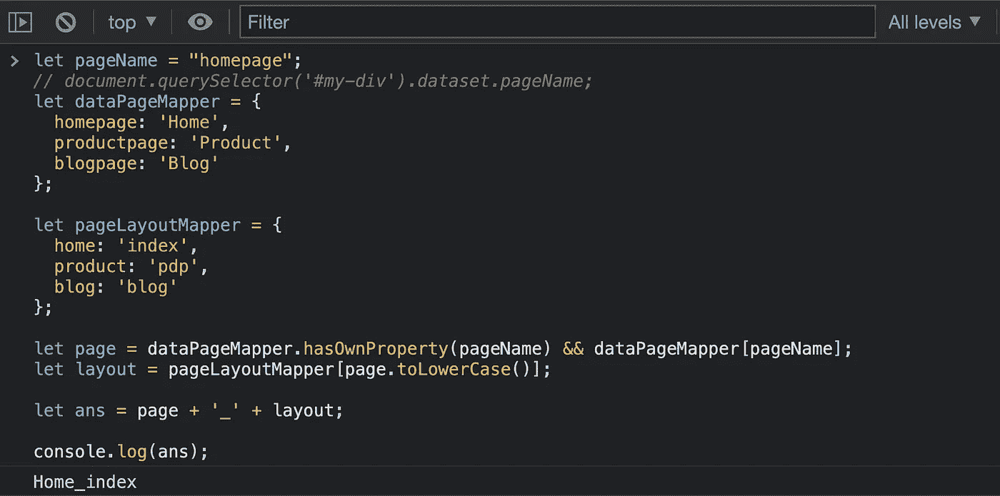

# 在 JavaScript 中重构 Switch 语句

> 原文：<https://javascript.plainenglish.io/switch-statements-in-javascript-how-to-refactor-1a32989f6b56?source=collection_archive---------4----------------------->

## 如何在 JavaScript 中重构 switch 语句的指南。

Switch 语句非常好，主要用于其他传统语言，如 C、C++和 Java。


Switch Refactoring in JavaScript

# 为什么切换语句？

switch 语句根据不同的条件执行不同的操作。当然，我们可以用 if-else 阶梯来解决上述问题，但这将使程序过于笨拙。此外，if-else 阶梯仅在您最多有 3 个条件要检查时才是可取的。

JavaScript 有 switch 语句，但是如果你对 Python 感兴趣，那么作为补充信息‘Python 没有 switch 语句，但是它通过字典映射实现了同样的功能’。

由于字典映射类似于 JavaScript 中的对象创建，受 Python 的启发，我们可以用多个对象替换 switch 语句，这是个不错的主意。从长远来看，这将保持代码的简单和可维护性。

让我们看看在我们的编码生涯中最常见的例子。

# 示例 1

编写一个代码，以字符串形式返回今天的日期，例如星期日。

## 使用 switch 语句

```
let day = new Date().getDay(); switch (day) {
  case 0:
    day = "Sunday";
    break;
  case 1:
    day = "Monday";
    break;
  case 2:
     day = "Tuesday";
    break;
  case 3:
    day = "Wednesday";
    break;
  case 4:
    day = "Thursday";
    break;
  case 5:
    day = "Friday";
    break;
  case 6:
    day = "Saturday";
}console.log(day); // for 30/01/2022 it will return Sunday
```

## console.log 的输出验证


## 不带开关，即重构代码

```
const day = new Date().getDay();
const dayMapper = {
    0: "Sunday",
    1: "Monday",
    2: "Tuesday",
    3: "Wednesday",
    4: "Thursday",
    5: "Friday",
    6: "Saturday"
};if (dayMapper.hasOwnProperty(day)) {
  console.log(dayMapper[day]); // Sunday
} else {
  console.log("Something went wrong");
}
```

## console.log 的输出验证


这是最基本的例子，让我们看一个更常见但复杂的例子。

***用例:*** 假设我们必须为一个页面发送一个 GA 事件，例如对于主页，我们将以页面名称+当前布局名称的形式发送事件标签。

问题是页面名称来自 DOM 中的数据属性。

让我用一个例子进一步解释一下:

对于在数据属性中找到的页面名称，我们需要返回(页面名称 _ 布局名称)如下。

```
homePage -> Home_index
productPage -> Product_pdp
blogPage -> Blog_blog
```

# 示例 2

假设将页面名称存储在数据属性中的 HTML 编写为:

```
HTML for homepage:
<div id="my-div" data-page-name="homepage"></div>
```

## 使用 switch 语句

```
let pageName = document.querySelector('#my-div').dataset.pageName;
let page;
let layout;
let ans;switch (pageName) {
  case "homepage":
    page = "Home";
    layout = "index";
    break;
  case "productpage":
    page = "Product";
    layout = "pdp";
    break;
  case "blogpage":
    page = "Blog";
    layout = "blog";
    break;
}ans = page + '_' + layout;console.log(ans);
```

## console.log 的输出验证


## 不带开关，即重构代码

```
let pageName = document.querySelector('#my-div').dataset.pageName;let dataPageMapper = {
  homepage: 'Home',
  productpage: 'Product',
  blogpage: 'Blog' 
};let pageLayoutMapper = {
  home: 'index',
  product: 'pdp',
  blog: 'blog' 
};let page = dataPageMapper.hasOwnProperty(pageName) && dataPageMapper[pageName];let layout = pageLayoutMapper[page.toLowerCase()];let ans = page + '_' + layout;console.log(ans);
```

## console.log 的输出验证



# 结论

上面一个是更干净的方法。如果将来我们有更多的可用页面，我们只需要在 mapper 对象中创建条目，就可以了。

但是对于 switch 语句，它将是一个很长的语句阶梯，如果您忘记添加 break 语句，那么您将陷入著名的 switch 陷阱。

让我知道你的想法，比如你如何在代码中处理开关的事情。

如果你喜欢我的文章，你可以[给我买杯咖啡](https://www.buymeacoffee.com/ajayv)

也请查看我在媒体上的其他文章和我自己的网站[https://weekendtutorial.com](https://weekendtutorial.com)

**编辑**

在**例 1** —由于数组也是一个对象，我们可以用数组替换代码中的对象。

```
const dayNum = new Date().getDay();
const days = [
    "Sunday"
    "Monday",
    "Tuesday",
    "Wednesday",
    "Thursday",
    "Friday",
    "Saturday"
];console.log(days[dayNum]); // Sunday
```

现在你知道了。感谢您的阅读。

*更内容于* [***浅显易懂的英语中***](http://plainenglish.io/) *。报名参加我们的* [***免费周报***](http://newsletter.plainenglish.io/) *。在我们的* [***社群不和***](https://discord.gg/GtDtUAvyhW) *中获得独家写作机会和建议。*