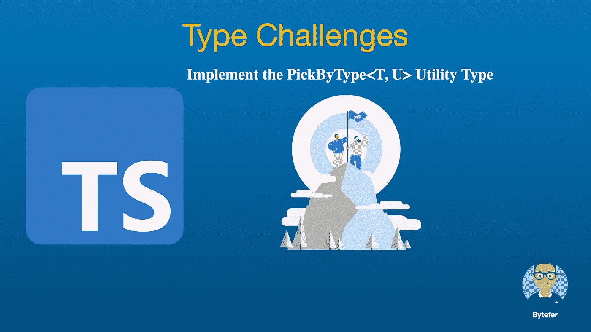
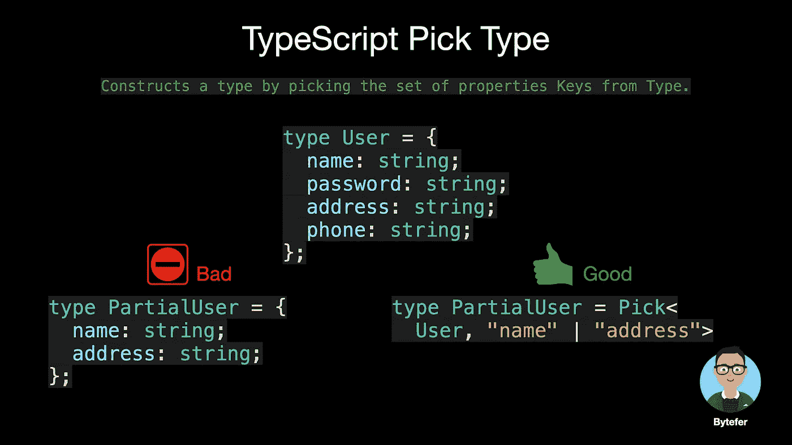
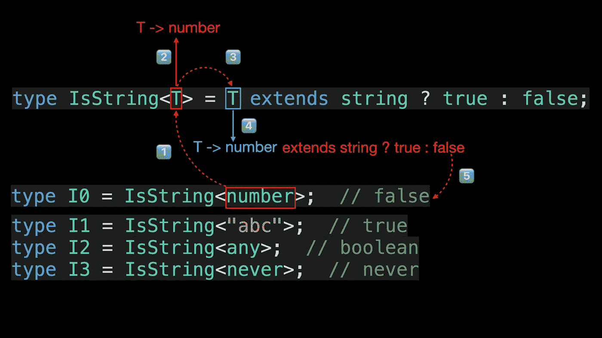
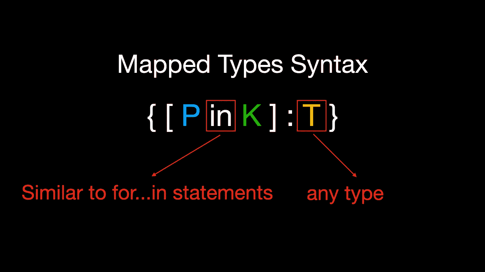

# 类型挑战:实现 PickByType <t u="">实用程序类型</t>

> 原文：<https://javascript.plainenglish.io/type-challenges-implement-the-pickbytype-t-u-utility-type-440b054ef9d0?source=collection_archive---------6----------------------->

## Pick 泛型类型并不完美，用 PickByType 泛型类型就够了！



欢迎来到**掌握打字稿**系列，这个系列有几十篇文章。为了帮助读者更好地巩固自己的 TypeScript 知识，我从 Github 上的[**type-challenges**](https://github.com/type-challenges/type-challenges)资源库中挑选了几十个挑战，和大家一起完成 type challenge。

[](https://medium.com/frontend-canteen/with-these-articles-you-will-not-be-confused-when-learning-typescript-d96a5c99e229) [## 有了 28+篇文章，学习 TypeScript 就不会迷茫了

### 通过生动的动画，让你轻松了解 TypeScript 的难点和核心知识！不断地…

medium.com](https://medium.com/frontend-canteen/with-these-articles-you-will-not-be-confused-when-learning-typescript-d96a5c99e229) 

*   [**类型挑战:实现内置 Pick < T，K >实用类型**](/type-challenges-implement-the-built-in-pick-t-k-utility-type-90f1970f121c)
*   [**类型挑战:实现内置省略< T，K >实用类型**](https://blog.bitsrc.io/typescript-challenge-implement-the-built-in-omit-t-k-utility-type-5e953d5c94c)
*   [**类型挑战:实现 RequiredByKeys < T，K >实用类型**](https://medium.com/p/4df181f7d4cf)
*   [**类型挑战:实现 PartialByKeys < T，K >实用类型**](https://blog.bitsrc.io/typescript-challenges-implement-the-partialbykeys-t-k-utility-type-21b2780ef48d)

# 挑战

从`T`中，选择一组类型可分配给`U`的属性。

例如:

```
type OnlyBoolean = PickByType<{
  name: string
  count: number
  isReadonly: boolean
  isEnable: boolean
}, boolean> // { isReadonly: boolean; isEnable: boolean; }
```

# 解决办法

我们的类型挑战是实现`PickByType<T, K>`泛型，在我们分析如何实现这个泛型之前，让我们简单介绍一下内置于 TypeScript 中的`Pick<Type, Keys>`泛型。

## 选择

通过从`Type`中挑选一组属性`Keys`(字符串或字符串的联合)来构造一个类型。



```
/**
 * From T, pick a set of properties whose keys are in the union K.
 * typescript/lib/lib.es5.d.ts
 */
type Pick<T, K extends keyof T> = {
    [P in K]: T[P];
};
```

上面的代码是`Pick`泛型类型的内部实现。上一个示例的流程如下所示:


如果您不熟悉上述代码，我们建议您阅读以下文章:

[](/type-challenges-implement-the-built-in-pick-t-k-utility-type-90f1970f121c) [## 类型挑战:实现内置 Pick <t k="">实用程序类型</t>

### Master TypeScript 挑选通用的，一起完成类型挑战，巩固你的打字知识。

javascript.plainenglish.io](/type-challenges-implement-the-built-in-pick-t-k-utility-type-90f1970f121c) 

要实现`PickByType<T, U>`泛型，首先我们需要知道如何获取属性的类型。这里我们可以使用一个 [**索引访问类型**](https://www.typescriptlang.org/docs/handbook/2/indexed-access-types.html) 来查找另一个类型的特定属性:

```
interface User {
  name: string;
  age: number;
  address: string;
}type NameType = User["name"]; // string
type AgeType = User["age"]; // number
type NameAndAgeType = User["name" | "age"]; // string | number
```

获得属性类型后，下一步是比较当前属性类型是否可以赋给指定的类型。为了实现这一点，我们需要使用 TypeScript 提供的**条件类型**。

## 条件类型

条件类型是在 TypeScript 2.8 中引入的。这种类型的语法如下:

```
T extends U ? X : Y
```

**T、U、X 和 Y 都是类型占位符。**你可以这样理解语法:当类型`T`可以赋给类型`U`时，则返回类型`X`，否则返回类型`Y`。看到这里让你想起了 JavaScript 中的三元表达式。


如果您不熟悉类型占位符，可以阅读下面的文章:

[](https://medium.com/frontend-canteen/what-are-k-t-and-v-in-typescript-generics-9fabe1d0f0f3) [## TypeScript 泛型中的 K，T，V 是什么？

### 用动画讲解，让你轻松掌握 TypeScript 泛型类型参数。

medium.com](https://medium.com/frontend-canteen/what-are-k-t-and-v-in-typescript-generics-9fabe1d0f0f3) 

那么条件类型有什么用呢？这里举个例子。

```
type IsString<T> = T extends string ? true : false;
​
type I0 = IsString<number>;  // false
type I1 = IsString<"abc">;  // true
type I2 = IsString<any>;  // boolean
type I3 = IsString<never>;  // never
```



在上面的代码中，我们定义了`IsString`实用程序类型。使用这个实用程序类型，我们可以确定传递给类型参数`T`的实际类型是否是字符串类型。

关于条件类型的内容就介绍到这里，如果你想进一步掌握它，你可以阅读下面的文章:

[](/use-typescript-conditional-types-like-a-pro-7baea0ad05c5) [## 像专业人员一样使用 TypeScript 条件类型

### 用动画解释。掌握 TypeScript 条件类型并理解 TypeScript 的内置实用工具如何类型化…

javascript.plainenglish.io](/use-typescript-conditional-types-like-a-pro-7baea0ad05c5) 

接下来我们要做的是遍历对象类型的每个属性，确定当前属性的类型是否可以赋给指定的 type (U)。为了迭代对象类型，我们需要使用 TypeScript 提供的**映射类型**。

## 映射类型

映射类型的语法如下:



其中`P in K`类似于 JavaScript `for...in`语句，用于遍历 type `K`中的所有类型，以及 type 变量`T`，用于表示 TypeScript 中的任意类型。

这里介绍了关于映射类型的内容，如果你想进一步掌握它，你可以阅读下面的文章:

[](/using-typescript-mapped-types-like-a-pro-be10aef5511a) [## 像专业人员一样使用 TypeScript 映射类型

### 映射类型—用动画解释。掌握 TypeScript 映射类型并理解 TypeScript 的内置…

javascript.plainenglish.io](/using-typescript-mapped-types-like-a-pro-be10aef5511a) 

## 完全码

最后，让我们看看完整的代码:

 [## TS Playground —探索 TypeScript 和 JavaScript 的在线编辑器

### Playground 让你以一种安全和可共享的方式在线编写类型脚本或 JavaScript。

www.typescriptlang.org](https://www.typescriptlang.org/play?#code/C4TwDgpgBACglgYwNYCEQBVwQDzoDRQCqAfFALxQDeAUFFANoxRwB2USEIA9gGZTpQAhgGd+jALpQIAD2AQWAE1GEoAflhQAXFBYQAbhABO47egkBuagF9L1UJCgB5FgBsQKLlxcRBbCvGQ0TEhsWiowuhZBAFsIbWFgQ1YAc0s6OgQuAFcWYG0WLOiAIyM09LhhACUfBS5XEG0iz29fMroKgFEoou9G5p8WMqs8MKavAepicygAehmqZiqaurc+8dbFrsEeuKgxlsGoKyA) 

TypeScript 4.1 允许我们使用 as 子句在映射类型中重新映射键[](https://www.typescriptlang.org/docs/handbook/release-notes/typescript-4-1.html#key-remapping-in-mapped-types)**。其语法如下:**

```
type MappedTypeWithNewKeys<T> = {
    [K in keyof T as NewKeyType]: T[K]
    //            ^^^^^^^^^^^^^
    //            New Syntax！
}
```

**其中 **NewKeyType** 的类型必须是`string | number | symbol`联合类型的子类型。**在重新映射键的过程中，我们可以通过返回 never 类型来过滤键。****

**如果你使用的是 4.1 以下的 TypeScript，我们也可以使用`Pick` generic 来实现同样的功能。**

```
type PickByType<T, U> = Pick<
  T,
  {
    [P in keyof T]: T[P] extends U ? P : never
  }[keyof T]
>
```

**你能理解上面的代码吗？如果有什么不清楚的地方，请给我留言。你也可以在 [Medium](https://medium.com/@bytefer) 或 [Twitter](https://twitter.com/Tbytefer) 上关注我，阅读更多关于 TypeScript 和 JavaScript 的内容！**

# **资源**

**[](https://github.com/type-challenges/type-challenges/blob/main/questions/02595-medium-pickbytype/README.md) [## type-challenges/readme . MD at main type-challenges/type-challenges

### 在线判官的类型挑战集-type-challenges/readme . MD 在主…

github.com](https://github.com/type-challenges/type-challenges/blob/main/questions/02595-medium-pickbytype/README.md) [](https://medium.com/frontend-canteen/with-these-articles-you-will-not-be-confused-when-learning-typescript-d96a5c99e229) [## 有了 28+篇文章，学习 TypeScript 就不会迷茫了

### 通过生动的动画，让你轻松了解 TypeScript 的难点和核心知识！不断地…

medium.com](https://medium.com/frontend-canteen/with-these-articles-you-will-not-be-confused-when-learning-typescript-d96a5c99e229) 

*更多内容请看*[***plain English . io***](https://plainenglish.io/)*。报名参加我们的* [***免费周报***](http://newsletter.plainenglish.io/) *。关注我们关于*[***Twitter***](https://twitter.com/inPlainEngHQ)[***LinkedIn***](https://www.linkedin.com/company/inplainenglish/)*[***YouTube***](https://www.youtube.com/channel/UCtipWUghju290NWcn8jhyAw)*[***不和***](https://discord.gg/GtDtUAvyhW) *。对增长黑客感兴趣？检查* [***电路***](https://circuit.ooo/) *。*****