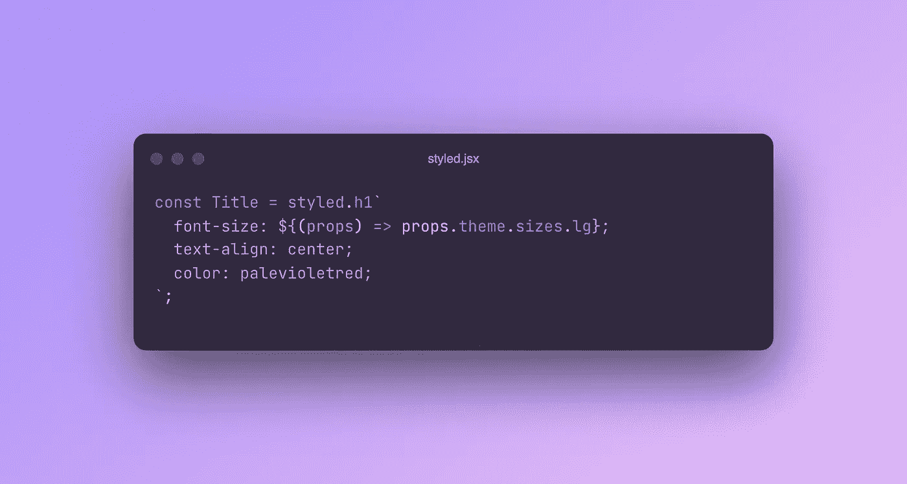

# 标记的模板文字——像样式化组件这样的工具是如何工作的

> 原文：<https://javascript.plainenglish.io/tagged-template-literals-how-tools-like-styled-components-work-81b26647e5ab?source=collection_archive---------4----------------------->

你有没有想过像 `*styled*` *这样的语法糖是如何神奇地工作的？让我们使用 Javascript 中的标记模板字符串重新创建这个功能。*



Styled Components and other libraries made template tags quite popular.

如果你使用了像[样式组件](https://styled-components.com/)或者 [graphql](https://graphql.org/) 这样的工具，你很可能会遇到带标签的模板文字。ES6 引入的新 Javascript 特性。

在样式化组件中，模板字符串允许您像这样神奇地创建组件:

```
const Title = styled.h1`
  font-size: ${props => props.theme.sizes.lg};
  text-align: center;
  color: palevioletred;
`;
```

本例中，`styled.h1`是*模板函数*或*标签*。后面的字符串表示实际的模板。我们称之为*模板串*。结合这两部分，我们得到了神奇的🪄

让我们先来看看模板字符串。它使用支持字符串插值的反斜线语法。因此，我们可以写…

```
const output = `My name is ${name}.`;
```

…并动态填充`name`值。

模板函数`styled.h1`用于标记字符串，因此命名为标记模板文字。它允许我们告诉引擎应该如何填充和构造带标签的字符串。

给定打印`My name is ${name}`的简单例子，浏览器通常会将`name`的当前值插入字符串。

但是也许我们想用绳子做些不同的事情？通过对字符串运行模板函数，我们可以做到这一点，并控制输出的外观。

模板函数接收关于模板字符串(它的部分和变量)的所有信息，无论我们从函数返回什么都将是我们的`output`。

# 了解模板功能

在我们尝试重新构建自己的`styled`模板函数之前，让我们先了解一下这些函数是如何工作的。

在下面这个简单的例子中，我们使用`introduce`标签打印出一个简短的介绍。

```
function introduce(strings, name, food) {
  // construct and return string
}const name = 'Nina';
const food = '🍕';
const output = introduce`I am ${name}. I like ${food}.`;
```

当对模板字符串运行函数时，我们通过参数接收所有需要的细节。

`strings`包含一个字符串数组，本质上是动态变量之间的所有静态部分。在我们的例子中，它是一个包含 3 项的数组:`I am`、`. I like`和`.`。

所有后续参数都是我们的插值变量，`name`和`food`的值。

使用 ES6 rest 操作符，我们可以像这样将这些后续参数批处理在一起:

```
function introduce(strings, ...args) {
  // construct and return string
}
```

因此，我们可以使用不仅限于两个值的模板。

# 构建我们自己的“风格化”标签

知道了模板函数通常是如何工作的，让我们回到最初的例子:`styled`标签。

```
const Title = styled.h1`
  font-size: ${props => props.theme.sizes.lg};
  text-align: center;
  color: palevioletred;
`;
```

我们现在想要返回一个名为`Title`的 React 组件，而不是返回一个简单的字符串。该组件应该使用我们在模板字符串中提供的样式呈现一个 HTML 标题元素。

对于样式，我们使用了在模板字符串中访问的主题。因此，`Title`组件应该尊重我们通过主题注入的字体大小。

尽管这看起来很复杂，但实现起来相当简单！

首先，让我们考虑一些先决条件:

```
// This acts as our theme provider
const props = {
  theme: {
    sizes: {
      xl: '2rem',
      lg: '1.5rem',
      md: '1rem',
      xs: '0.75rem',
    },
  },
};// This will be our template function
function h1(strings, ...args) {
  // Do something
}const styled = { h1 };// This will be our styled component
const Title = styled.h1`
  font-size: ${props => props.theme.sizes.lg};
  text-align: center;
  color: palevioletred;
`;
```

为了简单起见，我们假设我们可以访问一个全局的`props`对象，它就像是我们的主题提供者。

在我们的`props`对象下面，我们定义了我们的`h1`模板函数。为了让它看起来更像样式化组件，我将函数包装在一个名为`styled`的对象中，然后我们用它来构建我们的`Title`组件。

让我们仔细看看`h1`功能及其使用方式:

```
function h1(strings, ...args) {
  // Do something
}const Title = styled.h1`
  font-size: ${props => props.theme.sizes.lg};
  text-align: center;
  color: palevioletred;
`;
```

回想一下我们之前所学的，`strings`参数包含了我们模板的所有静态字符串部分。在这种情况下，它只有两个项目:`font-size:`和`; text-align: center; …`

`args`包含插值。请注意，在这个例子中，我们实际上是在插值函数，而不只是像以前那样插值字符串。它的工作原理是一样的，但是提供了更多的可能性，我们马上就会看到！

要创建输出这种样式化组件的标记模板文本，我们需要做两件事:

1.  基于所提供的模板字符串生成基于主题的样式
2.  创建并返回具有这些样式的 React 组件

所以我们就这么做，从第一步开始。

# 生成基于主题的样式

在第一步中，我们生成样式，稍后将应用于组件。现在，我们可以将样式输出为简单的 CSS 字符串，同样输出为模板字符串中的当前格式。

```
const props = {
  theme: {
    sizes: {
      xl: '2rem',
      lg: '1.5rem',
      md: '1rem',
      xs: '0.75rem',
    },
  },
};function h1(strings, ...args) {
  let str = ''; strings.forEach((string, i) => {
    str += string + (args[i] ? args[i](props) : '');
  }); return str;
}const styles = h1`
  font-size: ${props => props.theme.sizes.lg};
  text-align: center;
  color: palevioletred;
`;
```

在我们的函数`h1`中，我们遍历模板的静态字符串部分，并递增地连接它们。通过使用索引`i`，我们可以检查每个部分是否有相关的插值。

因此，在将`font-size:`连接到初始空字符串之后，我们检查在索引 0 处是否存在插值。的确有！我们提供的函数定义了基于主题的字体大小。

由于`args[i]`包含了我们注入的值`(props) => props.theme.sizes.lg`，我们可以用全局`props`对象调用这个函数并接收回字体大小。完美！

最后，我们从模板函数中返回`str`。它包含一个 CSS 字符串，如下所示:

```
font-size: 1.5rem;
text-align: center;
color: palevioletred;
```

# 返回样式化的 React 组件

为了完全模拟样式化的组件，我们现在想要返回一个样式化的 React 组件，而不是 CSS 字符串。

我们可以通过使用一个小的助手函数`css2obj`很容易地做到这一点，该函数将 CSS 字符串转换成可以应用于 React 组件的 CSS 对象。这并不完全是样式化组件的工作方式，但是目前它确实可以工作。有兴趣可以在这里查看实现[。](https://gist.github.com/konstantinmuenster/dd391a78b167972f03e198198fe6b5ae)

```
function h1(strings, ...args) {
  let str = ''; strings.forEach((string, i) => {
    str += string + (args[i] ? args[i](props) : '');
  }); return React.createElement('h1', {
    style: css2obj(str),
  });
}
```

这样，我们可以修改我们的`h1`实现，这样我们就不会返回 CSS 字符串，而是创建一个具有正确标题类型和生成的样式对象的 React 元素。

就是这样！我们现在可以使用这个带标签的模板文字来创建令人惊叹的标题，就像这样简单:

```
const Title = styled.h1`
  font-size: ${props => props.theme.sizes.lg};
  text-align: center;
  color: palevioletred;
`;export const MyComponent = () => {
  return <Title>My Heading</Title>;
};
```

当然，实际上，样式化组件比这个简单的例子隐藏了更多的复杂性。尽管如此，我希望我们揭示了一点标签模板文字提供的魔力。

对我来说，这一直是看起来(听起来)比实际复杂得多的事情之一。

所以你要记住:

**带标签的模板文字使您能够定义模板字符串应该如何构造和返回。**

又一个很好的工具带技术！如果你感兴趣，你可以在这个 [CodeSandbox](https://codesandbox.io/s/styled-components-tagged-template-literal-article-dbiyd9) 中找到完整的例子。

这篇文章最初发表于[konstantin.digital/blog](https://konstantin.digital/blog)。我每月写一篇关于 React 的 web 和产品开发以及如何成为更好的开发人员的文章。

*更多内容请看*[***plain English . io***](https://plainenglish.io/)*。报名参加我们的* [***免费周报***](http://newsletter.plainenglish.io/) *。关注我们关于*[***Twitter***](https://twitter.com/inPlainEngHQ)[***LinkedIn***](https://www.linkedin.com/company/inplainenglish/)*[***YouTube***](https://www.youtube.com/channel/UCtipWUghju290NWcn8jhyAw)*[***不和***](https://discord.gg/GtDtUAvyhW) *。对增长黑客感兴趣？检查* [***电路***](https://circuit.ooo/) *。***