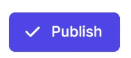
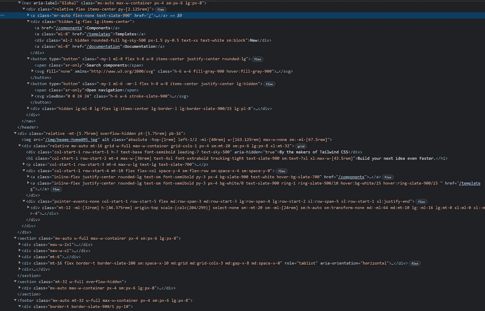
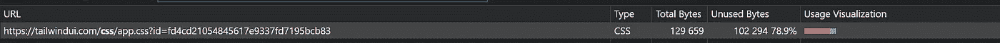

# 顺风是一种反模式

> 原文：<https://javascript.plainenglish.io/tailwind-is-an-anti-pattern-ed3f64f565f0?source=collection_archive---------0----------------------->

*让我们打开薛定谔的盒子，看看里面是什么。剧透:是死猫。*


Photo by [georgi benev](https://unsplash.com/@georgibenev97?utm_source=medium&utm_medium=referral) on [Unsplash](https://unsplash.com?utm_source=medium&utm_medium=referral)

很多人喜欢 Tailwind 所谓的“效用第一”的做法，我明白为什么。但是，你要知道，这种技术并不新鲜。事实上，在 Bootstrap 之前就有一些小的 CSS 代码片段，它们来自类似`.p-8`的类。它们不被认为是一个库或框架；它们只是从一个项目复制到另一个项目的片段。尽管如此，技术本身是*而不是新的*。然而，随着 Bootstrap 的兴起，我们停止了这样做。一个原因——当然——是 Bootstrap 自带了自己的实用程序类，但还有另一个原因，在开始在每个项目中使用 Tailwind 之前，您应该意识到这一点。

## 顺风是做什么的？

既然我找不到比使用他们自己的例子更好的方式来侮辱 Tailwind，我们就坚持这样做吧。请注意，我有一个 TailwindUI 帐户，因为我的一些客户坚持使用它。所以，我不只是责怪免费的例子，但你真的要为损坏的代码买单。但是，让我们坚持免费的“英雄部分”的例子，这样每个人都可以访问它，并遵循我的想法([https://tailwindui.com/components/marketing/sections/heroes](https://tailwindui.com/components/marketing/sections/heroes))。

**问题一，臃肿的 HTML:**

只要看看按钮:

```
<button type="button" **class="bg-white rounded-md p-2 inline-flex items-center justify-center text-gray-400 hover:text-gray-500 hover:bg-gray-100 focus:outline-none focus:ring-2 focus:ring-inset focus:ring-indigo-500"** aria-expanded="false">
  <span class="sr-only">Open main menu</span>
  <!-- Heroicon name: outline/menu -->
  <svg class="h-6 w-6" ae lc" href="http://www.w3.org/2000/svg" rel="noopener ugc nofollow" target="_blank">http://www.w3.org/2000/svg" fill="none" viewBox="0 0 24 24" stroke-width="2" stroke="currentColor" aria-hidden="true">
    <path stroke-linecap="round" stroke-linejoin="round" d="M4 6h16M4 12h16M4 18h16" />
  </svg>
</button>
```

天哪，这么多课。它看起来像什么？这个按钮是做什么的？嗯，很难搞清楚。这是一个没有顺风的例子:

```
<button type="button" **class="button-menu-toggle"** aria-expanded="false">
  <span class="sr-only">Open main menu</span>
  <!-- Heroicon name: outline/menu -->
  <svg class="h-6 w-6" ae lc" href="http://www.w3.org/2000/svg" rel="noopener ugc nofollow" target="_blank">http://www.w3.org/2000/svg" fill="none" viewBox="0 0 24 24" stroke-width="2" stroke="currentColor" aria-hidden="true">
    <path stroke-linecap="round" stroke-linejoin="round" d="M4 6h16M4 12h16M4 18h16" />
  </svg>
</button>
```

乍一看，我们知道这是负责切换菜单的按钮(注意，我没有使用 BEM，它也是一种反模式)。代码被阅读的次数比它被编写的次数多得多；考虑顺风时，请考虑这一点。

现在，每次我提起这个，至少有一个开发者会责怪我不知道`@apply`。相信我，我知道。但是这违背了 Tailwind 自己的目的，因为你将只编写常规的 CSS。当然，你可以混合使用这两种技术，但是你有两种方法来编写 CSS。如果你还内联了一些 CSS，那么甚至是三个。`@apply`让一切变得更糟。

**问题二、命名事物**

顺风声称

> 你必须一直想出类名——没有什么比给不值得命名的东西想出一个类名更让你慢下来或者消耗你的精力了。—[https://tailwindcss.com/docs/reusing-styles](https://tailwindcss.com/docs/reusing-styles)

“不值得命名的东西”也不值得实用类。事实上，CSS 已经覆盖了你。看看英雄部分的另一个片段:

```
<div **class="hidden md:block md:ml-10 md:pr-4 md:space-x-8"**>
  <a href="#" **class="font-medium text-gray-500 hover:text-gray-900"**>Product</a>
  <a href="#" **class="font-medium text-gray-500 hover:text-gray-900"**>Features</a>
  <a href="#" **class="font-medium text-gray-500 hover:text-gray-900"**>Marketplace</a>
  <a href="#" **class="font-medium text-gray-500 hover:text-gray-900"**>Company</a>
  <a href="#" **class="font-medium text-indigo-600 hover:text-indigo-500"**>Log in</a>
</div>
```

下面是如何用 CSS 做到这一点:

```
<div **class="navigation-desktop"** role="navigation" aria-label="Main Navigation">
  <a href="#">Product</a>
  <a href="#">Features</a>
  <a href="#">Marketplace</a>
  <a href="#">Company</a>
  <a href="#">Log in</a>
</div>
```

它展示了他们强迫你购买他们垃圾的营销胡言乱语。当然，CSS 会在它自己的样式表中，在 JS 中剪切 CSS(这也是一种反模式)。

```
.navigation-desktop {
  display: none;
}.navigation-desktop > a {
  font-weight: 500;
  color: rgb(107 114 128);
}.navigation-desktop > a:hover {
  color: rgb(17 24 39);
}[@media](http://twitter.com/media) (min-width: 768px) {
  .navigation-desktop {
    display: block;
    margin-left: 2.5rem;
    padding-right: 1rem;
  }

  .navigation-desktop > * + * {
    margin-left: 2rem;
  }
}
```

我不必为我的锚标签想出一个类名；每个人都从父元素中知道这应该是桌面导航(他们为什么使用 div 超出了我的理解，但是我现在不打算修复他们损坏的标记)。看着顺风码，你只会不知所措，向命运投降。你知道我的解决方案的另一个伟大之处:它适用于任何项目；它不依赖于任何库。

对开发人员来说最重要的是:HTML 标记保持可读性，不会臃肿。毕竟，这是你发送给用户的第一件东西。

**问题三、跳档**

顺风声称

> 您必须在多个文件之间跳转以进行更改，这是一个比您在将所有内容放在一起之前所想的更大的工作流杀手。——【https://tailwindcss.com/docs/reusing-styles 

这违背了使用 CSS 的初衷。在顺风之前，我们也可以内联每一种风格。然而，将样式从标记中分离出来是一个重要的特性。没有 Tailwind，您可以学习编写更多有用的代码，因为 Tailwind 将您的 CSS 与其标记紧密耦合。同样，我知道@apply，但是我可以坚持使用普通的 CSS，把整个 Tailwind 工具链扔出窗外——这是它应该呆的地方。

**问题四，改 CSS 很吓人**

顺风声称

> 改变样式更可怕——CSS 是全局的，你确定*你可以改变那个类的最小宽度值而不破坏站点其他部分的东西吗？—[https://tailwindcss.com/docs/reusing-styles](https://tailwindcss.com/docs/reusing-styles)*

CSS 不一定是全球性的。有了 ShadowDOM 和 CSS 模块，我们有了两个强大的工具来处理 CSS 类，否则这些类会有问题。我们再也不用想出疯狂的名字了(这也让 BEM 过时了)。此外，将 30 个不同的类放入一个 HTML 元素的 class 属性中会更好吗？为什么官方示例传入:

```
<button type="button" **class="inline-flex items-center px-4 py-2 border border-transparent rounded-md shadow-sm text-sm font-medium text-white bg-indigo-600 hover:bg-indigo-700 focus:outline-none focus:ring-2 focus:ring-offset-2 focus:ring-indigo-500"**>         *<!-- Heroicon name: solid/check -->*         <svg class="-ml-1 mr-2 h-5 w-5"  viewBox="0 0 20 20" fill="currentColor" aria-hidden="true">           <path fill-rule="evenodd" d="M16.707 5.293a1 1 0 010 1.414l-8 8a1 1 0 01-1.414 0l-4-4a1 1 0 011.414-1.414L8 12.586l7.293-7.293a1 1 0 011.414 0z" clip-rule="evenodd" />         </svg>         Publish       </button>
```

上面的胡言乱语会渲染这个按钮:



[https://tailwindui.com/components/application-ui/headings/page-headings](https://tailwindui.com/components/application-ui/headings/page-headings)

呈现一个简单的紫色按钮的类太多了。如果 HTML 文件只包含这一个按钮，可能不会有什么问题，但是在 Tailwind 中每个元素看起来都是这样。请看 TailwindUI 源代码:



Why? [https://tailwindui.com/](https://tailwindui.com/) source…

不重复自己(干)？我会说，你不需要它。我发现这比上一堂`.button-action`课更可怕，在那里*知道*会发生什么。改变它并不可怕，因为这是我的架构，我可以依靠它。我也不必写类似于`scale-[calc(204/299)]`的东西，尽管我害怕改变它。有人知道神奇的数字吗？那个代码很臭。

**问题五、大捆绑**

顺风声称

> 你的 CSS 包会更大。—[https://tailwindcss.com/docs/reusing-styles](https://tailwindcss.com/docs/reusing-styles)

那是个彻头彻尾的谎言。顺风不会神奇地减少你的包裹大小。你只需将部分大小转移到你的 HTML 文件中。此外，您可能会在类中声明冗余的属性，这最终会增加包的大小。但是您不必将项目中使用的所有属性都发送出去。在顺风时，你可以。工具链扫描您的项目，然后创建顺风包。这个包包含您在整个项目中使用的任何属性。即使用户从未访问过任何具有该特定属性的站点。CSS 模块或 Web 组件没有的问题。顺风消除了一个问题，代之以另一个问题——不多也不少。

tailwindui.com 的登陆页面使用了大约 20%的 CSS 数据，这些数据最初是装载到你的浏览器中的。



不幸的是，这并不奇怪。大多数网站都有大量未使用的 CSS——不管是否顺风。我们作为开发人员应该努力解决它，但顺风肯定不会帮助解决它。这也是保护我们稀缺资源的问题:节省字节最终意味着节省电力。每一次努力——尽管微不足道——都很重要。

自 Bootstrap 之类的黑暗时代以来，CSS 已经有所改进。因为我们有原生变量、网格和 CSS 模块，所以几乎没有理由使用 SCSS、Bootstrap 或 Tailwind。

另一个问题是你不能通过使用 Tailwind 来学习 CSS 模式。例如，`space-x-8`是做什么的？它将转化为 CSS 中典型的设计模式`.your-element > * + * { margin-left: 2rem; }`。你知道它是做什么的吗？太普通了，你应该一眼就能认出这种图案！

如果你是 CSS 初学者，顺风是保持初学者状态的最安全方式。更重要的是，适应他们破碎的 HTML 语义会让你的网站不符合现代标准——即使是你在 TailwindUI 付费的网站。他们在应该使用更多语义标签的地方使用 divs 此外，他们并不总是添加 aria-提供可访问网站所需的角色。例子？随机的 h2，h3，h4 标签，没有任何角色或语义标签的滑稽的 ul/li 页脚导航，同一级别标题的不相等字体大小，副标题使用跨度，…他们为此收取了一大笔钱。不幸的是，我不能给你的例子的代码，因为你必须**支付**。

是的，有很多个人的痛苦，也有很多个人的看法。我意识到了。然而，关注点分离和跳过学习重要的 CSS 模式仍然是个问题。当顺风过时了，你要去哪里？CSS 已经存在了。我两个都可以用。我被迫为一些客户使用 Tailwind，因为它只是他们工具链的一部分。作为外部开发人员，我有什么资格改变他们的决定呢？我还是觉得有问题。

概述的问题也是我们最初抛弃“实用程序类”方法的原因。不够灵活。当有新的 CSS 特性时，你会等到 Tailwind 实现它们吗？您的项目最终会有几个出口:使用`@apply`，创建自定义类，因为您不记得 Tailwind 的`background-image`语法，，或者甚至覆盖 Tailwind 类而不是扩展配置文件——因为它是 CSS，为什么不呢，对吗？

就这些了，伙计们！

考虑留下一个赞或关注，这样我就知道你更喜欢看哪种文章。非常感谢您的阅读。

**免责声明:**在撰写本文期间，没有猫受到伤害。

*更多内容请看*[***plain English . io***](https://plainenglish.io/)*。报名参加我们的* [***免费周报***](http://newsletter.plainenglish.io/) *。关注我们关于*[***Twitter***](https://twitter.com/inPlainEngHQ)*和*[***LinkedIn***](https://www.linkedin.com/company/inplainenglish/)*。查看我们的* [***社区不和谐***](https://discord.gg/GtDtUAvyhW) *加入我们的* [***人才集体***](https://inplainenglish.pallet.com/talent/welcome) *。*