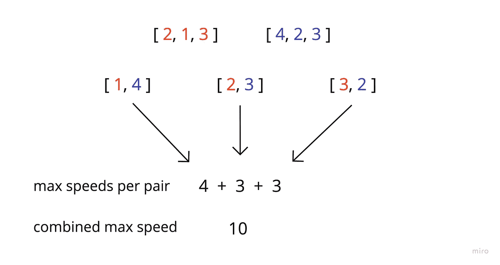
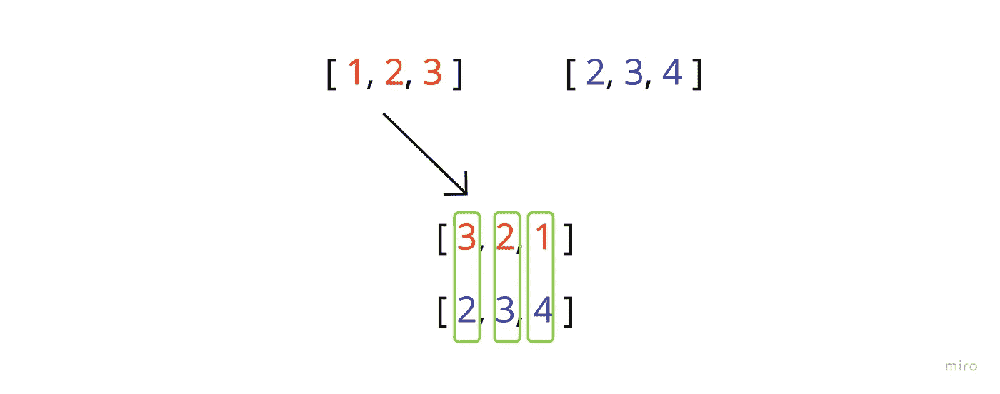
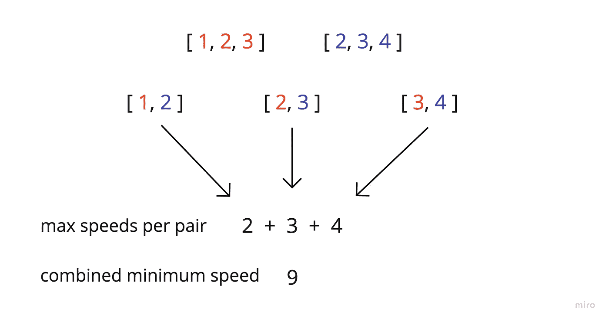

# AlgoExpert 双人自行车问题

> 原文：<https://javascript.plainenglish.io/tandem-bicycle-problem-ce8c9da83b46?source=collection_archive---------5----------------------->

## JavaScript +算法专家

我刚刚解决了一个叫做“双人自行车”的算法专家问题，虽然这是一个简单的问题，但它足够有趣，所以我想分享一下。

**问题**

我们将得到两个输入数组(长度总是相等)，每个数组包含每个骑手的最大速度。第一个数组包含穿红色衬衫的骑手，另一个包含穿蓝色衬衫的骑手。

现在，我们将选择两人一组骑双人自行车，每辆自行车必须有一名红色衬衫和一名蓝色衬衫骑手。

我们需要返回的内容将基于我们的第三个参数(true || false)。

True =返回所有组合对的最大速度

False =返回所有组合对的最小可能速度

对于每一对，速度由两者中的最大值决定。因此，如果我们有一个最大速度为 2 的红衫骑手和一个最大速度为 4 的蓝衫骑手，这对骑手的速度将是 4。

因此，对于输入([1，2，3]，[2，3，4]，真)，我们的答案看起来像这样

现在，让我们想出一个算法来给出最大或最小的组合速度。

***想通了***

首先，我想考虑如何获得最大速度。

我知道在每一对中，红色和蓝色必须被代表，两者中较快的一个将最终代表这一对。所以我现在的目标是使用我的初始输入数组最大化更大的值表示。

为了实现这一点，首先我将对两个数组进行排序，然后反转任意一组。在这个例子中，我将颠倒红衫军:

现在，当我比较每个数组的索引(将它们配对)时，很明显我们已经最大化了最大值。换句话说，如果我们没有逆转红衫骑手，我们就会通过将他们与其他快速骑手配对来浪费快速骑手(当我们只需要每对一个快速骑手来实现最大速度时)。

在下面的例子中，我们可以看到红色 3 和 4 配对浪费了速度，因为 4 和 1 配对也一样快。

这很好地过渡到我们的另一个场景……*最小*速度。

现在，我们希望在配对中尽量减少快速骑手的代表。为了做到这一点，我们只需要根据排序后的数组创建配对，而不需要反转它们。这样，我们最快的骑手与其他骑手而不是较慢的骑手配对，浪费了速度。

**编码出来**

这一个就这么多了！

再一次，这是一个超级简单的问题，但是当你找到基本原理，让它在这样一个基本的过程中走到一起时，它是如此令人满意。

*更多内容请看*[***plain English . io***](https://plainenglish.io/)*。报名参加我们的* [***免费周报***](http://newsletter.plainenglish.io/) *。关注我们关于* [***推特***](https://twitter.com/inPlainEngHQ)[***领英***](https://www.linkedin.com/company/inplainenglish/)**和* [***不和***](https://discord.gg/GtDtUAvyhW) ***。****