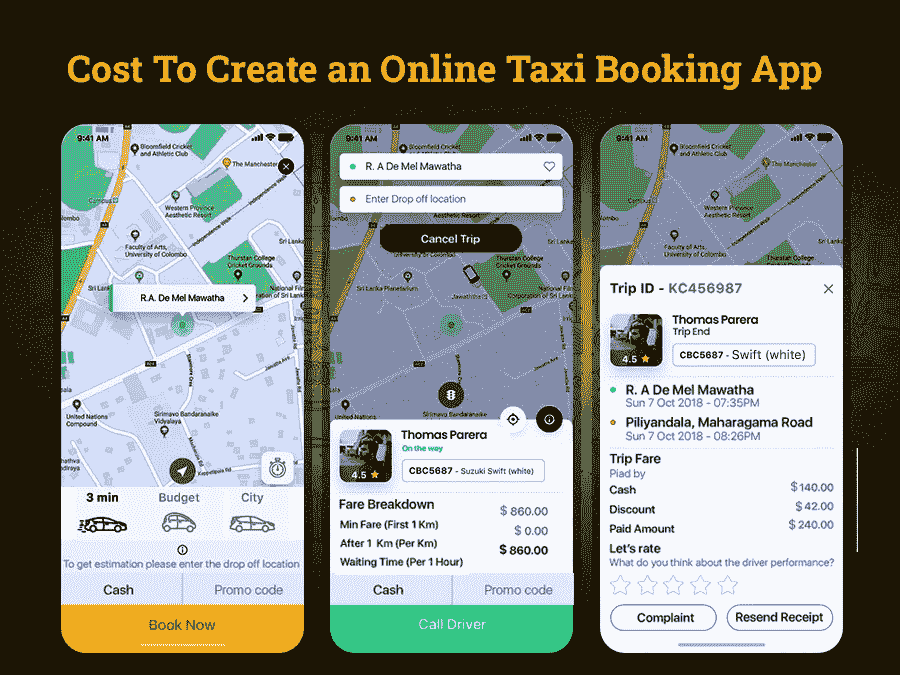

# 打车预约 App 业务设置:如何运作和赚钱？

> 原文：<https://javascript.plainenglish.io/taxi-booking-app-business-setup-how-does-it-work-and-make-money-bf617cf4fdf1?source=collection_archive---------9----------------------->

## 创建一个在线出租车预订应用程序需要多少钱

几年来，出租车预订应用程序在市场上越来越受欢迎，并成功取代了传统的出租车服务。现在，任何人都必须走一英里路才能叫到出租车的日子已经一去不复返了。事实上，按需出租车预订应用程序已经让每个人的通勤变得更快、更便宜、更容易。

因此，如果你正计划以最少的投资开始出租车预订业务，那么你来对地方了。这篇博客指南将帮助你在没有经验的情况下开始一项有利可图的出租车预订业务。你所需要的是建立一个包含所有先进技术的出租车预订应用程序，并把你的应用程序的想法带入图片中。

如果你准备好将你的出租车预订业务数字化，并有兴趣建立一个像优步一样的按需出租车预订应用程序，那么这里我们为你准备了一个博客指南。

**博客重点:**

*   *在线按需出租车预订生态系统介绍*
*   *出租车预订市场的统计数据和规模说明了什么？
    -了解在线出租车预订服务的市场份额和未来前景*
*   *如何在 1 个月内发展你的出租车预订业务？
    -使其成为成功解决方案的技巧*
*   *如何在 2 万美元以下开展类似优步的在线出租车预订业务？
    -拼车和出租车预订应用背后的功能*
*   *创建成功的出租车预约 App 的最佳技术选择是什么？*
*   *选择正确的货币化策略，从商业投资中获利*
*   创建一个像优步一样的在线出租车预订应用程序需要多少成本？
*   *结论:你准备好推出你的打车预约 App 了吗？*

为了更好地理解，让我们直接深入每一点:

## **在线按需出租车预订生态系统简介**

近年来，在线按需出租车预订应用风靡全球。技术的进步和人们越来越多地接触互联网也导致了移动应用的使用，出租车预订应用也不例外。

像优步或 Lyft 这样的出租车预订公司已经缓解了世界各地许多大城市的通勤问题。今天，人们可以通过手机立即预订出租车，而不用担心交通、停车位、费用等问题。通过一个出租车预订应用程序，用户可以以非常高的性价比享受个人汽车的体验。

由于对这些转型出租车服务的高需求，许多企业主正期待着像优步一样规划自己的出租车预订应用程序的未来。如果你正在寻找建立一个像优步一样的出租车预订应用程序，但想知道创建一个应用程序需要多少成本？雇佣一个 app 开发公司来创建一个 app 值得吗？而没有什么生意是容易起步的。只有一颗企业家的心，一颗热情的头脑，才愿意进入出租车行业并取得成功。为了帮助你做出正确的决定，我们收集了一些关于出租车市场的数据和事实。

## 出租车预订市场的统计数据和规模说明了什么？

对汽车预订或出租车预订服务的需求日益增长，使得有志的商业爱好者进入了这个蓬勃发展的行业。因为出租车预订移动应用市场正在经历巨大的增长，而没有任何下降的迹象。尽管如此，应用程序商店充斥着出租车预订应用程序，这些应用程序具有吸引用户仅通过这些应用程序预订的功能。

这一切都要归功于移动应用开发者，他们让这些应用快速增长。但作为一名企业家，你肯定不会相信这些说法。别担心，这里我们收集了一些统计数据和市场调查报告，帮助你了解出租车预订行业的市场规模。

**了解在线出租车预订服务的市场份额和未来前景**

*   据统计，打车和出租车市场预计在 2022 年达到[3142.24 亿美元。](https://www.statista.com/outlook/mmo/shared-mobility/shared-rides/ride-hailing-taxi/worldwide?currency=usd)
*   打车和出租车预订市场预计将增长 5.30%，预计到 2026 年市场规模将达到[3862.74 亿美元。](https://www.statista.com/outlook/mmo/shared-mobility/shared-rides/ride-hailing-taxi/worldwide?currency=usd)
*   2022 年，用户渗透率为 20.0%，预计到 2026 年[将达到 21.1%。](https://www.statista.com/outlook/mmo/shared-mobility/shared-rides/ride-hailing-taxi/worldwide?currency=usd)
*   2019 年全球出租车市场价值为 691.8 亿美元，预计到 2027 年将达到 1208.9 亿美元。
*   根据调查报告，预计到 2026 年，出租车市场价值将达到[3275.4 亿美元。](https://www.mordorintelligence.com/industry-reports/taxi-market)

简而言之，根据这些事实和统计数据，可以公平地说，从长远来看，对拼车服务日益增长的需求仍将是趋势。该行业将继续为全球经济做出贡献。通过雇佣一个 [**应用程序开发公司**](https://www.xicom.biz/services/mobile-app-development/) ，你可以创建一个应用程序，并成为这个蓬勃发展的公司的一部分。随着打车行业的发展，许多出租车预订应用程序正在蓬勃发展。

虽然像优步或 Lyft 这样的出租车预订应用程序已经在这个领域占据主导地位，但你们很多人都担心如何让你的出租车预订应用程序在市场上脱颖而出？如何发展你的出租车预订业务？无论这个行业发展到什么程度，成熟的打车应用总会有发展空间。因此，让我们来寻找帮助你在出租车预订行业取得成功的策略。

*让我们得到答案*

# **如何在 1 个月内发展你的出租车预订业务？**

进入打车市场，无疑你将与拼车市场最强的竞争对手竞争。根据调查报告，优步和 Lyft 是该行业最大的参与者，但如果你有正确的策略，你新的出租车服务移动应用程序可以取得成功。为了让你的应用赢得比赛，你需要理解优步和 Lyft 采用的策略。

让我们来看看一些构建成功的出租车预订应用程序的技巧:

## **1。提供独特的价值主张**

就像亚马逊和易贝正在主宰电子商务世界一样，优步和 Lyft 正在统治出租车预订行业的领域。因此，如果你正在进入出租车预订领域，那么你需要有一个独特的想法，将你的出租车预订应用程序与竞争对手区分开来。为你的出租车预订应用增加价值的另一个方面是让它看起来对用户和司机有吸引力。

*这里有两种方法可以让你的应用增值:*

*   **快速便捷的乘车**:通过添加当前位置，让用户在一分钟内预订出租车。随着 GPS 功能的实现，用户可以找到附近的出租车，并获得乘坐的估计。
*   **实惠的价格**:你知道为什么优步或 Lyft 占领了主要市场吗？原因首先是使用该应用程序的便利性，以及允许用户完美预订出租车的合理定价政策。所以如果你是 [**雇佣一个手机 app 开发者**](https://www.xicom.biz/offerings/hire-mobile-developers/) 来定制有这个功能的 app。你可以根据距离收取适当的费用，而不是收取统一的乘车费用。

## **2。预定一个轮子**

像优步和 Lyft 一样，你可以允许乘客从各种交通工具中进行选择，并预订最适合他们旅行的交通工具。从共享出租车、微型汽车到豪华车预订服务，优步提供了多种选择。

所以，明智地思考一下，你还能为你的顾客提供什么，来增加便利、省钱并确保更快的乘车速度。例如，在独自旅行时提供预订共享出租车的功能。这将有助于他们节省大量的旅行费用，也为旅行提供了便利。

## **3。将其扩展到其他位置**

与其在有限的地区提供打车服务，还不如把它推广到更多的地方。尽管优步和 Lyft 是出租车预订行业的主要领导者，但仍有一些领域在优步之外。这意味着这些地点为您的出租车预订服务提供了绝佳的市场机会。

无论你的应用程序结构有多复杂，这些应用程序开发技巧将帮助你创建一个增加成功机会的应用程序。由于开发像优步或 Lyft 这样的出租车预订应用程序是一项复杂的任务，因此值得考虑这些提示，以创造你在市场上的存在。但是，成功的主要部分取决于您选择在应用程序中实现的特性和功能。

再说一遍，在谈论应用程序的特性和功能时，你会紧张地想着它会花你多少钱？

别担心，这个我们有答案！

## **如何在 2 万美元以下开展类似优步的在线出租车预订业务？**

像优步这样的在线按需打车应用实际上包含三个重要元素。它包括一个司机应用程序，一个乘客应用程序和一个管理面板，以确保你的应用程序中的一切都顺利运行。应用程序的每个部分都有自己的一套功能，加起来就是成本。而优步是一个复杂的大规模应用，并不是一蹴而就的。所以首先你需要 [**雇佣一个移动应用开发者**](https://www.xicom.biz/offerings/hire-mobile-developers/) 来创建一个像优步一样的应用。相反，对基本出租车预订应用程序的多次更新已经将优步变成了一个成熟的应用程序。因此，让我们从基础开始，推出创建优步式出租车预订应用程序所需的基本功能。

在我们开始估算创建出租车预订应用程序的成本之前，我们已经列出了构建每个面板所需的所有基本功能。

**乘客应用功能**

*   **用户登录和注册:**允许乘客使用电话号码、Gmail 或社交媒体账户登录应用程序。确保您提供多种登录功能，让乘客可以快速登录应用程序。
*   **创建个人资料:**允许乘客编辑个人资料详情，包括个人信息、更改凭证和密码。
*   **付款方式:**由于人们使用多种付款方式，因此有必要添加付款方式列表，以便乘客选择首选付款方式。这将使乘客更容易使用信用卡、借记卡、Paypal、Google Pay 等进行即时支付。
*   **添加位置:**通过实现 Google MAP API 集成，您可以添加手动或自动添加位置的功能。
*   **请求出租车:**该功能允许乘客请求出租车并设置目的地。预订出租车时，允许乘客查看费用估计和时间。此外，还可以通过添加几个目的地来修改路线。
*   **选择一名司机:**一旦乘客提出出租车的要求，确保他们所在位置附近的司机列表将开始出现在屏幕上。
*   **通知:**向乘客发送推送通知，让他们随时了解乘车确认、付款、预计时间、旅行交易、优惠和折扣等信息。
*   **实时地图:**增加在应用程序上访问实时地图的灵活性，显示附近司机的可用性。
*   **位置跟踪:**一旦乘客收到确认，允许他们跟踪司机的实时位置，并提供估计时间。
*   **评分系统:**根据乘客对驾驶员的乘坐体验，允许乘客对驾驶员进行评分和评价。
*   **应用内聊天/通话:**在乘车许可时，允许乘客使用应用内通话或聊天功能与司机联系，并能够屏蔽他们的私人号码。

**司机 App 功能**

*   **登录和注册:**允许司机使用管理面板批准的相同凭据登录应用程序。司机还应提供汽车注册信息，并核实细节。
*   **驾驶员资料:**允许驾驶员添加个人信息，包括姓名、电话号码、汽车详情等。此外，添加编辑细节的功能。
*   **地理定位:**通过此功能，驾驶员可以使用内置街道导航功能导航至乘客位置。该功能将帮助驾驶员轻松定位位置，并使用最快的路线到达目的地。
*   **可用性状态:**允许司机编辑或更改他们的上班和下班时间。通过此功能，驾驶员可以标记他们是否可以接受乘车请求。
*   **接受/拒绝请求:**根据驾驶员的可用性，提供接受或拒绝乘坐请求的自由。
*   **通知:**该功能通知新的旅行、支付状态、道路细节等等。它还通知订单的获取或订单取消的情况。
*   **导航:**通过应用程序中的这一功能，司机可以选择最佳路线，使他们在最快的周转时间内放下乘客。
*   **乘车估算**:实现车费计算功能将允许司机了解旅行的总费用和折扣。
*   **收入:**司机可以生成月报，了解每月收入和车次。

**管理面板的功能**

*   **管理乘客:**允许管理员管理他们在应用程序中收集的乘客的每个帐户细节。你可以 [**雇佣一个应用开发者**](https://www.xicom.biz/solutions/hire-developers/) 定制这个功能，让管理员跟踪乘客的详细信息。它可能包括乘客的活动、更改帐户详细信息、被阻止的乘客等等。
*   **管理驱动程序:**记录驱动程序的详细信息对于保持应用程序的质量非常重要。因此，允许他们跟踪所有活动和评级，以控制服务质量。
*   **管理折扣和促销:**为多次乘车提供折扣和促销代码总能帮助你提高用户参与度。但是管理不同乘车的不同折扣是相当具有挑战性的。因此，管理员将确保在某些游乐设施上应用正确的折扣，以避免复杂化。

这些是你可以考虑在你的出租车预订应用程序中实现的几个基本功能。而基本版的按需打车预约 app 大约需要 4 到 5 个月的开发时间。因此，对于商业爱好者来说，从基本版的出租车预订应用开始将是一个值得的决定。这将帮助您在更少的预算下快速启动应用程序。

但是对于商业爱好者来说，一个核心问题是，创建在线出租车预订应用需要什么样的技术？

## **创建成功的出租车预约应用程序的最佳技术选择是什么？**

推出像优步这样的出租车预订应用程序需要复杂的技术，才能让应用程序像一台运转良好的机器一样工作。一个应用程序需要客户端和服务器端开发以及一个中央服务器来管理多个用户之间的交互。由于出租车预订应用程序涉及司机和客户面板的功能，因此使用正确的技术来提供持续的服务非常重要。

因此，请记住应用程序的复杂性、发布时间限制和成本，这里我们提到了帮助您构建成功的出租车预订应用程序的最佳技术选择。

*   **编程** **语言** : React Native、Flutter、Java、Objective C、Kotlin、Swift
*   **后端** **开发** : Node.js、Python、Go、MongoDB、MySQL
*   **第三** - **方** **集成** : AWS、Google App Engine、微软 Azure
*   **导航**:核心定位，谷歌定位服务 API
*   **路线** **配置**:谷歌地图方向 API，MapKit
*   支付 : Braintree，Stripe，PayPal
*   **短信** **通知** : Twilio
*   **推送** **通知** : Firebase 云消息，苹果推送通知

使用这些技术开发出租车预订应用程序是一项复杂的任务。但是如果你身边有一个合适的团队，你可以毫无争议地实现它。你可以选择雇佣一家 [**移动应用开发公司**](https://www.xicom.biz/services/mobile-app-development/) 来帮助你构建一个可以在各种平台上完美运行的应用。但最大的问题是，如何在商业投资上获利？让我们得到这个问题的答案…

## **选择正确的货币化策略，从商业投资中获利**

无论你是在开发一个基础应用还是一个成熟的应用，你最关心的问题总是围绕着“如何将这个应用货币化并从商业投资中获利？”。虽然有各种各样的方法来赚钱你的应用程序。但如果你真的想把你的商业应用变成一个成功的赚钱生意，那么你可以寻找这些潜在的赚钱策略。

*   收取佣金:这将是一个重要的创收策略。作为应用程序所有者，您可以在每次预订时设置佣金或交易便利费的标准百分比。该费用可作为服务费计入总乘坐费用。
*   第三方广告:你也可以通过广告获得大量收入。通过在你的出租车预订应用程序中运行广告，你可以收取每次点击成本或每次展示成本的佣金。
*   取消费用:这种策略是双向的。这将有助于您最大限度地降低取消率。此外，它还使您能够在乘客取消出租车预订时赚钱。

这些是帮助你通过出租车预订应用赚钱的少数策略，但问题是，像优步或 Lyft 这样的出租车预订应用需要多少成本？

## 创建一个像优步这样的在线出租车预订应用程序需要多少成本？

你很好奇做一个 app 要多少钱吗？如果是，请记住应用程序开发成本取决于各种因素。虽然每个企业都有不同的要求，因此，没有一个适合所有解决方案。影响应用程序开发成本的主要因素是位置、开发团队、他们的核心专业知识、要集成的功能数量等等。

这些是开发应用程序时需要考虑的主要成本影响因素。即使是这些因素的微小变化，也能带来 app 开发成本的重大差异。

因此，如果我们总结所有这些因素，并尝试评估应用程序估算，那么创建一个出租车预订应用程序的平均成本为每个平台 20，000 美元至 25，000 美元以上。

然而，在您做出任何最终决定之前，您需要了解这些都是粗略的估计。对于真实的评估，建议您与专家预约一个免费的咨询时段来讨论业务需求。

## **结论:你准备好推出你的出租车预约应用了吗？**

总结出租车预订行业的所有这些事实，可以公平地说，精心设计的出租车预订解决方案将继续统治市场。但事实是，出租车预订应用程序比创业解决方案更具竞争力。所以要想获得一个功能齐全的增强版打车 app，最好的办法就是雇佣一家 [**手机 app 开发公司**](https://www.xicom.biz/services/mobile-app-development/) 。它们包括应用程序开发流程中的最佳实践，并为您的解决方案增添独特价值，让您在行业中脱颖而出。

这将有助于您与领先的出租车预订应用展开激烈竞争，并使您能够在市场上建立强大的影响力。如果您正在寻找关于出租车预订应用程序的建议，请在此处留下您的疑问，或者您可以直接 [***联系我们***](https://www.xicom.biz/contact/) 。专家们将研究这个问题，并尽最大努力把它变成现实。

========================================

*更多内容看* [*说白了。报名参加我们的*](https://plainenglish.io/) [*免费每周简讯*](http://newsletter.plainenglish.io/) *。关注我们的*[*Twitter*](https://twitter.com/inPlainEngHQ)*和*[*LinkedIn*](https://www.linkedin.com/company/inplainenglish/)*。加入我们的* [*社区不和谐*](https://discord.gg/GtDtUAvyhW) *。*