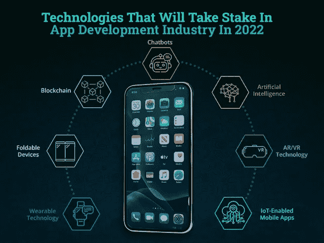
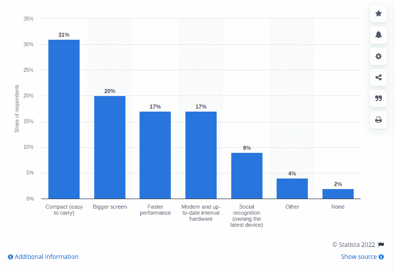

# 2022 年将在应用开发行业占有一席之地的技术

> 原文：<https://javascript.plainenglish.io/technologies-that-will-take-stake-in-app-development-industry-in-2022-326f67afdbfd?source=collection_archive---------14----------------------->

## 2022 年值得关注的移动应用开发技术

你是否一直在寻找潜在的业务拓展方式来帮助你创造更好的收入？毫无疑问，投资移动应用开发是获得成功的完美途径。

然而，随着 2023 年产生 5.32 亿美元收入的预测，移动应用程序开发行业正在快速发展，这不是夸大其词。因此，来自不同垂直行业的企业正迅速行动起来，创建一个数字化的存在。

随着疫情的到来，对移动应用的需求正在进一步飙升。然而，如果你认为开发一个应用程序可以确保你的成功，那么你可能错了。

随着市场竞争的加剧，开发一个成功的应用程序真的成为了一项具有挑战性的任务。你可能有一个很棒的应用想法，但是随着技术的融合，你需要做出一个明智的决定，哪种技术最适合你的需求。这就是游戏真正开始的地方。

因此，如果你在寻找成功的关键，那么你需要了解市场的脉搏。为了参与市场竞争，您需要了解最新的行业技术和趋势。

虽然没有适合不同应用程序开发需求的独立技术。不同的企业有不同的目标，因此寻找适合他们需求的解决方案是值得的。然而，核心问题是，你如何决定你应该选择哪种技术来构建一个应用程序。

无论你是初创公司还是领先的企业家，技术的选择确实可以在应用程序性能方面产生很大的影响。有这么多的技术渠道，很难判断哪种技术将在 2022 年统治这个领域。

因此，作为技术领域的行业专家，我们在这里提到了一系列应用程序开发技术，这些技术将在今年占有一席之地，并在不久的将来继续存在。

*让我们直接进入 2022 年将彻底改变移动开发行业的领先技术列表:*

*   **区块链在金融和银行领域的重要性日益提升**

当谈到领先的技术和移动应用程序的发展趋势时，区块链正快速而大胆地在银行和金融领域铺平道路。如果你正在管理任何银行公司、金融机构或股票交易，那么区块链肯定是你的茶。你所需要的就是雇佣一个移动应用开发者，他可以帮助你建立一个无与伦比的高质量的解决方案。随着分布式数据库系统的出现，区块链已经成为一种新兴技术。区块链的分布式分类帐架构使市场参与者之间的交易透明，并消除了对生态系统中信任执行者的需求。它的防篡改分布式数据结构提供了一个消除信任问题的环境。

此外，总部位于区块链的金融应用程序保留了无法更改的交易记录，并降低了盗窃、欺诈和误售高价值资产的重大风险。

*   **在移动应用中实施 AR/VR 技术**

近年来，AR/VR 技术席卷全球。事实上，它已经成为移动应用程序开发行业的下一件大事。

*你想知道这些技术将如何影响移动应用吗？如果是的话，那么你应该知道，到 2022 年* *，美国的 AR 用户数量将跃升至*[*9510 万。*](https://financesonline.com/virtual-reality-statistics/#:~:text=General%20User%20Statistics,(Business%20Insider%2C%202021).)

*事实上，2022 年美国 VR 用户数量为*[*5740 万。*](https://financesonline.com/virtual-reality-statistics/#:~:text=General%20User%20Statistics,(Business%20Insider%2C%202021).)

*根据*[*Statista*](https://www.statista.com/statistics/591181/global-augmented-virtual-reality-market-size/)*，增强现实(AR)和虚拟现实(VR)市场规模到 2024 年将变成 2969 亿美元。*

无论你是在开发游戏应用还是电子商务应用，AR/VR 技术都占据了中心舞台。随着 app 开发解决方案对现代技术的需求越来越大，值得雇佣一个 [**app 开发公司**](https://www.xicom.biz/services/mobile-app-development/) 。一方面，AR 技术的实现允许用户在没有实际衣柜的情况下尝试不同的服装，虚拟地尝试镜框，尝试珠宝，等等。另一方面，VR 技术会通过佩戴耳机把你带到虚拟环境中。

*   **可折叠设备的增长趋势**

毫无疑问，可折叠设备是移动应用开发行业的新趋势，并迅速占领市场份额。但在这里，你们中的许多人想知道为可折叠设备开发移动应用程序是否有什么不同？为什么可折叠设备受到大肆宣传？

*好了，下面是解释可折叠智能手机市场好处的调查报告:*

[Image source](https://www.statista.com/statistics/1187844/greatest-benefit-of-foldable-smartphones/)

随着可折叠设备在市场上的增长趋势，现在是时候创建适用于多显示器、可折叠屏幕的应用程序了。当展开时，屏幕为用户扩大尺寸，并且可以在使用期间或使用后再次折叠成小的形式。

根据 Gartner 的一项研究，到 2023 年，可折叠手机将占据高端智能手机市场的 5%。可折叠手机正在迅速到来，因此，聘请移动应用程序开发人员来创建移动应用程序确实是一个值得的决定。他们将帮助你开发一个可以无缝适应大小屏幕的应用程序。应用程序开发人员将帮助您定制具有多屏配置的应用程序。视频流和游戏应用可以从可折叠设备中获得最大收益。

使用一些额外的空间来提供额外的信息和控件，你可以很容易地抓住用户的注意力。2022 年最大的趋势将是开发一款考虑到应用屏幕尺寸的应用。

*   **人工智能驱动的聊天机器人**

你听说过 Alexa 或者谷歌助手吗？如果是的话，那么你肯定知道手机应用程序中的语音助手可以帮助你像人类一样交流。只需一个语音指令，你就可以下单。现在的问题是这实际上是如何工作的？

人工智能的出现使之成为可能，并成功地彻底改变了我们访问移动设备的方式。由于这项技术增加了极大的便利，因此，人工智能将在未来几年继续统治。

*据*[*Statista*](https://www.statista.com/)*预测，到 2025 年，全球人工智能市场规模将突破 890 亿美元。*

以类似的方式，聊天机器人也以类似的方式工作，并允许企业自动化他们的客户支持。您可以雇佣一家 [**移动应用程序开发公司**](https://www.xicom.biz/services/mobile-app-development/) 来定制应用程序，以确保出色的客户支持。实现人工智能聊天机器人意味着拥有一个基于语音或文本的用户界面，可以在后台与应用程序交互以提供结果。

人工智能聊天机器人已经成为移动应用开发行业的顶级技术之一。它确保与应用程序的无障碍交互，并提供快速响应。无论应用程序类型如何，在应用程序中实现聊天机器人将有助于您提供 24*7 的客户支持。

*   **针对数据准确性的机器学习和人工智能**

近年来，ML 和 AI 都在开发商业应用程序方面深深陷入困境。想知道他们如何改变 IT 行业，并将移动应用提升到一个新的水平吗？

人工智能技术的使用已经远远超出了虚拟助手，聊天机器人或基于人工智能的照片过滤应用程序。随着 ML 技术的增强，人工智能变得更加关注用户预测、语音交易、基于人工智能的相机等等。无论你开发的是 iOS 还是 Android 应用，人工智能和人工智能技术都占有特殊的地位。在人工智能和人工智能服务的帮助下，您可以收集所有有用的数据，从而扩展您的业务范围。事实上，通过应用各种算法，这些技术可以帮助您跟踪用户的行为和行动，然后实施它们。

*人工智能和人工智能技术的结合将对电子商务移动应用程序的开发非常有效。下面是 AI 和 ML 的几个可能会让你惊讶的功能:*

*   带识别功能的智能摄像机
*   人工智能支持面部解锁
*   面向网络和物联网安全的应用认证。
*   语言交易

除了这些功能之外，AL 和 ML 极大地发展了医疗保健移动应用。事实上，预计 54%的患者更愿意通过电子邮件或视频电话咨询医生。

*   **支持物联网的移动应用**

物联网技术极大地改变了我们的生活。从智能手机、笔记本电脑、平板电脑到语音控制的智能家居设备，我们都被连接到互联网的设备所包围。

物联网的出现并不新鲜。然而，技术正在将不同的家用电器与电子设备连接起来，物联网肯定会成为移动应用程序开发的新事物。因此，无论你是初创公司还是企业家，你都可以 [**雇佣一名移动应用开发者**](https://www.xicom.biz/offerings/hire-mobile-developers/) 来开发一款应用，让用户可以直接从他们的移动设备上控制智能电器。

由于物联网给我们的生活带来了极大的便利，因此它的需求正在迅速增长。据估计，2022 年价值 5940 亿美元，像三星、小米、博世这样的品牌正在快速走向这些技术，并在零售、智能家居和精明的健康保险计划中继续这一趋势。

*   **将移动应用与可穿戴技术配对**

像智能手表、眼镜、健康监测器、健身带这样的可穿戴设备已经在世界上引起了轰动。根据市场调查报告，2017 年联网可穿戴设备已达到 4.53 亿台，预计到 2022 年将达到 9.29 亿台。通过雇用应用程序开发人员，企业应该准备好为使用智能手表和可穿戴设备的用户提供数字体验的应用程序。在你的应用中实现这一功能会让你更接近你的目标受众。除此之外，它还能帮助你为他们提供尖端的体验。医疗保健和健身行业的企业正在充分利用这项技术，并创造更好的收入。

如果你是一家初创公司，正在寻找进入数字世界的方法，那么这些是你需要了解的技术。它将帮助您创建一个移动应用程序，为您的业务增添优势。你所需要的是寻找技术专家，他们可以指导你哪种技术最适合你的业务需求。

# **结论**

随着各种技术的出现，开发移动应用不再是一项具有挑战性的工作。但是为了在市场竞争中保持领先，紧跟最新趋势是值得的。通过雇佣一家移动应用程序开发公司，你可以很容易地把握市场的脉搏，并能够创建一个为你的业务增添优势的应用程序。无论你有多么出色的应用创意，如果你仍然试图通过使用老派的策略和趋势在市场上取得成功，那么你就不会在市场上脱颖而出。因此，要成为这个蓬勃发展的行业的一部分，不断学习和了解最新技术是非常重要的。

======================================

*更多内容看* [***说白了。报名参加我们的***](http://plainenglish.io/) **[***免费周报***](http://newsletter.plainenglish.io/) *。在我们的* [***社区获得独家访问写作机会和建议***](https://discord.gg/GtDtUAvyhW) *。***