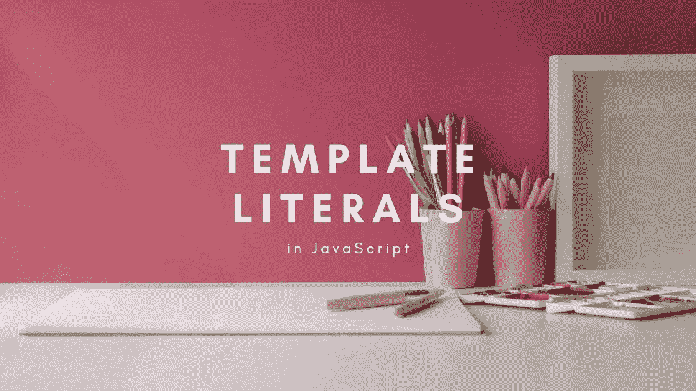
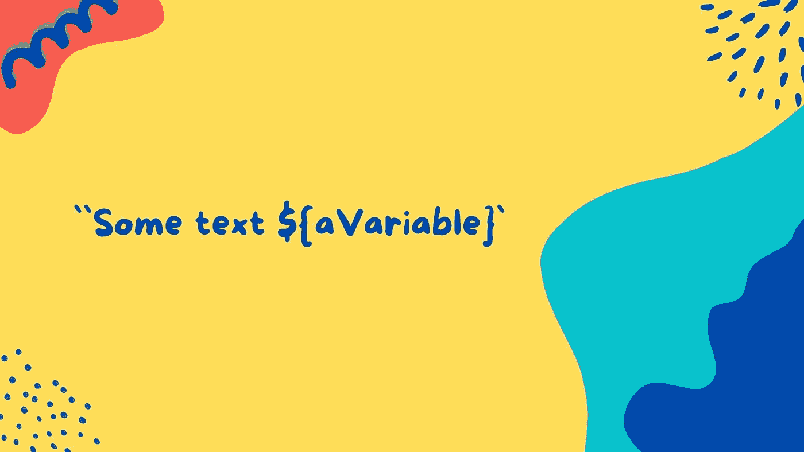

# JavaScript 中的模板文字是什么

> 原文：<https://javascript.plainenglish.io/template-literals-in-javascript-5fcf2e910688?source=collection_archive---------9----------------------->

## 了解如何在 JavaScript 中使用模板文字和字符串插值



## 什么是模板文字？

在 JavaScript 的 ES6 版本中，引入了模板文字。在 ES6 之前，如果我们有一个想要在字符串中使用的变量，我们必须像下面这样做。

```
function printDrink() {
  var drink = "Tea";
  return "My favourite drink is" + " " + drink;
}console.log(printDrink());
//Returns ---> My favourite drink is Tea
```

在上面的例子中，我们创建了一个名为`printDrink`的函数声明。在函数内部，我们创建了一个名为`drink`的变量。我们将字符串“Tea”赋给变量。该函数返回一个字符串，该字符串使用连接(加法符号)打印出一个字符串和`drink`变量。当函数被调用时，我们得到返回的字符串。

模板文字提供了一种简洁的方式将变量或表达式插入(注入)到字符串中，而不是必须进行连接。模板文字用反勾( **``** )括起来，而不是通常的双引号或单引号。字符串插值描述了何时将变量注入字符串。你想要插入的变量被包在花括号里，并以美元符号开始。变量本身放在花括号内。



让我们看看前面的例子，但这次使用的是模板文字。

```
function printDrink() {
  var drink = "Tea";
  return `My favourite drink is ${drink}`;
}console.log(printDrink());
//Returns ---> My favourite drink is Tea
```

在上面的例子中，我们保留了相同的函数声明和饮料变量。这次我们使用模板文字。模板文字用反勾号括起来，并返回字符串。使用内插法，饮料变量被注入到模板文本中。当函数被调用时，我们得到相同的返回值。

## 多行字符串

模板文字的另一个有用的特性是我们可以将字符串跨越多行。在 ES6 之前，您必须使用字符串连接或换行符(\n)来实现这一点。下面我简单举个例子:

```
var ourString = "First line\nSecond line\nThird line\n";
console.log(ourString);//Returns ---> 
First line
Second line
Third line
```

有了模板文字，我们再也不用担心这个问题了。如果我们想创建一个多行的字符串，我们可以用反勾号将字符串括起来，然后将各行分开。

```
let ourString = `First line
Second line 
Third line`;console.log(ourString);//Returns ---> 
First line
Second line
Third line
```

这篇文章的视频可以在这里找到:

请随时发表任何评论、问题或反馈，并关注我以获取更多内容！

*更多内容请看*[***plain English . io***](https://plainenglish.io/)*。报名参加我们的* [***免费周报***](http://newsletter.plainenglish.io/) *。关注我们关于*[***Twitter***](https://twitter.com/inPlainEngHQ)*和*[***LinkedIn***](https://www.linkedin.com/company/inplainenglish/)*。加入我们的* [***社区不和谐***](https://discord.gg/GtDtUAvyhW) *。*