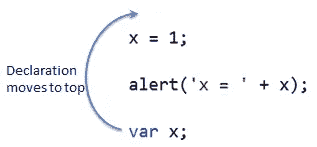

# JavaScript 中的时间死区是什么？

> 原文：<https://javascript.plainenglish.io/temporal-dead-zone-javascript-c38e63826cd?source=collection_archive---------11----------------------->


你以为只有恐怖片才有死亡地带吗？好好读读这个故事，你会惊讶地发现它们也是用 JavaScript 写的！

但是它们出现在哪里呢？嗯，大多数恐怖和幽灵的东西最近开始消失。但 JavaScript 的死区出现在 2015 年，当时 ECMAScript 的 TC39 发布了 JavaScript 的新标准(俗称 ES6)。然而，在了解死区之前，您需要了解一个简单的概念。所以，我们来讨论一下 JavaScript 中的提升是什么。

# 什么是吊装？

JavaScript 引擎在执行之前解析代码，在解析阶段，它将所有的**变量和函数声明**转移到作用域的顶部。JS 引擎的这种行为叫做**提升**。



# 可变提升

考虑下面的代码片段:

```
console.log(greeting); // undefined
var greeting = "Hello";
```

我们可以看到,`greeting`变量在声明之前可以被访问，尽管它的值是未定义的。发生这种情况是因为 JS 引擎在执行之前将我们的代码片段修改成这样。

```
var greeting;
console.log(greeting); // undefinedgreeting = "Hello";
```

值得注意的是，变量声明被移动到声明它们的作用域的顶部。例如:

```
function () {
  console.log(x);
  var x = 'hoisted in function scope';
}console.log(y);
var y = 'hoisted in global scope';
```

吊装后将转换为以下形式

```
var y;
function () {
  var x;
  console.log(x);
  x = 'hoisted in function scope';
}console.log(y);
y = 'hoisted in global scope';
```

# 功能提升

JavaScript 中的正式函数声明也被提升到了作用域的顶部。例如:

```
greeting(); // Hellofunction greeting() {
  console.log("Hello");
}
```

**注意:**变量提升和**函数提升**的重要区别在于:一个`var`变量被提升后自动初始化为`undefined`，而一个函数声明被提升后**初始化为其函数值**。

# 函数声明与函数表达式

*函数提升*只适用于形式`function`声明，不适用于`function`表达式赋值。考虑:

```
greeting(); // TypeError: greeting is not a functionconsole.log(greeting); // undefinedvar greeting = function greeting() {
  console.log("Hello!");
};
```

上面，我们可以看到`greeting`变量被提升了，但是它没有用函数引用初始化。引擎扔给我们一个`TypeError: greeting is not a function`而不是`ReferenceError: greeting is not defined`。函数表达式赋值的行为非常类似于**变量提升**。

# let 和 const 呢？

到目前为止，我们只讨论了`var`和正式的`function`声明。那`let`和`const`呢。**所有的声明** ( `var`、`let`、`const`、`function`、`function*`、`class` ) **在 JavaScript 中都是“悬挂”**。这意味着，如果在某个作用域中声明了一个名称，那么在该作用域中，标识符将总是引用该特定变量:

```
x = "global";
// function scope:
(function() {
    x; // not "global"
    var/let/… x;
}());// block scope (not for `var`s):
{
    x; // not "global"
    let/const/… x;
}
```

现在让我们看看下面的片段

```
console.log(greeting); // cannot access 'greeting' before initializationlet greeting = "Hello";
```

我们得到一种新的错误，它不是一个`ReferenceError`，引擎知道`greeting`，但是不允许我们在它初始化之前使用它。JS 引擎不允许我们在使用`let`和`const`声明变量之前访问它们。

让我们来看看这个片段-

```
let greeting;
console.log(greeting); // undefined
greeting = "Hello";
```

从上面我们可以看到，一旦声明了`greeting`变量，我们就可以访问它。

# 所以，let 和 const 都不吊？

## **颞侧死区**

> 这被称为**时间死区**。

看了上面两个代码片段，似乎很有说服力的是`let`和`const`没有被吊起来。但它们确实是。我们可以再举几个例子来证明这一点

```
console.log(typeof iDontExist); // undefined
console.log(typeof greeting); // cannot access 'greeting' before initializationlet greeting = "hello";
```

如果`greeting`变量没有被提升，我们会认为`typeof greeting`与`typeof iDontExist`相似。这证明 JS 引擎知道我们的`greeting`变量，但是由于**时间死区**，仍然不允许我们访问它。


让我们看另一个例子-

```
let x = 'outer value';
console.log(x); // outer value
{
  // start Temporal Dead Zone (TDZ) for x
  console.log(x); // cannot access 'x' before initialization
  let x = 'inner value'; // declaration ends TDZ for x
}
```

在内部作用域中访问变量`x`仍然会导致 TDZ 错误。如果`let x = 'inner value';`没有被吊起，那么在 6 号线上，它将记录`outer value`。

因此，`var` / `function` / `function*`申报与`let` / `const` / `class`申报的区别在于**初始化**。前者是在作用域顶部创建绑定时用`undefined`或(生成器)函数初始化的。然而，用`let` / `const` / `class`声明的变量保持**未初始化**。只有在对`let` / `const` / `class`语句求值时，它才会被初始化，之前(上面)的所有内容都被称为 ***时间死区*** 。此外，需要注意的是`let y`等同于`let y = undefined`。这意味着`let`关键字在遇到变量时将其初始化为 undefined，但是变量在提升时不会被初始化。

# 结论

*   用`undefined`提升并初始化`var`声明。
*   形式函数声明用它们的函数引用来提升和初始化。
*   `let`和`const`变量也被提升，但是在它们声明之前不能被访问。这被称为时间死区。

想学习现代 JavaScript 概念，TypeScript，React 或者 Next.js？请关注我的个人资料。我已经在 Vue.js 上发布了 2 门课程，并将很快发布一门完整的——使用 Next.js 和 TypeScript 进行全栈开发的课程。

[https://www.udemy.com/user/coding-simplified/](https://www.udemy.com/user/coding-simplified/)

*更多内容请看*[*plain English . io*](http://plainenglish.io/)*。报名参加我们的* [*免费每周简讯*](http://newsletter.plainenglish.io/) *。在我们的* [*社区*](https://discord.gg/GtDtUAvyhW) *获得独家写作机会和建议。*