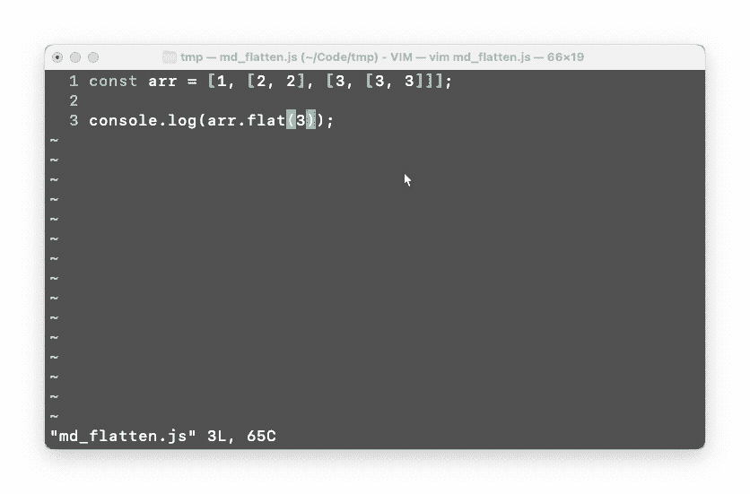

# 可怕的 JavaScript 建议:揭穿愚蠢的建议

> 原文：<https://javascript.plainenglish.io/terrible-javascript-advice-debunking-stupid-advice-8be0f4724005?source=collection_archive---------2----------------------->

## 然而，另一位程序员给出了糟糕的建议。


今天早些时候，我读了一篇名为 [*的文章，作者是 Ruhul Amin*](https://medium.com/javascript-in-plain-english/10-javascript-hacks-every-programmer-should-know-9b79efbabc4d)*。这位作者似乎对编程一无所知。*

我厌倦了媒体作家在简单的英语出版物中用可怕的文章和可怕的信息来滥发 JavaScript。在这篇文章中，我将揭穿鲁胡尔·阿明的每一个主张，并解释为什么你不应该听他的建议。

他相信他的建议会优化你的 JavaScript，减少内存使用，提高运行效率。这不是真的；**如果你听从他的建议**，你的代码库将**更难维护**，**低效**，并且**使用更多内存**。

此外，很明显，在他的清单的第 6 或第 7 项，他用完了“黑客”，所以他用废话填充它。很抱歉我的消极，但请继续读下去。

# 1.使用 array.length()调整数组大小或清空数组

好吧…所以呢？这就是调整数组大小的方法！这不是一个 JavaScript 黑客，而是你应该如何缩小一个集合。

Ruhul 的第一点就像是说，“嘿，看看这个 JavaScript 黑客”:

```
const x = "Hi";
```

哇！看看这个很酷的 JavaScript 代码。你可以用`const`在 JavaScript 中赋值一个常量！

不是很有趣，也不是 JavaScript 黑客。

# 2.展平多维数组

> "我们可以使用 spread 运算符来展平多维数组。"——鲁胡尔·阿明。

他提供了以下 JavaScript 代码:


Code that only flattens a 2D array — not all multidimensional arrays

你不能用这种方式展平多维数组！多维是什么意思？它的意思不仅仅是一维的。这包括 2D、3D 和 4D 阵列等。

这段代码甚至不能用于 3D 数组:


Demonstration of the flaws in Ruhul’s code

**那么正确的方法是什么呢？**使用`Array.flat(n)`原型函数，其中`n`是维度的数量。


The correct way to flatten an multi-dimensional array in JavaScript



Demonstration of the flat array prototype function

# 3.获取数组中的最后一项

> *“另一个聪明的技巧是，我们可以通过使用负数作为参数来获取数组中的最后一个元素。”——鲁胡尔·阿明。*

他使用`slice`方法来完成这个任务。


嗯…这不是黑客。同样，这是使用切片方法的正确方法。字面意思是在`Array.prototype.splice`的[文档](https://developer.mozilla.org/en-US/docs/Web/JavaScript/Reference/Global_Objects/Array/slice)中。虽然，如果你想知道:**这是一个获取最后一个元素**的低效方法。

简单的解决方案可能是最好的。


这样，您不需要析构数组来访问最后一个元素。

# 4.交换两个变量，不交换第三个变量

> *“我们可以使用第三个变量轻松交换两个变量。但是使用额外的变量意味着使用额外的内存。我们可以只用两个变量来优化内存。”——鲁胡尔·阿明。*

我一生中从未听过比这更错误的说法。作者提供了这个代码示例。


Inefficient swap — Ruhul, you’re wrong again

这个代码是有效的。这是一个巧妙的把戏，但作者显然错了。这位作者显然从未上过计算机科学入门课程。使用一个额外的变量确实意味着更多的内存… **但是初始化一个新的数组会使用更多的内存！**

```
let x = 1;      // + 8 bytes
let y = 2;      // + 8 bytes
[x, y] = [y, x] // + 48 bytes
```

第三行代码在赋值操作符的右边初始化一个新数组。空数组消耗 V8 中的`32 bytes`。每增加一个号至少消耗*`8 bytes`。这种方法总共消耗`64 bytes`。*

*交换两个数组的常规方法要高效得多*

```
*let x = 1;    // + 8 bytes
let y = 2;    // + 8 bytes
const z = x;  // + 8 bytes
x = y;        // + 0 bytes
y = z;        // + 0 bytes*
```

*另一方面，使用临时变量只消耗`24 bytes`总量，而使用额外变量只消耗`8 bytes`。*

*这不是 Ruhul 交换变量方法的唯一缺陷。他的方法在所有 JavaScript 运行时也慢得多。以下面的执行为例:*

**

*Demonstration showing that regular variable swapping is more efficient than Ruhul Amin’s method*

```
*array destructuring: 0.12msregular swap: 0.01ms*
```

*数组析构方法始终比临时变量花费至少 12 倍的时间。为什么？因为，在幕后，JavaScript 正在做以下事情:*

1.  *初始化数组(分配 48 字节)*
2.  *访问`array[0]`*
3.  *将值分配给`y`*
4.  *访问`array[1]`*
5.  *将值分配给`x`*
6.  *检查要析构的另一个值*

*在做出如此明显错误的声明之前，鲁胡尔应该为他的代码计时或者做一些研究。*

# *5.通过优化内存合并两个数组*

*好吧，这个其实挺好的。他建议使用`Array.prototype.push.apply`而不是`Array.prototype.concat`。我对这种选择的唯一问题是，这两个原型函数不做同样的事情。*

*`Array.prototype.concat(a, b)`将用来自`a`的元素创建一个`new`数组，后跟来自`b`的元素。*

*`Array.prototype.push.apply`将元素从`b`推到现有的数组`a`。虽然这减少了内存占用，但这会频繁调用`push`，这会花费稍长的时间。*

*—呃。不是可怕的建议，但也不是好建议。*

# *6.使用拼接代替简单删除*

> *“这可能是优化 JavaScript 代码的最佳方法。它也加快了你的代码。为什么不应该使用 **delete？**因为它只是删除对象属性，而没有**重新索引数组**或更新其长度，留下未定义的值。基本上，它在执行中消耗了大量的时间。”——鲁胡尔·阿明。*

*他是正确的——从数组中删除元素时不应该使用`delete`关键字。不过还是那句话，**这不是黑客**。这只是另一个数组原型方法。它在数组的文档中。简单的谷歌搜索就会告诉你这些。*

*我还没有见过一个 JavaScript 开发人员，甚至是入门级的开发人员，使用`delete`关键字从数组中移除元素。*

# *7.我们应该使用开关…格而不是 if/else*

> *“`switch…case`总是被低估。`Switch…case`和`if/else`执行几乎相同的任务，但是`switch…case`的**执行时间比`if/else`语句的**快！这是为什么呢？在`if/else`语句中，您需要进行平均比较，以获得正确的子句。另一方面，switch 语句基本上是一个查找表，其中包含已知的选项。”——鲁胡尔·阿明。*

*嗯……不完全是。我同意 switch 语句比 if-else 语句更快，但是只有当条件语句的数量非常大时，它才会明显更快。*

*…但是当您有大量的条件或开关语句时，使用对象映射会更好。这使得你的代码更快，更容易维护。*

*以下面的 if 语句为例。*

**

*我们可以把它改写成:*

**

*Slightly better*

*但是这段代码太长，效率低，而且不太容易维护。取而代之的是一个对象，将值映射到函数会更加有效和易于维护:*

**

*✅ Even better*

# *8.尽快打破这个循环*

> *“查找没有必要在一个循环中完成每个迭代的情况。例如，如果我们正在搜索一个特定的值，并且找到了那个值，那么后续的迭代是不必要的。因此，我们应该使用一个`break`语句来终止循环的执行。*

*首先，他用冒号结束了这个陈述，但是没有提供例子。除此之外，**这不是一个 JavaScript 黑客！这甚至不是更好的做事方式。这是编写代码的标准方式。这只是这种语言的一个特征，也是许多其他语言的一个特征。***

*执行查找的函数不应该使用`break`语句，而应该使用`return`语句:*

**

*很明显，他已经没有“黑客”可写了，但是他想达到 10 个，所以他提供了这条建议。*

# *9.减少内存泄漏的机会*

> *“内存管理在 JavaScript 中很重要。如果你不能正确地管理内存，那么内存就会泄漏，这将是你的程序崩溃的原因。内存泄漏背后有一些原因。一些原因是:**意外使用全局变量，忘记定时器或回调，不必要的缓存等。”** —鲁胡尔·阿明。*

*同样，他可能已经没有“黑客”可写了，但他想达到“10 个黑客”，所以他选择写“内存泄漏”。*

*这怎么是黑客呢？当然，每个开发人员都应该知道这一点。除非必要，否则避免全局变量是良好的编程实践。不再需要时，定时器(从`setInterval`开始)应被清除。这些只是 JavaScript 的基本实践，而不是黑客。*

# *10.理解大 O 符号*

> *“这是一个非常基本但被低估的话题😥。如果你学习了大 O 符号，那么你会很容易理解为什么你的一些函数运行得更快，为什么你的一些函数占用更少的内存。所以在钻研框架和其他高级东西之前，先学习这个基本的东西。”——鲁胡尔·阿明。*

*什么！说真的！这根本不算是黑客。这甚至与 JavaScript 无关。首先，Big-O 表示法只是一种表示**时间复杂度**的表示法。它们不是一回事。Big-O 符号不会教你任何关于函数运行时的东西；它只是教导如何描述一个算法的运行时间。他的意思是**时间复杂度**。*

*同样，任何上过数据结构或算法入门课的人都会知道时间复杂性；这同样适用于任何对算法研究很少的人。*

*但是如果我是一个自学成才的程序员呢？也许他应该教读者什么是 Big-O 和时间复杂性，而不是仅仅说要学习它们。此外，任何人都可以从逻辑上得出结论，将 for 循环放在 for 循环中会比使用单个 for 循环花费更长的时间。*

*他只想完成“清单”上的第十项。*

**如果你想要更多这样的内容，可以看看我的其他文章。**

*[](/how-to-really-implement-the-sleep-function-in-javascript-621b4ed1e618) [## 如何在 JavaScript 中真正实现 sleep()函数

### 如何用 JavaScript 实现 sleep()函数的指南(正确方法)。

javascript.plainenglish.io](/how-to-really-implement-the-sleep-function-in-javascript-621b4ed1e618) [](https://medium.com/@thesoggywaffle/no-the-end-of-javascript-is-not-here-776a0c92c501) [## 不，JavaScript 还没有结束

### 一个媒体作家如何因为自己一无所知的东西而毁掉自己的可信度。揭露谎言。

medium.com](https://medium.com/@thesoggywaffle/no-the-end-of-javascript-is-not-here-776a0c92c501) [](/responding-to-the-hate-stop-using-for-loops-use-iterators-instead-eb2139c8ce51) [## 回应仇恨:停止使用 For 循环，使用迭代器

### 一位评论者在评论中猛烈抨击了我在 Medium 上表现最好的文章。我会分解为什么我是对的，然后…

javascript.plainenglish.io](/responding-to-the-hate-stop-using-for-loops-use-iterators-instead-eb2139c8ce51) 

*更多内容看* [***说白了就是***](https://plainenglish.io/) *。报名参加我们的* [***免费周报***](http://newsletter.plainenglish.io/) *。关注我们关于*[***Twitter***](https://twitter.com/inPlainEngHQ)*和*[***LinkedIn***](https://www.linkedin.com/company/inplainenglish/)*。查看我们的* [***社区不和谐***](https://discord.gg/GtDtUAvyhW) *加入我们的* [***人才集体***](https://inplainenglish.pallet.com/talent/welcome) *。**