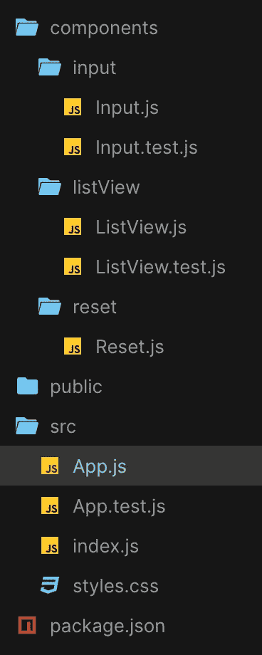
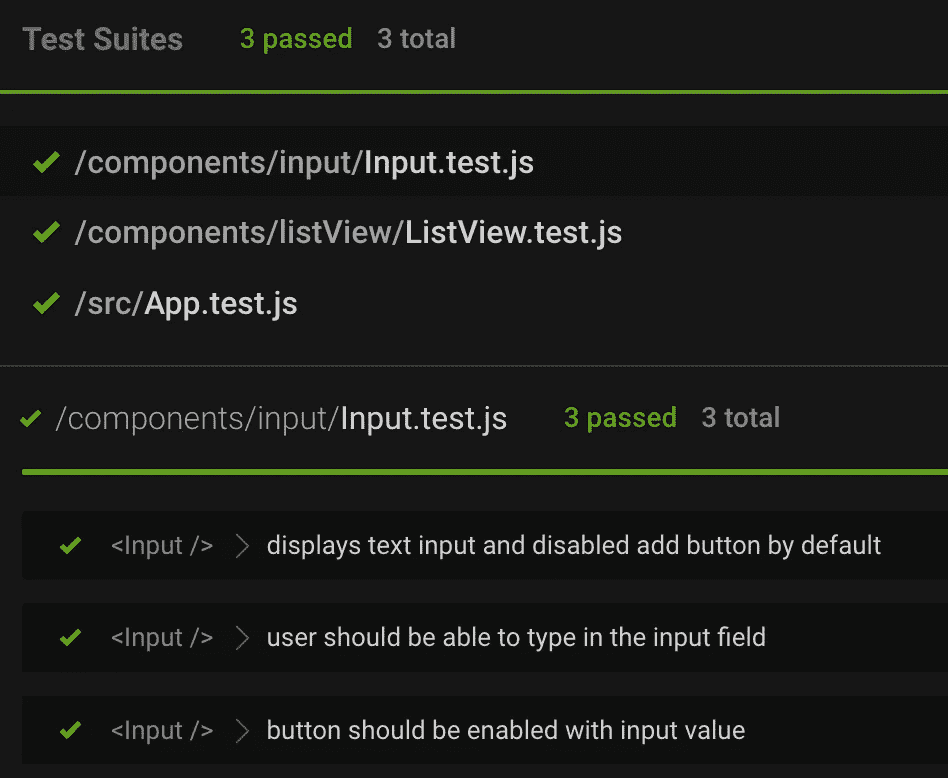
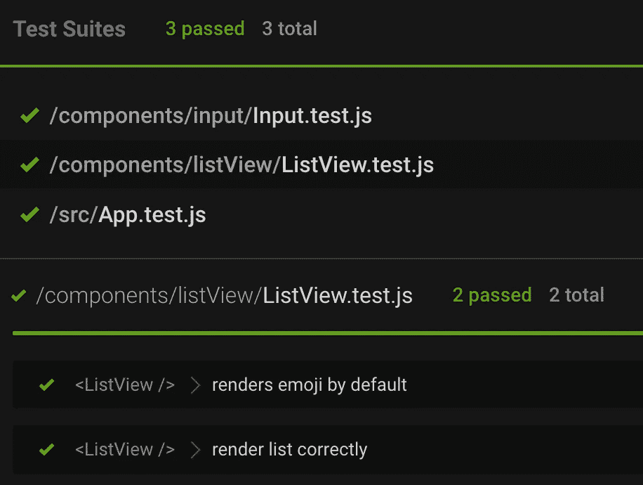
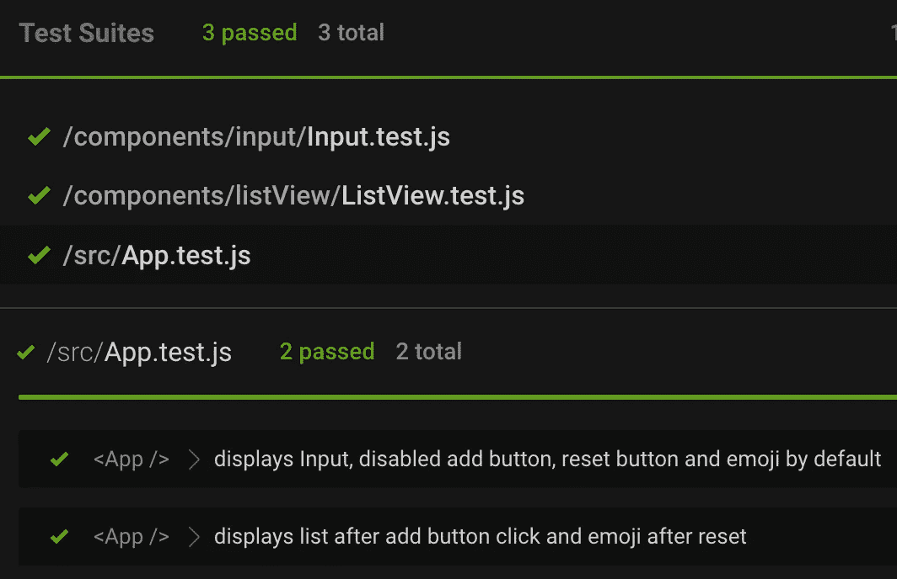

# 用 Jest 和 React- Testing-Library 测试 React 应用程序

> 原文：<https://javascript.plainenglish.io/test-a-react-app-with-jest-and-react-testing-library-da9b59860051?source=collection_archive---------3----------------------->

## 在开发 React 应用程序时，有一部分我们有时没有认真对待:测试。


三人行，必有我师焉 —Confucius: When three are walking together, I am sure to find teachers among them

测试是软件开发中必不可少的实践，它有助于创建健壮和高质量的应用程序，使它们更灵活，在引入或修改功能时更容易出现错误，在我看来，在自动化测试完成之前，任何功能都不应该发布。

自从与 React 一起工作以来，我一直使用 [Cypress](https://www.cypress.io/) 进行端到端测试，并且由于最近有人问我以前是否使用过 Jest，我认为是时候尝试一下了，所以我想从 React Todo 应用程序开始，以更好地了解基本知识，当然我会与您以及我的其他文章分享这些步骤。

> [**Jest**](https://jestjs.io/) 是一个 JavaScript 测试运行器，让你通过 [jsdom](https://reactjs.org/docs/testing-environments.html#mocking-a-rendering-surface) 访问 DOM，它用于运行单元测试。单元测试只是确保您的方法返回不同情况下的预期值。
> 
> [**React 测试库**](https://testing-library.com/docs/react-testing-library/intro/) 是一组帮助器，让您测试 React 组件，而不依赖于它们的实现细节，它模拟隔离组件上的用户交互，并断言它们的输出，以确保 UI 正确运行。

在本文中，我将尝试使用 Jest 和 React 测试库的流行组合来测试一个最小的 todo 应用程序(总是从 todo 开始😂 ).Jest 和 React 测试库都预装了 [Create React App](https://create-react-app.dev/) 。 **React 测试库并不特定于任何测试框架，我们可以与任何其他测试库一起使用，我们需要安装 Jest 因为 React 测试库只提供了帮助我们编写测试脚本的方法，所以我们仍然需要一个 JavaScript 测试框架来运行测试代码，* ***Jest 是很多开发者推荐和首选的。***

让我们开始为 Todo 应用程序创建组件。你可以用 *npx create-react-app、*启动一个新项目，或者直接进入[这个代码沙箱](https://codesandbox.io/s/todo-jest-react-zp3hhy?file=/src/App.js)查看完整代码👇

[https://codesandbox.io/s/todo-jest-react-zp3hhy?file=/src/App.js](https://codesandbox.io/s/todo-jest-react-zp3hhy?file=/src/App.test.js:908-980)

这个应用程序的结构非常清晰，里面有 3 个组件: **Input** 组件包含一个输入框和一个添加按钮， **ListView** 组件显示列表或蛋糕🍰表情符号中， **Reset** 组件只是包含了一个复位按钮。

**因为这篇文章是关于测试的，所以不太使用 CSS*



App contains 3 components

这是完整的代码👐

```
// **App.js**
import "./styles.css";
import Input from "../components/input/Input";
import ListView from "../components/listView/ListView";
import Reset from "../components/reset/Reset";
import { useState } from "react";
import uuid from "react-uuid";

export default function App() {
  const [todoList, setTodoList] = useState([]);
  const [inputValue, setInputValue] = useState("");
  const handleChange = (e) => setInputValue(e.target.value);
  const addTodo = () => {
    setTodoList([...todoList, { id: uuid(), content: inputValue }]);
    setInputValue("");
  };
  const removeTodo = (id) => {
    const newList = todoList.filter((list) => list.id !== id);
    setTodoList(newList);
  };
  const resetTodo = () => setTodoList([]);
  return (
    <div className="App">
      <**Input**
        inputValue={inputValue}
        handleChange={handleChange}
        addTodo={addTodo}
      />
      <**ListView** todoList={todoList} removeTodo={removeTodo} />
      <**Reset** resetTodo={resetTodo} />
    </div>
  );// **Input.js**
const Input = ({ inputValue, handleChange, addTodo }) => 
   <>
      <input
        onChange={handleChange}
        value={inputValue}
        className="inputField"
        type="text"
        **data-testid**="input-field"
      />
      <button
        className="button"
        disabled={!inputValue}
        onClick={addTodo}
      >
        add
      </button>
    </>
  );
export default input;// **ListView.js**
export default function ListView({ todoList, removeTodo }) {
  return (
    <ul>
      {todoList?.length ? (
        todoList.map(({ content, id }) => (
          <li key={id}>
            <span **data-testid**="list-view">{content}</span>
            <button className="button" onClick={() => removeTodo(id)}>
              remove
            </button>
          </li>
        ))
      ) : (
        <span role="img" aria-label="cake" **data-testid**="emoji">
          🍰
        </span>
      )}
    </ul>
  );
}// **Reset.js**
export default function Reset({ resetTodo }) {
  return (
    <button
      className="resetButton"
      onClick={resetTodo}
    >
      reset
    </button>
  );
}
```

现在让我们开始测试，首先我们需要用包管理器安装依赖项，

> **npm** 安装—保存-开发笑话
> 
> 或者
> 
> **纱线**添加—开发笑话

* *用 create-react-app 创建的项目已经开箱支持* ***React 测试库*** *，如果不是这样，可以这样添加:*

> NPMinstall—save-dev @ testing-library/react
> 
> 或者
> 
> **纱**添加—开发@测试-库/反应

之后，我们将对 Input、ListView 和 App 组件进行四项测试。

*   **测试 1:** 测试默认输入是否正确显示，用户是否可以在输入栏中键入，按钮是否从禁用状态启用(<输入/ >)
*   **测试 2:** 测试列表显示是否正确(ListView / >)
*   **测试 3:** 测试是否所有组件都在默认情况下正确地呈现在 DOM 中(< App / >)
*   **测试 4:** 测试复位按钮是否正常工作(< App / >)

首先让我们在组件文件夹中创建一些测试文件，例如 input → Input.js / Input.test.js，listView→ListView.js/ listView . test . js 等。

> **注意:**测试文件的名称应该与组件的名称相同，后面应该跟有 **.test.js** ，因为当使用 **npm test** 命令运行测试时，React 会自动检查所有带有**的文件名。测试**扩展并运行测试。

**Input.test.js**

```
import {render, screen} from "@testing-library/react";
import "@testing-library/jest-dom";
import Input from "./Input";
import userEvent from "@testing-library/user-event";
// import { **fireEvent** } from "@testing-library/react";**describe**("<Input />", () => {
    **test**("displays text input and disabled button by default", () => {
        **render**(<Input />);
        const userInput = **screen**.**getByTestId**("input-field");
        const addButton = **screen.getByRole**("button", { name: **/add/i** }); **expect**(userInput).toBeInTheDocument();
        expect(userInput).toHaveAttribute("type", "text");
        expect(addButton).toBeDisabled();
        expect(addButton).toHaveTextContent("add");
     }); **test**("user should be able to type in the input field", async () => {...});
    **test**("button should be enabled with input value", async () =>{...})
  });
```

👉*`***describe****(name****,*** *callback)*`*块是测试套件，* `***test****('...', () => {})*` *块(或者简称为* `*test*` *)是测试用例。描述块可以有多个测试用例，但是一个测试块不一定要在描述块中，每个测试文件中至少需要一个测试块。**

*让我们看一下第一个测试块，它测试输入字段和禁用按钮在默认情况下是否正确呈现。*

*🧚🏻‍♂️ **第一试块**:*

*   ***测试(**名称**，**回调 **)** :一个测试块接受两个必需的参数:1。一个代表测试用例的**字符串**(例如*正确显示某些内容*)，2。包含测试预期的**函数**。*
*   ***render(** 组件 **)** : React 测试库提供了一个`render`方法(例如***render****(<Input/>)*)将我们的组件渲染到 DOM 中。在给定的组件被呈现到测试环境的屏幕上之后，我们可以开始编写代码来确认预期的功能。*
*   ***Screen:**React 测试库提供了一个`screen`对象，作为访问针对测试 DOM 环境做出断言所需的相关查询的便捷方式。(*const user input =****屏幕*** *)。***【输入字段】*)。**
*   ****getByTestId()和 getByRole():** 默认情况下，React 测试库提供了[查询](https://testing-library.com/docs/react-testing-library/cheatsheet/#queries)，允许我们在 DOM 中定位元素，在本文中，我将重点介绍`getBy*`查询，这是最常见的查询类型，它通过 **data-testid** 属性来查找元素，简单点说，这是一种`screen.querySelector(`[data-testid="${someId}"]`).`的快捷方式**
*   ****expect():**`expect`函数(*例如****expect****(…)。someMatcher()* )每当我们想要检查一个特定的结果时就会用到，大多数 expect 函数都与一个`*matcher*`函数(大部分由 [jest-dom](https://github.com/testing-library/jest-dom) 提供)结合使用，以确认关于一个特定值的一些事情。(比如*。toBeInTheDocument* 是第一行 expect 函数的匹配器，而 *getByTestId()和 getByRole()* 是获取 DOM 元素的选择器)。**

```
**<input
        onChange={...}
        value={...}
        className="..."
        type="..."
        **data-testid**="input-field"
      />**
```

**🧚🏻‍♂️ **第二个试块:****

```
****describe**("<Input />", () => {
   ... // same first test block**test**("user should be able to type in the input field", **async** () => {
        const **handleChange** = **jest.fn()**; 
        render(<Input handleChange={handleChange} />);
        const userInput = screen.getByTestId("input-field"); *//* fireEvent**:** Simulates a specified event, e.g *input onChange
  //* **fireEvent**.change(userInput, {target: { value: "apple" }});**await** **userEvent**.type(userInput, "apple");
        expect(**handleChange**).toHaveBeenCalled();
        expect(userInput.value).toBe("apple");
})});**
```

**在这个块中，我们测试用户是否可以在输入字段中输入，为此我们可以使用来自 [*DOM 测试库*](https://testing-library.com/docs/dom-testing-library/intro) 和 [*Jest 函数模仿*](https://jestjs.io/docs/mock-functions) *的 [*fireEvent*](https://testing-library.com/docs/dom-testing-library/intro) 。***

*首先让我们看看模拟函数 **jest.fn** ()，它充当“间谍”，让我们窥探被其他代码间接调用的函数的行为，而不仅仅是测试输出( *change，click …* )，在我们的例子中，我们可以用`jest.fn()` : *handleChange* 回调处理程序为用户输入创建一个模拟函数👇*

```
*const handleChange = **jest.fn()**;*
```

*现在让我们看看 DOM 测试库 *fireEvent* ，我们注释掉这段代码的原因是因为建议使用`userEvent`而不是`fireEvent.`为什么？原因是`userEvent`模拟了**完整的交互**，而不仅仅是单个事件如`mouseOver()`、`focus()`、`change()` …,而且使用 fireEvent 而不是 userEvent 也有问题。*

```
*// import { **fireEvent** } from "@testing-library/react"; *//* **fireEvent:** Simulates a specified event. 
*//* fireEvent.change(userInput, {target: { value: "apple" }});*
```

*现在，在文件的顶部，我们需要确保从*@ testing library/user-event*中导入 **userEvent** ，用 *userEvent.type(userInput，" apple")* ，我们在输入字段中键入字符串:" apple "，并期望回调函数 *handleChange* 已被调用，并且" apple "应该在输入字段中。*

```
*import userEvent from "@testing-library/user-event";
...// same
        **userEvent**.type(userInput, "apple"); expect(handleChange).toHaveBeenCalled();
        expect(userInput.value).toBe("apple");*
```

*🧚🏻‍♂️ **第三个试块:***

*同样的逻辑在这里起作用，我们模仿函数，用一些值渲染组件，获取按钮，并使用 Jest API[**toBeFalsy()**](https://jestjs.io/docs/expect#tobefalsy)**来测试用户输入后按钮是否被启用。***

```
*****test**("button should be enabled with input value", **async** () => {
        // same ...
        const addTodo = jest.fn();
        render(
          <Input inputValue="apple" addTodo={addTodo} />);
          const addButton = **screen.getByRole**("button", { name: /add/i });*//button enabled* expect(addButton.disabled).**toBeFalsy**();
        **await** userEvent.**click**(addButton);
        expect(addTodo).toHaveBeenCalled();
});***
```

*   ****我使用 async-await 的原因是因为* `*v13*` *处的* `*@testing-library/user-event*` *没有返回承诺，但是* `*v14*` *的更新返回了。目前，* `*create-react-app*` *提供了* `*v13*` *，所以与最新文档不符。****

***现在，使用以下命令运行测试:***

```
***npm test***
```

******

***Input.test.js***

***这是输入测试，现在我们要测试 ListView 组件，在我们完成第一步后，接下来的步骤将会更容易。***

*****ListView.test.js*****

```
***import { render, screen} from “@testing-library/react”;
import ListView from “./ListView”;
import “@testing-library/jest-dom”;
import userEvent from “@testing-library/user-event”;describe(“<**ListView** />”, () => {
  test(“renders emoji by default”, () => {
    render(<ListView />);
      const emoji = screen.getAllByTestId(“emoji”);
      expect(emoji).toHaveLength(1); // default as array
})});***
```

***与输入组件一样，我们首先测试🍰默认情况下会显示表情符号，因为用户没有添加任何待办事项。我们使用 **data-testid** 来测试 ListView.js 中的每个元素。***

```
***<span **data-testid**="list-view">{content}</span>
<button **data-testid="remove-button">**remove</button>
<span role="img" aria-label="cake" **data-testid**="emoji">🍰</span>***
```

***然后，在第二个测试块中，我们模仿 *removeTodo* 函数，使用 Todo 列表呈现组件，获取 testid 并测试是否显示“苹果”列表而不是表情符号，然后获取 remove 按钮并触发回调函数。***

```
***test(“renders list correctly”, async () => {
    const removeTodo = jest.fn();
      render(<ListView todoList={[{ id: 1, content: “apple” }]}
           removeTodo={removeTodo} /> );
    const listView = screen.getAllByTestId(“list-view”); *// displays list content:’apple’* expect(listView[0]).toHaveTextContent(“apple”); *// remove list*    const removeButton = screen.getByRole("button", {name: /remove/i }); await userEvent.click(removeButton);
    expect(removeTodo).toHaveBeenCalled();
})***
```

***使用以下命令运行测试:***

```
***npm test***
```

******

***ListView.test.js***

*****App.test.js*****

```
***import {render, screen, fireEvent} from “@testing-library/react”;
import “@testing-library/jest-dom”;
import App from “./App”;describe(“<App />”, () => {
  test(“displays Input, disabled add-button, reset-button and emoji by default”, () => {
    render(<**App** />);
    const userInput = screen.getByTestId(“input-field”);
    const addButton = screen.getByRole("button", { name: /add/i });
    const emoji = screen.getByTestId(“emoji”);
    const resetButton = screen.getByRole("button", {name: /reset/i }); expect(userInput).toBeInTheDocument();
    expect(emoji).toBeInTheDocument();
    expect(addButton).toBeDisabled();
    expect(resetButton).toBeInTheDocument();
})});***
```

***第一个测试块非常清楚，我们测试了所有元素(输入、按钮和列表)在默认情况下都能正确显示。***

***在第二个测试块中，我将实现来自 [DOM 测试库](https://testing-library.com/docs/dom-testing-library/intro)的 *fireEvent API* (不推荐，仅作为示例)，来测试列表视图和重置按钮。( *fireEvent.click()，…* )***

```
***test(“displays list after add button click and emoji after reset”, () => {
    render(<App />);
    const userInput = screen.getByTestId(“input-field”);
    const addButton = screen.getByRole("button", {name: /add/i });
    const resetButton = screen.getByRole("button", {name: /reset/i }); *// user input* **fireEvent**.**change**(userInput, { target: { value: “apple” } });
    expect(userInput.value).toBe(“apple”);
    expect(addButton.disabled).toBeFalsy(); *// click add button and add/display list* **fireEvent**.**click**(addButton);
    const listView = screen.getByTestId(“list-view”);
    expect(listView).toHaveTextContent(“apple”); *// reset list and display emoji* **fireEvent**.**click**(resetButton);
    const emoji = screen.getByTestId(“emoji”);
    expect(listView).not.toBeInTheDocument();
    expect(emoji).toBeInTheDocument();
});***
```

***使用以下命令运行测试:***

```
***npm test***
```

******

***在最后一步中，我们添加了一个测试来验证应用程序的显示能力，现在我们知道我们的应用程序可以工作了。***

***在本教程中，我们已经使用 Jest、React 测试库编写了测试用例，我们编写了基于用户如何与 UI 交互的测试，我们还实现了 *getBy** 查询和异步测试。***

***还有更多的 [*Jest 方法*](https://jestjs.io/docs/expect#methods) 和测试用例，如编写[快照测试](https://jestjs.io/docs/snapshot-testing) s 等。您也可以阅读 Kent C. Dodd 的[React 测试库的常见错误](https://kentcdodds.com/blog/common-mistakes-with-react-testing-library)来了解更多关于使用 React 测试库的最佳实践。这是一篇很好的文章，解释了我犯的几个错误(*清理、筛选、查询、用户事件、等待…* )***

***希望这是有趣的，对你有帮助，如果你也对我的其他文章感兴趣，这里有一些链接，谢谢你的时间🌹***

***[](/suspense-with-lazy-axios-react-471a43113e4b) [## 反应:与懒惰和 Axios 的悬念

### 等等，悬疑不仅仅是代码分裂

javascript.plainenglish.io](/suspense-with-lazy-axios-react-471a43113e4b) [](https://xiaominzhu.medium.com/common-use-cases-of-react-hook-form-b7cf961a42f6) [## React-Hook-Form 库|常见用例

### 因为绝对没有人喜欢创建和重建带有验证的复杂表单

xiaominzhu.medium.com](https://xiaominzhu.medium.com/common-use-cases-of-react-hook-form-b7cf961a42f6) [](/a-shopping-list-with-react-hook-usereducer-310a3b6578) [## 用 React Hook useReducer 创建购物清单

### 带有 useReducer React 挂钩的购物清单——一个让 useReducer 更容易理解的小练习。

javascript.plainenglish.io](/a-shopping-list-with-react-hook-usereducer-310a3b6578) [](/create-a-simple-react-custom-hook-fc733d7b977a) [## 创建一个简单的 React 自定义挂钩

### 关于如何创建一个简单的 React 自定义钩子的教程

javascript.plainenglish.io](/create-a-simple-react-custom-hook-fc733d7b977a) [](/create-a-simple-express-server-node-js-for-react-application-e2b2bd0c7e93) [## 为 React 应用程序创建一个简单的 Express 服务器(Node.js)

### 关于如何创建一个简单的 Express 服务器(Node.js)、将其连接到 React 应用程序以及解决错误的教程…

javascript.plainenglish.io](/create-a-simple-express-server-node-js-for-react-application-e2b2bd0c7e93) [](https://xiaominzhu.medium.com/react-functional-components-using-refs-a5ad1d2817d4) [## 使用引用对功能组件进行反应

### forwardRef 和 useImperativeHandle 的示例

xiaominzhu.medium.com](https://xiaominzhu.medium.com/react-functional-components-using-refs-a5ad1d2817d4) [](https://medium.com/geekculture/update-parent-state-from-child-component-with-react-context-api-a56cf3742428) [## 用 React 上下文将状态从子节点更新到父节点

### — React Context 提供了一种通过组件树传递数据的方法，而不必在…

medium.com](https://medium.com/geekculture/update-parent-state-from-child-component-with-react-context-api-a56cf3742428) 

*更多内容请看*[***plain English . io***](https://plainenglish.io/)*。报名参加我们的* [***免费周报***](http://newsletter.plainenglish.io/) *。关注我们关于*[***Twitter***](https://twitter.com/inPlainEngHQ)[***LinkedIn***](https://www.linkedin.com/company/inplainenglish/)*[***YouTube***](https://www.youtube.com/channel/UCtipWUghju290NWcn8jhyAw)*[***不和***](https://discord.gg/GtDtUAvyhW) *。对增长黑客感兴趣？检查* [***电路***](https://circuit.ooo/) *。******