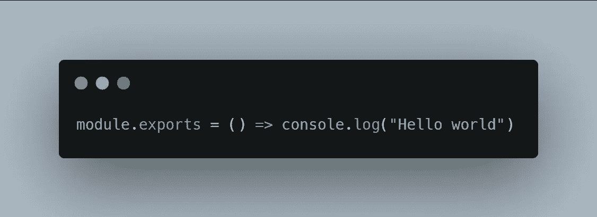
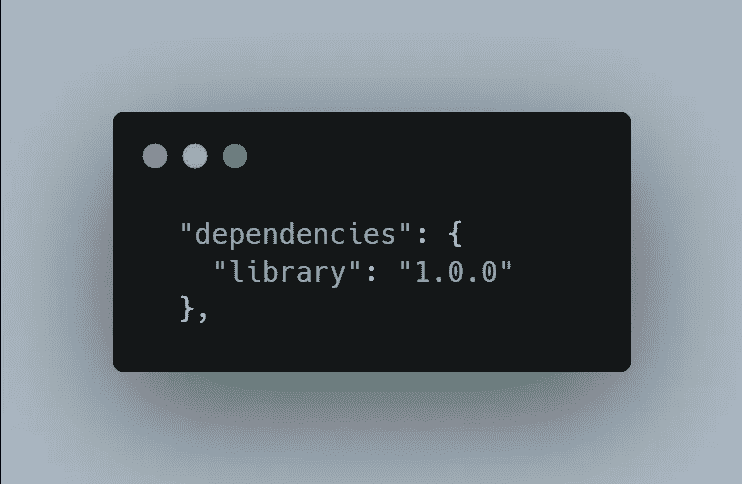
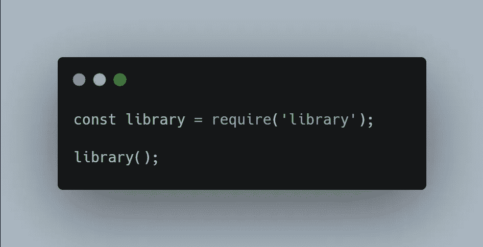

# 使用 npm 链接在本地测试您的库

> 原文：<https://javascript.plainenglish.io/test-your-library-locally-with-npm-link-a5aa79d07270?source=collection_archive---------2----------------------->

## 如何测试您的库而不必将其上传到 npm


Photo by Mike B: [https://www.pexels.com/photo/silver-chain-145683/](https://www.pexels.com/photo/silver-chain-145683/)

Npm 是一个非常强大的工具。多年来，它最终落后于它的“竞争对手”yarn，但自从 npm 7 的到来，它又回到了舞台的前面！

在本文中，我们将对 npm 的一个特殊特性感兴趣: **link。**

Npm link 是一个命令，允许你**将一个特定的 Npm 项目链接到另一个**。差不多就是这样！

它主要用于在项目中测试一个库，而不必将库发布到 npm 中。

开发一个库可能很难，npm 团队有一个好主意，让我们用一种非常简单的方式来测试它们。

让我们看看它是如何工作的。

# 设置我们的环境

为了完成这项工作，我们必须创建两个 npm 项目。为了本文的清晰，我将创建一个名为“应用程序”的项目和另一个名为“库”的项目

*提醒一下，您可以使用命令* `*npm init -y*` *创建一个 npm 项目，该项目将采用其文件夹的名称。*

## 创建我们的图书馆

一旦创建了库项目，创建一个`index.js`文件并粘贴以下内容:



这里的目标是创建一个**非常简单的库**，基本上只打印“Hello world ”,仅此而已！

我们已经完成了库的设置，让我们继续应用程序

## 创建我们的应用程序

在应用程序文件夹中，创建一个 npm 项目(如果尚未创建)。

然后我们将定义对库的依赖。在`package.json`中，定义依赖关系如下:



注意我是如何将版本设置为 1.0.0 的。这是因为 ***版本应该与库项目中的 package.json*** *版本相匹配。*

很好！现在创建一个`index.js`文件，导入这个库，并使用它:



Using our library

现在，如果你现在运行代码，**它就不会工作了**。另外，不要尝试`npm install`，因为它会尝试安装真正的`library` npm 包(我们不希望这样！)

# 将库链接到我们的应用程序

现在让我们把一切联系起来！

回到**库文件夹**，运行命令:

```
npm link
```

这个命令将通知 npm 存在一个可用于 npm 链接的`library`包。只要你**不重启你的电脑**，这种情况就会发生。

很好，现在让我们回到我们的应用程序，用下面的命令链接这个库:

```
npm link library
```

*如果你的库被不同地调用，用它的实际名称*替换 `*library*`

**你会在你的 package.json (name)* 中找到你的库名*

*这将产生两个影响:*

*   *第一个正在运行`npm install`，但是它不会有太大的用处，因为我们在这里没有任何外部依赖。*
*   *第二个效果是**将库链接到我们的项目**。这意味着现在，我们能够使用它了！*

*简单地运行应用程序文件夹中的`node index.js`，你应该会看到一个“你好世界”出现在你的控制台上！*

# *编辑库并刷新链接*

*好消息是，没有什么事可做！如果您将“Hello world”更改为库中的其他内容，只需在您的应用程序中再次运行`node index.js`，您将立即看到更改。*

*这是因为 npm 链接正在创建所谓的 [**符号链接**](https://en.wikipedia.org/wiki/Symbolic_link) 。*

# *手动取消链接*

*有两种方法可以解除库的链接。*

*第一个是重启电脑。*

*第二种方法是使用命令*

```
*npm unlink library*
```

*如果你的库有另一个名字，在命令中用它替换`library`。*

*差不多就是这样！您现在已经掌握了使用 npm link 所需的所有知识，并且不必发布 42 个 alpha 版本的库来用您的应用程序测试它！*

*我希望你喜欢这篇文章，如果是的话，不要犹豫留下掌声或关注！*

**更多内容请看*[***plain English . io***](https://plainenglish.io/)*。报名参加我们的* [***免费周报***](http://newsletter.plainenglish.io/) *。关注我们关于*[***Twitter***](https://twitter.com/inPlainEngHQ)*和*[***LinkedIn***](https://www.linkedin.com/company/inplainenglish/)*。查看我们的* [***社区不和谐***](https://discord.gg/GtDtUAvyhW) *加入我们的* [***人才集体***](https://inplainenglish.pallet.com/talent/welcome) *。**