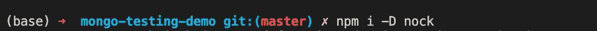

# 使用外部 HTTP 服务依赖项在 Node.js 中进行测试

> 原文：<https://javascript.plainenglish.io/testing-in-node-js-with-external-http-services-dependency-8d9e8be1f0fa?source=collection_archive---------17----------------------->

## 使用外部 HTTP 服务依赖在 Node.js 中进行测试的教程。

Photo by [Christopher Gower](https://unsplash.com/@cgower?utm_source=medium&utm_medium=referral) on [Unsplash](https://unsplash.com?utm_source=medium&utm_medium=referral)

当我们开发一些产品/特性时，需要调用外部服务是一个非常常见的场景。如果我们想创建测试良好的代码，就必须考虑如何处理这个问题。通常我们有两种选择:**为服务提供一个可访问的测试环境**或者**模拟调用。**

关于“**为服务提供一个可访问的测试环境”**要记住的是，也许我们可以从我们的机器上实现这一点，但是如果不能从我们的配置项访问该环境，或者如果服务出现故障或出现新的 bug，那该怎么办呢——所有这些都可能导致我们的测试失败。为此，在这篇文章中，我们将重点讨论“**模仿叫声**”。

当我们说“**嘲讽调用**”时，我们是在讨论发出一个真正的 HTTP 请求，拦截调用，并以我们想要的任何方式进行响应。我们**不是**在讨论一些奇怪的模块嘲讽或者一些自定义代码。对于我们的模拟，我们将使用一个名为 [**nock**](https://www.npmjs.com/package/nock) **的模块。**

**Nock** 允许我们定义 URL、路径、方法、事件头和参数(路径、查询和主体)并设置我们将要得到的响应(HTTP 代码、主体、头)。一个非常好的特性是，如果我们设置 mock 来获取一些具体参数的头，而我们的代码没有发送它们，那么 mock 就不会工作，我们的测试就会失败。

现在，让我们看一个如何在我们的代码中使用这个包的例子。

All 开始安装软件包:

现在，我们将开始我们的测试用例。让我们为一个简单的调用创建一个测试用例:

在设置 nock mock 之前，我们会遇到一些错误(取决于你如何在代码中处理这些错误)。在这种情况下，我们会得到这样的结果:

我们正在处理错误，并返回“”作为结果。

当我们完成我们的代码，HTTP 就像它应该的那样，所有的工作！

我们可以利用这个库做的事情有:

*   检查我们是否调用了 nock mock(通常如果我们没有调用，测试应该会失败，但是也许我们想确定)

*   确保该服务被调用 X 次。它必须处理同一个请求两次。我们可以使用上面看到的“isDone()”来确定这一点。

*   为连续的电话准备不同的回答。第一个调用将得到 200，第二个调用将得到 500。

这个有用的模块有更多的选项，我邀请你在[项目自述](https://www.npmjs.com/package/nock)中查看全部特性。

这里的要点是**我们需要**来开始我们的代码并与外部服务**进行集成的唯一事情是拥有 API 规范**:可用的方法、路径、参数和返回的数据。这样，我们可以确保我们的代码能够处理任何 API 行为(即使当服务不可用或者它响应错误时)。

**人们应该犯的常见错误**:

*   没有定义正确的调用预期(相同的头、参数等。)
*   在多次重新定义相同服务的测试后，不要清理 nock 模拟

要意识到这些小事会让你陷入困境一段时间。

希望这对你有帮助，谢谢你的阅读。

完整的代码包含在这个项目的[中。](https://github.com/amcereijo/mongo-testing-demo)

*更多内容看* [***说白了。报名参加我们的***](http://plainenglish.io/) **[***免费周报***](http://newsletter.plainenglish.io/) *。在我们的* [***社区不和谐***](https://discord.gg/GtDtUAvyhW) *获得独家获取写作机会和建议。***