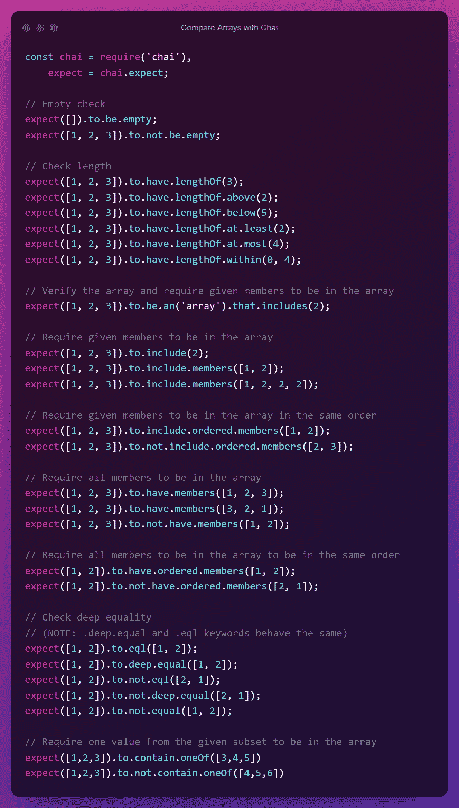
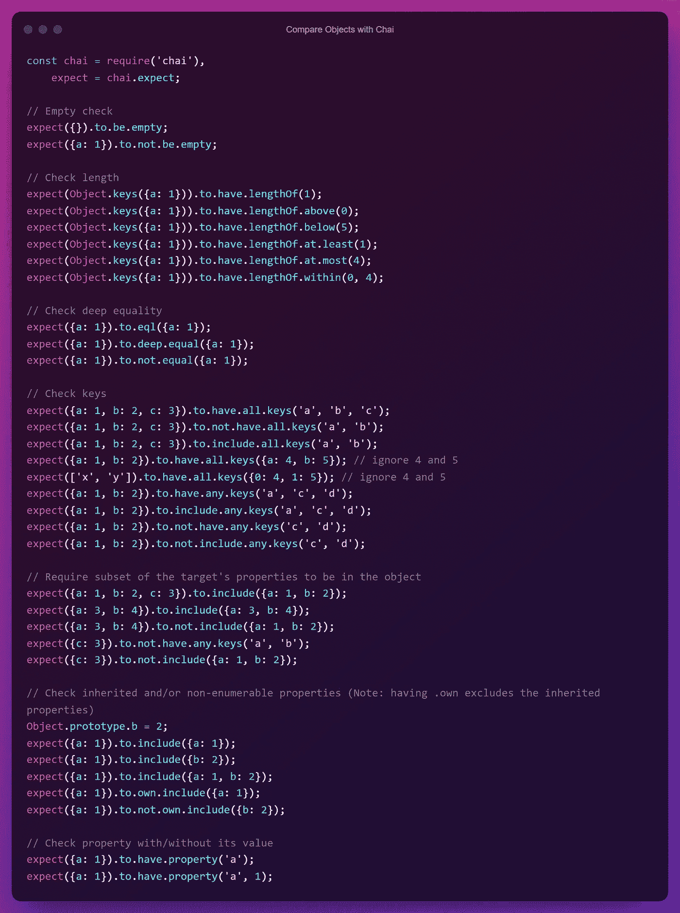
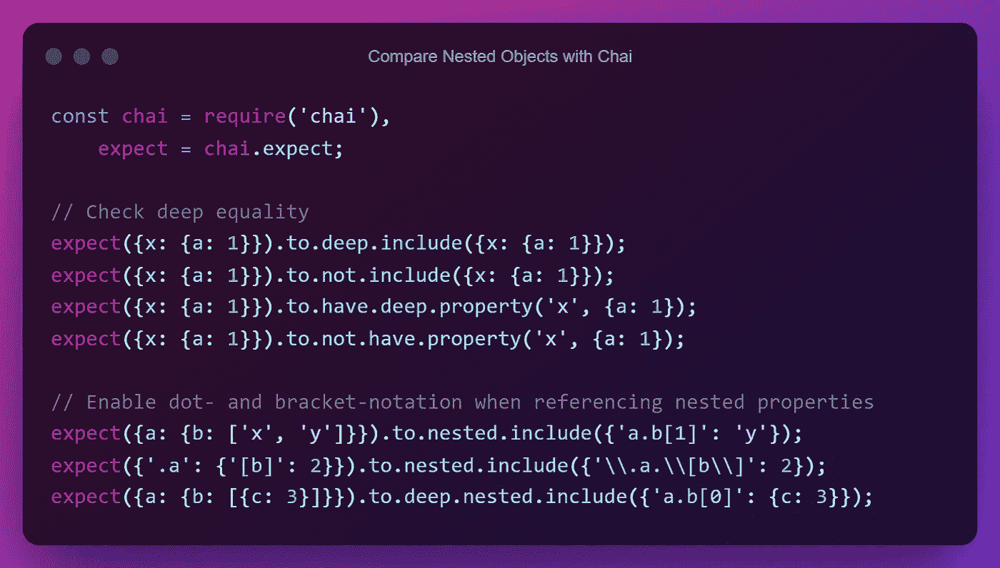
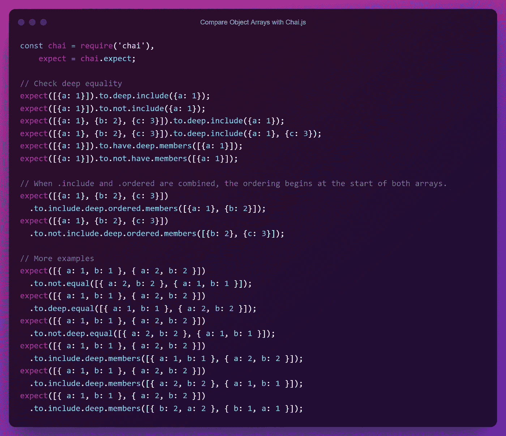
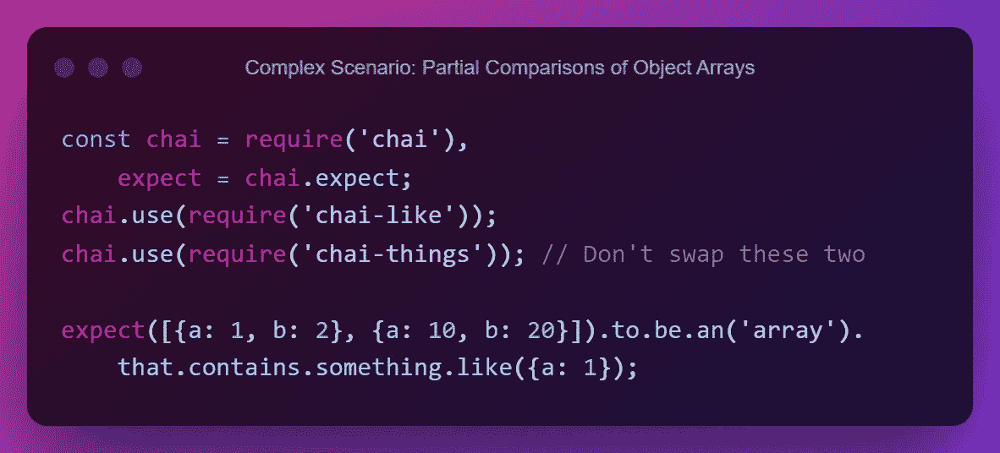
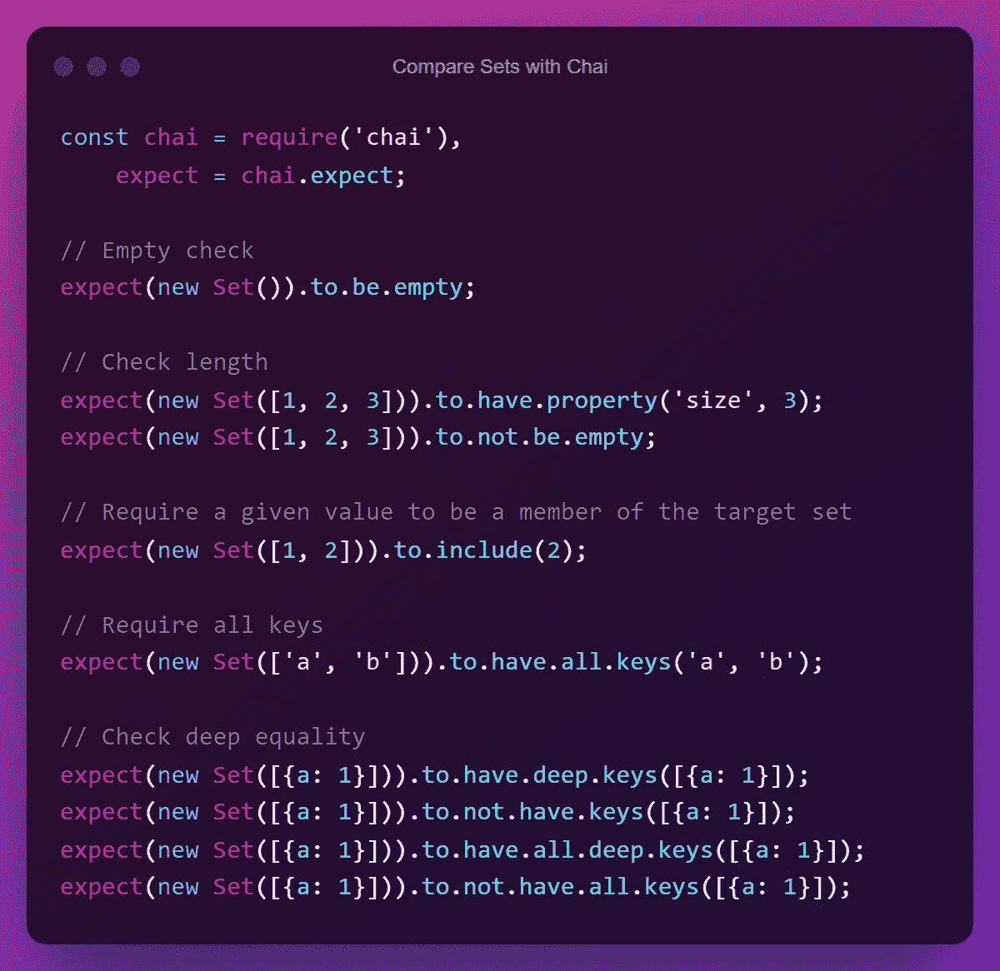
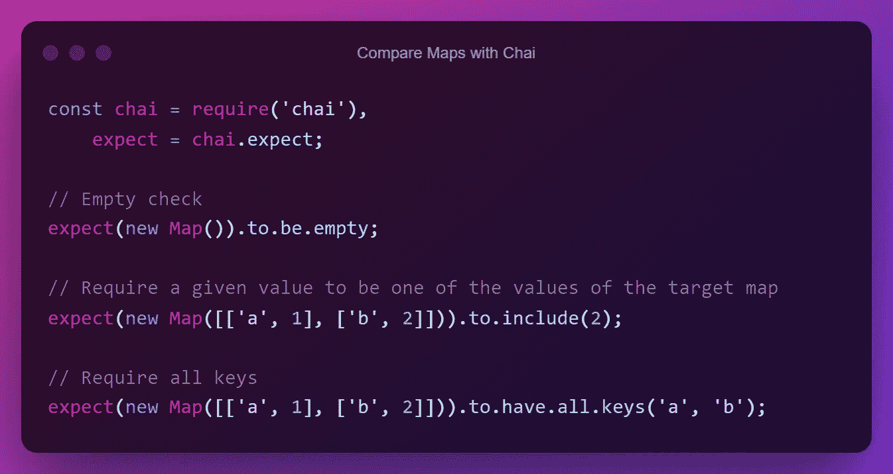

# 使用 Chai.js 测试 JS & JSON 对象、数组、对象数组、嵌套对象、集合和映射

> 原文：<https://javascript.plainenglish.io/testing-js-json-objects-arrays-object-arrays-nested-objects-sets-and-maps-using-chai-js-6bd04ac1e896?source=collection_archive---------5----------------------->

## 使用 Chai 库比较和测试 JavaScript 非原始/引用数据类型

[**柴**](https://www.chaijs.com/) 是一个流行的**断言库，为** [**Node.js**](http://nodejs.org/) 。它既支持 **BDD 测试风格又支持**TDD 测试风格，并且可以**与您选择的任何 JavaScript 测试框架**配对(例如 [Mocha](https://mochajs.org/#assertions) + Chai)。

在这个快速指南中，让我们讨论如何使用 Chai 特性来比较和测试上述数据类型。

## 关于 Chai.js 语法和功能的重要说明

*   柴提供了几个支持 **TDD** 和 **BDD** 样式的接口(`assert`、`should`、`expect`)。
*   柴支持两种主要的比较类型——**严格** **相等** ( `===`)和**深度相等**。
*   在 JavaScript 中，一个变量可以有两种类型的数据，一个**原语**值或者一个**引用**值。简单地说，如果值是数字、字符串、布尔值、未定义值、空值或符号，那么它就是一个原始值。如果是别的什么(如`typeof object`，那就是参考值。
*   为了比较**原始值**，可以使用**严格** **等式**。默认情况下，Chai 在几乎所有断言操作中都使用**严格** **等式**。
*   为了比较**参考值**(如**对象、数组、对象数组、集合和映射**)，可以使用**深度相等**。当使用这种方法时，它将递归地检查对象的键，直到找到检查引用相等性的原语，而不是引用相等性( [deep-eql](https://github.com/chaijs/deep-eql) )。
*   除了两种主要的比较类型——**严格** **相等** ( `===`)和**深度相等**之外，其他**松散比较**也可以通过使用其他 Chai 特性和特殊插件的组合来实现。

好，现在让我们看看如何在代码中使用这些概念。

# 用 Chai 比较数组

```
*// Empty check*
expect(**[]**).to.be.empty;
expect(**[1, 2, 3]**).to.not.be.empty;*// Check length*
expect(**[1, 2, 3]**).to.have.lengthOf(3);
expect(**[1, 2, 3]**).to.have.lengthOf.above(2);
expect(**[1, 2, 3]**).to.have.lengthOf.below(5);
expect(**[1, 2, 3]**).to.have.lengthOf.at.least(2);
expect(**[1, 2, 3]**).to.have.lengthOf.at.most(4);
expect(**[1, 2, 3]**).to.have.lengthOf.within(0, 4);*// Verify the array and require given members to be in the array*
expect(**[1, 2, 3]**).to.be.an(**'array'**).that.includes(**2**);*// Require given members to be in the array*
expect(**[1, 2, 3]**).to.include(**2**);
expect(**[1, 2, 3]**).to.include.members(**[1, 2]**);
expect(**[1, 2, 3]**).to.include.members(**[1, 2, 2, 2]**);*// Require given members to be in the array in the same order*
expect(**[1, 2, 3]**).to.include.ordered.members(**[1, 2]**);
expect(**[1, 2, 3]**).to.not.include.ordered.members(**[2, 3]**);*// Require all members to be in the array* expect(**[1, 2, 3]**).to.have.members(**[1, 2, 3]**);
expect(**[1, 2, 3]**).to.have.members(**[3, 2, 1]**);
expect(**[1, 2, 3]**).to.not.have.members(**[1, 2]**);*// Require all members to be in the array to be in the same order*
expect(**[1, 2]**).to.have.ordered.members(**[1, 2]**);
expect(**[1, 2]**).to.not.have.ordered.members(**[2, 1]**);*// Check deep equality 
// (NOTE:* ***.deep.equal*** *and* ***.eql*** *keywords behave the same)*
expect(**[1, 2]**).to.eql(**[1, 2]**);
expect(**[1, 2]**).to.deep.equal(**[1, 2]**);
expect(**[1, 2]**).to.not.eql(**[2, 1]**);
expect(**[1, 2]**).to.not.deep.equal(**[2, 1]**);
expect(**[1, 2]**).to.not.equal(**[1, 2]**);// *Require one value from the given subset to be in the array*
expect(**[1,2,3]**).to.contain.oneOf(**[3,4,5]**)
expect(**[1,2,3]**).to.not.contain.oneOf(**[4,5,6]**)
```



Compare Arrays with Chai (Source: Author)

# 用柴比较物体

```
*// Empty check*
expect(**{}**).to.be.empty;
expect(**{a: 1}**).to.not.be.empty;*// Check length*
expect(Object.keys(**{a: 1}**)).to.have.lengthOf(1);
expect(Object.keys(**{a: 1}**)).to.have.lengthOf.above(0);
expect(Object.keys(**{a: 1}**)).to.have.lengthOf.below(5);
expect(Object.keys(**{a: 1}**)).to.have.lengthOf.at.least(1);
expect(Object.keys(**{a: 1}**)).to.have.lengthOf.at.most(4);
expect(Object.keys(**{a: 1}**)).to.have.lengthOf.within(0, 4);*// Check deep equality* expect(**{a: 1}**).to.eql(**{a: 1}**);
expect(**{a: 1}**).to.deep.equal(**{a: 1}**);
expect(**{a: 1}**).to.not.equal(**{a: 1}**);*// Check keys*
expect(**{a: 1, b: 2, c: 3}**).to.have.all.keys(**'a', 'b', 'c'**);
expect(**{a: 1, b: 2, c: 3}**).to.not.have.all.keys(**'a', 'b'**);
expect(**{a: 1, b: 2, c: 3}**).to.include.all.keys(**'a', 'b'**);expect(**{a: 1, b: 2}**).to.have.all.keys(**{a: 4, b: 5}**); // ignore 4 and 5
expect(**['x', 'y']**).to.have.all.keys(**{0: 4, 1: 5}**); // ignore 4 and 5expect(**{a: 1, b: 2}**).to.have.any.keys(**'a', 'c', 'd'**);
expect(**{a: 1, b: 2}**).to.include.any.keys(**'a', 'c', 'd'**);expect(**{a: 1, b: 2}**).to.not.have.any.keys(**'c', 'd'**);
expect(**{a: 1, b: 2}**).to.not.include.any.keys(**'c', 'd'**);*// Require subset of the target’s properties to be in the object*
expect(**{a: 1, b: 2, c: 3}**).to.include(**{a: 1, b: 2}**);expect(**{a: 3, b: 4}**).to.include(**{a: 3, b: 4}**); 
expect(**{a: 3, b: 4}**).to.not.include(**{a: 1, b: 2}**); expect(**{c: 3}**).to.not.have.any.keys(**'a', 'b'**); 
expect(**{c: 3}**).to.not.include(**{a: 1, b: 2}**); *// Check inherited and/or non-enumerable properties (Note: having* .own excludes the inherited properties)
Object.prototype.**b = 2**;  
expect(**{a: 1}**).to.include(**{a: 1}**);
expect(**{a: 1}**).to.include(**{b: 2}**);
expect(**{a: 1}**).to.include(**{a: 1, b: 2}**);
expect(**{a: 1}**).to.own.include(**{a: 1}**); 
expect(**{a: 1}**).to.not.own.include(**{b: 2}**);*// Check property with/without its value*
expect(**{a: 1}**).to.have.property(**'a'**);
expect(**{a: 1}**).to.have.property(**'a', 1**);
```



Compare Objects with Chai (Source: Author)

# **用 Chai 比较嵌套对象**

```
*// Check deep equality* expect(**{x: {a: 1}}**).to.deep.include(**{x: {a: 1}}**); 
expect(**{x: {a: 1}}**).to.not.include(**{x: {a: 1}}**);expect(**{x: {a: 1}}**).to.have.deep.property(**'x', {a: 1}**); 
expect(**{x: {a: 1}}**).to.not.have.property(**'x', {a: 1}**);*// Enable dot- and bracket-notation when referencing nested properties*
expect(**{a: {b: ['x', 'y']}}**).to.nested.include(**{'a.b[1]': 'y'}**);
expect(**{'.a': {'[b]': 2}}**).to.nested.include(**{'\\.a.\\[b\\]': 2}**);
expect(**{a: {b: [{c: 3}]}}**).to.deep.nested.include(**{'a.b[0]': {c: 3}}**);
```



Compare Nested Objects with Chai (Source: Author)

# 用 Chai 比较对象数组

```
*// Check deep* equality expect(**[{a: 1}]**).to.deep.include(**{a: 1}**); 
expect(**[{a: 1}]**).to.not.include(**{a: 1}**);expect(**[{a: 1}, {b: 2}, {c: 3}]**).to.deep.include(**{a: 1}**);
expect(**[{a: 1}, {b: 2}, {c: 3}]**).to.deep.include(**{a: 1}, {c: 3}**);expect(**[{a: 1}]**).to.have.deep.members(**[{a: 1}]**); 
expect(**[{a: 1}]**).to.not.have.members(**[{a: 1}]**);// When *.include and .ordered are combined, the ordering begins at the start of both arrays.*
expect(**[{a: 1}, {b: 2}, {c: 3}]**)
  .to.include.deep.ordered.members(**[{a: 1}, {b: 2}]**);
expect(**[{a: 1}, {b: 2}, {c: 3}]**)
  .to.not.include.deep.ordered.members(**[{b: 2}, {c: 3}]**);// More examplesexpect(**[{ a: 1, b: 1 }, { a: 2, b: 2 }]**)
  .to.not.equal(**[{ a: 2, b: 2 }, { a: 1, b: 1 }]**);expect(**[{ a: 1, b: 1 }, { a: 2, b: 2 }]**)
  .to.deep.equal(**[{ a: 1, b: 1 }, { a: 2, b: 2 }]**);expect(**[{ a: 1, b: 1 }, { a: 2, b: 2 }]**)
  .to.not.deep.equal(**[{ a: 2, b: 2 }, { a: 1, b: 1 }]**);expect(**[{ a: 1, b: 1 }, { a: 2, b: 2 }]**)
  .to.include.deep.members(**[{ a: 1, b: 1 }, { a: 2, b: 2 }]**);expect(**[{ a: 1, b: 1 }, { a: 2, b: 2 }]**)
  .to.include.deep.members(**[{ a: 2, b: 2 }, { a: 1, b: 1 }]**);expect(**[{ a: 1, b: 1 }, { a: 2, b: 2 }]**)
  .to.include.deep.members(**[{ b: 2, a: 2 }, { b: 1, a: 1 }]**);
```



Compare Object Arrays with Chai (Source: Author)

## 复杂场景:对象数组的部分比较

```
const chai = require('chai'),
    expect = chai.expect;chai.use(require('chai-like'));
chai.use(require('chai-things')); // Don't swap these twoexpect(**[{a: 1, b: 2}, {a: 10, b: 20}]**).to.be.an('array').
    that.contains.something.like(**{a: 1}**);
```



Complex Scenario: Partial Comparisons of Object Arrays (Source: Author)

# 用柴比较器械包

```
*// Empty check*
expect(new Set()).to.be.empty;*// Check length*
expect(new Set(**[1, 2, 3]**)).to.have.property('size', 3);
expect(new Set(**[1, 2, 3]**)).to.not.be.empty;*// Require a given value to be a member of the target set*
expect(new Set(**[1, 2]**)).to.include(**2**);*// Require all keys* expect(newSet(**['a', 'b']**)).to.have.all.keys(**'a', 'b'**);*// Check deep equality* 
expect(new Set(**[{a: 1}]**)).to.have.deep.keys(**[{a: 1}]**); 
expect(new Set(**[{a: 1}]**)).to.not.have.keys(**[{a: 1}]**);
expect(new Set(**[{a: 1}]**)).to.have.all.deep.keys(**[{a: 1}]**);
expect(new Set(**[{a: 1}]**)).to.not.have.all.keys(**[{a: 1}]**);
```



Compare Sets with Chai (Source: Author)

# 与柴比较地图

```
*// Empty check*
expect(new Map()).to.be.empty;*// Require a given value to be one of the values of the target map*
expect(new Map(**[['a', 1], ['b', 2]]**)).to.include(**2**);*// Require all keys*
expect(new Map(**[['a', 1], ['b', 2]]**)).to.have.all.keys(**'a', 'b'**);
```



Compare Maps with Chai (Source: Author)

# 结论

最初，我在我的个人笔记中收集了所有这些信息，以便我可以重用它们作为在 Node.js 项目中为数组和对象类型编写 Chai 测试的首选资源。然后，我意识到了它的价值，决定发表这篇博文，供大家使用。如果你有任何改进这篇文章的建议或问题，我很乐意在评论区听到。

*敬请关注下一期编程技巧。在那之前，编码快乐！*

## 如果你喜欢这篇文章，你可能也会喜欢读这些:

[](https://codeburst.io/a-short-summary-on-clean-coding-best-practices-d8afbfa7677) [## 干净编码最佳实践的简短总结

### 成为一名干净的程序员

codeburst.io](https://codeburst.io/a-short-summary-on-clean-coding-best-practices-d8afbfa7677) [](https://betterprogramming.pub/application-logging-best-practices-a-support-engineers-perspective-b17d0ef1c5df) [## 企业应用程序日志记录最佳实践(支持工程师的视角)

### 大家来写点大家都爱的有意义的日志吧！

better 编程. pub](https://betterprogramming.pub/application-logging-best-practices-a-support-engineers-perspective-b17d0ef1c5df) 

*更多内容请看* [***说白了。报名参加我们的***](https://plainenglish.io/) **[***免费周报***](http://newsletter.plainenglish.io/) *。关注我们*[***Twitter***](https://twitter.com/inPlainEngHQ)*和*[***LinkedIn***](https://www.linkedin.com/company/inplainenglish/)*。查看我们的* [***社区不和谐***](https://discord.gg/GtDtUAvyhW) *加入我们的* [***人才集体***](https://inplainenglish.pallet.com/talent/welcome) *。***