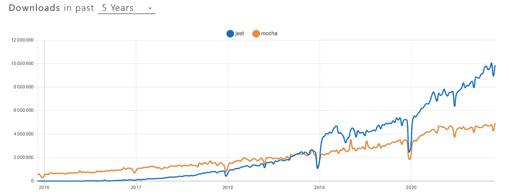

# 用 Node.js 测试:理解并选择正确的工具

> 原文：<https://javascript.plainenglish.io/testing-with-node-js-understand-and-choose-the-right-tools-98c0a33fb59a?source=collection_archive---------11----------------------->

## 用 Node.js 测试需要哪些工具，根据自己的目的选择哪些？

Photo by [flowforfrank](https://unsplash.com/@flowforfrank) on [Unsplash](https://unsplash.com/s/photos/code-test)

如果你今天在这里，有 99%的机会你想在一个更高层次的环境中开始测试，但是缺乏底层的知识。您可能正在使用 Node.js 进行前端或后端工作，但是不知道从哪里开始。恭喜你，你来对地方了。

# 测试类型

如果你不熟悉测试，你可能会有点迷路。测试类型有很多[，但有些更常见。](https://www.guru99.com/types-of-software-testing.html)

Atlassian 的以下文章提供了一个很好的起点:

 [## 软件测试的不同类型

### 有许多不同类型的测试，您可以使用它们来确保对您的代码所做的更改…

www.atlassian.com](https://www.atlassian.com/continuous-delivery/software-testing/types-of-software-testing) 

因为我们将在 Node.js 测试环境中迈出第一步，所以我们的范围将围绕单元和集成测试。

# 不同的工具

现在，你可能想知道 ***从哪里*** 开始。您已经看到了使用 Jest 的 Node.js 项目，听说了 Mocha 或 Chai，但您不确定它们是关于什么的。

太好了，这正是我们今天要讨论的。为了有一个更清晰的画面，我们可以把我们需要的不同种类的工具分开。

## 测试跑步者

您对编写测试有一个模糊的想法，但是您如何组织和运行它们呢？这就是试跑者的作用。它们的一些功能是:

*   查找测试文件和运行测试
*   报告测试成功或失败
*   配置更新后要运行或重新运行的测试
*   设置环境

还有很多。

下面是通过下载比较最受欢迎的 Node.js 测试运行程序的图表:

[https://www.npmtrends.com/jest-vs-mocha-vs-jasmine-vs-ava-vs-qunit](https://www.npmtrends.com/jest-vs-mocha-vs-jasmine-vs-ava-vs-qunit)

## 断言

现在你已经有了一个可以编写测试的环境，我们来看最重要的问题:**我如何编写我的第一个测试？**

从我们之前引用的文章中，Atlassian 对单元测试做了如下描述:

*它们包括测试你的软件所使用的类、组件或模块的单个方法和功能。*

从实用的角度来看，您可以这样看待它:

*   在一种情况下(使用定义的参数)，从您的个人单元(例如函数)获得结果。
*   确保给定结果与预期结果相匹配。

这就是**断言**所要做的:将收到的结果与预期的结果进行比较，以报告测试是成功还是失败。

像测试运行程序一样，有几个库可以帮助您处理断言:

[https://www.npmtrends.com/jest-vs-chai-vs-assert-vs-should-vs-better-assert-vs-unexpected](https://www.npmtrends.com/jest-vs-chai-vs-assert-vs-should-vs-better-assert-vs-unexpected)

## 间谍

单元和集成测试带来了一个困难:

*   您可能希望对依赖于外部依赖项的函数进行单元测试。
*   对于单元测试和集成测试，您的函数可能有一个在 JS 环境中无法使用的本机依赖项。
*   您的函数正在进行 API 调用，但是您的服务器没有在您的测试环境中设置。

间谍就是用在那里的。它们帮助您创建假货(或模仿对象)并用您定义的对象替换依赖关系。

 [## 模拟对象

### 在面向对象编程中，模拟对象是模拟真实对象行为的模拟对象。

en.wikipedia.org](https://en.wikipedia.org/wiki/Mock_object) 

同样，几个 spy 库可以帮助您:

[https://www.npmtrends.com/jest-vs-sinon-vs-jack-vs-testdouble](https://www.npmtrends.com/jest-vs-sinon-vs-jack-vs-testdouble)

# 做出选择

很好，现在你对你需要什么工具有了一个大致的概念，并且列出了最流行的工具。现在到了最困难的部分:选择哪些工具？

## 测试跑步者

老实说，我从未真正考虑过茉莉、艾娃和库奈特。

我首先从后端项目开始测试。当时，摩卡是更广泛使用的，这是我开始使用它(和柴)的唯一原因。

摩卡工作了几年，然后发生了两个变化:

*   我开始专攻 React
*   笑话开始推翻摩卡

[https://www.npmtrends.com/jest-vs-mocha](https://www.npmtrends.com/jest-vs-mocha)

在这一点上，我不得不做一个认真的比较。

Mocha 是一个测试运行程序，允许您选择外部断言和间谍库。它不会限制你，而是给你更多的灵活性。

 [## mocha——有趣、简单、灵活的 JavaScript 测试框架

### Mocha 允许你使用任何你想要的断言库。

mochajs.org](https://mochajs.org/#assertions) 

Jest 是一个完整的测试框架，由 React 提供，由脸书维护。从前面的章节和图表中，您可能已经注意到 Jest 不仅仅是一个测试运行程序，它还包括自己的断言和模拟库。

有趣的是 Jest 是建立在 Jasmine 之上的。

 [## 笑话🃏愉快的 JavaScript 测试

### Jest 是一个 JavaScript 测试框架，旨在确保任何 JavaScript 代码库的正确性。它允许您…

jet js . io](https://jestjs.io/en/) 

两者非常相似。当然，它们的 API 会发生变化，当从一个 API 转换到另一个 API 时，您需要习惯这种变化。

我非常喜欢用一个单独的库/框架/实用程序来完成一个给定的角色。在试用 Jest 和 React 之后，我肯定会采用它。

# 以后

一旦你理解了如何编写测试，你最好的行动就是编写 ***伟大的*** 测试。

[测试驱动开发](https://en.wikipedia.org/wiki/Test-driven_development)是一个软件开发过程，它肯定会帮助你写出优秀的测试。另一个有用的工具是[代码覆盖率](https://en.wikipedia.org/wiki/Code_coverage)。

 [## 代码覆盖率介绍| Atlassian

### 代码覆盖率是一个可以帮助你理解你的源代码有多少被测试的度量标准。这是一个非常有用的指标…

www.atlassian.com](https://www.atlassian.com/continuous-delivery/software-testing/code-coverage) 

我想用下面的话来完成 Atlassian 关于代码覆盖率的文章:

如果你的代码覆盖率低于 100%，你可以确定你没有测试所有的东西。如果是 100%……你不知道。

代码覆盖率可以告诉你你的代码是否在测试中被执行了。有时，您会在没有真正测试代码的情况下执行代码。为了确保你真的测试了一切，你必须求助于[突变测试](https://en.wikipedia.org/wiki/Mutation_testing)。

 [## Stryker Mutator

### Stryker Mutator:用突变测试来测试你的测试。

stryker-mutator.io](https://stryker-mutator.io/) 

突变测试很棒，但是非常昂贵，不能像单元/集成测试那样使用。

一旦你进入测试，你经常会看到下面的金字塔:

这代表了你应该做多少测试。由于编写和运行单元测试很便宜，所以您应该有大量的单元测试。

仍然便宜但比单元测试少的是:集成测试。人们期望一个应用程序有很多集成测试，但少于单元测试。

最后，您将拥有 e2e 测试，但数量较少，因为设置、编写和运行这些测试的成本很高。

祝你测试之旅好运。

*更多内容看* [***说白了。报名参加我们的***](https://plainenglish.io/) **[***免费周报***](http://newsletter.plainenglish.io/) *。关注我们关于*[***Twitter***](https://twitter.com/inPlainEngHQ)*和*[***LinkedIn***](https://www.linkedin.com/company/inplainenglish/)*。查看我们的* [***社区不和谐***](https://discord.gg/GtDtUAvyhW) *，加入我们的* [***人才集体***](https://inplainenglish.pallet.com/talent/welcome) *。***