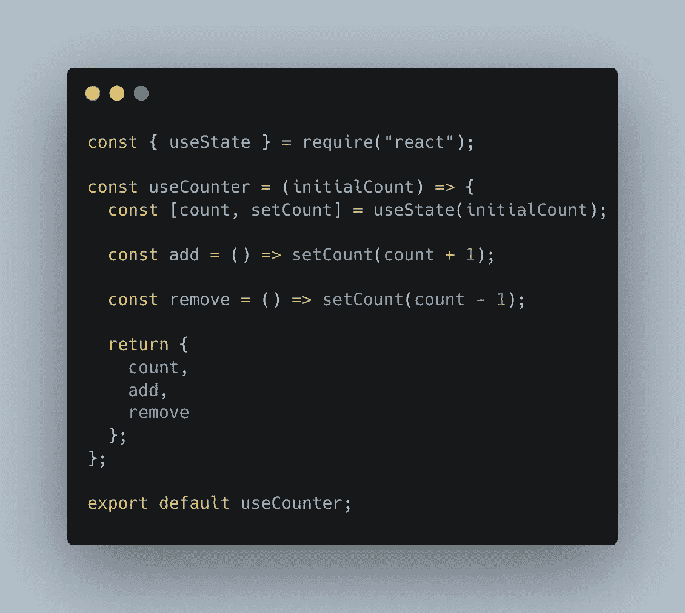
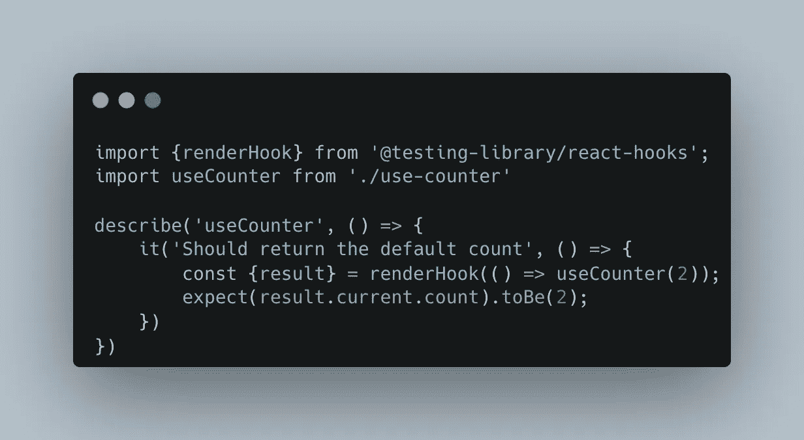
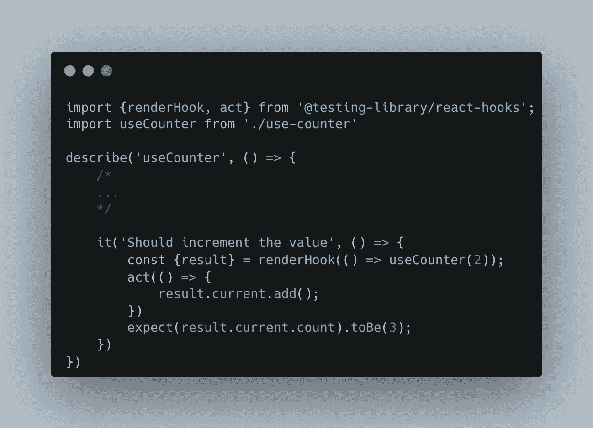

# 如何像专业人士一样测试你的反应钩

> 原文：<https://javascript.plainenglish.io/testing-your-hooks-like-a-pro-e1e0d7106670?source=collection_archive---------4----------------------->

## 一开始看起来可能很复杂，但是测试 React 钩子实际上非常简单！


Photo by Karolina Grabowska: [https://www.pexels.com/photo/orange-and-black-fish-bait-on-white-surface-6478090/](https://www.pexels.com/photo/orange-and-black-fish-bait-on-white-surface-6478090/)

我已经用 React 每天工作了 4 年多了。我一直在浏览类组件，不得不习惯新的钩子系统。尽管他们的到来更多的是一种祝福而不是诅咒，但是对他们的测试是一条新的学习曲线。

谢天谢地，测试库团队发布了一个专门测试钩子的库，让我们的生活更简单！这就是我们今天要学习的内容！

对于本文，我将假设您正在运行一个 react 环境(CRA 或任何类似 webpack 的 bundler)并设置(如果需要)Jest。

测试库团队正在将他们的库分成不同的包，以使测试更加模块化。因此，为了测试我们的钩子，我们必须安装`@testing-library/react-hooks`包:

[](https://www.npmjs.com/package/@testing-library/react-hooks) [## @测试库/反应钩

### 简单完整的 React hooks 测试工具鼓励良好的测试实践..最新版本:8.0.0，最新…

www.npmjs.com](https://www.npmjs.com/package/@testing-library/react-hooks) 

# 要测试的钩子

当我们学习如何测试一个钩子时，我们当然需要一个钩子来测试！

为了保持简单但足够详细，我们将创建一个简单的钩子来存储一个计数器，接受一个默认值，并允许增加或减少它:



Our useCounter hook

# 获取默认值

正如您所看到，这个钩子用一个默认值初始化我们的计数器。那么我们的两个函数要么递增要么递减计数器。

我们将从确保默认值成功返回开始。

测试钩子时，`renderHook`将返回一个具有如下结构的对象:

```
{
  all: Array<any>
  current: any,
  error: Error
}
```

根据文档，`all`代表**钩子**返回的所有结果(包括错误)，`current`是**当前状态**，如果**当前状态**中有任何抛出的错误，则定义错误。

我们的最终测试将如下所示:



在这个测试中，我们只是渲染我们的钩子，并从中获得初始结果。因为我们在调用它的时候给出了两个，所以我们希望它也是两个！

# 与挂钩互动

既然我们可以测试我们的钩子正在返回它的默认值，我们需要确保交互函数也正常工作。

我们将测试`add`函数，并期望我们的新值为 3。

当与钩子交互时，我们需要将任何改变状态的交互封装在测试库提供的一个名为`act`
的函数中，这个函数是为了确保钩子的行为更接近 react 在浏览器中的工作方式。



就这么简单！像第一个测试一样，我们使用默认值 2 来呈现钩子。但是这一次，我们调用了`act`中的`add`函数来触发状态的改变。那么我们期望我们的结果是 3！

测试一个钩子非常简单，可以很快给你的代码带来信心。此外，将大部分逻辑封装到钩子中可以让您专注于 React 组件中的 UI 测试，并在测试钩子时更加关注数据！

感谢您的阅读，如果您喜欢这篇文章，请留下关注或鼓掌，因为这将对我有很大帮助！

祝你有美好的一天！

*更多内容看**[***说白了. io***](https://plainenglish.io/) *。报名参加我们的* [***免费周报***](http://newsletter.plainenglish.io/) *。关注我们关于*[***Twitter***](https://twitter.com/inPlainEngHQ)*和*[***LinkedIn***](https://www.linkedin.com/company/inplainenglish/)*。加入我们的* [***社区***](https://discord.gg/GtDtUAvyhW) *。**