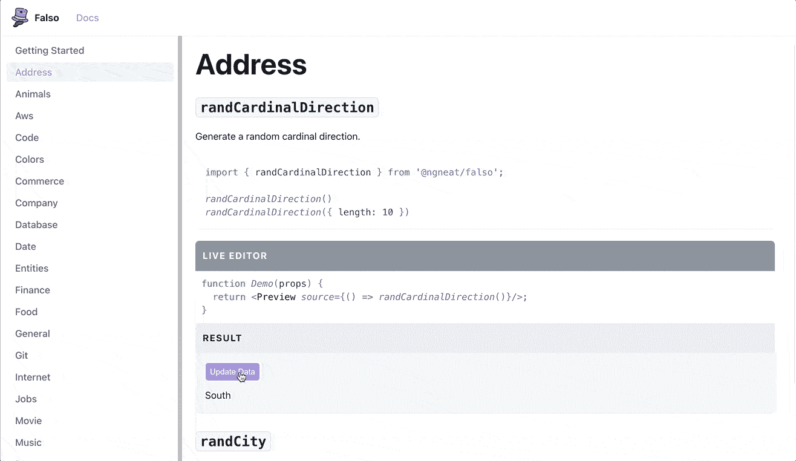

# 认识 Falso:faker . js 的替代品

> 原文：<https://javascript.plainenglish.io/thank-you-faker-now-its-time-to-move-on-27253d3b0885?source=collection_archive---------4----------------------->

## 谢谢你 Faker。现在是时候继续前进了。

TL；DR — [Falso](https://github.com/ngneat/falso) 是 Faker.js 的一个现代的、可动摇的、有据可查的替代品

你可能知道[两周前 Faker.js 发生了什么](https://www.theverge.com/2022/1/9/22874949/developer-corrupts-open-source-libraries-projects-affected)。

在与 [Netanel Basal](https://medium.com/u/b889ae02aa26?source=post_page-----27253d3b0885--------------------------------) 的合作中，我创建了一个新的模拟数据生成器库，为那些依赖 Faker 的人(包括我们)提供一个快速、合适的替代品。

# 遇见福尔索🎩

✅ 160+函数(在撰写本文时)
✅树可摇动
✅全类型化
✅实体函数
✅有据可查，有现场预览
✅单个和数组结果

为了建造这个图书馆，社区投入了大量的精力。在短短两周内，我们完成了:

1.6k github 明星
💪59 个合并的拉取请求
🎁58 项新功能

我要感谢所有参与其中的人，你们太棒了！

试试 Falso，让我知道你的想法🌟

 [## GitHub - ngneat/falso:你真正需要的所有假数据🙂

### 所有你真正需要的虚假数据🙂在浏览器和节点中创建大量虚假数据。树…

github.com](https://github.com/ngneat/falso)  [## Falso |所有真实需求的所有虚假数据

### Falso -所有你真正需要的虚假数据

ngneat.github.io](https://ngneat.github.io/falso/) 

The Falso docs and live preview

我们才刚刚开始。

# 下一步是什么？

🌐区域设置支持
💪更多发电机
🎯提高数据准确性

欢迎您[投稿](https://github.com/ngneat/falso/blob/main/CONTRIBUTING.md)！让我们一起构建下一代模拟数据！

对于那些第一次为开源软件做贡献的人来说，Falso 是一个极好的选择！

*更多内容看* [***说白了就是***](http://plainenglish.io/) *。报名参加我们的* [***免费每周简讯***](http://newsletter.plainenglish.io/) *。在我们的* [***社区不和谐***](https://discord.gg/GtDtUAvyhW) *获得独家获取写作机会和建议。*