# 对循环的 1 个非常简单的解释，非常适合初学者

> 原文：<https://javascript.plainenglish.io/the-1-perfectly-simple-explanation-of-loops-well-timed-for-beginners-4c689651cca8?source=collection_archive---------8----------------------->

## While 循环、do-while 循环和 for 循环使之变得简单。

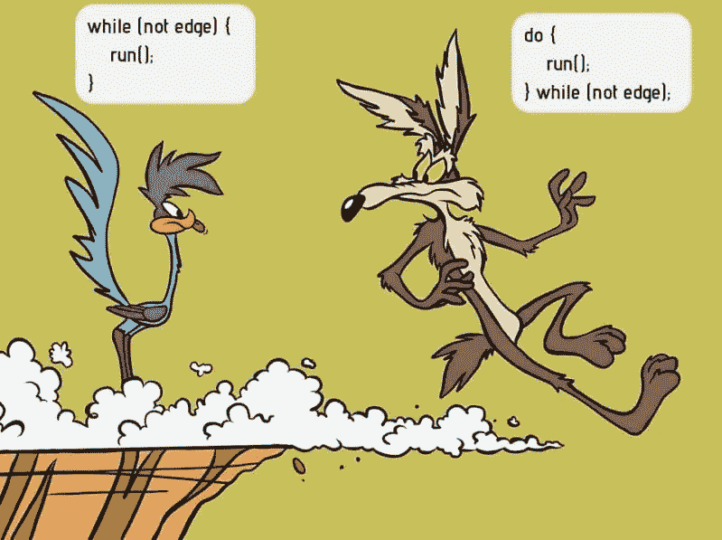

[Picture from r/programmerHumor](https://www.google.com/url?sa=i&url=https%3A%2F%2Fwww.reddit.com%2Fr%2FProgrammerHumor%2Fcomments%2Fa5mghb%2Fthe_importance_of_knowing_how_to_correctly_use%2F&psig=AOvVaw2a7-Zk8gqmT2hg1H0IRqPC&ust=1648141240495000&source=images&cd=vfe&ved=0CAwQjhxqFwoTCOD819va3PYCFQAAAAAdAAAAABAJ)

学习编程意味着学习如何[解决问题](https://medium.com/codex/why-the-hard-truth-about-learning-to-code-quickly-will-cost-you-more-years-df2250b78c05)。理论上，编写一个解决问题的程序是很容易的。

你需要发展的技能是非常精确地思考如何通过把事情分解成简单的步骤来解决问题，甚至计算机也能执行这些步骤。**就是这个关键词！**循环做这样简单的步骤来解决更大的问题。

通常，您希望重复执行相同的代码，而对细节进行最小的更改。

# Todo-List 示例简介

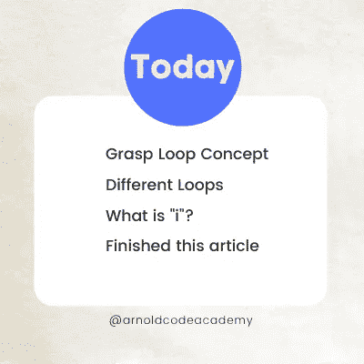

Made by The [Author](http://www.arnoldcode.com)

你今天可能检查了你的**待办事项列表中的项目。想象你度过了富有成效的一天，并设法完成了所有任务。你是怎么把它们划掉的？— **手动。****

*那么*轻轻一点就把它们全部划掉呢？幸运的是，您正在开发在线工具的下一个功能，可以选择将它们全部标记为选中——只需单击一个按钮。

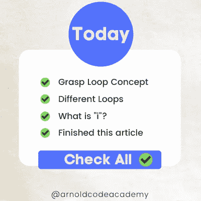

Made by The [Author](http://www.arnoldcode.com)

但是代码看起来如何实现如此优雅的特性呢？

🔎:*这是一个有点高级的代码，但只是一个演示。这些例子更容易理解。*

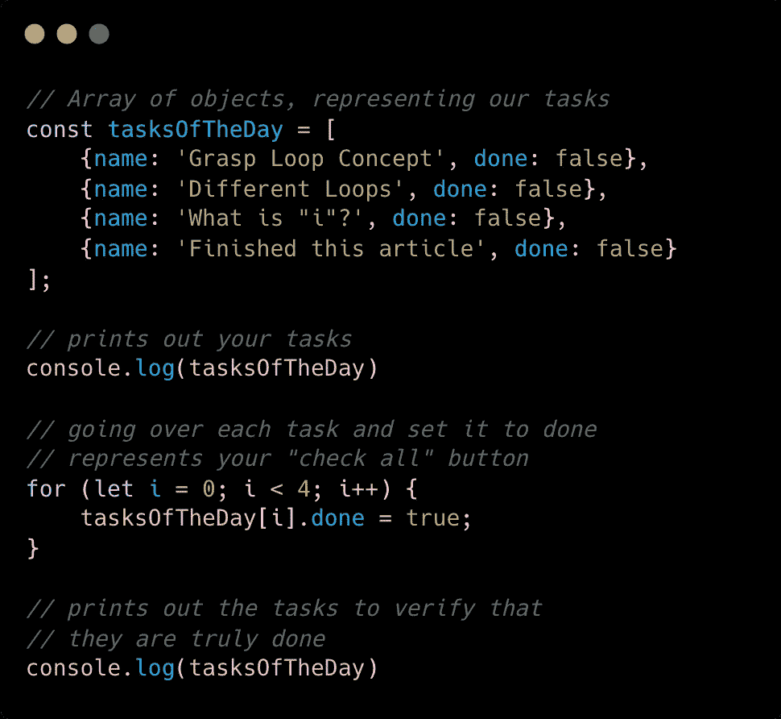

[Source code on GitHub](https://gist.github.com/ArnoldATProJanitorDevs/2d19f03e16a05824eb2f368ca3336dbd)

## 控制台中的结果

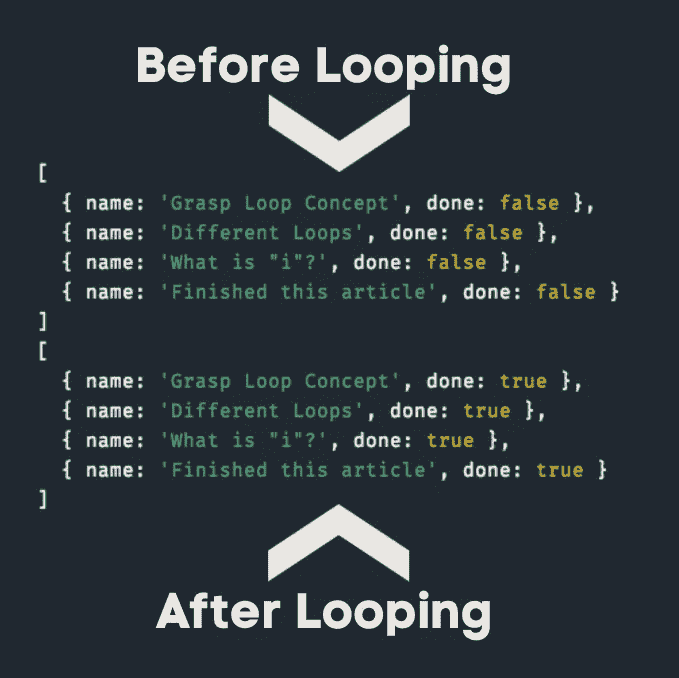

## 怎么做到的？

这是用一个简单的循环语句完成的。

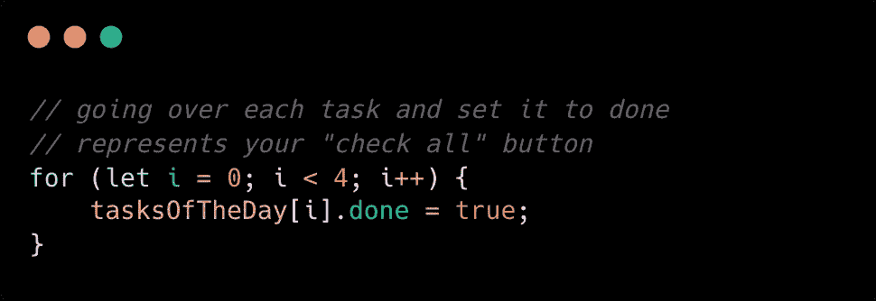

这就是神奇之处:

*   `**for**` 是使用一个`**for**`循环的关键字
*   `**let i = 0**` 将计数器变量设为 0 作为初始值
*   `**i < 4**` 是进一步执行这个循环的表达式，如果结果为`**true**` (4 因为你的 todo-list 有 4 个条目，你从 0 开始→ 0，1，2，3 是 4 个数字)。
*   `**i++**` 在每个周期后将计数器变量增加`**1**`
*   `**tasksOfTheDay[i].done = true**` 将任务的`**done**`属性设置为 true

> **换句话说:**for 循环重复循环 4 次，变量`**i**` 保持 0，然后 1，然后 2，然后 3，在到达 4 之前，由于`**i < 4**`的表达式检查，它退出。你的任务数组有 4 个元素，索引为(i) 0…3。在每个周期中，数组的另一个元素被寻址。

它们通常用于迭代集合(*您的每日任务*)和调整细节(*标记为选中*)。

# 每个循环的概念

JavaScript 总共给了 7 个循环一个家。但是只有 3 个是必须要知道的循环， ***尤其是作为初学者。***

1.  **while-loop**
2.  边做边循环。
3.  **for-loop**

都是这么做的。它们在进行迭代过程和语法的方式上有所不同。稍后会详细介绍。

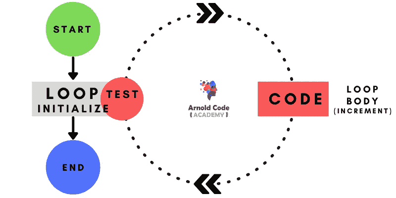

每个循环都做同样的 3 件事:

> **初始化|测试|增量**

它们都需要一个循环计数器变量。它们大多被称为“*I”*进行迭代。

# While 循环——常见的疑点

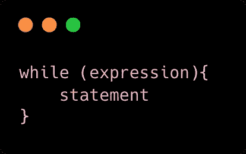

正如`[if-statements](/a-simple-explanation-of-if-else-switch-statements-in-javascript-for-beginners-1c6cfa1185c8?source=your_stories_page----------------------------------------)`是 JavaScript 的基本条件，while 语句是 JavaScript 的主循环。

为了执行 while 语句，解释器首先计算一个表达式。

*   如果表达式的值是 *falsy* ，解释器跳过作为循环体的语句。
*   如果表达式为*真值*，解释器执行语句并重复，跳回循环顶部并重新计算表达式。

> **换句话说:**当表达式为*真值*时，解释器重复执行语句。

下面的代码将打印出从 0 到 9 的数字。

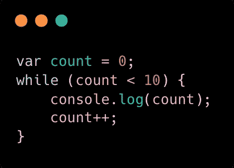

变量 count 从 0 开始，每次循环体运行时递增(`**count++**`)。一旦循环被执行 **10** 次，表达式(`**count < 10**`)变为*假*。变量值不再小于 10，while 语句结束。

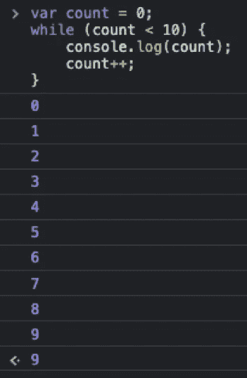

重要的是改变表达式中涉及的一个或多个变量(在本例中是`**count**`)。

***为什么这很重要？***

想象一个以 *truthy，*开头的表达式，变量永远不会改变。因此，循环将永远不会结束。每次循环体执行时，表达式的值必须不同。

**你的程序冻结了，不再响应——它崩溃了。**

# do-While——反过来

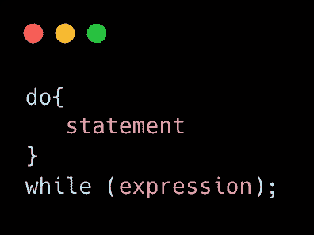

do-while 循环与 while 循环非常相似，只是循环表达式**是在底部而不是顶部测试的。**

**循环体总是至少执行一次，**do-while 循环不太常用。确定希望一个循环至少执行一次是不常见的。

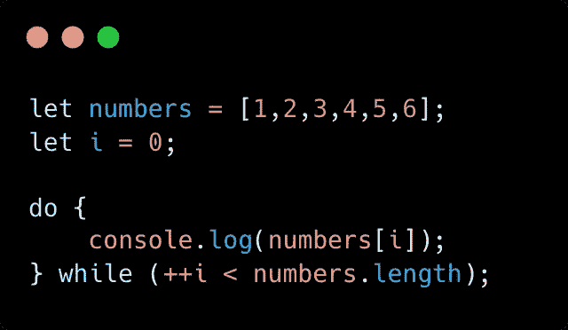

只要计数器变量( **i** )小于数组`**numbers.length**` **的长度，代码就会打印出数组`**numbers**`的每个元素。**

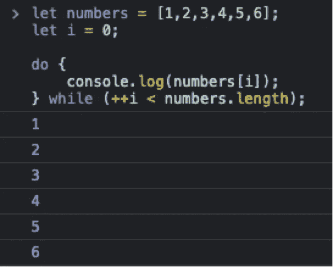

# 保持 While 和 Do-While 循环永远分离

现在你可以完全理解标题图片。因此你永远不会忘记 while 循环和 do-while 循环之间的区别。

# For —循环

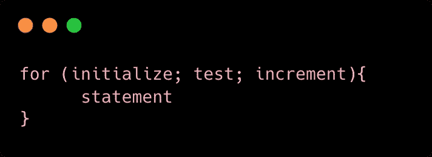

for 循环通常比 while 语句更方便，并且通过**应用一个公共模式来简化循环。**

循环包括一个计数器变量，需要 3 个步骤才能正常工作:

1.  在循环开始前初始化
2.  在每次循环迭代之前进行测试
3.  在循环体结束时递增或更新

这些都是在进入循环的下一次迭代之前完成的。for 循环在其 head 声明中定义了计数器变量的初始化、测试和递增。

`**initialise**`、`**test**`、`**increment**`是三个表达式，用分号隔开，负责循环计数器变量。

将它们都放在循环的第一行会使整个循环更容易理解。**此外，**它还能防止诸如忘记初始化或递增循环变量之类的错误——导致冻结。

以下示例也打印出从 0 到 9 的数字。

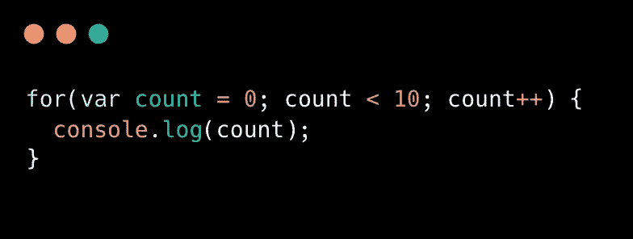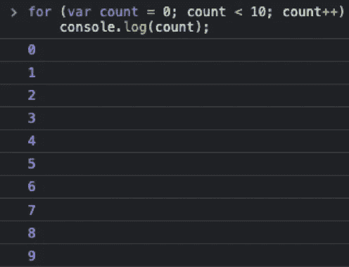

# For 循环与 While 循环

**解释 for 循环如何工作的最简单方法是看一下等价的 while 循环:**

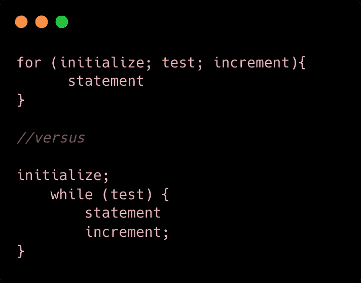

下面是 while 和 for 循环执行相同操作的比较:

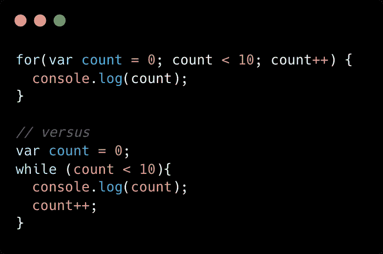

为自己节省大量时间，只关注重要的主题。

[26 Web Dev Cheatsheets for Every Beginner Must Have](https://arnoldcodeacademy.ck.page/26-web-dev-cheat-sheets)

[***节省自己大量的时间，专注于重要的主题。***](https://arnoldcodeacademy.ck.page/26-web-dev-cheat-sheets)

*更多内容看* [***说白了就是 io***](https://plainenglish.io/) *。报名参加我们的* [***免费周报***](http://newsletter.plainenglish.io/) *。关注我们关于*[***Twitter***](https://twitter.com/inPlainEngHQ)*和*[***LinkedIn***](https://www.linkedin.com/company/inplainenglish/)*。加入我们的* [***社区***](https://discord.gg/GtDtUAvyhW) *。*