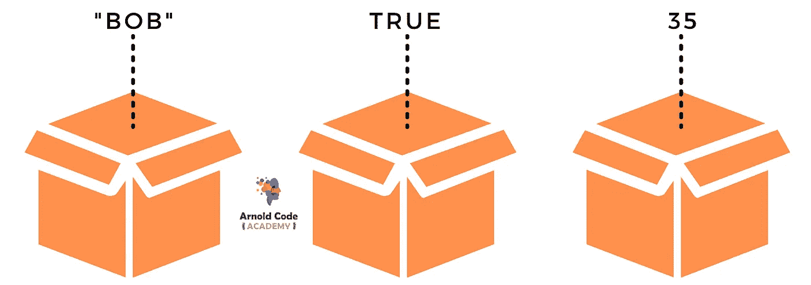
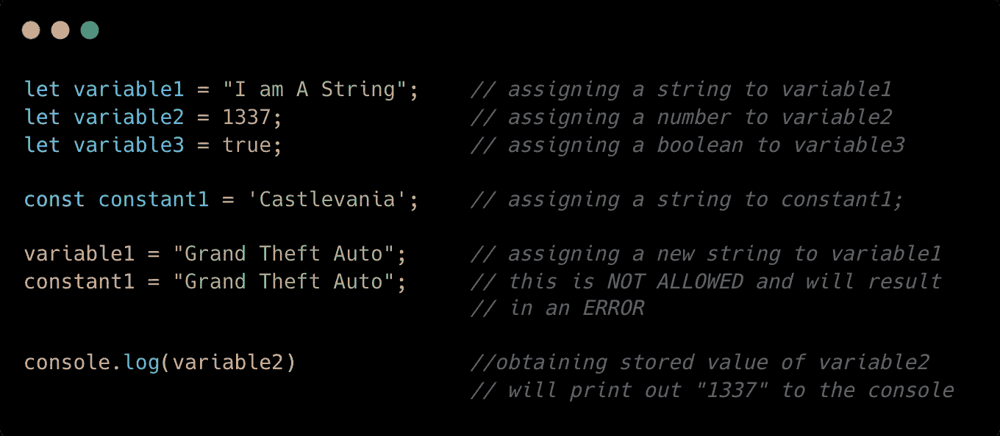
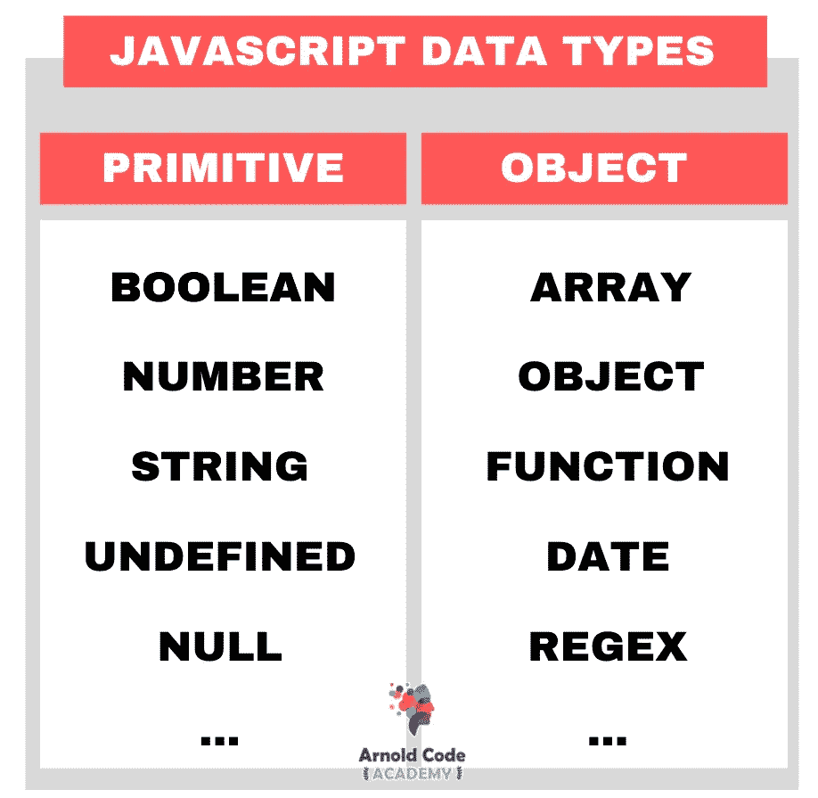

# JavaScript 中变量和数据类型的 1 个简单解释，适合初学者

> 原文：<https://javascript.plainenglish.io/the-1-simple-explanation-of-variables-datatypes-in-javascript-for-beginners-befc1a05dcc4?source=collection_archive---------13----------------------->

## 有一些事情需要了解，但是你已经领先好几光年了

计算机程序通过将值存储到变量(也叫容器)中来工作。操纵这些变量的值是每个程序的基本任务。

不同值的表示称为*类型*。类型是任何编程语言的一个基本特征。它支持不同的价值观。

当程序需要获取一个值以备将来使用时，它会将该值赋给(或“存储”)一个变量。

这里您可以看到三个不同的值:

*   `"Bob"`是字符串
*   `TRUE`是一个布尔值
*   `35`是一个数字

一个字符串，一个布尔值，一个数字是所谓的原始类型。稍后会详细介绍。

你可以把它们都存储在同一个“非类型化”的容器中:JavaScript 中的一个变量。

变量定义了一个保存值的符号名。它允许你在整个程序中引用变量的值。

*🔥:*想象你的妈妈或者你的妻子或者和你一起生活的任何人从超市买了糖果(一定是除你之外的其他人)放在架子上。在 JavaScript 中，您可以将值“sweets”存储到变量“shelf”中，这是一个符号名称。如果你不像我一样是一个糖果粉碎机，那么你将稍后从变量“shelf”中“获得”值“sweets ”,而不是像我一样立即获得。这正是变量的用法:*现在存储，以后使用。*

## 几个不同的例子

创建和定义变量有三种可能的方法:

*   `var`
*   `let`
*   `[const](/javascript-const-vs-var-vs-let-a-comprehensive-guide-for-all-time-d6d836c8bbd7)`

本文专注于基本原理，但在这里您会找到答案:

 [## JavaScript Const vs. Var vs. Let:一个全面的指南

### 应该使用什么以及为什么常量变量不总是常量

javascript.plainenglish.io](/javascript-const-vs-var-vs-let-a-comprehensive-guide-for-all-time-d6d836c8bbd7) 

> *🔥:*在这种情况下，你吃了一半的糖果包装，并把它放回货架上，你操纵了可变货架。包装现在是半满的。如果您家中的其他人获得了这个包，它会发现一个半满的包，这只是 JavaScript 变量中的另一个值。

# 基本数据类型

变量的工作方式是任何编程语言的另一个基本特征。JavaScript 类型可以分为两类:

1.  **原始类型**
2.  **对象类型**

JavaScript 的基本类型包括:

*   **布尔型**:真/假
*   **数字** : 10，1.3，3.7，-14，-0.4，1e12
*   **字符串** : 'a '，'合法'，'酗酒和赌博'
*   **Null** :没有任何值
*   **未定义**:未赋值

不是基本类型的是 JavaScript 中的对象

*   **数组**:值的有序集合
*   **对象**:属性(键，值对)的无序集合
*   属性:对象的一部分，或者是原始值，或者是另一个对象
*   **功能**:重复使用的一段代码(归类为对象)
*   **日期**:日期/时间字符串，因为包含函数而被归类为对象
*   **RegEx** :正则表达式，匹配文本的模式，分类为 object，因为它包含函数

# 原语和对象的区别

对象总是通过引用传递。

如果你给一个变量赋予另一个变量的精确值，如果它是一个像数字或字符串这样的基本类型，那么它们是通过值传递的。

举个例子:

如你所见，`myAge`的内容被设置为`37`，既然是`myAge = age`，年龄也应该是`37`吧？没有。

原始类型被复制。就像一张纸的复印件一样，它是由原件创造出来的。你不分享你的原创。

这些对象不会被复制。它们被引用。如果你正在吃一块饼干，而你最好的朋友想要这块饼干，你必须把你的递给他。你不能仅仅从你的 cookie 中创建一个副本。

以第 4 行为指导，找到原件，而不是创建原件的副本。操纵引用确实会路由到原始文件并对其进行修改。

*🔥想象你正在度假，问某人当地的教堂在哪里。示例的第 4 行完全相同。这个人会给你一个参考在哪里可以找到教堂。不是教堂本身。如果不知何故，该镇决定搬迁教堂，所有其他参考需要知道这种情况。如果没有，他们会给你“空”的方向。*

## 你可能想知道的是

遮光罩下的数组或函数是对象吗？

是啊！数组也是对象，函数也是所谓的一等公民，也就是说它们是对象。

所以了解它们是如何工作的至关重要。

如果你还在学习，知道学什么是不可能的。想象有人创造了浓缩的备忘单。 [***幸好他们在这里！*T32**](https://arnoldcodeacademy.ck.page/26-web-dev-cheat-sheets)

[26 Web Dev Cheatsheets for Every Beginner Must Have](https://arnoldcodeacademy.ck.page/26-web-dev-cheat-sheets)

*更内容于* [***普通英语***](https://plainenglish.io/) *。报名参加我们的* [***免费周报***](http://newsletter.plainenglish.io/) *。* [***推特***](https://twitter.com/inPlainEngHQ) *和**[***领英***](https://www.linkedin.com/company/inplainenglish/) *。加入我们的* [***社群不和***](https://discord.gg/GtDtUAvyhW) *。**