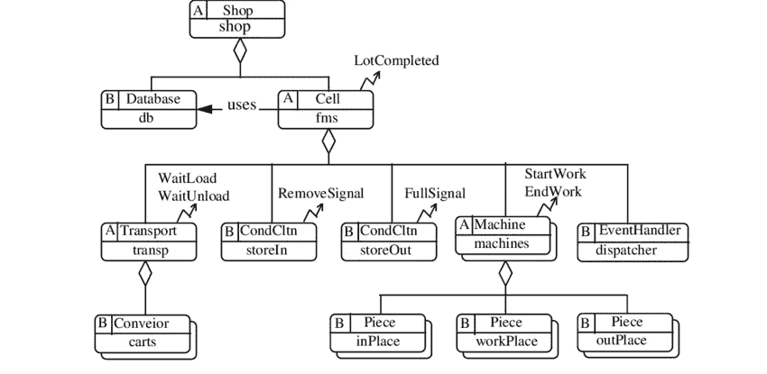
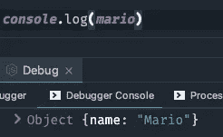
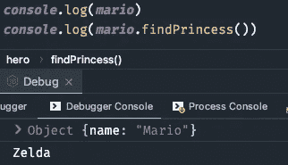
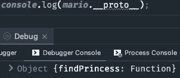
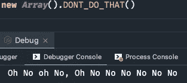

# 成为高级开发人员需要知道的 4 种创造模式

> 原文：<https://javascript.plainenglish.io/the-4-creational-patterns-you-need-to-know-to-become-a-senior-developer-e2d8c0a26b8f?source=collection_archive---------2----------------------->

## 代码的目标不仅仅是工作。

Image Made By Author via Canva

在编码的早期，有效的代码是你的单一目标。当坚持这种态度时，你的代码看起来就像意大利面食。发展你的技能意味着遇到**软件设计模式**，你的代码将看起来像罗马的万神殿。

您使用软件模式来解决与现代开发人员相关的常见问题。

设计模式分为`creational`、`structural`、&、`behavioral`。本文主要关注 4 种`creational`设计模式以及使用它们的优缺点。

# Singleton —已经在 JavaScript 中实现

第一种模式非常容易理解。

这是一种只能实例化一次的对象。在 *TypeScript* 中，你可以实现一个名为`Config`的类。它代表全局应用程序配置数据。因此，您给它一个静态实例属性，然后在构造函数前面添加 private。它不能再用关键字`new`实例化。

然后创建一个静态的`getInstance()`方法来检查实例是否已经创建。如果没有，它将创建一个新的，确保只有一个对象可以存在。

## 听起来很棒！但是细节决定成败。

*JavaScript* 允许你创建**对象文字**。此外，它持有全局数据的概念。用通过引用传递的对象将两者结合起来。💣！

*通过创建一个简单的全局对象，您可以获得该模式的基本特征。*

使用 JavaScript 意味着这种模式对你没有用。它会转换成你不需要的样板文件。

> *🔥在面向对象语言中，这是一个完全不同的故事。在到处传播设计模式之前，依靠你的语言的内置特性。*

# 原型—在扁平的层次结构中共享功能

“原型”只是克隆人*的一个通俗词汇。*

**你知道面向对象编程吗？你应该对继承很熟悉。**如果不是** —一个类可以用一个子类来扩展。**

**简单。但是继承的主要问题是它会导致复杂的代码层次:**

Complex Hierarchy (picture by [ResearchGate](https://www.google.com/url?sa=i&url=https%3A%2F%2Fwww.researchgate.net%2Ffigure%2FClass-hierarchy-of-the-framework_fig1_220420202&psig=AOvVaw1yM_J7Y60meeYnhrg82g5N&ust=1647542462236000&source=images&cd=vfe&ved=0CAwQjhxqFwoTCJCn1Iyky_YCFQAAAAAdAAAAABAO))

原型模式解决了提到的*主要问题*。它通过使用两个方面来做到这一点:

*   来自一个已经存在的物体
*   创建平面原型链

两者都使得在对象之间共享功能变得更加容易。

*主要是*支持原型继承的动态语言。
🤫: *JavaScript 支持原型。*

**开箱即用，**假设我们有一个名为`hero`的对象。

这是我们的原型。

现在您想基于它创建一个新的对象，它也有一个`name`。你可以通过将`hero`作为原型，用`Object.create()`来实现。最后，指定更多属性。对于新的对象，我们坚持使用`name`→`Mario`。

如果您记录这个对象，您将只能看到名称而不能看到`findPrincess()`方法。

然而，如果你试着调用那个方法，它甚至会工作。

为什么？因为 JavaScript 沿着原型链向上，直到到达根。您总是可以通过使用这个`__proto__`属性从一个对象获得原型。

但这也不是现代的最佳实践。棉绒已经用黄色做了标记。你应该用`Object.getPrototypeOf()`。

对类使用 prototype 将总是引用它的构造函数。这意味着如果你愿意，你可以用额外的函数来扩展一个类。Ups，那也是[一般认为不好的做法](https://stackoverflow.com/questions/14034180/why-is-extending-native-objects-a-bad-practice)。

# 构建器—在逐步构建时使用

注意构建器模式。

想象一下，经营一家汉堡店，每个顾客都要下单。转折:他们需要告诉你汉堡上的每一种配料。

同样的逻辑也适用于**构造函数**。虽然这很有效，但是跟踪所有这些成分很烦人，特别是如果你想把每一步推迟到以后。

使用构建器模式，您只需一步一步地创建对象。使用多个方法，而不是单个大型构造函数。

您甚至可以将构建逻辑委托给不同的类。

对对象实例的引用是您想要的回报。在 JavaScript 中，`this`。这允许您实现方法链接。简单地实例化一个对象，链接方法调用，但是总是得到这个东西作为返回值。

*这个模式太棒了，你不需要调用所有的步骤。您可以只调用那些必要的方法来创建对象的特定配置。*

# 工厂—避免不必要的环境检查

您可能会发现另一个非常有用的模式。

通常使用`new`关键字来实例化对象。但是现在，您将使用一个*函数*或一个*方法*来实现。

这听起来微不足道，但这里有一个实际的例子:想象你正在开发一个跨平台的应用程序，可以在 T2 的 iPad 和 T4 的 iPhone 上运行。

它们都有相同的界面。您可能会做一些条件检查来决定在我们的代码中显示哪个布局。

**不可维护**😔

对你来说，更好的选择是创建一个工厂来决定实例化哪个对象。您不用重复相同的逻辑，而是使用这个子类来决定应该呈现哪个布局。

*模式都很棒，但是你需要开动脑筋去应用。从堆栈溢出复制粘贴不起作用。以下是成为一名合格的精神开发者的 8 条规则。*

8 Rules To Become A Succesful Developer

*更多内容请看* [***说白了就是***](https://plainenglish.io/) *。报名参加我们的* [***免费每周简讯***](http://newsletter.plainenglish.io/) *。关注我们* [***推特***](https://twitter.com/inPlainEngHQ) *和*[***LinkedIn***](https://www.linkedin.com/company/inplainenglish/)*。加入我们的* [***社区不和谐***](https://discord.gg/GtDtUAvyhW) *。*