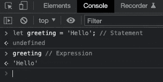

# 初学者理解 JavaScript 代码结构的 5 个简单概念

> 原文：<https://javascript.plainenglish.io/the-5-easy-concepts-to-understand-javascript-code-structure-for-beginners-d3f5b178a484?source=collection_archive---------18----------------------->

## 了解 JavaScript 的词汇结构、表达式、语句和关键字

Image Made By [Author](https://www.linkedin.com/in/arnold-abraham/) via Canva

JavaScript 是一种遵循特定规则的语言。

这些实践与单词**词汇结构、**联系在一起，后者跟踪 JavaScript 或任何其他语言的基本语法。它描述了在哪里放置哪个符号，每个 JavaScript 程序包含哪个基本结构来构建一个完整的工作程序。

如果你知道以下 5 个概念，你就可以成功地构建和编写你的程序。

# 1.词汇结构意味着基本句法

任何编程语言以及 JavaScript 都有一个词汇结构**。**

**这个术语描述了用一种语言编写程序的基本规则:**

****它是最低级别的语法|语句如何分隔|指定变量名|对象声明|函数定义|注释分隔符****

**这个结构也描述了 JavaScript 程序的所有块。每个工作应用包括至少一个表达式或一个语句。**

# **2.表达式返回值**

**表达式是一个短语，通过计算产生一个值。看图可以看出`2+5`是一个返回`7`值的表达式。**

****

**Example of an Expression**

**如果它不返回值，它自动成为一个语句。**

****跟随解释:****

*   **点击键盘上的`F12`键(打开开发者控制台)**
*   **导航到控制台选项卡(在新窗口中)**
*   **请输入您在图片中看到的内容。**
*   **你会看到 7 的结果或者你想执行的任何操作。**

****

**Chrome Console Runs A JavaScript Expression**

# **3.语句不返回值**

****

**Declaring an Empty Function is a Statement**

**这些代码行不返回值。**

**把它们想象成命令。就像一个典型的句子以句号结尾一样，一个分号结束一个 JavaScript 句子。看图看*函数 randomName() {}* 的那一行确实没有返回值。**

**提示:永远不要省略分号，尽管 JavaScript 允许这个特性。它会产生新的错误，成为你调试时最糟糕的噩梦。**

** [## 写 JavaScript 时不要跳过分号和逗号

### 为什么以及如何使用分号和逗号更好

javascript.plainenglish.io](/dont-skip-using-semicolons-and-commas-when-writing-javascript-d508d22d8755) 

由 **undefined** 表示没有任何意义，表明这是一条注释*//语句*描述的语句。

***顺便说一下:*** 评论也在词法结构的兜帽下。使用双斜杠(//)创建一行代码，并使用/* your comment here */创建一个块注释。

**语句和表达式的区别:**

*   **表达式返回值**
*   **执行语句是为了让某事发生，但不返回值**** 

# **4.陈述与表达的结合**

****

**Combination of Statement & Expression**

**你有权力使用一个语句来声明和初始化一个变量(对比上图的第 1 行)。**

*   ****声明**:让程序熟悉你选择的变量**
*   ****初始化**:在声明后写一个初始值。**

**然后使用一个表达式来获得已定义和已初始化变量的值。(对比上图第 3 行)。**

**这是用变量存储和获取数据的方法。这是开发软件时需要理解的基本功能。**

# **5.关键词**

****

**为了使语句功能齐全，你需要在语句中加入关键词。**

**解释器理解它们，并将它们转换成所需的操作。关键字是语言的保留字，让程序的解释器(浏览器)意识到这里应该发生一些事情。**

**🔥你不需要知道他们所有人。作为开发人员，子集对于您的日常工作是必需的。**

**上一节已经向您展示了其中的两个。**功能**和**让**:**

****

**Declaring an Empty Function is a Statement**

*   **“ **function** ”关键字用于创建一段重复使用的代码——函数。**

****

**Combination of Statement & Expression**

*   **“**let”**关键字用于创建一个变量，您可以向其中写入值并从中获取值。**

**JavaScript 提供的所有关键字列表位于其他 26 个备忘单之间:**

**[***你可以把它们打印出来，挂在电脑旁边，这样你就不会感到惊讶，可以在飞行中学习它们。***](https://arnoldcodeacademy.ck.page/26-web-dev-cheat-sheets)**

****

**[26 Web Dev Cheatsheets for Any Upcoming Web Developer](https://arnoldcodeacademy.ck.page/26-web-dev-cheat-sheets)**

***更多内容看* [***说白了。报名参加我们的***](https://plainenglish.io/) **[***免费每周简讯***](http://newsletter.plainenglish.io/) *。关注我们* [***推特***](https://twitter.com/inPlainEngHQ) *和*[***LinkedIn***](https://www.linkedin.com/company/inplainenglish/)*。加入我们的* [***社区不和谐***](https://discord.gg/GtDtUAvyhW) *。*****