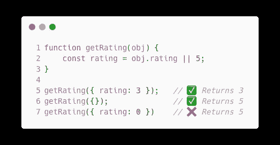

# JavaScript(和 TypeScript)的 7 个伪值

> 原文：<https://javascript.plainenglish.io/the-7-false-like-values-of-javascript-and-typescript-93df73bda44?source=collection_archive---------15----------------------->

## 众多虚伪类型之间的主要区别

Photo by [Valentin Lacoste](https://unsplash.com/@valentinlacoste?utm_source=medium&utm_medium=referral) on [Unsplash](https://unsplash.com?utm_source=medium&utm_medium=referral)

无论您是 JavaScript 新手还是经验丰富的老手，您都会注意到 JavaScript 中有太多类似 false 的值。在 TypeScript 和 JavaScript 中，当使用逻辑块(if/else-if，while，for)时，并不总是需要布尔或布尔表达式。

If 语句检查值是否为空、未定义或无效。让我们看看 JavaScript 提供的所有“虚假”值。我们将回答以下问题:

*   什么是伪似值？
*   这个值和其他值有什么不同？
*   这些值应该如何使用？

# 错误的

False 是最基本的类 false 值。它是一个布尔值，你可能最熟悉这个值。当确定程序中的逻辑路径或确定真值时，应该使用 False。

When to use false in JavaScript (and any programming language)

# 不明确的

JavaScript 允许使用未初始化的变量。即使 JavaScript 允许您使用这些变量，它们也不会被定义，因此出现了未定义这个术语。只有在两种情况下才应该使用 undefined:函数不返回任何内容，或者变量尚未初始化。JS 程序员不应该直接给变量赋值 undefined。

When to use undefined

# 空

Null 可能是 JavaScript 中最突出的混乱点。当我们可以使用 undefined 时，为什么还有人需要`null`？

Null 表明某些东西显式地没有值。请记住，undefined 只应该是在变量初始化之前或函数不返回任何内容时出现的效果。另一方面，`null` 表示定义了值但没有值。

您会注意到上面的代码明确地将`undefined`分配给了`d`。将 undefined 设置为对象属性没有任何效果，只会浪费计算资源。JavaScript 说`d`没有被定义，所以我们甚至不会把它包含在对象中。

Notice that **d** is undefined, the same as not even assigning **d**

相反，如果你想让`d`包含在对象中，那么你应该使用`null` **:**

Using null will include it in the object

当期望一个函数返回一些东西时，你也应该使用`null`，但是它不能。您应该将`null`赋给变量，这比将`undefined`赋给变量更好。

简单来说，`null`就是定义了值但是没有任何值。

# 圆盘烤饼

**NaN** 在技术上是一个数值，代表一个不是数字的值。`NaN`字面意思是“不是数字”它不能用于比较运算，因为它不等于任何东西，甚至不等于它本身。所以使用`NaN == NaN`，它总是返回`false`。如果您向函数传递一个字母字符串，该值将由函数返回，如`parseInt`；`parseInt`不能将字母字符串转换成数字，所以它返回“不是数字”。`NaN`为假值。在条件句中使用时，它将总是返回`false`。所以你可以这样使用它:

# 0(零)

零是一个数字，但它仍然是假的。如果你在一个条件句中使用零，就等于说`false`。从逻辑上讲，反过来也是正确的:任何非零数字在条件中使用时都计算为 true。

短路表示，如果使用 or 运算符，并且第一个值为 false，则第二个值将用作默认值。例如，如果 0 是有效值，并且在提供默认值时使用，则使用默认值。默认值为零会导致意外行为，因此牢记这一点至关重要。相反，您可以使用 null-ish 合并运算符。

An example of how 0 is falsy (and can lead to errors)

Example of null-coallescing

# 空字符串

空字符串也是假值。空字符串只是普通的字符串，但是当在条件中使用时，它们将被以与`false`相同的方式处理。就这么简单。

# 空的

Void 稍微复杂一些，因为它是一个通用的关键字。void 关键字将执行一个表达式，然后返回 undefined。

另外，`void`是一个函数修饰符。以`void` **为前缀可以立即调用函数。**

有时你也可以写箭头函数。当使用箭头函数的简写符号时，您可以省去花括号。当省略花括号时，arrow 函数返回紧跟在箭头后面的表达式。有时这不是所期望的，所以您可以使用 void 关键字来执行操作，然后返回 undefined 而不是返回值。这是避免任何副作用的好方法。

希望本文能让您深入了解 JavaScript 中各种可用的 falsy 值！😀

*更多内容请看*[***plain English . io***](https://plainenglish.io/)*。报名参加我们的* [***免费周报***](http://newsletter.plainenglish.io/) *。关注我们关于*[***Twitter***](https://twitter.com/inPlainEngHQ)*和*[***LinkedIn***](https://www.linkedin.com/company/inplainenglish/)*。查看我们的* [***社区不和谐***](https://discord.gg/GtDtUAvyhW) *加入我们的* [***人才集体***](https://inplainenglish.pallet.com/talent/welcome) *。*