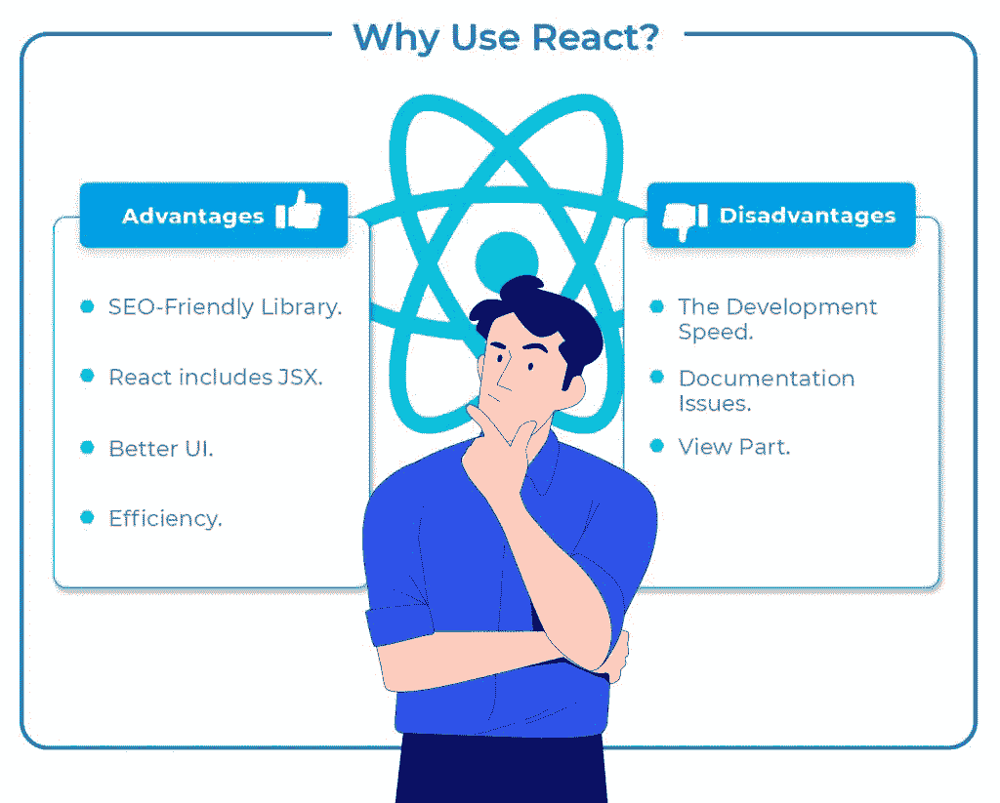
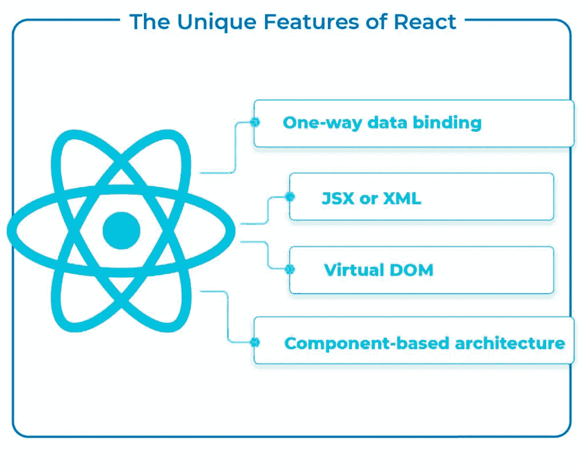
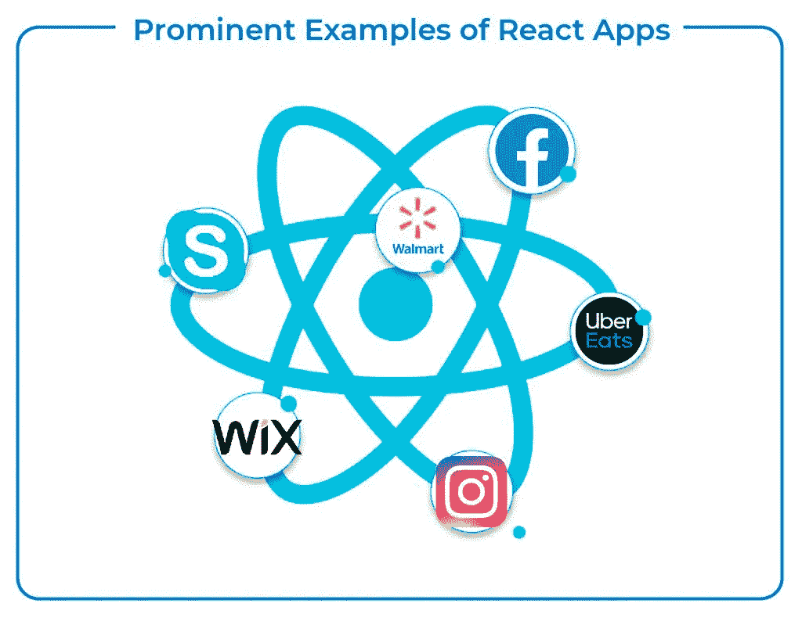

# 8 个最佳 React 应用实例

> 原文：<https://javascript.plainenglish.io/the-8-best-real-life-react-apps-examples-b834b10b8807?source=collection_archive---------5----------------------->

Foto of [Rob Hampson](https://unsplash.com/@robman?utm_source=unsplash&utm_medium=referral&utm_content=creditCopyText) in [Unsplash](https://unsplash.com/es/s/fotos/apps?utm_source=unsplash&utm_medium=referral&utm_content=creditCopyText)

前端开发生态系统的不断进化，让企业主很难选择一个框架。有了 **react 应用示例**，做出符合他们需求的好选择可能会更容易。一些商家默认选择 Angular，但不知道它是否合适。所以，让我们来看看脸书和优步等知名公司使用 React 和 React Native 创建的网站示例。

React 正在成为开发领域流行的前端框架。它已经被全世界超过 1020 万个网站使用。

我们邀请您阅读我们的博客 [React vs. Angular](https://www.clickittech.com/developer/react-vs-angular/) ，了解哪种框架最适合您的项目。

# 什么是反应？

React 是一个用 JavaScript 编写的 UI 开发库。它由脸书和一个开源开发者社区共同管理。根据[某开发者的调查结果](https://insights.stackoverflow.com/survey/2019#technology-_-most-loved-dreaded-and-wanted-web-frameworks)，React 取得了第一的位置，击败了大部分前端开发框架。

React 是用户友好的，并支持那些希望在前端开发中发挥创造力的开发人员。它也是 JavaScript 和 HTML 标签的结合，被认为是这个领域中最好的。

除了 UI，React 还包括各种支持工具来完善组件架构，比如 Redux 和 Babel。

# 为什么使用 React？

当企业为他们的前端开发项目选择 React 时，他们会看到几个好处。这些好处也证明了我们将在下面几节中讨论的八家著名公司选择 React 作为框架的合理性。让我们回顾一下其中的一些优势:

*   SEO 友好的库。 [搜索引擎优化](https://supple.com.au/small-business-seo-strategy/)对任何在线公司的成功都至关重要。根据 Moz 的说法，网站加载越快，应用程序呈现越快，应用程序在谷歌上的排名就越好。由于其快速渲染，React 与其他框架相比显著减少了网站加载时间，这明显有助于公司在谷歌搜索引擎结果页面上获得第一名。
*   **JSX。** [React 包含 JSX](https://www.peerbits.com/blog/reasons-to-choose-reactjs-for-your-web-development-project.html) ，这是一个可选的语法扩展，支持创建定制组件。这些组件有效地支持 HTML 引用，并使子组件呈现成为开发人员的乐趣。尽管对 JSX 有一些争议，但它已经被用于定制组件开发、大容量应用程序开发，以及将 HTML 模型转化为 React 元素树。
*   **更好的用户界面。**应用程序用户界面的质量至关重要。如果 UI 设计得不好，程序成功的可能性就会降低。React 的声明性组件支持创建高质量、丰富的用户界面，这就引出了我们的下一点。
*   **效率。** React 有一个虚拟 DOM 来存储组件。这种方法为开发人员提供了前所未有的灵活性和性能改进，因为 React 可以预测对虚拟 DOM 进行哪些更改，并相应地更新 DOM 树。

您也可以阅读我们关于选择 React 的[大理由的幻灯片。](https://www.clickittech.com/resource/slides/software-development/Benefits-of-React-JS.pdf)

# React 的一些缺点

值得注意的是，开发人员发现 React 中存在一些难以解决的问题:

*   **发展速度。**快速进步既能带来好处，也能带来坏处。由于环境总是在变化，一些开发人员可能不愿意频繁地重新学习新的做事方法。
*   **文件问题。**这是与快速发展的技术相关的另一个缺点。React 技术正在以极快的速度进化和发展，几乎没有时间来编写适当的文档。
*   **查看零件。** React 仅限于应用程序的 UI 层。因此，您必须选择其他一些 UI 框架，如 React.bootstrap、Material UI、CSS Grids 或 Flexbox，才能进行全面的 UI 开发。

许多企业主并不认为上述缺点是他们开发项目的障碍。因此，在深入 react 应用程序示例之前，让我们看看为什么 React 会是比其他框架更好的选择。

# React 的独特功能

React 具有一些独特的元素，使其从其他基于 JS 的框架中脱颖而出:

*   **虚拟 DOM。**React 的这个特性有助于提高开发过程的速度和灵活性。该方法使 React 的虚拟内存能够复制一个网页。每当一个应用程序被编辑或更新，[虚拟 DOM 通过更新所有定制的组件来重新创建完整的 UI](https://webandcrafts.com/blog/react-js-features/) 。这大大减少了与开发相关的时间和费用。
*   **JSX 或者 XML。**它是一种用于描述应用程序界面外观的标记语法。它将语法转换成 HTML，开发人员用它来生成 React 组件。JSX 是 ReactJS 最好的方面之一，因为它简化了开发构件的过程。
*   **单向数据绑定。**这意味着 React 采用了单向数据流，要求开发人员通过回调特性来更改组件，并禁止他们直接更改组件。从一个位置控制数据流是通过使用 JS 应用程序中一个名为 Flux 的元素来完成的。它给了开发人员对软件更大的控制权，增加了软件的灵活性和有效性。
*   **基于组件的架构。** React.js 是一个基于组件的框架。换句话说，基于 React 的 web 应用程序的用户界面由几个组件组成。每个组件都有自己的逻辑，所以逻辑是用 JavaScript 编写的，而不是使用模板。这使得 React 应用程序的开发人员可以在不改变 DOM 的情况下在整个应用程序中传输数据。

虽然上述独特的特性可以证明对大多数其他 web 开发框架是有效的，但是了解 React 的一些用例是很重要的。

# React 应用的 8 个突出例子

React 最突出的应用是跨平台的 app 开发。我们还在 web 开发和移动应用程序开发领域找到了 React 开发的例子。

以下是八个应用 React 应用程序的不同类别示例。

# 软件即服务(SAAS)应用

# 1.React 应用程序示例:沃尔玛

沃尔玛是一家总部位于美国的国际零售公司，拥有 11，000 家超市的全球网络。他们基于 React 的软件提供了顺畅的在线购物体验、产品搜索和店内价格比较。

开发人员表示，React Native 支持跨两个平台重用大约 95%的代码库。此外，他们只需要一个 JavaScript 开发团队来完成这项工作。沃尔玛的目标是在不创建额外代码的情况下瞄准许多平台，并将其用户群扩大到 iOS 之外。

根据沃尔玛的说法，作为 React 本地应用程序的一个例子，协作的主要优势是有机会在两个平台上使用相同的自动化套件。它有助于提高 iOS 和 Android 平台上应用程序的速度。

此外，它还帮助他们获得了对更新发布日期的更大控制权。除了提升性能，另一个目标是改善客户端体验。

# 2 .React app 举例:优步吃饭

Uber Eats 就是 React 原生 app 的例子。送餐服务和优步原有打车业务的延伸。它是一种按需在线食品配送服务，在你和餐馆之间充当中介，将独立和连锁餐馆的外卖直接送到你家。

React Native 为开发团队提供了 react native 应用程序开发的出色知识和功能，这有助于增强用户体验。尽管 React Native 在 UberEats 庞大的技术体系中只占很小一部分，在幕后运作，但它的贡献是值得关注的。

它介绍了餐馆仪表板大修中最重要的修改。它授权、简化并增强了这一业务部门的响应能力。通过将 web 和移动开发结合在一起，这个框架无疑增加了应用程序的容量，而没有增加其复杂性。

# 3.React 应用程序示例:Wix

Wix 是一个非常受欢迎的基于云的网站构建服务，是 React 原生应用的一个例子。Wix 使消费者能够创建网站，而不需要他们拥有专业知识或雇用网络专家。这些网站是移动友好的，可以通过 Wix 网站快速构建、更新和管理。无论用户的专业水平如何， [Wix](https://www.rapyd.net/resources/what-is-wix/) 都能为开发网站提供解决方案。

React 帮助 Wix 处理了与早期适应相关的障碍，并保持在正轨上，为开发过程提供了灵活性，这更容易进行。除此之外，为 React Native app 的核心项目做出贡献，同时维护关键修复的分叉已经成为可能。

React 的实现还使得创建其他项目成为可能，如 react-native-navigation、react-native-notifications、react-native-UI-lib 和 react-native-calendars，这些项目仍然活跃，并且每天都在增长。

# 聊天应用

# 4.React 应用程序示例:脸书

脸书是一个社交网络平台，让你与家人和朋友互动和分享信息。马克·扎克伯格在 2004 年创立了脸书，最初的目标是大学生。到 2006 年，脸书对 13 岁以上的任何人开放，只要有一个经过验证的电子邮件地址。如今，脸书是全球最重要的社交网络平台，拥有超过 10 亿会员。

虽然只是部分，脸书使用 React，他们的网站是使用 React 设计的，React 是一种集成到应用程序代码中的脚本语言。移动应用程序也是使用 React Native 构建的，类似于 React，但负责显示原生 iOS 和 Android 组件，而不是 DOM 元素。

有趣的是，脸书是 React 库诞生的地方，所以该应用程序是 React 应用程序的一个主要例子。脸书推出了 React Fiber 的测试版，这是一款完全重新设计的 React。

# 5.React 应用程序示例:Skype

Skype 是一种基于云的音频和视频通信服务，允许用户使用网络浏览器、电脑或手机通过互联网进行和接收免费的语音和视频对话，这是 react 应用程序的另一个例子。VoIP 提供不依赖于传统座机或手机计划的通信。

该公司继承了上一版本 Skype 的几乎所有功能，并增加了许多新功能。例如，微软已经整合了 Giphy，它使用户能够在讨论中交换动画 GIF 文件。

# 6.React 应用示例:Instagram

专注于图片和视频分享的社交网站 Instagram 也是 React 应用程序的一个例子。它首先是为 iPhone 发布的，然后是 Android。脸书在 2012 年 4 月收购了这项服务，并一直保留所有权。

Instagram 大量使用 React。许多元素，如 Google Maps APIs、地理定位、搜索引擎准确性以及不带标签的标签都证明了这一点。大约 90%的代码在 iOS 和 Android 平台之间共享。Instagram 完全建立在 React 技术之上，该技术允许用户快速适应其令人难以置信的功能，并快速交付产品。

# 医疗保健应用

# 7.React 应用示例:陀螺仪

Gyroscope 是一款智能手机应用程序，与 Apple Health 集成，可根据您的数据提供个性化的健康仪表盘和指导。利用你的 Apple Watch 和应用内监控来了解每一项活动。

陀螺仪允许访问设备的陀螺仪传感器，该传感器检测三维空间中的旋转位移。该软件是使用 React 构建的，为用户提供了几个独特的好处，例如手动或数字地与数据进行交互，并且所有数据可以按月、按年甚至按周进行整合。

# 金融科技应用

# 8.React 应用程序示例:脸书广告

脸书的广告只能在脸书广告平台上看到。它们可能会显示在脸书的新闻提要、Messenger 中，甚至显示在非脸书应用程序和网站上。它们有多种格式——单张图片、视频、幻灯片等——并且可以定制以覆盖极其特殊的人群。

脸书并不是该公司唯一的 React 原生应用脸书广告是该公司第一个 Android 上的 React 原生应用，也是第一个跨平台 React 原生应用的例子。

不管你选择做什么操作，这个程序都快如闪电；从监控现有活动的成功到发起新的活动，进入下一个级别或访问数据只需一两秒钟。

在了解了这些应用程序之后，你可能会问，你是如何创建自己的应用程序的？

# React 是您构建应用的专业合作伙伴

当你在阅读了上述 React 应用程序示例后决定寻找一个 [React 开发者](https://www.clickittech.com/reactjs-development-services/)时，你应该考虑一个可靠的成功合作伙伴。建议在选择构建 React 应用程序之前进行适当的尽职调查。

经过适当的验证后，您将对创建更好的 React 应用程序所需的关键要素有所了解:

*   **反应迁移。**迁移至 React 前所未有的简单和便捷。
*   **重构 React 代码。在那些知道自己在做什么的专业开发人员的帮助下，重构代码可以随时完成。**
*   **专门的 React 开发者。**极其专业于 React 的开发者。
*   **白手起家。从头开始创建一个带有 React 的应用程序总是最好的。这种实践让开发人员更容易设计和解决关键问题，同时牢记反应。**

最后，如果你确信像 React migration、专门的开发人员或从头开始这样的功能足以开始，你应该与开发公司合作。

# 结论

毫无疑问，React 是开发基于 web 或移动应用程序的最佳选择之一。然而，对于许多企业来说，很难决定哪种框架最适合他们的平台。

因此，当我们看到脸书、沃尔玛和 Instagram 等顶级企业的 React 应用程序或 React 原生应用程序示例时，采用类似的框架来满足您的开发需求是有意义的。

原文：<https://www.clickittech.com/developer/react-apps-examples/?utm_source=react+apps+examples&utm_id=Blogs+Medium>

*更多内容请看*[***plain English . io***](https://plainenglish.io/)*。报名参加我们的* [***免费周报***](http://newsletter.plainenglish.io/) *。关注我们关于*[***Twitter***](https://twitter.com/inPlainEngHQ)[***LinkedIn***](https://www.linkedin.com/company/inplainenglish/)*[***YouTube***](https://www.youtube.com/channel/UCtipWUghju290NWcn8jhyAw)*[***不和***](https://discord.gg/GtDtUAvyhW) ***。*****

*****对缩放您的软件启动感兴趣*** *？检查* [***电路***](https://circuit.ooo/?utm=publication-post-cta) *。***