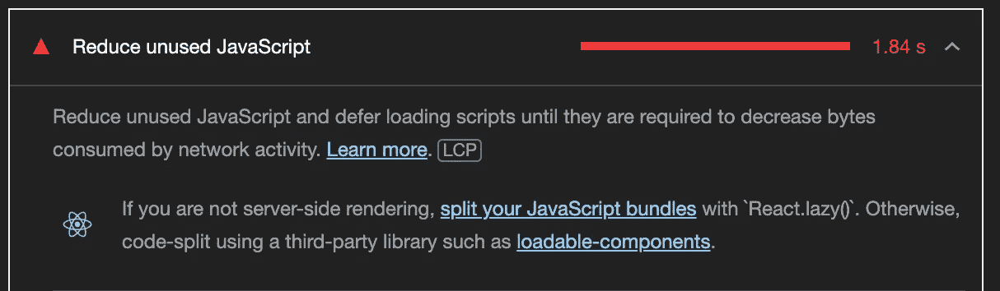
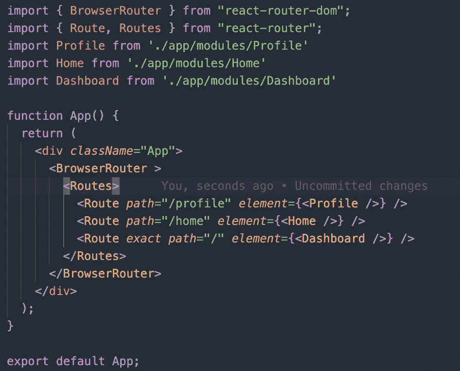
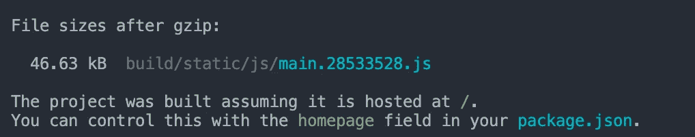
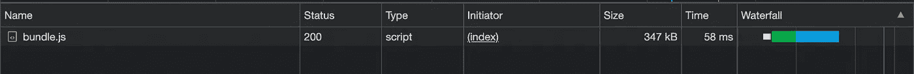
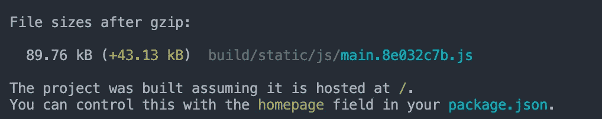
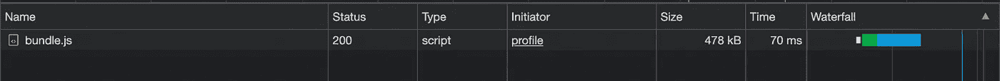
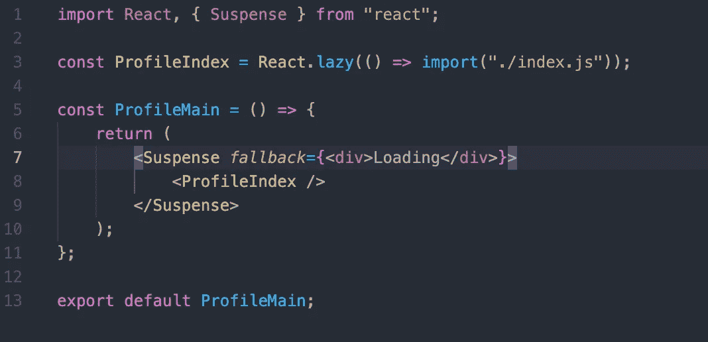
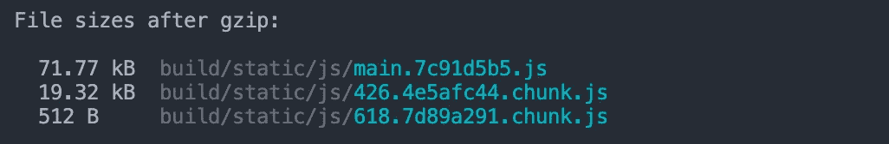
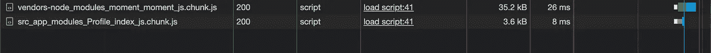

# 代码拆分的基础知识

> 原文：<https://javascript.plainenglish.io/the-abc-of-code-splitting-ebb7060ca704?source=collection_archive---------4----------------------->

Photo by [Tengyart](https://unsplash.com/@tengyart?utm_source=unsplash&utm_medium=referral&utm_content=creditCopyText) on [Unsplash](https://unsplash.com/?utm_source=unsplash&utm_medium=referral&utm_content=creditCopyText)

找出修复 web 应用程序性能的最佳方法可能是一个棘手的问题。虽然这很大程度上取决于手头的项目，但我们可以相信一些通用技术，如**代码分割**可以让我们走出困境。

## A.**为什么我们需要一个叫做*代码拆分*的东西？**

几乎每个 JavaScript 框架都将所有的代码+依赖项打包成一个大的 JS 文件。这有助于为最终客户提供一个真实的来源，并消除了多次网络调用来获取 JS 资源的需要。从理论上讲，这增强了应用程序的性能。

直到它不存在。一旦包的大小超出比例，一次性解释和服务它的开销就会使这种方法变得有些无效。开发人员普遍认为包的大小不应该超过 200kB (gzip)。

如果浏览器需要 4 秒钟来加载 JS 包，那么您的 web 应用程序没有其他选择，只能显示一个白色的空白屏幕或某种加载程序。这通过像[第一个令人满意的描绘](https://developer.mozilla.org/en-US/docs/Glossary/First_contentful_paint)和[第一个有意义的描绘](https://developer.mozilla.org/en-US/docs/Glossary/first_meaningful_paint)这样的指标得到了负面的反映，更不用说最终用户的不满了。代码分割将帮助我们解决这个问题。

## B.**什么是代码拆分？**

顾名思义，代码拆分是一种小心地将代码分成多个包的技术。

假设我创建了一个电子商务网站，销售五种不同的豪华手表。我知道我 80%的到访顾客都会购买手表。如果我在第一次访问时就加载了`htttps://buywatch.com/watch1`的 JS 包，那就太聪明了。如果用户访问任何其他手表的路线，我将按需加载相应的包。这将允许我更快地加载和呈现我的 web 应用程序。

> 代码分割:除非需要，否则不要加载 JavaScript

## C.**如何拆分代码？**

有两种方法可以做到这一点。一、借助动态“导入”。第二，使用`[React.lazy](https://reactjs.org/docs/code-splitting.html#reactlazy).`我们将借助下面的例子讨论本文中的后一种方法。

甚至灯塔建议我们使用`React.lazy`。

Figure 1\. Lighthouse Chrome extension tool

## React 应用程序的设置→

让我们从一个非常简单的 React 应用程序`code-split-app`开始。`App.js`有以下路线

Figure 2\. App.js

我已经下载了 2 个节点包到名为 [*moment*](https://momentjs.com/) 和 [*lodash*](https://www.npmjs.com/package/lodash) *的应用程序中。请注意，我们还没有将这些模块导入到我们的应用程序中。有了这个初始设置，让我们执行`npm run build.`*

这将为我们提供*优化的 gzip 生产版本*详情如下

Figure 3\. Original gzip

简而言之，这意味着我们的应用程序的构建文件夹大小为 **46.63kB** ，可以部署了。

如果我们加载`http://our-website/`，这就是此时`bundle.js`的网络调用的样子(图 4)。此外，现在如果您导航到任何路线，如`/profile`或`/home`，将不会触发新的包调用，因为我们所有的代码都已经加载。

Figure 4\. JS network requests

## 案例一。导入力矩和 lodash。

让我们导入`lodash`到`Dashboard.js`和`moment`到`Profile.js.`

Figure 5\. Case 1 gzip

突然，我们的文件大小增加了两倍！为什么会这样？如果你只是在应用程序中安装一个节点模块，它不会包含在最终的构建文件夹中，除非你在某个地方使用它。因此，当我们将这两个库导入到我们的项目文件中时,`react-scripts`会选择它并将其放入最终的构建文件夹中。现在我们位于 **89.76kB**

Figure 6\. JS network requests visiting **our-website/ ;** If you go to `/profile` route, no additional JS files are loaded.

优化的一个小方法是导入您真正想要使用的库的单个部分，而不是整个库。

## 好✅

`import lowerCase from ‘lodash/lowerCase’`

## 巴特❎

`import _ from ‘lodash’`

这将创建一个大小为 **71.72 kB** 的构建，而不是上面的 **89.76kB** 。

## 案例二。延迟加载`Profile.js`

现在让我们在应用程序中实现一些`React.lazy`。我们将首先在我们的`Profile`模块中创建一个`main.js`，并将我们的`App.js`路由改为指向`ProfileMain`而不是`Profile`组件。代码如下所示:

Figure 7\. main.js

`React.lazy`允许您使用动态导入创建常规组件`ProfileIndex`。当`/profile`第一次被击中时，`React.lazy`会自动加载与`index.js.`关联的捆，请注意`index.js`必须`default`出口一个反作用组件。

当 React 等待包加载时，它必须向最终用户显示一个类似“Loading”消息或动态`Loading`组件的回退。这是通过`Suspense.`实现的，因此惰性组件必须在`Suspense`组件内部呈现。

***注***→甚至可以用一个`*Suspense*` *组件包装多个惰性组件。*

让我们现在构建应用程序。

Figure 8\. Lazy load gzip

在上面的 gzip 中，我们可以看到`main.[hashcode].js`现在被分成 3 个 JS 文件。顺便说一下，如果我们使用`import lowerCase from ‘lodash/lowerCase’`，那么主束将下降到 **49.6 kB。**

1.  `main.[hashcode].js`包含除以下文件之外的几乎所有应用程序代码。
2.  `426.[hashcode].chunk.js`包含力矩库。
3.  `618.[hashcode].chunk.js`包含我们自己对应于`Profile`模块的代码。

> *但是请注意，如果*矩*在项目中的其他任何地方使用，并且该文件或路径没有被直接或间接延迟加载，那么上面的第二个块文件将不会被创建，而是主捆绑包的一部分。*

从图 9 和 10 中可以看出，捆绑文件和块文件是按需加载的

Figure 9\. JS network requests visiting **our-website/**

Figure 10\. JS network requests visiting **our-website/profile**

总结一下:

1.  用 React.lazy 包装你的“基于路线的”组件。
2.  创建一个包。反作用会将惰性加载的文件从主捆绑包中分离出来，并创建一个单独的块。
3.  用户访问触发浏览器下载主捆绑包的 web 应用程序。
4.  用户访问惰性加载的路径，反应。惰性渲染`Suspense`回退，同时我们等待惰性组件加载。
5.  导致增强的性能和优雅的加载器处理。这就是所谓的**“基于路由的”**代码拆分！

## 如何决定是否应该使用代码拆分？

在我看来，你应该考虑以下规则来决定

1.  如果只有不到 30%的活跃用户访问过你的网站。*使用它！*
2.  如果它能帮助您减少超过 10-15%的 JS 包大小。*用吧！*
3.  如果您不习惯代码拆分的异步逻辑，或者您的代码需要进行重大更改来适应这种情况。*避免！*
4.  如果代码没有任何依赖项或本地导入。*避免！*
5.  最后，`React.lazy`和`Suspense`还不能用于服务器端渲染。相反，检查[可加载组件](https://loadable-components.com/docs/server-side-rendering/)。

## 结论

即使我们添加了 2 个重型节点模块，我们最终也只有 **3 kB** 的额外负载，如果我们不使用这些智能技术，这可能会远远超过 **43 kB** 。此外，在 ***覆盖率*** 下，我们可以看到我们的`bundle.js`的未使用字节减少了将近 **10%** 。如果您正在处理一个大型的应用程序，这种影响会更加显著。一定要记住过度杀戮！

我在这篇文章中跳过了一些概念，比如 gzip、可加载组件、代码捆绑、捆绑包中的 hashcode。如果你希望在接下来的文章中了解更多，那么请在评论中或 [LinkedIn](https://www.linkedin.com/in/abhayganjoo/) 中让我知道，并在 Medium 上关注我以获得相同的更新。😃我很乐意那样做。

你可以在这里了解另一个优化 React 应用的好方法[。😃非常感谢你的阅读！](https://blog.bitsrc.io/how-to-make-your-react-application-even-faster-3efe9387cbb1)

*更多内容请看*[***plain English . io***](https://plainenglish.io/)*。报名参加我们的* [***免费每周简讯***](http://newsletter.plainenglish.io/) *。关注我们关于*[***Twitter***](https://twitter.com/inPlainEngHQ)*和*[***LinkedIn***](https://www.linkedin.com/company/inplainenglish/)*。加入我们的* [***社区不和谐***](https://discord.gg/GtDtUAvyhW) *。*