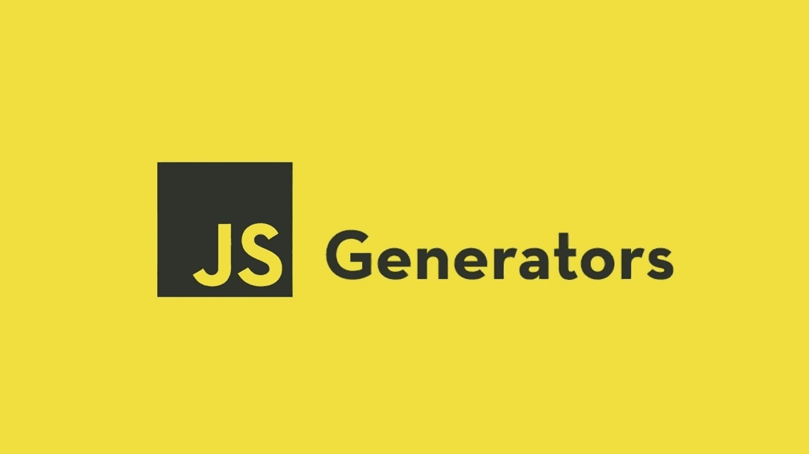

# JavaScript 生成器的魔力

> 原文：<https://javascript.plainenglish.io/the-alchemy-of-javascript-generators-f58e81c9f269?source=collection_archive---------12----------------------->

## JavaScript 函数第 3 部分:理解生成器



这是 JavaScript 函数第 2 部分的继续:

[](/javascript-functions-part-2-function-invocation-bb51407b81b8) [## 通过精确的函数调用展现您的 JavaScript 开发能力

### JavaScript 函数第 2 部分:函数隐式参数和调用函数

javascript.plainenglish.io](/javascript-functions-part-2-function-invocation-bb51407b81b8) 

生成器是一种独特的函数形式。标准函数在从头到尾运行代码时只能创建一个值，而生成器可以为每个请求输出多个值。它能够在请求之间暂停执行。

大多数普通程序员不使用它，因为他们认为它是一个非必要的语言特性。但这就是我们在这里的原因:帮助编码器和生成器解决他们的差异。

```
function***** ironManMovies() {
 **yield** "IronMan 1"
 **yield** "Iron Man 2"
 **yield** "Iron Man 3"
}const movieProducer = ironManMovies()for(let produce of movieProducer) {
 console.log(produce)
}//output
IronMan 1
Iron Man 2
Iron Man 3
```

我们首先定义一个将生成一系列`IronMan`影片的生成器。
很容易做一个生成器函数。在 function 关键字之后，我们添加一个星号(`*`)。这允许我们在生成器主体中使用新的`yield`关键字来生成唯一的值。

为了消耗来自生成器函数的值，我们使用了一个`for-of-loop`。运行`ironmanMovies()`的结果用在了`for-of-loop`的右侧。没有使用退货单。如前所述，生成器不是典型的函数。首先，调用生成器不会运行生成器函数；相反，它创建一个迭代器对象。

## 1.使用迭代器对象理解生成器

让我们制造一些噪音；调用生成器并不意味着将执行生成器函数的主体。相反，创建了一个迭代器对象。这让我们可以和发电机交流。为了更好地理解，我们可以使用迭代器来请求更多的值。让我们改进一下前面的例子。

```
function* ironManMovies() {
 yield "IronMan 1"
 yield "Iron Man 2"
 yield "Iron Man 3"
}const movieProducer = ironManMovies()

const movie1 = movieProducer.next()
console.log(movie1)
const movie2 = movieProducer.next()
console.log(movie2)
const movie3 = movieProducer.next()
console.log(movie3)
const movie4 = movieProducer.next()
console.log(movie4)
const movie5 = movieProducer.next()
console.log(movie5)// output
{ value: 'IronMan 1', done: false }
{ value: 'Iron Man 2', done: false }
{ value: 'Iron Man 3', done: false }
{ value: undefined, done: true }
{ value: undefined, done: true } 
```

如您所见，调用生成器会导致创建一个新的迭代器，用于控制生成器的执行。迭代器对象公开的最基本的东西之一是`next`函数，它可以通过向生成器请求一个值来控制生成器。

当 moment 值返回时，生成器的执行被挂起而没有阻塞，它等待另一个调用。这是一个标准功能中没有的便利特性。

通过在迭代器上使用`next`,生成器从休眠中醒来，并从它停止的地方继续。它一直运行，直到到达下一个 yield 语句，然后挂起以进行更多的调用。当我们第四次调用 next 时，不再有代码要执行，因此生成器返回一个对象，将`values`设置为`undefined`，将`done`设置为`true`。

```
// **Iterating over generator using while loop**function* ironManMovies() {
 yield "Iron Man 1"
 yield "Iron Man 2"
 yield "Iron Man 3"
 const a = 'Have many things to do in lfe'
}const movieProducer = ironManMovies()let movie;
while(!(item = movieProducer.next()).done) {
 console.log(item.value)
}//output
Iron Man 1
Iron Man 2
Iron Man 3
```

## 2.屈服于另一个发电机

从一个生成器函数调用另一个生成器函数被称为嵌套函数调用。让我们看一个例子。

```
function* MarvelMovies() {
 yield "The Avengers"
 yield "Avengers: The Age of Ultron"
 yield "And many more"
}function* ironManMovies() {
 yield "IronMan 1"
 yield "Iron Man 2"
 yield "Iron Man 3"
 **yield* MarvelMovies()**
}const movieProducer = ironManMovies()let movie;
while(!(item = movieProducer.next()).done) {
 console.log(item.value)
}// output
IronMan 1
Iron Man 2
Iron Man 3
The Avengers
Avengers: The Age of Ultron
And many more
```

在迭代器上使用`yield*`操作符，我们可以使用另一个生成器。在这个例子中，我们从一个`ironManMovies`让位于一个新的`MarvelMovies`；对当前`ironManMovies`迭代器的下一个方法的所有调用都转到`MarvelMovies`生成器。这将一直持续到`MarvelMovies`生成器用完了要处理的项目。

## 3.与发电机互动

到目前为止，我们已经看到了如何使用`yield`从生成器接收几个值。我们现在将关注与生成器的双向通信，也就是说，发送和接收来自它们的数据。

**3.1 使用值作为生成器函数的参数:**

向生成器提交数据的最简单方法是像对待任何其他函数一样对待它，并像对待任何其他函数一样使用函数调用参数。

```
function* ironManMovies(actor) {
 const featured = yield "Iron Man 1"
 yield (`Iron Man 2, ${actor}, ${featured}`)
}const movieProducer = ironManMovies('Tony')
const mov1 = movieProducer.next()
console.log(mov1)const mov2 = movieProducer.next('Happy')
console.log(mov2)//output
{ value: 'Iron Man 1', done: false }
{ value: 'Iron Man 2, Tony, Happy', done: false }
```

在这个例子中，我们有两个对`ironManMovies's` next 方法的调用。
第一种方法`movieProducer.next()`，向生成器询问初始值。这个调用启动生成器，它计算短语“*钢铁侠 1”*的值，然后暂停生成器的执行，因为它还没有启动。

在第二次调用`ironManMovies's`下一个方法`movieProducer.next('Happy')`时，有趣的事情开始了。Next 用于将数据发送回生成器。我们的生成器正在耐心等待，在表达式 yield "I *ron Man 1* 处暂停，因此整个 yield 表达式的值是作为参数提供给`next()`的' *Happy* 。这表示`featured = yield 'Iron Man 1'`中的变量的值将为“*快乐*”

这就是我们能够与发电机双向通信的方式。
要从生成器返回数据，请使用 yield，要将数据反馈给生成器，请使用迭代器的`next()`方法。

**3.2 使用异常:**

抛出异常是另一种向生成器提供值的技术，这种技术稍逊一筹。每个迭代器都有一个`next`函数，以及一个用于向生成器返回异常的`throw`方法。

```
function* ironmanMovies() {
 try {
  yield "Iron Man"
  fail("The villian did cause issue")
 }catch(e) {
  console.log(e)
 }
}const movies = ironmanMovies()const result = movies.next()
console.log(result)movies.throw('Caught the villina')//output
{ value: 'Iron Man', done: false }
Caught the villina
```

为了更好地理解`throw`，请参考以下内容:

[](https://developer.mozilla.org/en-US/docs/Web/JavaScript/Reference/Global_Objects/Generator/throw) [## generator . prototype . throw()-JavaScript | MDN

### 该方法通过向生成器抛出一个错误来恢复生成器的执行，并返回一个具有两个属性的对象…

developer.mozilla.org](https://developer.mozilla.org/en-US/docs/Web/JavaScript/Reference/Global_Objects/Generator/throw) 

这就是 JavaScript 函数的全部进展。我希望你已经发现这是有用的。感谢您的阅读。

*更多内容看* [***说白了。报名参加我们的***](https://plainenglish.io/) **[***免费周报***](http://newsletter.plainenglish.io/) *。关注我们关于*[***Twitter***](https://twitter.com/inPlainEngHQ)*和*[***LinkedIn***](https://www.linkedin.com/company/inplainenglish/)*。加入我们的**[***社区不和谐***](https://discord.gg/GtDtUAvyhW) *。****