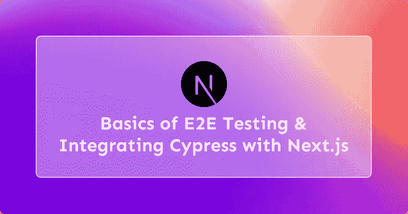

# E2E 测试和集成 Cypress 与 Next.js 的基础

> 原文：<https://javascript.plainenglish.io/the-basics-of-e2e-testing-and-integrating-cypress-with-next-js-4010160b6c9e?source=collection_archive---------10----------------------->



👋你们好，伙计们！已经有一段时间没发文章了。

作为开发者，我们总是想把最好的产品交付给用户。测试是这个过程中至关重要的一部分。一种常用的测试技术是 E2E 测试。

# 💡E2E 测试—基础知识

端到端测试(或简称为 E2E 测试)是一种从头到尾测试整个软件产品的技术，以确保应用程序流的行为符合预期。

E2E 测试的主要目的是模拟真实的用户场景，并根据最终用户的体验进行测试。

## 📃E2E 测试的优势

*   降低风险
*   增强信心
*   降低的价格

# ⚡ E2E 测试方法

## 水平 E2E 测试

水平测试是从最终用户的角度进行的。它评估用户是否能够导航软件并正确使用其功能。它还有助于检测可能阻止用户使用某些软件功能的错误。

## 垂直 E2E 测试

这种方法指的是分层测试，也就是说测试是以连续的、层次化的顺序进行的。系统的每个子组件从头到尾都经过测试，以确保质量。

当系统没有用户界面或者用户界面有很高的技术性并且用于测试关键组件时，通常会这样做。

# ❓如何进行 E2E 测试？

*   分析所有需求。对应用程序应该做什么有一个清晰的想法。
*   根据要求设置测试环境。
*   列出测试这些反应所需的所有测试方法。
*   设计测试用例。
*   运行测试并记录结果。

# ⚡ E2E 测试框架

E2E 测试框架用于确保应用程序中的所有活动部分都配置正确。

以下是一些最受欢迎的:

*   硒
*   柏树
*   黄瓜
*   Testim

现在您已经熟悉了 E2E 测试的基本概念，让我们看看如何在 Next.js 中使用 Cypress 集成 E2E 测试..

# 👨‍💻集成 Cypress 和 Next.js 进行 E2E 测试

现在您已经熟悉了 E2E 测试的基础，让我们看看如何在 Next.js 中开始使用 Cypress

**Next.js**

如果您不熟悉 Next.js，它是一个 React 框架，包含一些额外的功能来帮助开发人员和客户。

**柏树**

赛普拉斯是 E2E 网络测试的测试员。

## 设置项目

你可以用“创建下一个应用”和“cypress”例子来快速开始。

```
npx create-next-app@latest — example with-cypress with-cypress-app 
```

对于现有的项目，您可以从安装“cypress”包开始。

```
npm install — save-dev cypress
```

然后，将 Cypress 添加到“package.json”文件的“scripts”部分。

```
// package.json
“scripts”: {
 “dev”: “next dev”,
 “build”: “next build”,
 “start”: “next start”,
 “cypress”: “cypress open”,
}
```

接下来，运行 Cypress 来生成使用推荐的文件夹结构的例子。

```
npm run cypress
```

## 创建您的第一个 Cypress 集成测试

假设您有两页:

```
// pages/index.jsimport Link from ‘next/link’export default function Home() {
 return (
 <nav>
 <Link href=”/about”>
 <a>About</a>
 </Link>
 </nav>
 )
}
``````jsx
// pages/about.js
export default function About() {
 return (
 <div>
 <h1>About Page</h1>
 </div>
 )
}
```
```

然后，为了测试您的导航是否正常工作:

```
// cypress/integration/app.spec.jsdescribe(‘Navigation’, () => {
 it(‘should navigate to the about page’, () => {
 // Start from the index page
 cy.visit(‘[http://localhost:3000/'](http://localhost:3000/'))// Find a link with an href attribute containing “about” and click it
 cy.get(‘a[href*=”about”]’).click()// The new url should include “/about”
 cy.url().should(‘include’, ‘/about’)// The new page should contain an h1 with “About page”
 cy.get(‘h1’).contains(‘About Page’)
 })
})
```

**提示**:不用做***` cy . visit(***[***http://localhost:3000/')`***](http://localhost:3000/')`)，只要把 ***`baseUrl`*** 设为 ***`*** 就可以了

```
// cypress.json {
 “baseUrl”: “[http://localhost:3000](http://localhost:3000)"
}
```

至此，您将拥有一个简单的测试设置。因为 cypress 正在测试一个真正的 Next.js 应用程序，所以它要求在启动 Cypress 之前运行 Next.js 服务器。

首先运行`npm run build`和`npm run start`；然后，在另一个终端窗口运行`npm run cypress`来启动 Cypress。

现在，cypress 将启动，您可以查看结果。

## 持续集成(CI)的进一步步骤

此时，您可能已经注意到，到目前为止运行 Cypress 已经打开了一个交互式浏览器，这对于 CI 环境来说并不理想。

您可以使用`cypress run`命令运行 Cypress。

在***` package . JSON `***文件中:

```
// package.json“scripts”: {
 // …
 “cypress”: “cypress open”,
 “cypress:headless”: “cypress run”
}
```

本文到此为止！你可以在这里放下一些反应来表示你的支持！

**关于作者**

*   [**投资组合**](https://anurag.tech)
*   [**博客**](https://blog.anurag.tech)

*更多内容请看*[***plain English . io***](https://plainenglish.io/)*。报名参加我们的* [***免费周报***](http://newsletter.plainenglish.io/) *。关注我们关于*[***Twitter***](https://twitter.com/inPlainEngHQ)*和*[***LinkedIn***](https://www.linkedin.com/company/inplainenglish/)*。加入我们的* [***社区不和谐***](https://discord.gg/GtDtUAvyhW) *。*