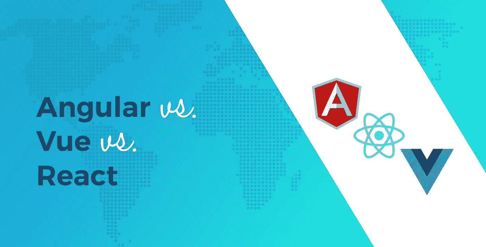
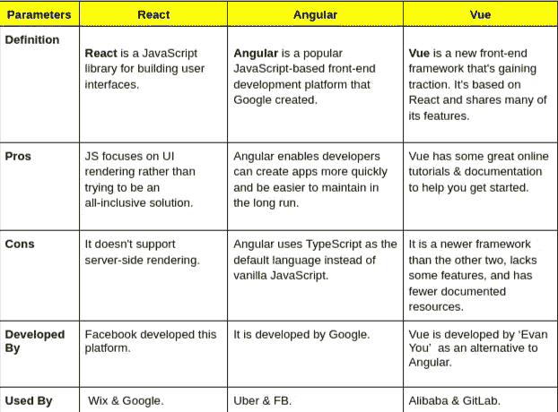

# 前端框架之战:Angular vs. React vs. Vue.js

> 原文：<https://javascript.plainenglish.io/the-battle-of-the-front-end-frameworks-angular-vs-react-vs-vue-16c17c53dad1?source=collection_archive---------4----------------------->

什么是 Angular vs. React vs. Vue.js？或者说，我为什么要在制作一个新的 app 或网站时使用 Reactjs？前端框架之战已经持续了多年，而且还远未结束。许多开发人员都有自己的偏好，但是没有理由只局限于一种。

在本文中，我们将深入探讨这三个流行框架的比较，从它们的优缺点到哪一个最适合您的下一个项目。

[Source](https://www.codeinwp.com/blog/angular-vs-vue-vs-react/)

# 快速查看反应、角度和 Vue

React 是一个用于构建用户界面的 JavaScript 库。它帮助您创建可重用的组件，并使管理状态变得容易。

Angular 是 Google 创建的一个流行的基于 JavaScript 的前端开发平台。它提供了许多特性，使其成为 web 开发的一个有吸引力的选择，例如声明性模板语法、依赖注入和反应式编程。

Vue 是一个新的前端框架，正在获得越来越多的关注。它以 React 为基础，并分享了它的许多功能，但它也有独特的功能，使它比 Angular 或 React 更有效。

# 有什么区别？

在很高的层面上，这些框架是不同的，因为它们用于不同的目的。Angular 通常用于单页面应用程序(spa)和有许多静态页面的网站(想想你的典型网站)。

另一方面，印度 ReactJS 应用程序开发公司 React 最适合实时更新内容的动态页面和应用程序——想想亚马逊或脸书新闻订阅等电子商务商店。

Vue Js 被设计成可增量采用的，这使它成为小型项目的好选择，在这些项目中，您可能只想使用应用程序的某些部分。它还非常注重性能，并提供了一些工具，使其易于与 jQuery 或 Bootstrap 等库一起使用。

# React、Angular 和 Vue 的优缺点

为了更好地理解，让我们评估一下每个框架的优缺点。这将帮助您决定哪个框架最适合您的项目。

# 赞成的意见

## 反应

*   React 是一个 JavaScript 库，主要用于创建用户界面，它已经在许多项目中使用，如脸书、Instagram、Whatsapp 和网飞。
*   React 还附带了各种调试工具，使开发人员可以轻松调试他们在应用程序中遇到的任何问题。
*   JS 专注于 UI 渲染，而不是试图成为一个包罗万象的解决方案。
*   React 使用事件系统进行更改，而不是数据绑定，这可以为那些不习惯处理模型和视图之间双向绑定的人带来更简单的代码。
*   React 非常适合高性能应用程序，因为它的虚拟 DOM 只更新需要更新的部分。

# 有角的

*   Angular 是一个功能齐全的框架，可以提供很多功能，包括数据绑定、路由和依赖注入。
*   在 Angular 的帮助下，开发人员可以更快地创建应用程序，从长远来看，这些应用程序更容易维护。
*   Angular 还具有延迟加载和树抖动等特性，这使得它比其他具有大型库的框架(如 Ember 或 jQuery)加载更快。
*   Angular 的另一个优点是，它不仅仅用于构建 web 应用程序。从桌面应用程序到服务器后端，甚至是移动应用程序，它都很有用。
*   您可以使用 Angular 快速启动并运行您的应用程序。

# 某视频剪辑软件

*   Vue 是一个直观的框架，可以让低水平的[**前端开发**](https://www.valuecoders.com/frontend-development-services?utm_source=Medium_%28Reactvsangular%29&utm_medium=Anu_B11&utm_id=Front-end-development) 经验的开发者快速上手。例如，在 Vue 中实现路由要比在 React 或 Angular 等其他框架中容易得多。
*   它还提供了一些很棒的在线教程和文档，如果您正在尝试前端开发，可以帮助您入门。
*   Vue 的另一个优势是，你可以用比雇佣了解 Angular 或 React 的人更少的钱雇佣 Reactjs 开发人员。
*   在 Vue 框架的帮助下，开发人员可以获得足够的前端开发知识，以创建在桌面和移动平台上运行良好的专业应用程序。
*   Vue 是一个前端开发技能变得不那么受重视的平台，这意味着新的开发人员可以以较低的工资进入该领域，并与其他人竞争。

# 骗局

## 反应

现在，让我们分析 React 的缺点，以及为什么您应该为您的下一个项目雇用 Reactjs 开发人员。

*   React 非常适合构建单页面 web 应用程序，但它不支持服务器端渲染，也不像 Angular 或 Vue 等其他框架那样被广泛采用。
*   它也很难调试，因为它严重依赖于虚拟 DOM 而不是真实的 DOM，这使得很难在代码中找到错误。
*   React 非常依赖 JavaScript，所以你必须很好地了解 JavaScript，才能用这个框架写出有效的代码。
*   React 的另一个缺点是它只适合前端开发。如果你想做后端开发，你需要使用另一种后端技术，比如 Rails。
*   如果你在寻找前端开发服务的帮助，请雇佣 Reactjs 开发人员。他们会把你的项目引向正确的方向。

# 有角的

*   Angular 是一个开源的客户端 JavaScript 框架，支持双向数据绑定和强类型。如果您正在从头构建一个应用程序，这些特性是非常好的，但是很难集成到现有的系统中，并且有一个陡峭的学习曲线。
*   如果您在前端开发方面需要帮助，我们建议雇用 Reactjs 开发人员。有我们的专家在您身边，管理设计流程和在发布日及时更新将变得更加容易！
*   Angular 的另一个缺点是它使用 TypeScript 作为默认语言，而不是普通的 JavaScript。
*   相比之下，Reactjs 使用 JSX，这使得将 CSS 合并到代码中变得容易，并且提供了简单的调试。
*   雇用 Angular 开发人员来帮助您的企业或组织创建前端开发！

# 某视频剪辑软件

*   Vue 是一个比其他两个更新的框架，它缺少一些特性，开发者可用的文档资源也更少。
*   在这个框架中调试更加困难，因为 Vue 不像 React & Angular 那样内置所有工具。
*   很难找到精通 Vue 的合格开发人员。
*   Vue 的另一个弱点是它的学习曲线很陡。开发者在有效使用 Vue 之前，需要了解 JavaScript。
*   最后，与 React & Angular 不同，Vue 只有一个快速参考指南，包含每个组件/指令/过滤器的教程，可以作为单独的 pdf 下载，没有代码示例。

# 最后的话

前端开发从来没有像现在这样重要，‌knowing 很难决定哪个前端框架最适合你的项目。三个最流行的框架是 Reactjs、Angular 和 Vuejs，它们各有利弊。一些企业更喜欢为他们的项目雇佣 Reactjs 开发人员，而另一些企业更喜欢 react JS 应用开发服务 T2 公司。

您选择哪种框架取决于您正在构建的应用程序的类型、您在前端开发方面有多少时间和经验，或者您对特定框架的熟悉程度。

*更多内容请看*[***plain English . io***](https://plainenglish.io/)*。报名参加我们的* [***免费周报***](http://newsletter.plainenglish.io/) *。关注我们关于*[***Twitter***](https://twitter.com/inPlainEngHQ)[***LinkedIn***](https://www.linkedin.com/company/inplainenglish/)*[***YouTube***](https://www.youtube.com/channel/UCtipWUghju290NWcn8jhyAw)*[***不和***](https://discord.gg/GtDtUAvyhW) *。对增长黑客感兴趣？检查* [***电路***](https://circuit.ooo/) *。***