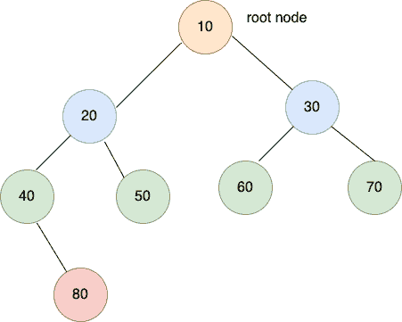

# 你需要解决的 5 个二叉树编码问题

> 原文：<https://javascript.plainenglish.io/the-best-5-coding-questions-you-must-solve-in-binary-tree-1f760c9f70a9?source=collection_archive---------4----------------------->

## 数据结构编码问题系列——二叉树上最常见的面试问题。

在本文中，我们将看到二叉树上最常被问到的 5 个面试问题。

如果你正在准备软件工程师/软件开发员或任何与编程相关的职位的面试，你必须对数据结构有很强的掌握。

从面试官的角度来看，像树、图这样的非线性数据结构是他们最喜欢的话题。这个博客是关于二叉树数据结构的。

我们刚刚开始*面试问题系列*，在这里我们将看到几乎每个面试中被问到的首要面试问题。随着问题的出现，我们还将向*提供详细的解决方案*，以便您能更清楚地了解。

*注:如果你还没看过这个，请先做一下* [二叉树——2022 年如何用 Javascript 实现？](https://weekendtutorial.com/binary-tree-and-its-traversal-in-javascript/)

不过有一个强烈的建议——先自己尝试一下这些问题。 一旦你用尽了所有的选择，但没有任何结果，那就检查解决方案。相信我，练习这个会增强你的自信。

你会发现，大部分时候，你几乎已经到了解。稍后，这将在你的头脑中被编程，你将能够找到方法并在没有任何提示或帮助的情况下达成解决方案。

# 问题清单

1.  二叉树的大小(即所有节点的数量)
2.  二叉树的高度
3.  二叉树中的最大节点
4.  二叉树中的最小节点
5.  二叉树中所有节点的总和

# 问题 1。二叉树的大小

二叉树的大小是树中存在的节点总数。

例如，下面的树的大小是 8


**树的大小=左子树的大小+右子树的大小+ 1**

```
function size(root) {
   if (root === null) return 0;

   return size(root.left) + size(root.right) + 1;
}
```

TC: O(N) ~必须访问树的每个节点最多一次
SC: O(N) ~如果是倾斜的树

# 2.二叉树的高度

树的高度是从树的根节点到最远的叶节点的距离。

例如，下面的树的高度是 4


**树的高度= Max(左子树的高度，右子树的高度)+ 1**

```
function height(root) {
   if (root === null) return 0; return Math.max(height(root.left), height(root.right)) + 1;
}
```

TC: O(N) ~必须访问树的每个节点最多一次
SC: O(N) ~如果是倾斜的树

# 3.二叉树中的最大节点

最大节点可以是根节点，也可以来自左边或右边的子树。

如果我们取上面 3 个中的最大值，结果就是树中的最大节点。

例如，下面的树的最大值是 80



**树的最大节点=
Max(左子树最大，右子树最大，root.data)**

```
function largest(root) {
   if (root === null) return 0; return Math.max(
        largest(root.left),
        largest(root.right),
        root.data
    );
}
```

TC: O(N) ~最多只能访问树的每个节点一次
SC: O(N) ~如果是偏斜树

# 4.二叉树中的最小节点

最小节点可以是根节点，也可以来自左或右子树。

如果我们取上述 3 个中的最小值，结果将是树中的最小节点。

例如，下面树的最小值是 10


**树的最小节点=
最小(左子树最小，右子树最小，根。数据)**

```
function smallest(root) {
   if (root === null) return 0; return Math.min(
        smallest(root.left),
        smallest(root.right),
        root.data
    );
}
```

TC: O(N) ~最多只能访问树的每个节点一次
SC: O(N) ~如果是偏斜树

# 5.二叉树中所有节点的和

为了找到树的所有节点的总和，我们需要使用任何树遍历方法访问每个节点。在这个例子中，我使用了后置遍历。

例如，下方树的最大值为 360。


**sumTree = sumTree(左子树)+ sumTree(右子树)+ root.data**

```
function sumTree(root) {
   if (root === null) return 0; return sumTree(root.left) + sumTree(root.right) + root.data;
}
```

TC: O(N) ~最多只能访问树的每个节点一次
SC: O(N) ~如果是偏斜树

# 摘要

我们已经看到了采访中问到的最常见的问题。我们将提出更多的问题，涵盖整个树数据结构。

请跟读 [**周末教程**](https://weekendtutorial.com) 并以此为媒介获取最新文章。

***如果你跟着我来，会鼓励我多写点，我会很感激的。***

谢谢你阅读这篇文章。我们下次见面吧。

*更内容于**[**T24**](https://plainenglish.io/)*。注册参加我们的* [***免费周报***](http://newsletter.plainenglish.io/) *。跟随我们在*[](https://twitter.com/inPlainEngHQ)**和* [***领英***](https://www.linkedin.com/company/inplainenglish/) *上。加入我们的* [***社群不和***](https://discord.gg/GtDtUAvyhW) *。***