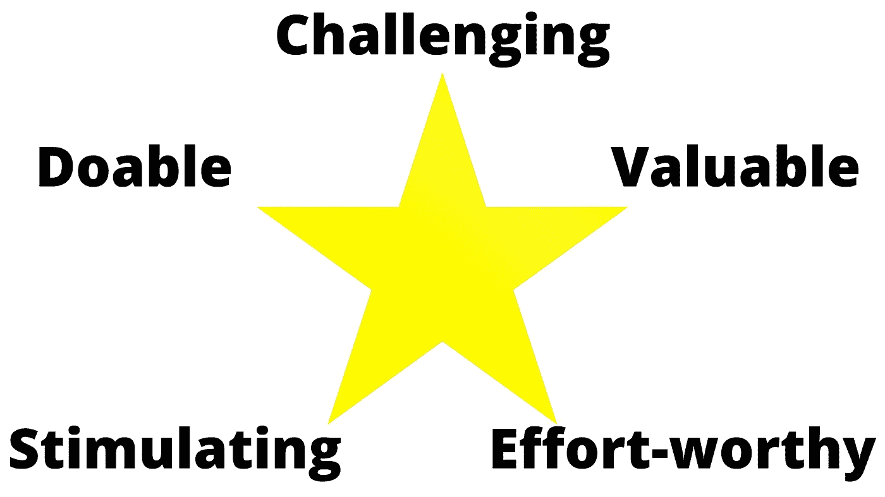
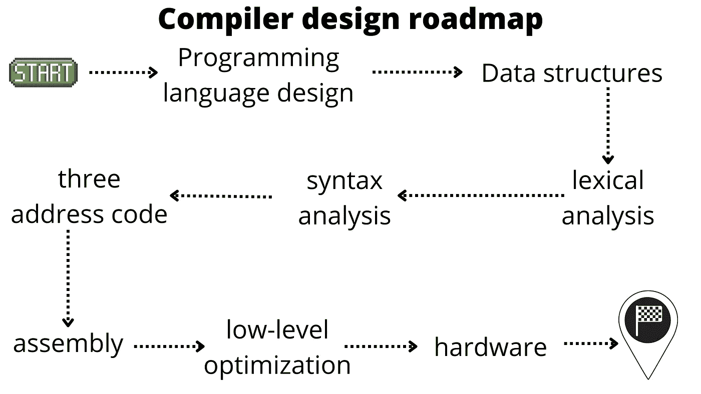

# 成为更好的程序员的最佳项目

> 原文：<https://javascript.plainenglish.io/the-best-project-to-become-a-better-programmer-bf53ac7545db?source=collection_archive---------5----------------------->

## 挑战自己，学习大量新的有用的概念，以及如何开始

Photo by [Andy Hermawan](https://unsplash.com/@kolamdigital?utm_source=medium&utm_medium=referral) on [Unsplash](https://unsplash.com?utm_source=medium&utm_medium=referral)

自从你开始编程以来，你总是被教导你应该自己承担项目来巩固你的知识并获得开发真实世界软件所需的实践经验。

从你的软件开发之旅的开始，关注某种适合你当前专业水平和兴趣的项目是很重要的。第一个项目通常是基本的基于文本的游戏、简单的命令行应用程序，或者是再现像 Pong 这样的经典游戏。

然而，随着你在这个领域越来越有经验，你需要新的刺激来保持学习和提高。在这篇文章中，我将讨论什么是一个好的项目；然后，我将介绍我认为是一个伟大的项目及其原因。最后，我会分享一些免费资源来入门。

## 什么是好的项目？

一个好的编程项目应该值得你花时间，并教会你一些有用的东西，无论是新的技能还是概念。一个好的项目应该让你做研究和学习新的东西，否则，你很可能会腾出时间做别的事情。

承担项目的另一个重要方面是挑战。它必须是精神上的刺激，在跳到键盘上开始编码之前需要一些思考。毕竟，不付出努力是不会变好的。

一个好的项目应该花一些时间来完成，包括相关的研究和回顾你的步骤来修复错误或错误的方法，这些都是你在深入了解特定领域后才认识到的。这可能会让你忙碌一段时间，但是，这项工作应该由一个单独的开发人员来完成，因为你是一个需要改进的人，除非你在一个团队中工作，并且只专注于整个项目的某个部分。

## 最好的项目(在我看来)

对于高级软件开发人员来说，最好的编程项目之一就是完全从零开始构建编译器。让我们看看为什么你应该考虑它。

首先，编译肯定是一个刺激的旅程。你可以编译现有的编程语言，或者更好的是，以你喜欢的方式创建你自己的语言。为了做到这一点，你必须研究编译器是如何工作的，编译的各个阶段(稍后会详细介绍)，汇编语言，你的 CPU 如何执行二进制文件，以及内存是如何工作的。

这样的项目会让你忙碌一段时间，随着你对底层世界和优化技术的深入挖掘，它会变得越来越复杂。虽然您可以决定您的编译器应该有多简单或多复杂，但预计至少需要几个月的时间，包括研究和反复试验的时间。

构建编译器也具有挑战性，尤其是因为在线上没有太多关于这个主题的信息，而且编写编译器的方式也取决于语言特性、您选择的编程语言以及您自己的编码选择。因此，你必须主要靠自己来解决问题。

尽管困难重重，这个项目完全可以由一个开发商来完成。而且，如果你一次专注于编译的一个阶段的编码，你可以一步一步的测试，看看你的进度，这会让你有动力走下去。

从头开始构建编译器的另一个好处是，你不需要依赖第三方软件。最终您无能为力的 bug 或者文档不清晰都不是问题，更不用说您不必为了完成项目而学习新技术。

## 你将学到什么

从头开始构建编译器的旅程将带您了解许多不同的编程领域。如果您还不熟悉，您将熟悉核心数据结构，如双向链表和树，或者与效率相关的结构，如查找表。

我建议您实现自己的数据结构，而不是使用语言的内置数据结构，主要有两个原因:首先，您将习惯于编写自己的自定义数据结构，这是软件开发中编写优化代码时的常见做法；其次，通过自己编写代码，您可以根据自己的需要调整结构，提高特定情况下的性能，或者包含一些数据结构的经典实现所不具备的与应用程序相关的功能。

你将对底层世界和编程本身有更好的理解。通过尽可能接近计算机如何操作，以便将人类友好的编程语言翻译成 CPU 可以理解和运行的代码，您开始像计算机一样思考，并调整您的编码风格，以更好地利用低级优化技术。

## 从哪里开始

现在，让我们进入更具体的部分。如何开始构建编译器？正如我之前提到的，在网上找到关于这个话题的好的和完整的资源有点困难。出于这个原因，我在这里列出了一些我用来学习的有用资源。然而，不要期望这些信息就足够了，因为你是将所有这些概念粘合到一个工作系统中的头脑。在我的旅程中，我不得不学习如何独立应用大多数概念，更不用说由于缺乏现成的具体信息，我经常被迫自己发明东西。

为了构建一个编译器，你首先要知道它是什么。关于题目的简单介绍，建议大家看下面由精华的[帧的 YouTube 视频。为了更深入地了解，编译器上的](https://www.youtube.com/c/frameofessence)[维基百科页面](https://en.wikipedia.org/wiki/Compiler)是一个开始学习的好地方。

在我提到编译的阶段之前。虽然不同的编译器可能实现不同的阶段，但几乎所有的阶段都包括标记化、语法分析、中间代码生成和目标代码生成。你可以在下面关于 geeksforgeeks.org 的文章中了解更多，其中还包括一个很好的视频解释。

 [## 编译器的各个阶段

### 先决条件-介绍编译器设计我们基本上有两个阶段的编译器，即分析阶段和…

www.geeksforgeeks.org](https://www.geeksforgeeks.org/phases-of-a-compiler/) 

要开始使用标记化，我建议您阅读我的文章《编写数学解释器》(又名。计算器)。在那里，我将重点放在标记化器的实际实现上，并对源代码进行了彻底的注释。

 [## 编写计算器程序来解决复杂的数字表达式

### 计算器与编译器和解释器有许多共同之处。通过代码示例和算法探索细节…

better 编程. pub](https://betterprogramming.pub/programming-a-calculator-to-solve-complex-numerical-expressions-75d228f37ebf) 

另一个需要熟悉的基本概念是组装。不知道 CPU 指令是如何工作的，就写不出编译器。幸运的是，你不必成为汇编程序员来创建一个编译器。但是，需要对低级 CPU 指令、寄存器和内存有基本的了解。Tutorialspoint.com 有一个很好的简单的[组装教程](https://www.tutorialspoint.com/assembly_programming/index.htm)。我还建议你看看这个由 [javidx9](https://www.youtube.com/c/javidx9) 制作的关于汇编的精彩视频:

除此之外，您可能会发现了解计算机在硬件层面上的实际工作方式非常有用，因为您将生成直接在 CPU 上运行的二进制代码，或者您可能会决定开发一个虚拟机来运行您生成的字节代码，这是我在学习编译器时的首选方法。为此，我建议看 YouTube 上 [CrashCourse](https://www.youtube.com/c/crashcourse) 的速成课程计算机科学系列。虽然不需要看完剧集的所有集，但至少要达到剧集的第 21 个视频。

## 结论

总而言之，从事项目对于提高您的编程技能和获得特定领域的实践知识至关重要。你永远不应该停止挑战自己和学习新事物，总会有改进的空间。

尽管你不会学习你已经很熟悉的东西，但当你开始一个新项目时，确保你没有任何关于如何完成它的线索:你会在途中学到你需要的东西。

> 你不会因为总是举起同样的重量而变得更强大:每次都要更加努力，释放你真正的潜力。

我希望你喜欢这篇文章。如果你有什么要补充的或任何其他好的项目，请在评论中分享你的想法。

**感谢您的阅读！**

*更内容于***。报名参加我们的* [***免费周报***](http://newsletter.plainenglish.io/) *。跟随我们登上* [***推特***](https://twitter.com/inPlainEngHQ) 和 [***领英***](https://www.linkedin.com/company/inplainenglish/) *。查看我们的* [***社区不和***](https://discord.gg/GtDtUAvyhW)T42，加入我们的 [***人才集体***](https://inplainenglish.pallet.com/talent/welcome) *。**