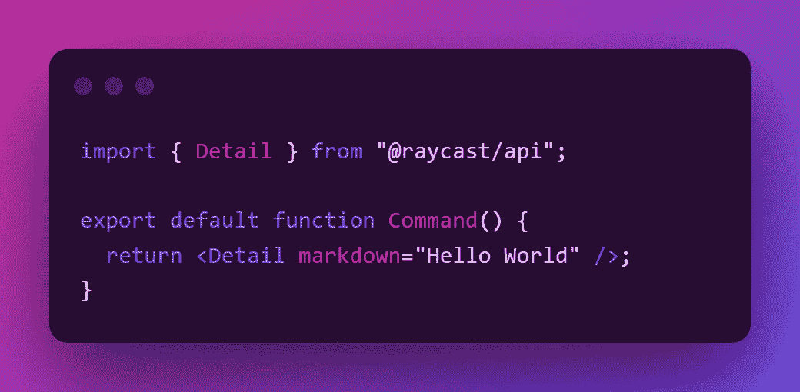

# 将嵌入式代码插入中型文章的最佳方式。

> 原文：<https://javascript.plainenglish.io/the-best-ways-to-insert-or-write-code-into-a-medium-e354b1d36d22?source=collection_archive---------8----------------------->

## 我们如何在不破坏用户体验的情况下将代码插入媒体编辑器。

这篇文章，我是在做了大量的研究和尝试了许多方法来给中型帖子添加代码后写的。

## 方法 1:使用内置代码块。

将代码添加到中型 post 的简单方法是通过`selecting the text + backtick ( ` ) for inline code`和

```
3 backticks (```) for block code.
```

**挑战:**

*   格式化代码非常困难。
*   代码是用灰色写的，很难区分关键字、变量和表达式等。

## 方法二:使用 GitHub Gist。

这种方法被许多作家使用，而且非常简单。我们只需要创建一个要点，并将其 URL 添加到您的媒体帖子中。

下面你可以看到一个示例代码。

**挑战:**

*   它不支持黑暗主题。

## 方法三:使用截图。

这是将代码作为图像插入的一种非常简单的方法。有很多网站会把你的代码转换成截图。

1.  [**CodeSnap**](https://marketplace.visualstudio.com/items?itemName=adpyke.codesnap)**:**直接让你截图的是 VSCode 插件
2.  [**ray . so**](https://ray.so/)**:**这是一个网站，我们只需要粘贴代码，它就会为我们生成截图。你可以在下面看到一个例子。



**挑战:**

*   用户不能复制代码。

## 方法 4:使用在线代码编辑器和 ide。

我试过很多在线代码编辑器比如[**Codepen**](https://codepen.io/)[**code sandbox**](https://codesandbox.io/)[**stack blitz**](https://stackblitz.com/)等等。

功能上没有区别，但是用户体验上有区别。然后我决定用 [**StackBlitz**](https://stackblitz.com/) 因为它的 UI。

下面你可以看到一个例子。

**挑战:**

*   这些代码编辑器大多只支持 JavaScript。如果你使用任何其他语言，它看起来很奇怪，而且你不能编译它。

## 方法五:使用[碳。Now.sh](https://carbon.now.sh/) 。

它是一个在线工具，允许你从你的代码中生成一个嵌入的或者截图。

它支持许多编程语言。

这里嵌入式看起来不同于在线代码编辑器，也提供了良好的用户界面。下面你可以看到一个例子。

**挑战:**

*   如果代码很大，它会增加一个滚动条，看起来有点乱，但是你仍然可以复制代码。

## 我个人用哪个？

*   每当我使用 Javascript 时，我都会使用 [**StackBlitz**](https://stackblitz.com/) 。
*   或者我用 [**碳。Now.sh**](https://carbon.now.sh/) ，如果我从事的不是 Javascript 的工作。

如果你觉得这篇文章有用，非常感谢。如果你喜欢，请喜欢并跟随我。

*更多内容看* [***说白了就是***](https://plainenglish.io/) *。报名参加我们的* [***免费周报***](http://newsletter.plainenglish.io/) *。关注我们* [***推特***](https://twitter.com/inPlainEngHQ) ，[***LinkedIn***](https://www.linkedin.com/company/inplainenglish/)*，*[***YouTube***](https://www.youtube.com/channel/UCtipWUghju290NWcn8jhyAw)*，*[*不和*](https://discord.gg/GtDtUAvyhW) ***。***

***有兴趣缩放你的软件启动*** *？检查出* [***电路***](https://circuit.ooo/?utm=publication-post-cta) *。*