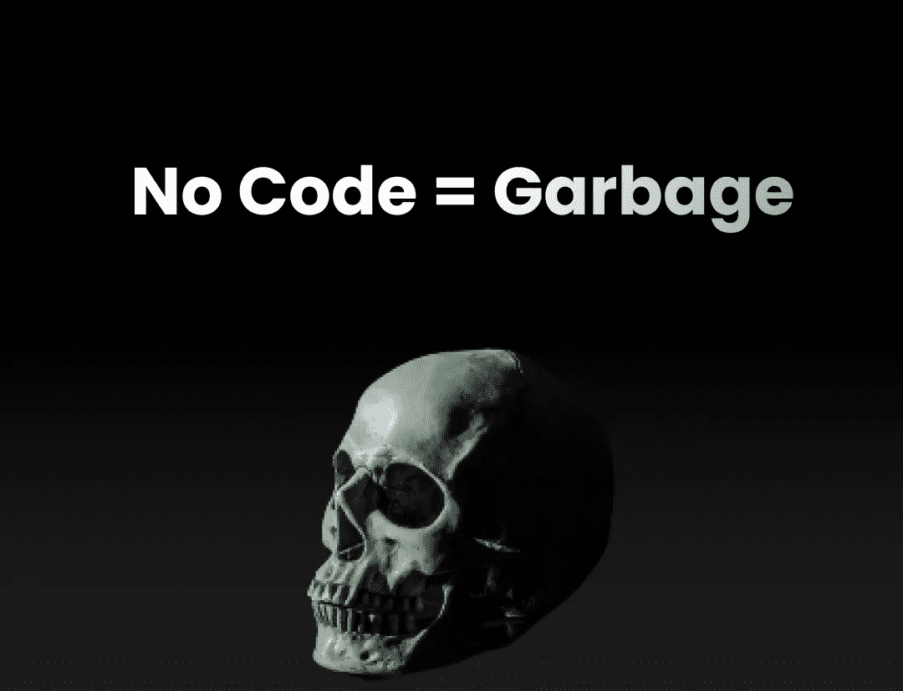

# 为什么没有代码是绝对的垃圾并且永远不会取代开发人员的残酷事实

> 原文：<https://javascript.plainenglish.io/the-brutal-truth-about-why-no-code-is-absolute-garbage-and-will-never-ever-replace-developers-86e5f2b3879c?source=collection_archive---------1----------------------->

## 为什么你会被愚弄。

Image by Author

**通过在**[**【https://twitter.com/antondevv】**](https://twitter.com/antondevv)**的 Twitter 上关注我，保持反应和打字的前沿。**

让我们开始吧。

在过去的几个月里，你读过多少关于“为什么没有代码是未来”或者“为什么没有代码会让开发人员过时”的文章？

我确定我至少见过 20 个。

## 停止散播恐惧

你知道最有趣的是什么吗？太可笑了。他们中的大多数人，如果不是全部的话，他们自己都不是软件工程师，他们根本不知道他们在说什么。

他们使用老媒体的标题散布恐惧，比如“我会失业”，“不值得学习编码”，等等。

任何软件工程师都知道，无代码工具永远无法取代该死的软件工程师，虽然我不认为软件工程师是着陆页的构建者，但很明显，到 2022 年，当每个人都可以使用模板或任何东西来创建他们的着陆页时，着陆页将是一个显而易见的事情。

## 没有代码的问题

因此，在我变得太专业并开始向您抛出术语之前，让我先解释一下为什么没有代码是垃圾，原因有多种。

你看，如果你想要任何像样的东西，几乎任何与坚实的用户界面、复杂的定制设计、复杂的数据处理和定制的东西有关的东西，如果你试图用一个没有代码的工具来构建它，你就注定要失败。

当你的工程师或你意识到你遇到了巨大的绊脚石时，这将是一个痛苦而残酷的警钟，就像试图在不被监禁或下毒的情况下揭露普京在俄罗斯的腐败一样。然后，哇，从头开始重新创造一切？这一次，最有可能是正确的方式。

## 不相信我？

考虑以下真实场景的示例:

X 公司有一个新闻平台的产品创意，他们获得了资金，创始人认为不写代码是一个好主意，因为他/她在 Medium 上读到了为什么它如此棒以及未来。不管怎样，他们开始着手工作，经过几个月对如何用无代码工具满足设计需求的痛苦思考，终于到了发布的时候了。

该公司推出了一款网络应用，从一个知名的加密货币 API 中获取新闻。该公司做了出色的营销，它像火箭一样起飞，在这个过程中获得了成千上万的用户。现在是时候添加新功能了，因为没有生产出更多更好的产品，哪家公司还能成长？

哦天啊！

因此，经理和创始人认为，实现一个允许用户自助撰写加密货币文章以及评论和为其他用户的帖子鼓掌的系统将是非常棒的，就像 Medium 一样。

现在我们到达了路障❌

痛苦我只能想象，哈哈。😅💀

您将需要一种允许用户创建帖子的方式，这很可能包括一个自定义文本编辑器以及复杂的组件，如 SEO 设置、预览图像、标签等。下一步是为所有帖子添加一个新功能，允许人们喜欢和评论它们。你忘了你需要一个数据库和你自己的 REST API 来完成这项工作吗？并使它快速、优化，最重要的是，可扩展，这在一开始也不是。

如果到目前为止，这个 web 应用程序完全是在没有代码的情况下构建的，那么恭喜你，这是一场灾难；您将需要重新构建整个 web 应用程序，这次是用代码。

“嗯，我们可以把这些特性添加到无代码工具中，”你可能会这样想。

不，你不能；没有一种无代码工具可以支持高度定制的设计、服务器和数据库集成以及应用程序中复杂的数据管理。你不能用一个没有代码的工具来创造媒体，真的。

让我告诉你，即使你可以，这也不是一个好主意。首先，你必须雇佣这种无代码工具的专家，这种专家可能不多，而且几乎肯定会比普通的 web 开发人员花费更多。

## 让我们来看看为什么它不能工作的一些技术原因:

**1。应用程序的质量保证**

如果整个 web 应用程序。建立了自定义功能，如数据处理和状态管理(老实说，我无法想象没有代码会有多困难)，什么专家，质量保证，系统设置，管道，e2e 测试将在这里应用？

**2。许多开发人员(或者我应该说没有代码构建人员)之间的协作**

让我们回到加密货币新闻应用。假设有 12 个开发人员/构建人员在同时工作。如果这个工具还没有一个 git，一个管道集成，以及所有这些，那么 12 个人怎么能同时开发这个应用的不同功能呢？如果一个构建者处理 article clap 组件，而另一个构建者处理 article-like 组件，并且他们想要合并它们，会发生什么呢？不知何故，一切都需要转换成代码，并以这种方式进行管理，这就失去了不处理代码的目的。

他的东西会非常难以构建，因为你本质上是在做拖放式设计和拖放式业务逻辑；当一个组件合并时，你怎么知道它没有在另一个组件中断裂？这就引出了我的**第三点。**

**3。共享组件和业务逻辑的模块化**

好吧，我只想说，没有比构建复杂的大型应用程序更难维护和扩展的代码了。想象一下，你所有的组件、共享逻辑等等都是拖放的东西，如果某个东西因为一些奇怪的事情而损坏，你可能不知道它是什么，因为它不是代码，你看不到发生了什么，你可以看到视觉效果，但看不到核心。我敢说，不用代码构建 Medium.com 要比用代码构建困难 10 倍。毫无疑问，这将是一场噩梦(我的意思是，如果有工具允许你这么做的话)。

你看，你仍然需要知道如何创建大型的、可伸缩的应用程序的专业开发人员，所以将使用相同的架构，但是增加了一层复杂性。想象一个中等规模的代码库，在一个结构良好的架构中有 1000 个代码模块；现在想象一下把那 1000 个模块转换成拖拽模块；哎哟。

**3。定制复杂设计？**

如果你需要一个像我现在正在使用的文本编辑器呢？如果您需要包含引用、标题、图像和其他内容，该怎么办？没有代码能为您做到这一点；然而，如果有一个像 NPM 这样的大型生态系统，开发者为这个工具编写插件，这将是可能的。我很想看到一个具有非凡能力的无代码工具，但我不相信在很长一段时间内会有这样的工具。

**4。应用程序的性能和可访问性**

根据我的经验，许多无代码工具比其他工具慢，有可访问性问题，有许多数据处理问题，还有奇怪的设计缺陷。因为你无法控制它在引擎盖下是如何工作的，因为它不是:D 代码

**最后但同样重要的是:**

## Psst，制作一个无代码工具需要高度熟练的开发者。

假设下一个 mega 100X 无代码工具被创建；这将需要数百名专家级开发人员甚至更多的开发人员来创建无代码工具的生态系统；这只会增加对开发商的需求。

## 结论:

不，没有代码不会让开发人员过时或导致他们失业。在很长一段时间内，它都不会成为创建真实世界的复杂生产应用程序的选项。

你好，如果你想自己体验媒介，请考虑支持我和所有其他作家，注册一个**会员，每月 5 美元，以保持独立写作的活力， [**在这里注册；)**](https://medium.com/@anton.franzen/membership)**

**除了支持他人，Medium 还可以通过写作和在这里找到家的强大、积极参与的社区来支持你。**

***更多内容请看*[***plain English . io***](https://plainenglish.io/)*。报名参加我们的* [***免费周报***](http://newsletter.plainenglish.io/) *。关注我们关于*[***Twitter***](https://twitter.com/inPlainEngHQ)*和*[***LinkedIn***](https://www.linkedin.com/company/inplainenglish/)*。加入我们的* [***社区不和谐***](https://discord.gg/GtDtUAvyhW) *。***