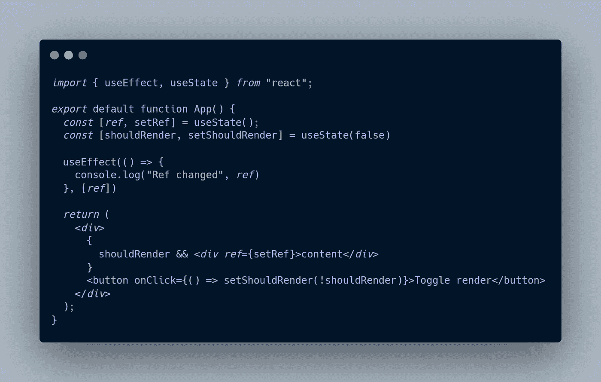

# 回调引用模式解释

> 原文：<https://javascript.plainenglish.io/the-callback-ref-pattern-explained-6357b20891d5?source=collection_archive---------12----------------------->

## 如何基于 React 中组件的可见性触发状态更改

I looked for “pattern” (Photo by [Iva Muškić](https://www.pexels.com/@ivaoo?utm_content=attributionCopyText&utm_medium=referral&utm_source=pexels) from [Pexels](https://www.pexels.com/photo/gray-and-black-hive-printed-textile-691710/?utm_content=attributionCopyText&utm_medium=referral&utm_source=pexels))

React 充满了惊喜。甚至在每天使用 3 年后，我仍然能学到新的东西。

今天是所谓的**回调参考模式**。

# 这是什么

你知道 React 元素**上的`ref`道具不需要**接受来自`useRef`的值吗？

他们也可以使用来自`useState`的`setState`功能！

所以你很容易在 React 状态下存储一个 DOM 元素，在改变的时候触发一些逻辑！

# 对 useRef 的好处和好处

> 不要误会，`useRef` **不会消失**。他们实际上可以生活在一起。

使用`useState`而不是`useRef`的主要优势在于**组件的生命周期**。
如果您想在渲染目标时触发一个`useEffect`(例如)来添加一些基于元素可见性的逻辑，那么这个模式非常适合您！

另一方面，如果您不指望元素的可见性来触发逻辑，那么您最好坚持使用`useRef`，因为它不会触发组件内的任何刷新。

# 如何使用它

Quick example

上面的代码非常简单。我们有一个有条件呈现的元素(只是一个包含呈现内容的 div)和一个显示/隐藏该元素的按钮。

我们使用一个`useState`来存储状态中这个条件元素的 ref。
最后，我们在自己的`useEffect`内观察这个状态

现在，每当我点击按钮时，`console.log`就会触发，根据元素是否显示，要么显示元素，要么为空。

> 如果使用`useRef`，元素的打印与打印`myRef.current`相同

*更多内容请看*[***plain English . io***](http://plainenglish.io/)*。报名参加我们的* [***免费周报***](http://newsletter.plainenglish.io/) *。在我们的* [***社区***](https://discord.gg/GtDtUAvyhW) *获得独家获得写作机会和建议。*