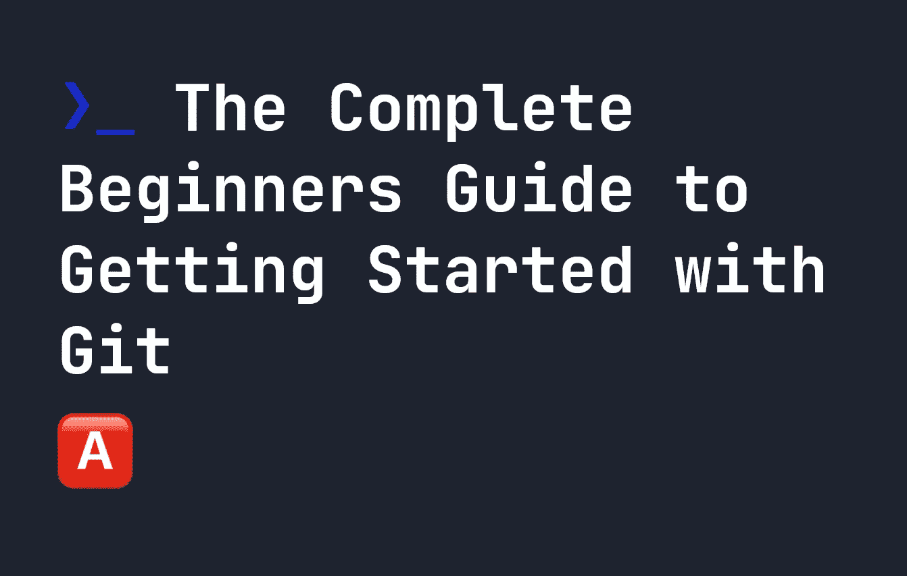
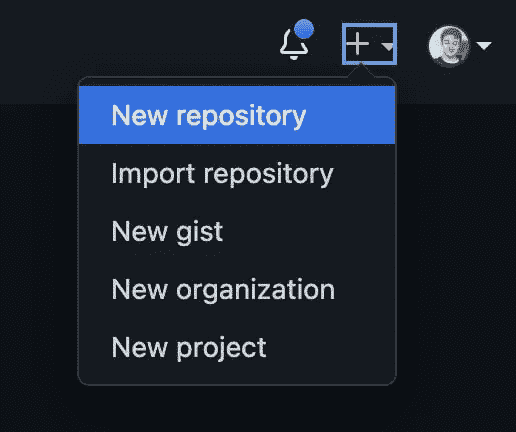
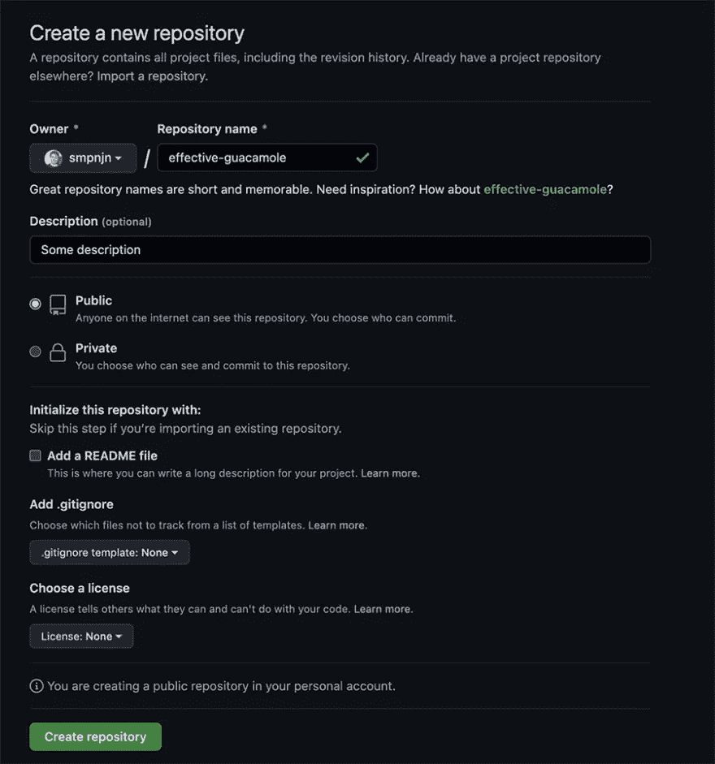

# Git 完全入门指南

> 原文：<https://javascript.plainenglish.io/the-complete-beginners-guide-to-getting-started-with-git-592edbd4b0a6?source=collection_archive---------12----------------------->



Git 很难理解，因为它完全由终端驱动，但其核心只是版本管理软件。它让我们维护代码的版本，其他人也可以为之做出贡献。在本指南中，我们将探讨如何快速掌握 git 的基础知识，以便开始您的软件项目。我们将讨论以下内容:

*   制作一个 git 项目，以及`git init`是如何工作的，
*   围绕`git init`的细节，比如`git init --bare`是做什么的。
*   git 的基础，比如创建一个分支，提交更改
*   将您的更改推送到 GitHub。
*   `git init`和`git clone`的区别。

# 用 Git 制作项目

在开始使用 git 之前，确保已经安装了它。[你可以在这里了解所有关于安装 git 的信息](https://git-scm.com/book/en/v2/Getting-Started-Installing-Git)。安装完成后，打开一个新的终端窗口，使用 cd 命令[导航到您想要用作 git 项目的文件夹。之后，只需运行以下命令开始您的 git 之旅:](https://fjolt.com/article/linux-cd-command)

```
git init
```

如果您想在一个特定的文件夹中创建 git 项目，您也可以使用一个目录位置来运行它。例如，下面将创建一个名为`myProject`的文件夹，并将其转换成一个 git 存储库:

```
git init myProject
```

现在您有了一个 git 项目，您可以开始在其中创建文件。您可能会注意到 git 存储库中有一个名为`.git`的文件夹。这是存储变更历史、分支和其他项目细节的地方。

# git init-bare 做什么？

如果你以前使用过`git`，你可能也见过下面的命令:

```
git init --bare
```

本质上，如果您使用`git init`，您的目录将存储关于本地更改的信息，并且您可以在那里进行开发。如果你使用`git init --bare`，你就不能真正在你的目录下开发。相反，它被用作一个存储位置，其他人可以将他们的更改放入其中。所以你只需要在你在某个地方创建一个库的时候使用`git init --bare`,这个库的唯一目的是允许其他人将代码修改推送到那里。例如，`github`就是`git init --bare`有用的地方的一个例子。

对于大多数项目，您将从`git init`开始。

# 使用 git init 更改分支名称

当您使用`git init`时，它会创建一个名为`master`的分支。分支是代码的副本，它允许我们独立于主代码库工作，并在我们需要时恢复到主代码库。所有 git 存储库都有一个主分支，通常称为 master。如果你想叫它别的什么，你可以使用`-b`选项。例如，下面的代码创建了一个新的 git 存储库，其中的主分支叫做`myBranch`:

```
git init -b myBranch
```

# 在 git 上提交您的更改

现在你已经建立并运行了你的`git`目录，你可以开始做一些改变了。git 将跟踪您所做的任何更改——比如创建文件、修改文件、重命名文件或任何其他类型的更改。当您进行了一定数量的更改后，我们可以提交我们的更改来创建一个到目前为止我们所做工作的**快照**。这将由`git`存储为`git`将记住的项目版本。

假设您已经在 git 存储库中创建了一个名为`file.md`的文件。首先，我们需要将它添加到我们的提交中。为了将我们到目前为止所做的一切添加到我们的提交中，我们使用`-A`选项编写`git add`，这将所有更改的文件添加到我们的**暂存区**，准备提交:

```
git add -A
```

如果您不想提交所有文件，也可以将单个文件添加到暂存中。要做到这一点，只需运行文件名的`git add`。例如，这里我将只展示`file.md`:

```
git add file.md
```

现在我们可以使用`git commit`提交我们的更改。当我们提交时，我们必须留言告诉人们这次提交的内容，如果他们将来想知道的话。最简单的方法是使用`-m`选项，它允许您向提交添加一条消息:

```
git commit -m "My first commit!"
```

**提交在 git** 中很有用，因为它们提供了你所做的所有更改的历史。然后，您可以在某个提交时恢复项目。你可以在我的文章中了解更多关于[恢复提交的信息。](https://fjolt.com/article/git-how-to-undo-a-git-pull)

# 在 git 中查看分支

现在您已经提交了您的第一个变更，您将能够看到您的分支。您可以通过键入以下命令来查看您的所有分支:

```
git branch --list
```

如果你想创建一个新的分支，你也可以使用`git branch`创建一个新的分支。例如，下面将创建一个名为`newBranch`的分支

```
git branch newBranch
```

要切换到新的分支，请使用`git switch`:

```
git switch newBranch
```

当您创建一个新的分支时，它会复制该分支中的代码。当您切换到它时，您可以编辑它、更新它并提交它——它将只更新那个分支。当您切换回原来的分支时，代码将保持与切换前相同。分支允许您单独编辑代码，然后在需要时恢复原始状态。他们也让你做一些事情，而其他人在做一些完全不同的事情。

# 将 git 更改推送到 Github

通常，我们使用 git 是因为我们希望与他人共享项目，并跟踪我们的变更历史。最流行的代码共享方式是 GitHub。GitHub 只是一个网站，你可以在那里提交和推送你的项目，这样其他人就可以克隆或贡献它们。我在前面谈到创建`git init --bare`的时候，GitHub 就是一个完美的例子——它是一个我们推送代码的地方，但是我们并不直接对存储在 GitHub 中的代码副本进行操作。

相反，我们在本地拷贝上工作，然后上传到 GitHub。要开始使用 GitHub，您需要创建一个帐户，然后点击`+`创建一个新的存储库:



填写您的存储库信息——您可以随意命名。

这是我做的一个:



既然我们的存储库已经创建，请确保您已经提交了所有代码，就像我们之前在您的本地计算机上所做的那样。您可以使用以下命令再次执行此操作:

```
git add -A
git commit -m "My first commit!
```

在 git 中，有一个`remote`库的概念。这基本上是我们希望能够在需要的时候进行`push`编码的地方。当您创建第一个存储库时，`git`会提供一些说明，但是对于我的例子，我在我的 git 项目中运行了下面的代码来将远程 URL 添加到我的本地 git 配置中。您的 URL 会有所不同，但会采用`[https://github.com/USERNAME/GIT_PROJECT.git](https://github.com/USERNAME/GIT_PROJECT.git)`的格式

```
git remote add origin [https://github.com/smpnjn/effective-guacamole.git](https://github.com/smpnjn/effective-guacamole.git)
```

上面，我们将我们的远程分支标记为`origin`，但是理论上你可以改变它。Git 使用分支`main`而不是主分支——所以建议您运行下面的命令来**重命名**您当前的分支为`main`:

```
git branch -M main
```

我们就快到了！现在我们终于可以对 GitHub 进行修改了。为此，您必须运行以下命令。

```
git push -u origin main
```

我们使用`-u`选项(这意味着设置上游)，因为它将把我们标记为`origin`的远程存储库链接到我们的`main`分支。这意味着无论何时我们在本地的`main`分支上，默认情况下任何`git push`都会直接推送到我们的 GitHub 库`origin`。当我们想要将更改推送到我们的 GitHub 存储库时，这可以节省我们一点精力。

现在你刷新的时候你的项目就会出现在 GitHub 上了！很酷，对吧？

# 推动 GitHub 的未来变化

现在您已经有了 GitHub 项目，您可能会继续在本地对您的项目进行一些更改。每当您准备好再次将您的更改推送到 GitHub 时，请遵循相同的过程。首先，将所有文件添加到登台，并提交它们:

```
git add -A
git commit -m "My newest commit"
```

然后运行`git push`:

```
git push
```

当您在本地提交一个变更时，它将只存储在本地，直到您执行`git push`，这给了您一些版本管理的灵活性。

# 结论

我希望您喜欢这篇 Git 入门指南。一开始 Git 可能有点令人畏惧，但是现在它在编程中无处不在，所以了解它是至关重要的。这也是一个很棒的软件管理工具，你会喜欢上它的，尤其是当你不小心删除了一个重要文件的时候😉。

*更多内容看* [***说白了。报名参加我们的***](https://plainenglish.io/) **[***免费周报***](http://newsletter.plainenglish.io/) *。关注我们上* [***推特***](https://twitter.com/inPlainEngHQ) ，[***LinkedIn***](https://www.linkedin.com/company/inplainenglish/)***，***[***YouTube***](https://www.youtube.com/channel/UCtipWUghju290NWcn8jhyAw)***，以及****[***不和***](https://discord.gg/GtDtUAvyhW)***