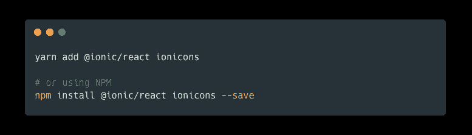

# 在你的 React 项目中使用 Ionicons 的正确方法

> 原文：<https://javascript.plainenglish.io/the-correct-way-to-use-ionicons-in-your-reactjs-project-3b65c97d5b1?source=collection_archive---------2----------------------->

## HTML 中的 Ionicons 很简单，但在 reaction 中却是一场斗争。尽管缺少文档，我还是想通了！

所以你已经在你最喜欢的项目中使用了爱奥尼亚克。你通常使用 HTML 标记`<ion-icon name="..." />`，但现在你使用了 reaction，这个解决方案不再有效。

You cannot use **ion-icon** in ReactJS

在“反应”中，所有组件名称都必须以大写字母开头，不能包含连字符，并且必须在“反应”中定义。在 HTML 中，`ion-icon`元素是一个伪元素，实际上被替换为图标。

大量的`npm`软件包允许你在你的项目中使用爱奥尼亚 cons。它们通常会遗漏图示和型式(填满或轮廓化)、不允许自订、不会更新，或每个图示都有不同的元件。它们是盗版的。

Ionic Framework 文档指的是 Ionicons 文档。关于在 reaction 中使用它，爱奥尼亚 cons 文档缺少任何信息，但我经过足够的研究找到了它！

# 安装依赖项

要使用爱奥尼亚康组件，您首先需要正确的依赖关系。

*   `**@ionic/react**` —包括 IonicFramework 中包含的每个 React 组件(但不要担心:`webpack`将忽略任何未使用的组件)
*   `**ionicons**` —包括每个图标的图标名称

可以使用`yarn`或`npm`安装依赖项(尽管`yarn`更好):

Install the dependencies for Ionicons

# 使用 Icon 元件

从这里开始，这很容易。而不是使用`ion-icon`，组件名称是`IonIcon`。他们必须对其进行修改，以符合 JavaScript 和 React 组件命名规则。

您将希望使用以下导入和组件:

Basic IonIcon usage

先别太激动。不能将图标名称直接插入`icon`属性。你需要使用一个预定义的变量来访问每个图标，否则它将不起作用。

你可以在他们的网站上找到完整的爱奥尼亚人名单。然后需要导入图标:

Importing the bowling ball icon from ionicons

对于任何图标名称，您将希望使用 camel-case。因此如果图标名称为`bowling-ball-outline`，则导入并使用`bowlingBallOutline`。

就是这么简单。您还可以访问每个离子框架组件，除了离子图标。

你可以做一些有趣的事情，比如使用 CSS 来设计图标或者内嵌样式，就像你在 HTML 中做的一样。您还可以使用`font-size` CSS 属性来配置它的大小。我不想因为描述你可以用 Ionicons 做的所有事情而分心。

我希望这个指南对你有所帮助，尽管 Ionic 网站缺乏在 React 中使用图标的良好文档。

编码快乐！👍

*更多内容尽在* [***说白了. io***](https://plainenglish.io/) *。报名参加我们的* [***免费周报***](http://newsletter.plainenglish.io/) *。关注我们关于* [***推特***](https://twitter.com/inPlainEngHQ) *和*[***LinkedIn***](https://www.linkedin.com/company/inplainenglish/)*。查看我们的* [***社区不和谐***](https://discord.gg/GtDtUAvyhW) *加入我们的* [***人才集体***](https://inplainenglish.pallet.com/talent/welcome) *。*