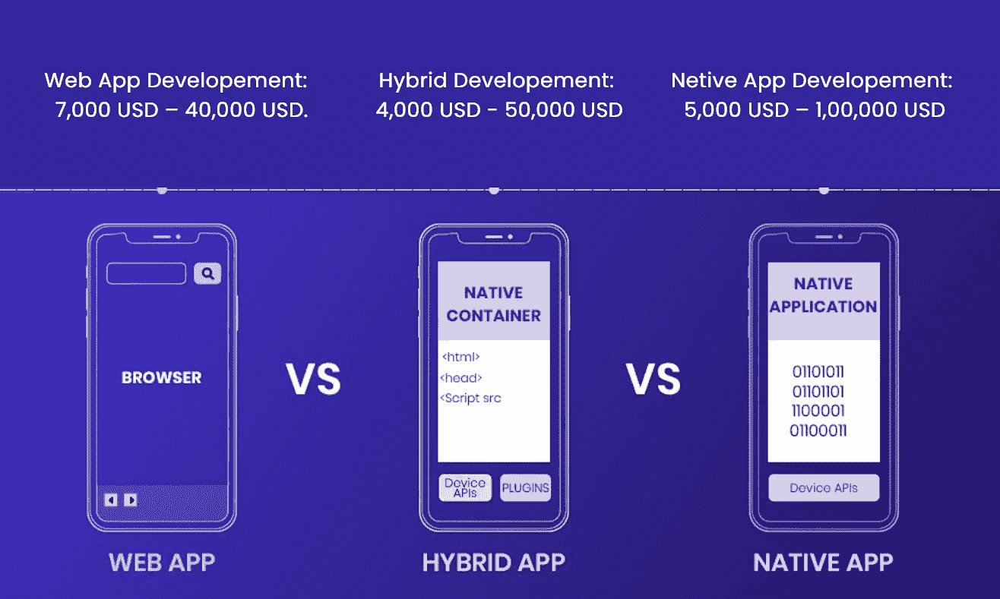

# 2022 年创建和维护商业应用的成本

> 原文：<https://javascript.plainenglish.io/the-cost-of-creating-maintaining-a-business-app-in-2022-321e6d429599?source=collection_archive---------15----------------------->

## 了解为初创公司创建一个应用程序需要多少成本。

Image Source — Technource

商业应用程序开发成本取决于从应用程序的概念化到发布所遇到的各种因素。iOS 和 Android 应用程序商店中有数百万个应用程序，这证明今天存在一个适用于所有业务类型的应用程序。

无论你是想为你的汽车购买保险，还是需要在你的住处预约理发，随需应变的应用程序开发解决方案都能满足你的需求。这么多应用程序的出现清楚地表明了市场中存在的竞争。因此，明智地投资于应用程序开发过程变得势在必行。

除了开发费用之外，还有一个*应用维护成本*需要考虑。这篇博客让你对应用程序的开发和维护成本有了基本的了解。所以，让我们开始吧。

# 2022 年 App 开发成本

根据你的应用的特性、类型和复杂程度，创建一个应用的总成本可能在 **10，000 美元到 1，000，000 美元**或更多之间。从一个商业想法开始， [***移动应用开发成本***](https://www.technource.com/blog/mobile-app-development-cost-complete-guide/) 没有一个数字可以引用。

有无数的因素可以影响应用程序的开发，因此很难从一开始就确定价格。为了进一步简化这一过程，我们将应用程序开发分为 3 种不同的类型，即简单、中等和高级。

## 简单的应用

**开发成本:**5000 美元—25000 美元

**描述:**登录/注册、通知、数据库连接、支付集成、有限屏幕、标准 UI 元素、最佳后端支持等等。

## 中等应用

**开发费用:** 2 万美元— 6 万美元

**描述:**完整的后端支持、自定义 UI/UX 设计、多种支付选项、6–15 个应用程序屏幕、API 集成等等

## 高级应用程序

**开发费用:** 5 万美元—10 万美元

**描述:**实时同步、带音频和视频流的通信面板、高级动画&图形、高安全性、多语言、第三方集成等等。

以上是暂定成本，可以作为一个人开始规划预算的平均基准。一个具有核心功能的简单应用程序可以在正常预算内创建，而一个具有高级功能的复杂应用程序可能会非常昂贵。但是一个高级应用需要顶级移动应用开发公司的帮助。

你的应用程序的成本也取决于你选择的应用程序类型。

# 不同类型的应用程序及其开发成本

根据您的项目和合约的范围，您应该决定最适合他们的应用程序类型。如果你选择了正确的应用程序类型，这将对你的整体预算产生重大影响。这里有不同类型的应用程序可供选择。

# Web 应用程序

web 应用程序是网站的移动友好版本。一个 web 应用程序的设计是智能的，它提供了从手机到平板电脑的各种屏幕尺寸的无缝界面。据观察，大约 85%的智能手机用户更喜欢使用网络应用程序而不是移动网站。它们以较低的价格范围提供更高的性能。开发相同产品的**价格从 7000 美元到 40000 美元**不等。

# 原生应用

智能开发的原生应用可提供最佳性能和用户体验。由于它们是使用 Windows、iOS 和 Android 等平台的原始本地语言构建的，因此可以自然地与这些设备集成。最好的移动应用程序开发框架是 Objective C 或 Swift for iOS 和 Kotlin 或 Java for Android。

虽然原生应用程序可能会被证明是昂贵且复杂的，但它们是一项很好的投资，因为它们提供了最佳的性能。这是因为它们针对特定平台进行了优化。创建本地应用程序的**成本从 5000 美元到 100000 美元不等**。

# 混合/跨平台应用

顾名思义，这些类型的应用是网络和本地技术的融合。如果你没有足够的时间或预算，想用一个代码库为网络和移动平台创建应用程序，那么这是最适合你的。它们的维护成本也很低，与原生应用程序体验相比，不能提供最好的功能。这背后的原因可能是与原生应用相比，它对设备硬件的访问有限。然而，它们在 Windows、iOS 和 Android 设备上提供了不错的体验。

# 为什么 App 维护这么重要？

如果你不想你的应用变得过时，你应该从一开始就投资应用维护。令你惊讶的是，由于类似的问题，苹果从 app store 中删除了 5 万个应用。

用户的习惯和偏好确实会随着时间而改变。除此之外，由于前所未有的网络和数据盗窃威胁，总有一些安全更新需要反复灌输。有了及时的维护，您的应用不必担心随着时间的推移而被烧毁和崩溃。应用程序维护**可能会花费你 1000 美元到 5000 美元**不等，取决于你引入的升级。

# 编后记

这是这本书的摘要。为了全面了解内部开发流程，你应该尝试一下 [***按需应用开发***](https://www.technource.com/on-demand-app-development/) 指南。你的应用程序开发体验如何？在评论区和我们分享你的想法。感谢您的阅读。

*更多内容看* [***说白了就是 io***](https://plainenglish.io/) *。报名参加我们的* [***免费周报***](http://newsletter.plainenglish.io/) *。关注我们关于*[***Twitter***](https://twitter.com/inPlainEngHQ)*和*[***LinkedIn***](https://www.linkedin.com/company/inplainenglish/)*。加入我们的* [***社区***](https://discord.gg/GtDtUAvyhW) *。*