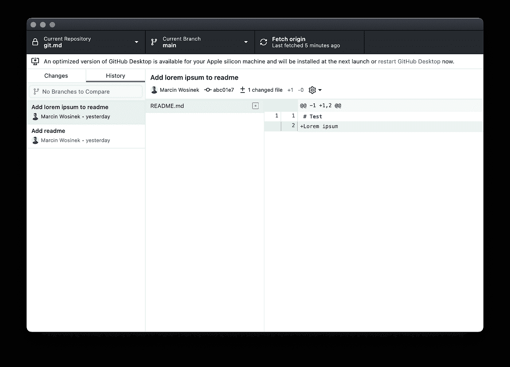

# Git 中的“分离头”状态:它是什么以及如何修复它

> 原文：<https://javascript.plainenglish.io/the-detached-head-state-in-git-what-it-is-and-how-to-fix-it-6329bd1dbb7e?source=collection_archive---------8----------------------->


Illustration by the author

使用 Git 时，一个常见的困惑是当您看到如下输出时，不知道它的全部含义:

```
You are in 'detached HEAD' state. You can look around, make experimental changes and commit them, and you can discard any commits you make in thisstate without impacting any branches by switching back to a branch.
```

# 这一切意味着什么？

为了真正理解发生了什么，我们需要看看 Git 的内部。

Git 提交是不可变的——这意味着您可以创建新的提交，但是已经提交的内容永远不会改变。这就是我们的存储库为我们保护数据安全的方式。对存储库进行更改的唯一方法是创建新的提交。

Git 提交为我们提供了一个稳定、完整的存储库变更历史。在这个稳定的基础之上，我们有一个动态的部分:分支。首先令人惊讶的是，分支只是标签。它们指向一个提交。除了名字和它的位置，它们没有其他数据。

除此之外的任何事情，例如，

*   主或主的特殊含义，
*   像`feature/<info>`或`<branch-owner>/<description>`这样的模式只是团队使用的惯例。从 Git 的角度来看，你的`main`或者`master`分支和`lorem-ipsum`没什么区别。

# 当前提交

HEAD 是一个指向当前提交的指针——您现在在存储库中的位置。它被用作:

*   当您想通过`git diff`查看工作副本的最后更改时的参考点
*   创建新提交时将用作父提交的提交

你的头脑是你的仓库状态的核心部分。

# 正规状态

Git 的典型工作流程如下:

*   你在某个树枝上，
*   您创建新的提交，然后
*   Git 将您的分支移动到这个新的提交。

如果你只限于检查分支，你将永远不会离开这种状态。当你运行`git status`时，它会告诉你你在哪个分支上:

```
$ git status
On branch main
Your branch is up to date with 'origin/main'.

nothing to commit, working tree clean
```

# 分离头

到目前为止，HEAD(当前提交)和 branch 处于正常的对齐状态。当您签出不是分支的东西时，事情就变得复杂了——例如，当您根据 ID 切换到 commit:

```
$ git checkout abc01e7
```

其中`abc01e7`是存储库中任何提交的 ID——它可以在任何分支内部，在其中一个分支之上，或者在存储库历史的另一个地方。

因为您不再在分支上，所以`git status`变为:

```
$ git status
HEAD detached at abc01e7
nothing to commit, working tree clean
```

为了引起您对这种情况的注意，将颜色`HEAD detached`设置为红色。

# 为什么要切换到 commit 而不是 branch？

因为你可以，而且它有时会很有用。一个常见的场景是查看应用程序在几次提交之前是如何工作的——例如，用于故障排除。我们注意到了一些错误，比如一个特性没有像预期的那样工作，我们检查了最后一次提交，我们期望它工作正常。通过这种方式，我们可以准确地确定问题是何时出现的。

# 它对工作有什么影响？

因为您不在分支上，所以当您创建新的提交时，Git 没有分支可以更新。因此，您在那里创建的所有提交都被**存储在**中，但却悬而未决:没有办法轻松地到达它们，因此，它们被认为是不重要的。在某个时候，垃圾收集器会将它们从存储库中永久删除。

# 怎么发生的？

你离开了树枝，把头移到了别处。有可能发生:

*   通过检验非分支引用:
*   `git checkout <commit ID>`——同上
*   `git checkout HEAD^`-最后一次提交
*   `git checkout <tag>`-标签类似于分支，但是它们是不可变的，不能作为分支更新
*   当您的`git rebase`中途停止时——由于冲突或者为了让您对提交进行更改，
*   期间`git bisect`

# 怎么修

幸运的是，当您检查非分支引用时，您可以直接在 CLI 中获得一些指令:

```
$ git checkout abc01e7
Note: switching to 'abc01e7'.

You are in 'detached HEAD' state. You can look around, make 
experimental changes and commit them, and you can discard any 
commits you make in this state without impacting any branches 
by switching back to a branch.

If you want to create a new branch to retain commits you 
create, you may do so (now or later) by using -c with the 
switch command. Example:

  git switch -c <new-branch-name>

Or undo this operation with:

  git switch -

Turn off this advice by setting config variable 
advice.detachedHead to false
```

# 创建新分支

您可以创建一个新的分支，就在您所在的地方——包括您可能从那里创建的所有提交。您可以使用以下语法创建分支:

```
git switch -c <new-branch-name>
```

或者命令格式 Git 2.23 之前的版本:

```
git checkout -b <new-branch-name>
```

这些命令**创建**一个新的分支，并将其设置为当前分支。

或者，您可以在当前提交上创建一个新的分支，并保持在分离的头状态:

# 切换到一个分支并合并您的提交

或者，您可以选择一个现有的分支，或者合并您的悬空提交，或者精选它们。如果你不确定这些术语的意思，那么坚持创建一个新的分支，因为它将允许你做同样的事情，但是在一个不那么混乱的设置中。

# 它在工具中看起来怎么样

除了`git status`，你怎么能看到这种状态？

# 您可以在 Git 树形图中看到它

如果你使用`git log --oneline --graph --decorate --all`(我推荐用[定义为`git tree`别名的东西)它会以不同的方式显示你的头部。当它在分支上时，输出看起来像这样:](https://how-to.dev/how-to-display-git-branches-as-a-tree-in-cli)

```
$ git tree
* abc01e7 (HEAD -> main, origin/main) Add lorem ipsum to readme
* edd3504 Add readme
```

`HEAD`用箭头指向你所在的树枝。当处于“分离头”状态时，`main`和`HEAD`分别显示，作为不相关的参考:

```
$ git tree
* abc01e7 (HEAD, origin/main, main) Add lorem ipsum to readme
* edd3504 Add readme
```

当你知道你为什么要关注它时，这种差异是微妙而明显的。

# GitHub 桌面

在`main`分支机构:



“分离头”状态:


你能看出页眉中间部分的区别吗？一个是显示“当前分支”；而另一个“分离的头”。

# 源树

在`main`分公司:


“分离头”状态:


它显示为当前的分支负责人。

# 想了解更多？

当你开始使用 Git 时，它有许多令人困惑的地方，但是一旦你更好地理解了它存储数据的方式，它就会变得简单得多。如果你有兴趣了解更多关于 Git 的知识，请在这里注册[来获取我的 Git 相关内容的更新。](https://how-to-dev.ck.page/e45bdb4d9b)

*最初发布于*[*https://how-to . dev*](https://how-to.dev/the-detached-head-state-in-git-what-it-is-and-how-to-fix-it)*。*

*更多内容看* [***说白了就是***](https://plainenglish.io/) *。报名参加我们的* [***免费每周简讯***](http://newsletter.plainenglish.io/) *。关注我们* [***推特***](https://twitter.com/inPlainEngHQ) ， [***领英***](https://www.linkedin.com/company/inplainenglish/) *，*[***YouTube***](https://www.youtube.com/channel/UCtipWUghju290NWcn8jhyAw)*，* [***不和***](https://discord.gg/GtDtUAvyhW) *。对增长黑客感兴趣？检查出* [***电路***](https://circuit.ooo/) *。*