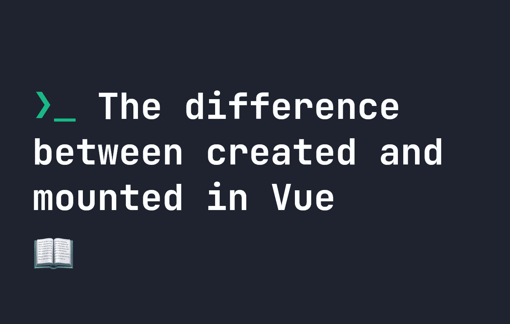

# Vue.js 中 created()和 mounted()的区别

> 原文：<https://javascript.plainenglish.io/the-difference-between-created-and-mounted-in-vue-js-d923b0c75dca?source=collection_archive---------1----------------------->

## 探究 Vue.js 中 created()和 mounted()的细微区别。



在上一篇文章中，我介绍了 Vue 中所有不同的生命周期挂钩。当谈到生命周期挂钩时，大多数人感到困惑的事情之一是`created()`和`mounted()`之间的区别。两人名字都差不多，感觉应该做一样的事，但也有一些细微的区别。

# Vue.js 中 created()和 mounted()的区别

首先，`created()`和`mounted()`都可以访问你原型上的数据和道具。例如，两个钩子都将控制台记录下面的“我的消息”，以及`myProp`的默认值，即“某个道具”:

```
export default {
    data() {
        return {
            msg: 'My Message'
        }
    },
    props: {
        myProp: {
            type: String,
            default: 'My Prop'
        }
    },
    created() {
        console.log(this.msg);
        console.log(this.myProp);
    },
    mounted() {
        console.log(this.msg);        
        console.log(this.myProp);
    }
}
```

# 创建和安装的正确继承]

注意:即使您设置了属性，它在`created()`和`mounted()`中仍然可用

**`created()`和`mounted()`之间的根本区别**是你还不能访问`created()`中的 DOM。在我们的例子中，如果我们试图引用`this.$el`，它将在`created()`中返回`null`，并在`mounted()`中返回 DOM 元素:

```
export default {
    created() {
        // Returns null
        console.log(this.$el);
    },
    mounted() {
        // Returns the DOM element in console:
        console.log(this.$el);     
    }
}
```

因此，任何 DOM 操作，甚至使用像`querySelector`这样的方法获取 DOM 结构，在`created()`中都是不可用的。正如关于[生命周期挂钩](https://fjolt.com/article/vue-lifecycle-hooks)的文章中提到的，`created()`非常适合调用 API，而`mounted()`非常适合在 DOM 元素完全加载后做任何事情。

# 合成 API 并创建或挂载

需要注意的是，如果您使用的是组合 API，`created()`和`beforeCreated()`将不再存在。你不得不用`setup()`来代替。该功能代替了`created()`和`beforeCreated()`。因此，DOM 在`setup()`中仍然不可用。在组合 API 中，`mounted()`保持不变。

*更多内容看* [***说白了。报名参加我们的***](https://plainenglish.io/) **[***免费周报***](http://newsletter.plainenglish.io/) *。关注我们关于*[***Twitter***](https://twitter.com/inPlainEngHQ)*和*[***LinkedIn***](https://www.linkedin.com/company/inplainenglish/)*。加入我们的* [***社区***](https://discord.gg/GtDtUAvyhW) *。***