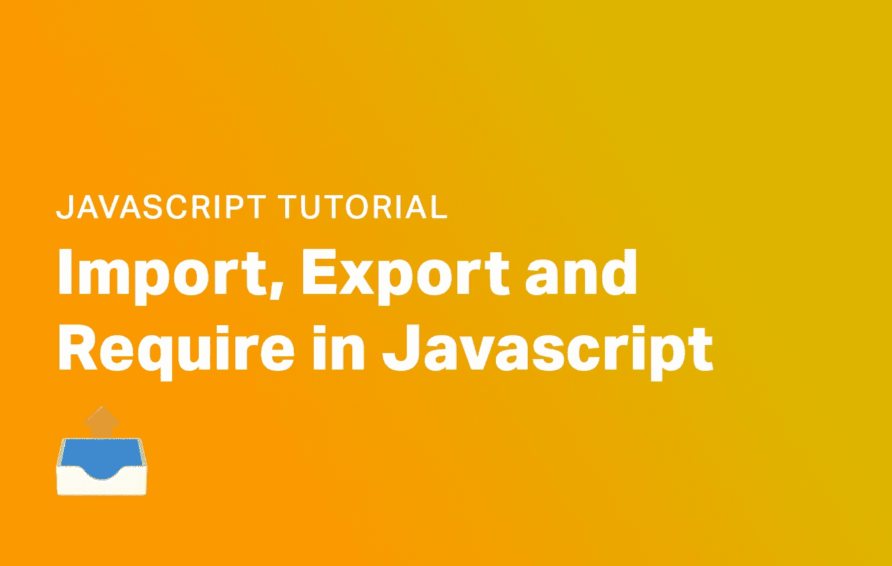

# JavaScript 中导入、导出和要求的区别

> 原文：<https://javascript.plainenglish.io/the-difference-between-import-export-and-require-in-javascript-e2680f553f5e?source=collection_archive---------6----------------------->



您可能在 JavaScript 中看到过下面一行:

```
const fs = *require*('fs');
```

你可能已经看过这个了。

```
import fs from 'fs'
```

更糟糕的是，你可能已经看到了这个:

```
import { promises as fs } from 'fs'
```

所有这些意味着什么？！还有为什么 JavaScript 里看似导入包的方法那么多？为什么我不能在 Node.js 服务器上使用 import？让我们探索一下这一切意味着什么。

# JavaScript 中的导入、导出和要求

开箱即用，当您在 Node.js 中用 JavaScript 编写时，`require()`非常好用。那是因为`require`是专门为 Node.js 打造的。如果一个文件导出一些东西，那么 require 将会导入这个导出。假设我们有一个名为“general”的包，其中有一个`index.js`文件，如下所示:

```
export.*consoller* = function(msg) {
    *console*.*log*(msg);
}
export.*adder* = function(x, y) {
    return x + y;
}
export.name = 'Some Name';
```

使用`export.[function]`的这种格式是 NPM 特有的。它是为了与 NPM 一起工作而构建的，也是 Node.js 的定制部分，不符合任何特定的标准。为了导入这些函数，我们可以很容易地使用 require:

```
const general = *require*('./general.js');
```

我们现在可以访问任何出口。在上面使用`export.name`的例子中，我们现在可以通过代码中的`general.name`来访问它。这是用 Node.js 添加包的最直接的方法之一。

需要记住的重要一点是，require 和 import 是两个完全独立的功能。不要被我们用 require 导出代码的方式弄糊涂了！

# 用 JavaScript 导入

import 和 require 的区别在于 require 是针对 Node.js 的，import 是一个 JavaScript/ECMAScript 标准。Import 使用稍微不同的符号，但是允许我们做与 require 大致相同的事情。

导入标准给了我们更多的灵活性，并且我们可以导入特定的功能。当与 Webpack 这样的捆绑器结合使用时，这被称为树抖动，允许我们只加载我们想要的 JavaScript，而不是整个文件。首先，让我们看一个如何导出和导入函数的简单例子。

首先，假设我们有一个名为 general.js 的文件，这是我们的导出文件。让我们使用`export`关键字导出一些函数。

```
const *consoller* = function(msg) {
    *console*.*log*(msg);
}
const *adder* = function(x, y) {
    return x + y;
}
const name = 'Some Name';export { consoller, adder, name }
```

现在当我们导入时，我们只能导入这个模块的一部分。例如:

```
import { consoller } from './general.js'
```

现在我们只需要引用`consoller`，就可以引用为`consoller()`。如果我们不希望这样，我们可以将 consoller 作为其他内容导入，例如:

```
import { consoller as myFunction } from './general.js'
*myFunction*() // Runs 'consoller'
```

# 在 JavaScript 中导入默认值

如果在我们的导出文件中，我们命名了一个默认的导出，那么这个导出将会包含我们想要的任何内容。例如，假设我们做了以下事情:

```
let functionList = {}functionList.*consoller* = function(msg) {
    *console*.*log*(msg);
}
functionList.*adder* = function(x, y) {
    return x + y;
}
functionList.name = 'Some Name';

export default functionList;
```

现在，当我们导入时，我们可以导入 functionList，并按照以下格式将其命名为我们喜欢的任何名称:

```
javascript Copyimport myStuff from './general.js';
myStuff.*consoller*() // Our consoller function
```

# JavaScript 中的 Import *

我们可以做的另一件事是导入所有内容，并给它命名为其他内容。例如，我们可以这样做:

```
import * as functionSet from './general.js';
functionSet.*consoller*(); // Runs our consoller function
```

# 为什么在 Node.js 中导入对我不起作用？

默认情况下没有启用导入，所以我们必须让 Node.js 知道我们正在使用它。确保至少安装了 Node.js 版本 12。然后，我们需要更新我们的 package.json。如果你没有，在命令行上运行你所在的文件夹中的`npm init`。

将 package.json 更改为具有行`"module":"true"`，如下所示:

```
// .....
"name": "Fjolt",
"type": "module", /* This is the line you need to add */
"repository": {
    "type": "git",
    "url": "..."
},
"author": "",
"license": "ISC",
// .....
```

现在，默认情况下，模块将在 Node.js 目录中工作。不过有一个问题——那就是现在`require()`不能工作了——所以在做这个改变之前，确保你已经完全转换到了`import`。

# 结论

所以，require 是一个定制的解决方案，而 import/export 是一个 JavaScript 标准。最初编写 Require 是因为 import 不存在，Node.js 需要一种方法来轻松插入包。后来，负责 JavaScript 开发的小组提出了引进的建议。换句话说，Node.js 想快速做一些事情，所以他们发明了自己的方法。

现在我们有了 import(比要求更好、更充实)，如果可以的话，我会推荐使用它。因为它是一个标准，这意味着您可以在前端和后端开发中使用它，并且它将为您导入和导出您的包提供更多的选择。如果你在前端做任何事情，它也会限制文件大小，只导入你需要的东西！

*更多内容看* [***说白了就是***](https://plainenglish.io/) *。报名参加我们的* [***免费周报***](http://newsletter.plainenglish.io/) *。关注我们关于*[***Twitter***](https://twitter.com/inPlainEngHQ)*和*[***LinkedIn***](https://www.linkedin.com/company/inplainenglish/)*。加入我们的* [***社区***](https://discord.gg/GtDtUAvyhW) *。*