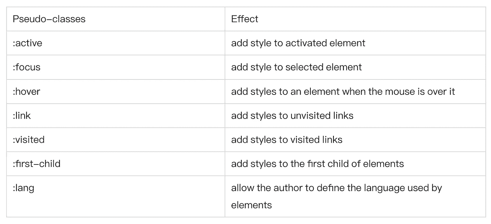
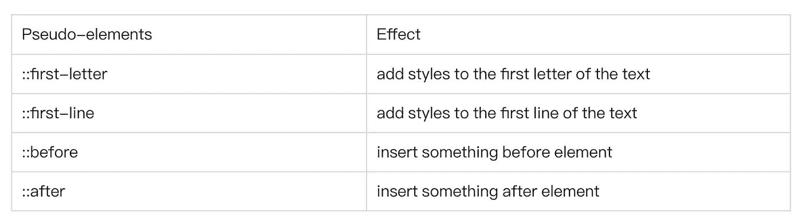
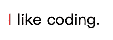

# CSS 属性的伪类和伪元素的区别

> 原文：<https://javascript.plainenglish.io/the-difference-between-pseudo-classes-and-pseudo-elements-of-css-properties-e408fcbd68a0?source=collection_archive---------10----------------------->


Photo by [Larm Rmah](https://unsplash.com/@larm?utm_source=unsplash&utm_medium=referral&utm_content=creditCopyText) on [Unsplash](https://unsplash.com/s/photos/girl?utm_source=unsplash&utm_medium=referral&utm_content=creditCopyText)

首先，我们来看看 W3C 对[伪类](https://www.w3schools.com/css/css_pseudo_classes.asp)和[伪元素](https://www.w3schools.com/css/css_pseudo_elements.asp)的定义:

*   CSS 伪类用于给一些选择器添加特殊效果。
*   CSS 伪元素用于为特定的选择器添加特殊效果。

有两点可以明确，前两点和选择器有关，第二点是增加一些“特效”。在这里，“特效”是指两者都描述了其他 CSS 所不能描述的东西。

# 一种伪类



# 一种伪元素



# 伪类和伪元素的区别

我们使用伪类:`first-child`和伪元素`::first-letter`进行比较。

## 第一胎

```
p i:first-child {color: red}
<p>
    <i>first</i>
    <i>second</i>
</p>
```


不使用`Pseudo-classes`，我们可以这样做来达到上面的效果:

```
.first-child {color: red}
<p>
    <i class="first-child">first</i>
    <i>second</i>
</p>
```

也就是我们给第一个子元素添加一个类，然后定义这个类的样式。

接下来，我们来看看伪元素`::first-letter`

## 第一个字母

```
p:first-letter {color: red}
<p>I like coding.</p>
```



不使用伪元素怎么才能达到效果？

```
.first-letter {color: red}
<p><span class='first-letter'>I</span> like coding.</p>
```

我们给第一个字母加一个 span，然后定义这个类的风格。

两者的区别很明显:伪类的效果可以通过添加一个实际类来实现。相比之下，伪元素的效果需要通过添加一个实际元素来实现，这就是它们被称为伪类和伪元素的原因。

# 结论

伪元素和伪类之所以容易混淆，是因为**它们的作用和编写方式都很相似**。其实为了区分，CSS3 已经明确规定伪类用一个冒号表示，伪元素用两个冒号表示。

```
:Pseudo-classes
::Pseudo-elements
```

事实上，由于兼容性问题，它们中的大多数都由单个冒号使用。但抛开兼容性问题，我们应该养成良好的习惯，在编码时区分两者。

# 最后

**感谢阅读。**期待您的关注和阅读更多高质量的文章。

[](/identify-javascript-data-types-two-methods-are-enough-882e2c238e6b) [## 识别 JavaScript 数据类型:两种方法就足够了

### 我们知道，JavaScript 数据类型包括原语类型和对象类型。

javascript.plainenglish.io](/identify-javascript-data-types-two-methods-are-enough-882e2c238e6b) [](/regexp-is-hard-to-write-easy-to-use-2cd94236e48d) [## 正则表达式很难写，很容易使用

### 10 个有用的正则表达式。

javascript.plainenglish.io](/regexp-is-hard-to-write-easy-to-use-2cd94236e48d) [](/interviewer-how-to-modify-the-original-array-in-foreach-fd36a08c6ce1) [## 面试官:如何在 forEach()中修改原数组

### 这是一个面试官的真题，有一半的受访者回答不好。今天，让我们深入挖掘…

javascript.plainenglish.io](/interviewer-how-to-modify-the-original-array-in-foreach-fd36a08c6ce1) 

*更多内容请看*[***plain English . io***](https://plainenglish.io/)*。报名参加我们的* [***免费周报***](http://newsletter.plainenglish.io/) *。关注我们关于*[***Twitter***](https://twitter.com/inPlainEngHQ)*和*[***LinkedIn***](https://www.linkedin.com/company/inplainenglish/)*。查看我们的* [***社区不和谐***](https://discord.gg/GtDtUAvyhW) *加入我们的* [***人才集体***](https://inplainenglish.pallet.com/talent/welcome) *。*