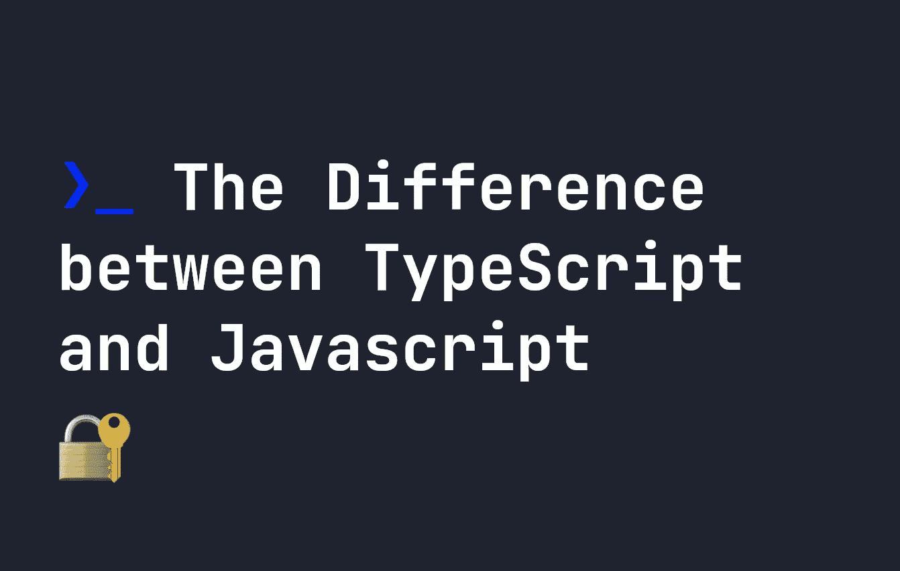

# TypeScript 和 JavaScript 有什么区别

> 原文：<https://javascript.plainenglish.io/the-difference-between-typescript-and-javascript-a95e8feb9304?source=collection_archive---------13----------------------->

## 什么是 TypeScript，为什么它不同于 JavaScript。



如果你是 web 开发的新手，或者只是 Javascript 开发的新手，你可能会想知道【TypeScript 和 Javascript 之间有什么区别。在本指南中，我将解释什么是 TypeScript，以及为什么它不同于 Javascript。如果你想开始自己的打字稿项目，我在这里写了一篇关于[建立你的第一个打字稿项目](https://fjolt.com/article/typescript-how-to-use)的指南。

# TypeScript 和 JavaScript 有什么不同？

当网络出现时，JavaScript 是一种脚本语言，允许我们在网站上增加交互性。众所周知，Javascript 是在 10 天内完成的，所以正如你所料，它并没有我们今天拥有的所有功能。

随着时间的推移，Javascript 的重要性与日俱增。框架进化的像 jQuery，Mootools，然后 React，Vue，Svelte。然后，随着 Node.JS 的出现，Javascript 也成为了一种后端语言。随着它重要性的增加，Javascript 的所有怪癖、特性和缺失的特性都变得更加明显。对于来自强类型语言的程序员来说，缺少的特性之一就是类型系统。

# 什么是类型？

在 Javascript 中，类型是动态的，取决于您如何编写代码。这与其他一些语言不同，在这些语言中，你必须明确地提及所有事物的类型。在 Javascript 中，这更简单:

```
let x = 5; // Type is Number
let y = 'string'; // Type is String
let z = {}; // Type is object
```

这其实是一个很棒的功能。对于想要快速创建东西的开发人员来说，它使得 Javascript 很容易入门。不过，它也有缺点。主要的一点是，如果你和多个团队一起工作，在复杂的系统中，强制类型是很重要的，或者只是因为`TypeError` s 而面临许多问题，这可能会成为你的应用程序的一个障碍，而不是一个净积极因素。

TypeScript 试图解决这个问题。它真正做的唯一事情是向 Javascript 添加类型，这意味着您必须更频繁地定义代码的类型。使用前面的例子，我们可以这样定义变量的类型:

```
let x:number = 5; // Type is Number
let y:string = 'string'; // Type is String
let z:object = {}; // Type is object
```

然而，事情并没有就此结束。例如，用 Javascript 编写一个简单的函数可能如下所示:

```
let myFunction = (x, y) => {
    return x + y;
}
```

而 TypeScript 让我们为函数的所有参数和返回值定义类型:

```
let myFunction = (x:number, y:number):number => {
    return x + y;
}
```

因此，学习 TypeScript 与 Javascript 略有不同。如果你有兴趣，[你可以在这里](https://fjolt.com/article/typescript-creating-custom-types)学习更多关于类型的知识。

# 打字稿的特点

*   它是强类型的——如前所述，我们必须在 TypeScript 中定义类型，而在 Javascript 中却不需要。
*   **它仍然像 Javascript** 一样工作——所有的函数、方法和你习惯的一切仍然存在于 TypeScript 中。它只是增加了类型。
*   **它有一个编译步骤，编译成 Javascript** — TypeScript 不能在浏览器上运行。相反，你用类型编写你的代码，然后它们被编译成没有类型的普通 Javascript。这意味着在你编译代码之前，你知道你的代码是正确输入的，之后它就是可以在网络上运行的普通 Javascript。

# 为什么使用 TypeScript？

人们和组织使用 TypeScript 的主要原因是因为**它是类型安全的**——你可以强类型化你所有的代码，最终这将导致更少的错误和问题。当一个函数的返回类型，或者一个变量的输入类型被定义的时候，开发者不可能不小心写了`"true"`而不是`true`。

# TypeScript 比 Javascript 好吗？

TypeScript 并不比 Javascript 更好——它只是给了你在代码中定义类型的能力。有时，您可能不需要这样做，而 Typescript 的主要缺点是编译时间**。在 Javascript 中，代码一写出来就准备好了，但是在 TypeScript 中，它需要你把它编译成 Javascript。**

**将来，[类型可能会以这样或那样的形式出现在 Javascript](https://fjolt.com/article/javascript-type-annotations) 中，这可能会删除这个编译步骤。但是现在，这需要时间，如果不是必须的话，这可能不是您编写代码的首选方法。这是坚持使用 Javascript 的主要好处，但还有其他好处——对于小型应用程序，强类型化代码可能也不会带来额外的好处。**

**因此，不要觉得你需要使用 TypeScript——使用任何对你的产品或组织有意义的东西。**

# **结论**

**如果你不熟悉 TypeScript，[我在这里写了很多。这是一种很棒的语言，它提供了很多 Javascript 所没有的关于类型的安全性。TypeScript 并不比 Javascript 更好，但是如果您来自强类型背景，您可能会更熟悉它。如果您从事大型产品或与许多团队一起工作，这也可能是首选。虽然选择适合您的情况的工具集很重要，但是鉴于 TypeScript 越来越受欢迎，学习它也没有坏处。](https://fjolt.com/category/typescript)**

**如果你喜欢这个，你可以在推特上找到我。**

***更多内容请看*[***plain English . io***](https://plainenglish.io/)*。报名参加我们的* [***免费周报***](http://newsletter.plainenglish.io/) *。关注我们关于*[***Twitter***](https://twitter.com/inPlainEngHQ)[***LinkedIn***](https://www.linkedin.com/company/inplainenglish/)*[***YouTube***](https://www.youtube.com/channel/UCtipWUghju290NWcn8jhyAw)*[***不和***](https://discord.gg/GtDtUAvyhW) *。对增长黑客感兴趣？检查* [***电路***](https://circuit.ooo/) *。*****