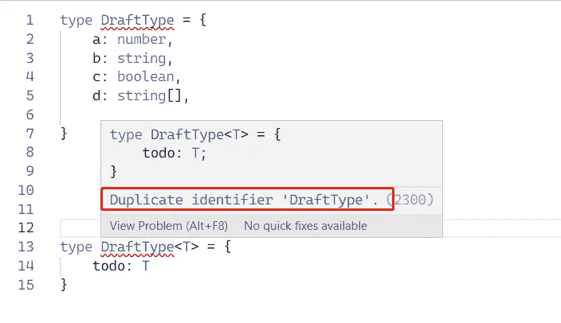
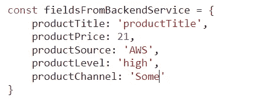
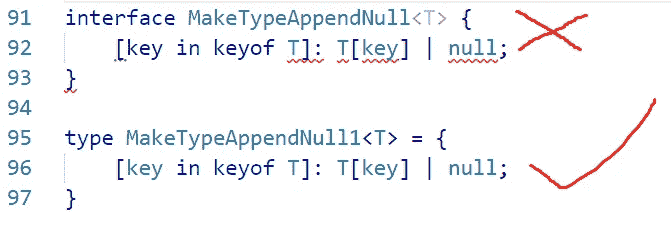
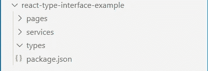
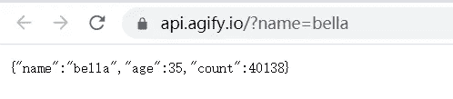
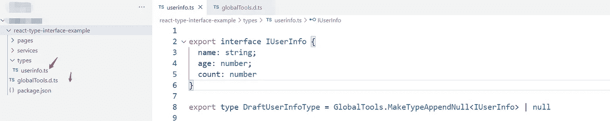
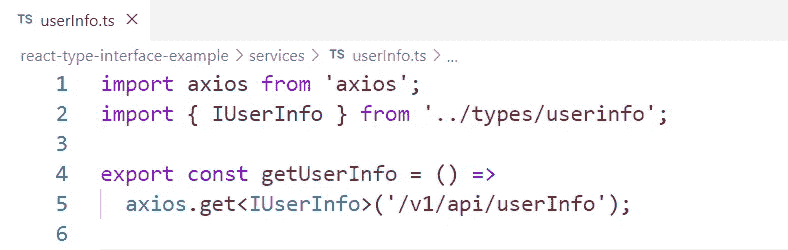

# TypeScript 接口和 type-Final 版本的区别

> 原文：<https://javascript.plainenglish.io/the-difference-between-typescript-interface-and-type-final-version-3e8801a16b2f?source=collection_archive---------8----------------------->

## 详细讲解接口和类型的区别，以及实际使用场景，团队规范。

Photo by [Irvan Smith](https://unsplash.com/@mr_vero?utm_source=medium&utm_medium=referral) on [Unsplash](https://unsplash.com?utm_source=medium&utm_medium=referral)

[TypeScript](https://www.typescriptlang.org/) 是 JavaScript 的超集。它出色的设计架构和流畅的类型系统给我们带来了全面的体验，但它的一些概念和用法非常混乱。

从本文中，您可以了解到:

*   深入了解`interface`和`type`在 TypeScript 中的区别是什么。
*   如何在各个场景中正确使用。
*   构建您自己的类型脚本工具。

*本文假设您已经具备一定的打字技能。*

# 我最明确的观点

`interface` **描述了一组数据结构，** `type` **描述了一种类型关系。**

# 接口和类型能做什么？

## 1.可以声明一个对象或函数:

## 2.**可以扩展现有类型**

在上面的例子中，`interface`使用 extends 关键字来集成`IUserInfo`的类型，类型使用 cross-type 的类型来集成`IUserInfo`。两者的实现方式不同，但效果是一样的。

## 3.**可以用** [**通用**](https://www.typescriptlang.org/docs/handbook/2/generics.html#handbook-content)

# 界面能做到，但类型不能

`**interface**` **可以组合重复申报**

The interface can combine duplicate declarations

**用** `**type**` **声明重复类型会产生错误**

Declare a duplicate type using the type keyword

# 类型可以，但接口不行

1.  使用`type`声明类型别名(一个非常好的技术)想象一个场景，假设后端返回一个产品信息的接口，`interface`包含 5 个字段，假设它们是这样的:

Field information returned from the backend interface

看起来不错，但是我们在编码过程中不能完全信任后端返回的字段类型，**因为对象内部的一个字段可能是** `**null**` **，对象也可能是** `**null**`，所以我们需要使用一个类型工具来约束类型，但是`interface`做不到。这个时候，`type`就有了很大的作用。让我们看一个例子:

上面使用了`type`关键字来声明一个`MakeTypeAppendNull` 类型工具，以帮助我们在出现在线问题时控制类型

但是这个工具类型不能用`interface`声明，因为 TypeScript 会有莫名其妙的错误信息:

2.通过利用 TypeScript 提供的各种概念，`type`关键字可以做任何事情。

# 那么，什么时候使用接口或者类型呢？

*   当声明后端返回的字段类型时，**使用** `interface`
*   **在 React/Vue.js/Angular 等前端框架中传递属性声明类型时使用接口**
*   当声明公用事业类型时，**使用** `type`
*   **使用 *TypeScript* 内置类型时，如 ReturnType、Pick、Omit、Required 等，可以考虑使用** `type` 。
*   写主类型时(类似 ES6 中抽象类的概念)用`interface`，辅助类型**用** `type`。

# 实际场景—在 React 类型脚本环境中

这个场景是从定义后端字段的类型到使用`type`关键字定义一个基本类型，然后在 React 环境中使用，然后渲染 DOM。`interface`和`type`的确切用法。

首先，得到一个如下图所示的文件夹结构:

Basic file

然后，我们在 types 文件夹中定义该 URL 返回的字段信息的类型:

Suppose this information is returned by the backend

在类型文件夹中创建新的 *userInfo.ts* 和`globalTools.d.ts`。这里我们用`interface`定义数据的基本类型，用 type 关键字对原始类型进行两次扩展。这类似于在 JavaScript LOL 中复制对对象的引用:)

Declare return type

然后在`services` 文件夹中，通过 axios 定义一个函数，帮助我们以标准化的方式获取后端返回的数据。

Define a function to fetch data

然后在`User.tsx`文件中写具体的逻辑。

干得好！相信你已经学会了如何在项目中正确使用`interface`和`type`，然后开始在你的团队中改造项目！

# 结论

本文首先讨论了使用`interface and type`的各种方式，然后解释了它们的异同，并通过一个文字工具说明了文字的威力。最后，结合现代前端框架，深入了解 `interface and type`。具体使用场景，希望你工作愉快！

*更多内容看* [***说白了就是 io***](https://plainenglish.io/) *。报名参加我们的* [***免费周报***](http://newsletter.plainenglish.io/) *。关注我们关于*[***Twitter***](https://twitter.com/inPlainEngHQ)*和*[***LinkedIn***](https://www.linkedin.com/company/inplainenglish/)*。加入我们的* [***社区***](https://discord.gg/GtDtUAvyhW) *。*