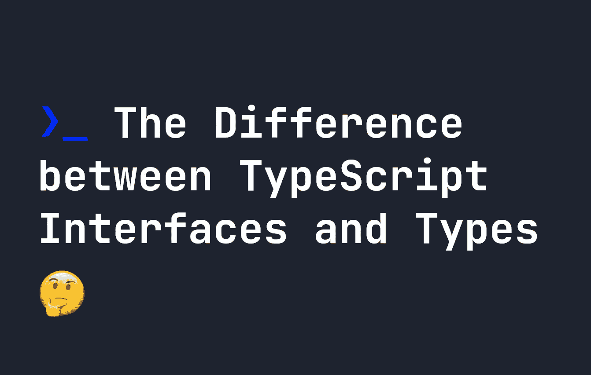

# TypeScript 接口和类型之间的区别

> 原文：<https://javascript.plainenglish.io/the-difference-between-typescript-interfaces-and-types-d93c8d023b37?source=collection_archive---------9----------------------->

## TypeScript 有两种方法可以创建新的自定义类型—接口和类型。我们来看看两者的区别。



在 TypeScript 中，您可能已经注意到可以用两种不同的方式声明自定义类型。一个是用`interface`关键字，另一个是用`type`关键字。因此，你可能会发现自己想知道为什么做一件事有两种方法——而且你并不孤单。我已经在我的指南[中介绍了如何在 TypeScript](https://fjolt.com/article/typescript-creating-custom-types) 中声明自定义类型，如何使用接口和类型——但是让我们更深入地了解一下它们之间的区别。

# 1.接口扩展语法因类型而异

如果我们在 TypeScript 中定义了一个类型，它在事实之后是不可扩展的。例如，考虑我刚刚创建的这个自定义类型:

```
type user = {
    name: string,
    age: number
}
```

如果在定义了地址之后，我突然意识到我也想添加一个地址，我可以使用下面的语法:

```
type userWithAddress = user & {
    address: string
}
```

使用接口，我们可以做同样的事情，但是语法略有不同:

```
interface user {
    name: string;
    age: number;
}
interface userWithAddress extends user {
    address: string
}
```

现在`userWithAddress`包含了`user`的所有属性，外加一个额外的属性——那就是`address`。

这两种扩展类型的方式之间唯一的区别是它们处理冲突的方式。例如，如果您扩展一个接口并提到一个已经定义的属性，将会引发一个错误。例如，**这个不行**:

```
interface user {
    name: string;
}
interface newUser extends user {
    name: number;
}
```

同时，使用`type`，您可以这样做:

```
type user = {
    name: string
}type newUser = user & {
    name: number
}
```

虽然这不会引发错误，但可能会导致一些意想不到的结果——因此在必要时应该避免。例如，上面的`name`属性被简化为类型`never`——因为一个类型`never`可以同时是`string`和`number`。:)

# 2.接口可以合并，类型不能

同样，`types`不能被合并，而`interfaces`可以，如果你多次声明它们。例如，如果我们有一个类型，我们不能这样做:

```
type cat = {
    name: string
}
type cat = {
    color: string
}
```

实际上，**上面的代码会抛出一个错误**。同时，使用`interface`，我们可以做到这一点——它将合并两个声明。所以下面的例子将创建一个名为`cat`的类型，它同时具有`name`和`color`属性:

```
interface cat {
    name: string;
}
interface cat {
    color: string;
}
```

# 3.接口不能扩展原语

虽然我们可以创建一个类型，作为像`string`，`interface`这样的原始类型的别名，但是我们不能这样做。例如，如果你想创建一个名为`myName`的类型，它总是字符串类型，我们可以这样做:

```
type myName = string;
```

在这里，`myName`成为了`string`的别名——所以我们可以在任何地方写`myName`而不是`string`。而`interface`则没有这个能力。以下内容不能也不会起作用:

```
interface myName extends string {}
```

# 4.类型可以创建联合，而接口不能

我们可以用关键字`type`创建联合类型，但是不能用接口来实现。例如，在这里，`userId`可以是`string`或`number`:

```
type userId = string | number
```

同时，上述不能用`interface`实现，因为接口定义了对象的形状或类型。

# 5.类可以实现接口，但不能实现类型

如果在 TypeScript 代码中使用类，它们可以实现接口，但不能实现类型。这意味着类必须符合接口本身。如果你定义了一个`type`，你不能在一个类中使用它。例如:

```
interface user {
    name: string;
    age: number;
}class createUser implements user {
  name = "John";
  age = 143;
}
```

如果您决定在您的类型脚本代码中使用类，这使得`interface`非常方便——但是正如我们所知，许多类型脚本代码倾向于函数式的，而不是基于代码的。所以这个好处将取决于你的代码库。

# 结论

如你所见，`type`和`interface`的主要区别取决于你使用它们的环境。几乎`interface`的所有特性在`type`中都可以得到，这意味着你可能会发现自己更频繁地去`type`。不过，一般来说，它倾向于基于你的偏好或者在你的代码库中什么工作得最好(例如，使用`interface`的额外的`implement`特性)。

无论如何，请放心，这并不像你最初想的那样令人困惑——因为`interface`和`type`实际上是做同一件事的两种方式！

*更多内容请看*[***plain English . io***](https://plainenglish.io/)*。报名参加我们的* [***免费周报***](http://newsletter.plainenglish.io/) *。关注我们关于*[***Twitter***](https://twitter.com/inPlainEngHQ)[***LinkedIn***](https://www.linkedin.com/company/inplainenglish/)*[***YouTube***](https://www.youtube.com/channel/UCtipWUghju290NWcn8jhyAw)*[***不和***](https://discord.gg/GtDtUAvyhW) *。对增长黑客感兴趣？检查* [***电路***](https://circuit.ooo/) *。***