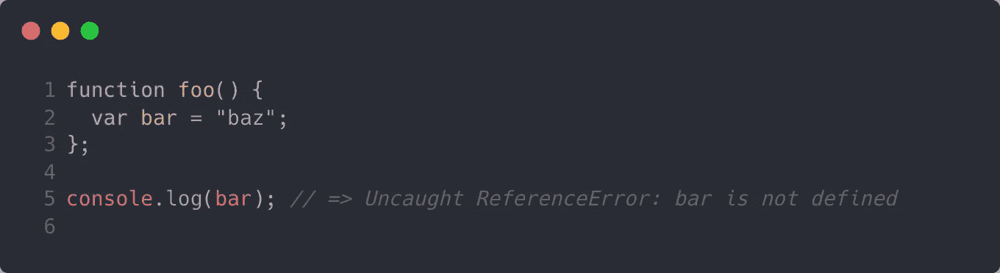
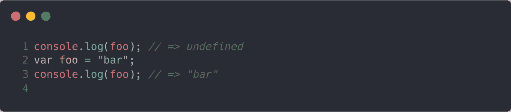
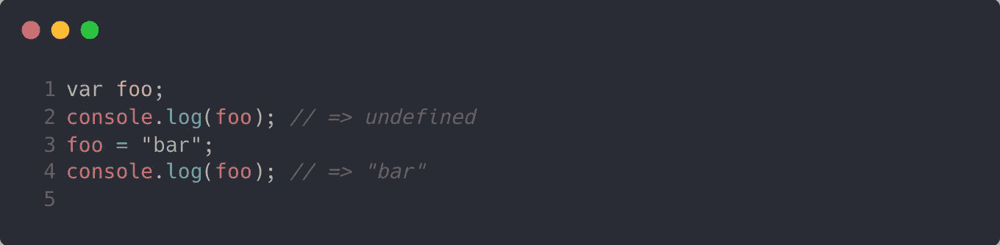
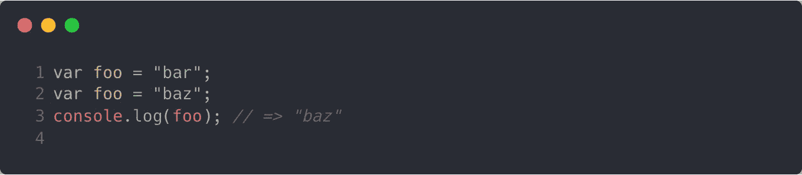
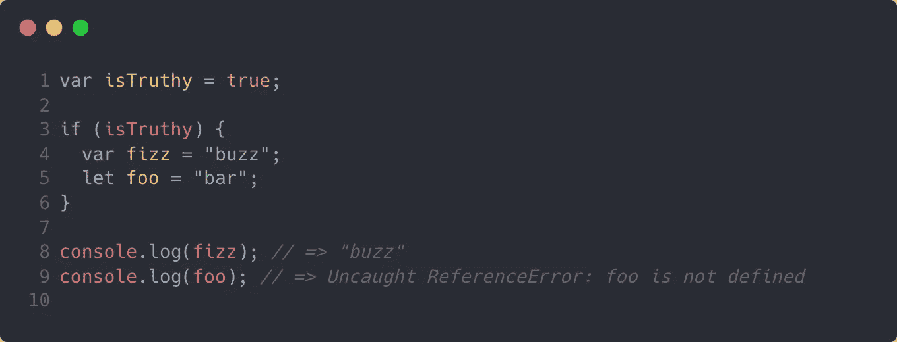
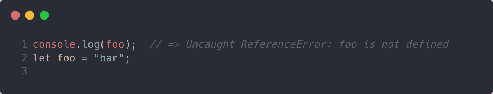
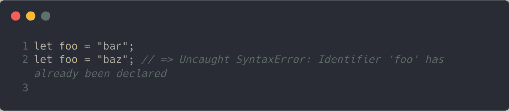
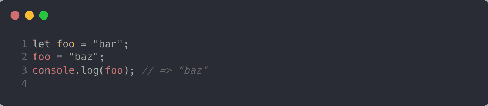
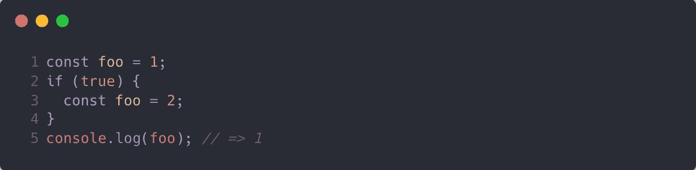
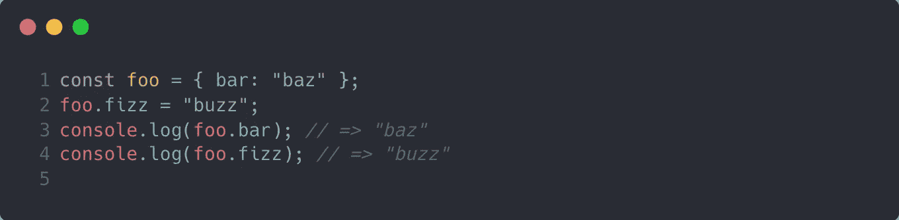

# JavaScript 中 var、let 和 const 的区别

> 原文：<https://javascript.plainenglish.io/the-difference-between-var-let-and-const-in-javascript-4ef3b4307fb3?source=collection_archive---------13----------------------->

Variable declaration keywords in JavaScript can seem like the Spider-Man meme.

# TL；速度三角形定位法(dead reckoning)

*   JavaScript 有着独特的历史，这导致了它令人困惑的特性和结构。
*   当考虑何时使用`var`、`let`或`const`时，必须考虑范围、吊装、重新声明和其他环境因素。
*   我更喜欢用`const`表示常量值，用`let`表示其他值。

# 所有背景的程序员都觉得 JavaScript 令人困惑

Photo by [愚木混株 cdd20](https://unsplash.com/@cdd20?utm_source=medium&utm_medium=referral) on [Unsplash](https://unsplash.com?utm_source=medium&utm_medium=referral)

在没有任何 JavaScript 知识的情况下，像声明变量这样简单的事情可能会令人困惑。或者至少这是我在为以前公司的另一个部门做内部咨询时发现的。我与一位经验丰富的专业人士共事，他的电子邮件签名是“首席顾问”，负责为外部客户设计完整的、全栈的、独立的解决方案，这些解决方案需要与我们现有的产品无缝集成。

我们偶尔会打电话讨论项目的各个方面，我们经常通过电子邮件交流。然后有一天，我打开我的电子邮件客户端，看到了一封来自他的邮件。我喜欢在早上第一件事就解决他的问题，因为他住在东海岸，我想确保我没有妨碍他完成工作。我读了他的邮件，最终读到了这样一段话，“T5、`const`和 T7 有什么不同？”一开始我有点吃惊，因为这样一个简单的问题，由一个经验可能是我两倍的工程师来问，实在令人震惊。

后来我意识到这其实很有道理。JavaScript 令人困惑，用三种不同的方式声明变量似乎有些过分(很可能是这样)。这种模式直到最近 5 年左右才随着 [ES6](https://en.wikipedia.org/wiki/ECMAScript#6th_Edition_%E2%80%93_ECMAScript_2015) 成为主流，对于最近没有积极开发 JavaScript 的人来说，ES6 的变化会使 JavaScript 看起来像是一种与之前版本完全不同的语言。JavaScript 有着复杂的历史，所以要理解事情“为什么”是这样做的，理解我们是如何走到这一步的会很有帮助。

# JavaScript 简史

Photo by [Natalia Yakovleva](https://unsplash.com/@foxfox?utm_source=medium&utm_medium=referral) on [Unsplash](https://unsplash.com?utm_source=medium&utm_medium=referral)

早期的网络以一种只有在科幻电影中才有可能的方式将人们联系起来。也就是说，它是由缓慢加载的静态页面组成的，这些页面在今天是无法识别的。1993 年，Mosaic 网络浏览器诞生了，它允许用户在网页上浏览图片和文本(而不是在另一个窗口)。

马赛克的主要开发者创建了网景，它引入了非常受欢迎的网景导航器。他们开始致力于增加对脚本语言的支持，他们将脚本语言命名为 JavaScript，以利用当时热门的编程语言 Java 的优势。

微软在 1995 年进入这一领域，推出了互联网浏览器，并有效地引发了“浏览器战争”两种网络浏览器都开始支持自己的脚本语言，为最终用户提供更丰富、更动态的网络浏览体验。

拥有两种主要浏览器和两种独立的脚本语言意味着网页通常只能在一种浏览器或另一种浏览器中完全运行。这种碎片化导致了 1997 年的 ECMAScript 标准化。随着互联网的爆炸式增长，ECMAScript(即 JavaScript)成为事实上的浏览器语言，并变得令人难以置信的流行。

> 由于其复杂的历史和不断的演变，JavaScript 仍然是最受欢迎但令人困惑的编程语言之一

作为一种灵活的脚本语言，同时又出生在 Java 的阴影下，这使得 JavaScript 成为一种独特的令人困惑的语言。JavaScript 是弱的动态类型，但是您可以使用 JavaScript 的 TypeScript 超集来添加严格的类型。您可以在同一应用程序中轻松使用[面向对象编程(OOP)](https://en.wikipedia.org/wiki/Object-oriented_programming) 和[功能编程](https://en.wikipedia.org/wiki/Functional_programming)范例。由于其复杂的历史和不断的演变，JavaScript 仍然是一种更受欢迎但令人困惑的编程语言。

# `var`关键字

`var`关键字是三个关键字中最古老的，因此，可以认为有点过时。它有一些奇怪的行为，在没有适当的知识或开发环境配置的情况下会产生错误。

## 范围

使用`var`关键字声明的变量是函数作用域，除非在函数外声明，否则它是全局作用域。请看下图，了解功能范围。

var declarations are scoped to their immediate containing function

上面的`var`变量的作用域是`foo`函数，因此，它对其周围的全局作用域是不“可见”的。

## 提升

`var`申报被悬挂，最初`undefined`后最终被分配。JavaScript 解释器将提升函数、变量和类的声明，并将它们初始化为`undefined`(有一些例外——继续阅读)。因此，我们可以运行下面的代码而不会抛出异常。

var declarations are hoisted and initialized to undefined

这可能有点令人困惑，所以让我们解释一下 JavaScript 解释器实际上在做什么。在执行您的 JavaScript 代码之前，解释器将扫描并创建您的声明的映射，以优化代码执行。对于所有这些声明，解释器都不会分配正确的值，因为这需要执行代码。相反，它创建映射，将所有这些声明分配给`undefined`(同样，有一些例外)。让我们用代码来说明这个概念:

var declarations hoisting can be visualized as undefined, initially

## 申报

`var`申报可以重新申报。这是一个微妙但非常危险的概念，不应该被忽略，因为这个特性允许您在代码中引入命名冲突。看看下面的例子:

An example of a naming collision using the var keyword

这是一个微不足道的例子，但是您可以想象在一个更大的代码库中意外地重新声明一个变量是多么容易。现代开发环境将允许您配置一个“linter ”,在您可能不小心重新分配了一个现有变量时向您发出警告。

# 字母关键字

关键字`let`是在 ES6 中引入的，随着这个最新的 ECMAScript 标准被广泛采用，`let`开始取代`var`成为声明变量的首选关键字。有一些主要的不同使得`let`比`var`稍微宽松一点，因此“更安全”。

## 范围

`let`是块范围的，也就是说，它的范围是最近的包含块。因此，`let`声明不是像`var` 声明那样只作用于包含函数块，而是作用于所有变体的第一个包含块。JavaScript 中的 block 语句是一对有效的“花括号”(即`{`和`}`)之间的任何代码。因此，这包括`if`语句、`for`和`while`循环、`function`声明，甚至是其他用例中的一组独立的花括号。让我们来说明我在这里所说的:

let declarations are block-scoped

## 提升

虽然所有的声明都是提升的，`let`声明的行为与前面描述的`var`关键字的提升略有不同。即使`let`声明被提升，它们也不会像被提升的`var`声明一样被初始化为`undefined`。这意味着你不能引用一个在初始化之前使用`let`关键字声明的变量。

let declarations are hoisted but not initialized to undefined

这个场景展示了一个被称为“[时间死区(TDZ)](https://developer.mozilla.org/en-US/docs/Web/JavaScript/Reference/Statements/let#temporal_dead_zone_tdz) 的奇怪现象这是一个时间问题，因为它与时间有关。由于变量在运行时直到第一次赋值时才被初始化，如果您试图过早地引用它，将会抛出一个错误。

## 申报

关键字`let`不如`var`宽松的另一个原因是它不能被重声明。总的来说，重新声明是 JavaScript 的一个奇怪的特性，将它从关键字`let`中设计出来是一个重大的胜利。这里有一个例子来说明我所说的。

Redeclarations of let variables are not allowed

需要明确的是，重新声明和重新分配是两回事。您肯定可以像通常预期的那样重新分配`let`变量。如果不能变化，它们就不是很好的变量。

You can still reassign let variables

# const 关键字

`const`关键字是声明变量的另一种方式。顾名思义，`const`声明可以有效地称为“常量”我们来分解一下他们的行为。

## 范围

与关键字`let`非常相似，`const`声明是块范围的。

## 提升

`const`关键字的提升方式与`let` 关键字完全相同。它已被提升但未初始化，因此将会遇到相同的临时死区问题。

## 申报

一旦你已经声明了一个`const`声明，你就不能重新声明它。同样，这与`let`声明的行为完全相同。然而，因为`let`和`const`是块范围的，所以有时看起来它们被重新声明了，而实际上它们不是。看一下这个例子:

Block scoping can create the illusion of redeclaration

您会注意到我们声明并赋值了两次`foo`常量，但是代码的执行不会抛出异常。同样，这是因为`const`声明的块范围性质。

## 分配

`const`关键字的主要特点是它不能被重新分配。因此，您必须立即为该常数赋值，否则，该常数将保持未定义状态。下面可以看到一个明显的“漏洞”:

A “loophole” to change the value of a constant

即使`foo`是一个常量，上面的代码也不会产生异常。你能看出这是怎么回事吗？花点时间考虑一下。

虽然看起来我们违反了关键字`const`的主要特性，但严格来说，我们实际上并没有重新分配`foo`常量。这是因为我们使用了`Object`数据结构。所以我们将`foo`初始化为`Object`实例，并且在过程的每一步，`foo`总是引用同一个`Object`实例。我们只是向该对象添加另一个属性，而不是重新分配`foo`。

# 何时使用它们

你应该使用你觉得舒服的任何东西，但是我喜欢只在需要的时候使用。如果您的值永远不需要重新分配，请使用`const`，否则，请使用`let`。我再也不用`var` s 了，因为它们太放纵了。如果我需要引用其作用域之外的变量，我只需将变量声明移动到一个更高的公共作用域。我也从来没有理由利用`var`没有时间死区的优势，事实上，我认为这个属性更像是一个 bug，而不是一个特性。

# 结论

即使是有经验的开发人员有时也会发现 JavaScript 令人困惑。它不寻常的历史使它成为当今最受欢迎的语言之一，但也是最难掌握的语言之一。彻底理解`var`、`let`和`const`是构建强大 JavaScript 基础的重要一步。

如果你正在学习 JavaScript 基础知识以成为一名软件工程师，请查看我写的这篇关于我的编码训练营之旅的文章。

*最初发表于*[*【https://codingbootcampguides.com】*](https://codingbootcampguides.com)*。*

*更多内容看* [***说白了。报名参加我们的***](https://plainenglish.io/) **[***免费周报***](http://newsletter.plainenglish.io/) *。关注我们关于*[***Twitter***](https://twitter.com/inPlainEngHQ)*和*[***LinkedIn***](https://www.linkedin.com/company/inplainenglish/)*。加入我们的* [***社区***](https://discord.gg/GtDtUAvyhW) *。***