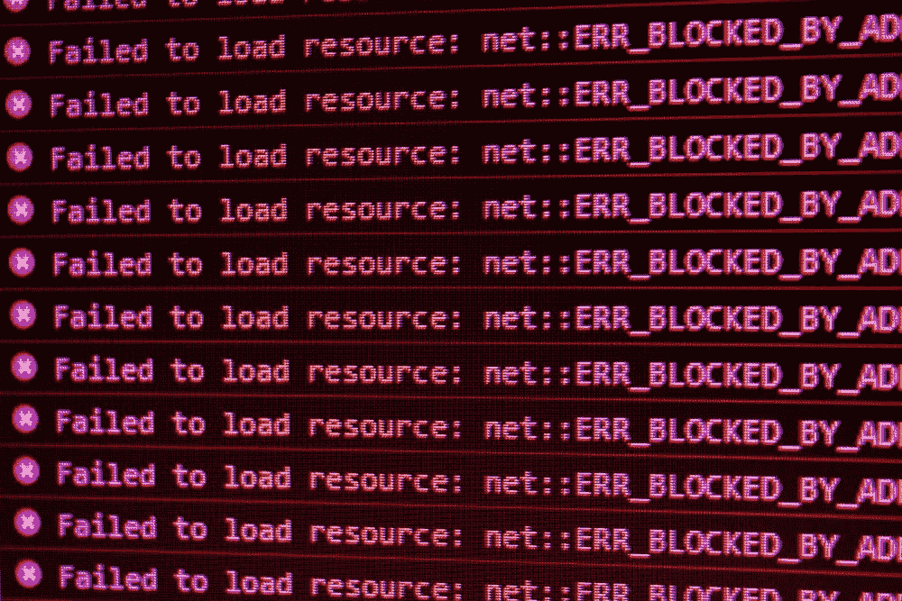
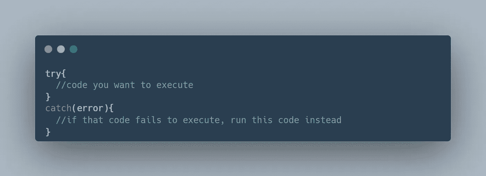
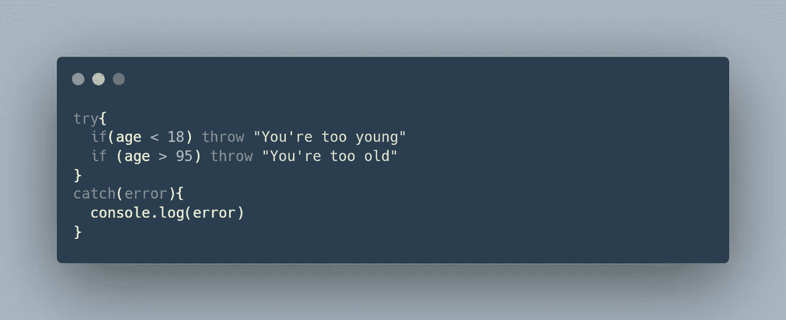

# JavaScript 中 Try-Catch 的注意事项

> 原文：<https://javascript.plainenglish.io/the-dos-and-don-ts-of-try-catch-in-javascript-75c4e8c82200?source=collection_archive---------0----------------------->

## 学习使用 try{}catch{}快速简单地处理错误

Photo By [**David Pupaza**](https://www.instagram.com/davijd1/)

早上好，朋友们，

几个月前，当我在做技术访谈时，错误处理出现了。我的面试官并没有使用简单的 if-else 语句，而是鼓励我使用 try-catch。他没有直接说出来。；这更像是一种暗示或戏弄。他说了一些类似于“如果有一种处理异常的方法就好了……”幸运的是，我有在 Java 中使用 try-catch 和 throw 语句的经验，所以我能够理解他所说的。但对我来说不幸的是，我对 JavaScript 中的语法有何不同一无所知。

所以今天，这就是我们要讲的内容。我们如何使用试捕法？什么时候我们应该使用 if-else 语句而不是 try-catch？

让我们得到它。

# 开始使用 Try Catch

在我们讨论该做什么和不该做什么之前，让我们先来简单了解一下如何使用 try-catch。

Oversimplified Template of Try-Catch

首先，让我们从 try 语句开始。在花括号内，也就是 try-block，编写任何您想要执行的代码。你可以打印到控制台，创建对象，声明变量，调用函数。尽你所能。

如果由于某种原因，try 语句中出现错误，catch 语句中所有代码都将被执行。

以下是 MDN 官方网站文档对此的解释:

> `try...catch`语句标记了一个`try`块和一个`catch`块。如果`try`块中的代码抛出异常，那么`catch`块中的代码将被执行。
> 
> - [MDN 网络文档](https://developer.mozilla.org/en-US/docs/Web/JavaScript/Reference/Statements/try...catch)

你可能想知道:我们在谈论什么类型的错误？**字面意思，全部。这实际上是使用 try-catch 而不是 if-else 语句的好处。**

错误可能是由程序员造成的。例如，也许你拼错了。你可能没有写`console.log()`，而是写了`consolelog()`或`conle.log()`。你明白了。按照这种基本原理，你的代码可能想要做一些不可能的事情。例如，你正在调用一个不存在的函数。您试图使用不存在的变量或对象。你试图使用一个没有意义的陈述——同样，比如拼错的`console.log()`。

然后在浏览器的自然错误处理之上，你甚至可以创建你自己的错误。

例如，假设您有一个存储用户年龄的变量`age`。正如您所看到的，如果年龄小于 18 岁，它将抛出一个错误，显示“您太年轻了。”当抛出这个错误时，将执行 catch-block 而不是 try-block。相反，例如，如果用户的年龄是 20 岁，则不会抛出任何错误。try 块将被完全执行，而 catch 块将永远不会被执行。

除了由程序员引起的错误之外，错误也可能是由程序员无法控制的事情引起的。如果你的程序依赖于 API 或任何第三方，当然程序员总是会假设第三方会成功地完成他们的部分。有时候他们不会。也许第三方有服务器问题。程序员的工作就是处理这些错误，以防第三方无法履行其职责。

try-catch 语句就是这么简单。更多信息，请查看[试抓文档](https://developer.mozilla.org/en-US/docs/Web/JavaScript/Reference/Statements/try...catch)。

现在让我们来看看该做和不该做的事情。

# 试抓的注意事项

## ❌Don't 使用 Try-Catch 进行输入验证

如果您有一个输入表单来获取用户名，显然您需要一个字符串。如果用户发送了一系列的数字，我们想要处理它。或者如果您希望用户的年龄在某个范围内，我们也需要输入验证。

我们需要确保用户提供的输入是我们所期望的。

尝试捕捉并不是做到这一点的工具。绝对可以用。它会像你期望的那样工作。根本不推荐。在特殊情况下，应该谨慎使用 try-catch。您应该使用 try-catch 进行**错误处理。**错误处理和输入验证是两回事。

这里有一个 [W3 Schools](https://www.w3schools.com/jsref/tryit.asp?filename=tryjsref_state_throw_error) 使用它进行输入验证的例子。简单的 if-else 语句肯定就够了。你根本不需要使用 try-catch。

## ✔️Do 使用 Try-Catch 进行错误处理

当你预计事情会出错，但又完全超出你的控制范围时，使用尝试捕捉。大多数情况下，该功能会起作用，很少会不起作用；这种可变性不是你能控制的。如果它在你的控制范围内，那就已经解决了。

## ✔️Do 使用 Try-Catch 定制错误消息

程序会很快变大。如果您希望能够无缝且快速地识别错误，自定义错误消息是您的好朋友。它们比浏览器提供的一般错误信息更能说明问题，也更有帮助。

在本文中，我们非常简要地讨论了定制错误消息。如果你想更深入地了解它，请查看自定义错误[，通过 Javascript.info 扩展错误](https://javascript.info/custom-errors)。它非常全面且易于理解。此外，还有许多代码示例，您可以自己尝试一下。

## ✔️Do 使用 Try-Catch 来捕捉所有异常

如果您试图使用 if-else 语句来捕获所有的异常，您将会写很多很多的代码——即使这样，您可能也不会捕获到所有的异常。

请注意，会有一些你可能会忘记甚至没有预料到的例外。

Try-Catch 非常棒，因为它将捕获所有异常——甚至是那些您没有想到或预料到会发生的异常。

## ❌Don't 在程序逻辑中使用 Try-Catch

if-else 语句和 try-catch 不能互换使用。它们都有特定的用例以及需要满足的环境。

再次强调，谨慎而有策略地使用试捕。单独使用 try-catch 来处理错误。不要将 try-catch 用于其他任何东西，比如程序逻辑。绝对不行。

感谢阅读。如果你用不同的方式使用 try-catch，或者对它们有独特的用例，我很想了解一下。

如果你想和我一起学习更多的 JavaScript，请查看:

[你认为你知道 var、let 和 const 之间的区别吗？](/you-think-you-know-the-difference-between-var-let-and-const-b55b638529fc)

[如何使用 JavaScript 类进行面向对象编程](/how-to-use-javascript-classes-for-object-oriented-programming-8f300d5f71a5)

[重构 JavaScript 代码:Truthy 和 Falsy](https://medium.com/@kyledeguzmanx/refactoring-javascript-code-truthy-and-falsy-f176a834a080)

*更多内容请看*[***plain English . io***](https://plainenglish.io/)*。报名参加我们的* [***免费周报***](http://newsletter.plainenglish.io/) *。关注我们关于*[***Twitter***](https://twitter.com/inPlainEngHQ)*和*[***LinkedIn***](https://www.linkedin.com/company/inplainenglish/)*。查看我们的* [***社区不和谐***](https://discord.gg/GtDtUAvyhW) *加入我们的* [***人才集体***](https://inplainenglish.pallet.com/talent/welcome) *。*