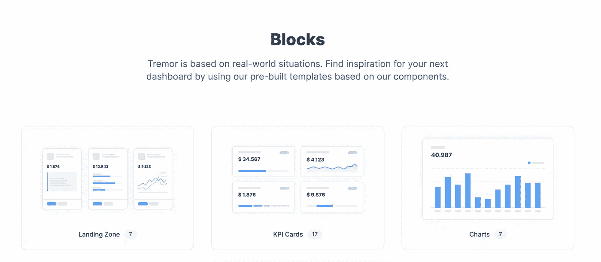
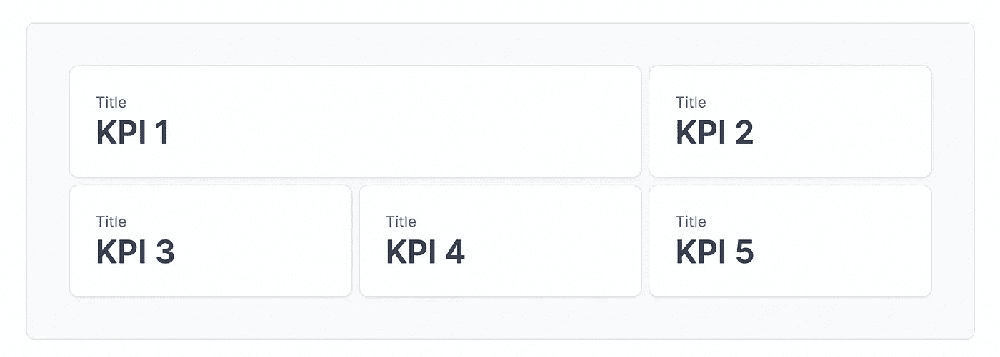

# 在 React 中构建仪表板的最简单方法

> 原文：<https://javascript.plainenglish.io/the-easiest-way-to-build-dashboards-in-react-83bf44d1c981?source=collection_archive---------3----------------------->

如果你曾经为网络建立过仪表板，那么你就会知道这是一场多么艰难的斗争。从让它完全响应到让图表看起来至少有点令人愉快…

在我寻找解决方案的过程中，我遇到了三个才华横溢的小伙子，他们正在为 React 构建下一代仪表盘。


# 引入震颤

震颤是一个为 React 构建的开源仪表板组件包，它利用模块化的方法来解决问题。

单独的图表、标签和布局组件确保它具有原始库的灵活性，同时还提供了预构建 UI 工具包的迫切需要的结构。

当名为[阿奇利亚斯·米特罗西奥斯](https://twitter.com/a_mitrotasios)、[塞弗林·兰道](https://twitter.com/severinlandolt)和[克里斯多夫·金德](https://twitter.com/kindlaar)的三名推特用户宣布他们正在致力于一项将永远改变你构建仪表盘的方式的工作时，震颤似乎不知从何而来。一个非常大胆的主张，但在尝试了这个项目之后，我不得不说我感到惊喜！

## 安装震颤

安装震颤是一样容易运行一个命令，安装命令更具体。

```
npm install @tremor/react
```

在幕后，震颤使用了 [Recharts](https://recharts.org/en-US/) 库，并在其上提供了一个便利层。为您提供定制的包装组件，这些组件抽象了您原本需要的大量配置。

## 组件和块

震颤团队提供单独的组件和块。组件是您所熟悉的单个部件，如折线图、卡片、标签…使您能够从头开始构建自己的自定义仪表板。



如果您正在寻找一个更加预构建的解决方案，那么您会很高兴地了解到 blocks 正是这种解决方案。预构建的组件组为您提供了更完整的模板。包含更深入的标签和工具提示的图表，或者完整的表格只是文档中的一部分。

## 是什么让震颤与众不同

从样式和结构的角度来看，可定制性和结构之间的完美平衡。

以他们文档中的这个[条形图](https://www.tremor.so/docs/components/bar-chart)为例。

您仍然拥有的数量惊人的切换当然是由 TypeScript 的提示来帮助的，以确保您总是知道您的选项是什么。

虽然硬配置可能隐藏在库中，但您仍然可以选择切换组件的各个方面，如网格线、动画或布局。

## 不仅仅是图表

然而，震颤提供的不仅仅是图表。仪表板的一个同样重要的部分是仔细寻找一个布局，尽可能多地呈现信息，同时不弄乱整个屏幕。

在这个非常简单的例子中，我们使用了[震颤的 ColGrid](https://www.tremor.so/docs/layout/col-grid) ，它允许你配置一个可以用图表和卡片填充的网格。



The ColGrid example from the above code block

## 导致震颤

震颤是一个在 [GitHub](https://github.com/tremorlabs/tremor) 上运行的开源项目。

发现了一个 bug，开发了一个很酷的例子，或者只是有一个一般性的改进。该团队非常欢迎创新的想法和贡献者！

# 我对震颤的看法

我一直在等待震颤的释放有一段时间了，虽然长时间的等待往往以平淡无奇的结果告终，但这肯定不是震颤的情况。从预构建的模块到简单的配置。

这对我来说是一个坚实的 10/10，我相信这个项目将在未来几个月接管仪表板业务！

*更多内容看* [***说白了就是***](https://plainenglish.io/) *。报名参加我们的* [***免费周报***](http://newsletter.plainenglish.io/) *。关注我们关于* [***推特***](https://twitter.com/inPlainEngHQ) ， [***领英***](https://www.linkedin.com/company/inplainenglish/) *，*[***YouTube***](https://www.youtube.com/channel/UCtipWUghju290NWcn8jhyAw)*，以及* [***不和***](https://discord.gg/GtDtUAvyhW) *。对增长黑客感兴趣？检查* [***电路***](https://circuit.ooo/) *。*