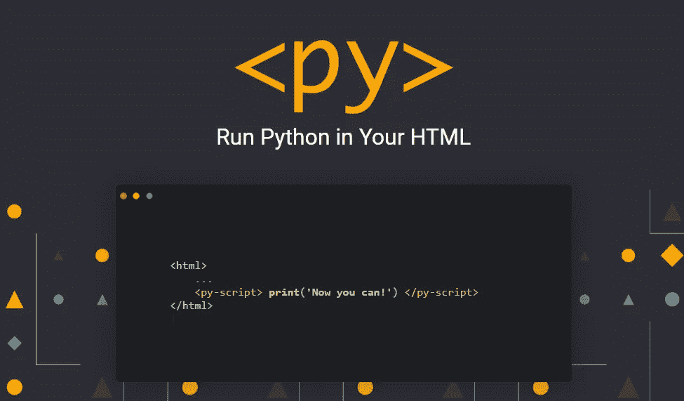

# JavaScript 的末日可能就在这里

> 原文：<https://javascript.plainenglish.io/the-end-of-javascript-might-be-here-a9ac611c0433?source=collection_archive---------0----------------------->

## 这种新的编程语言将在未来几年取代 JavaScript。

Photo by [Joel Muniz](https://unsplash.com/@jmuniz?utm_source=medium&utm_medium=referral) on [Unsplash](https://unsplash.com?utm_source=medium&utm_medium=referral)

JavaScript 是有史以来最流行的编程语言之一。在当前时代，开发人员更喜欢 JavaScript 而不是任何其他编程语言。

JavaScript 在 Web 开发领域的使用非常广泛，不仅因为 JavaScript 是 2021 年十大编程语言中排名第一的编程语言。

但是 JavaScript 的流行和强大会因为一种新的编程语言的诞生而终结吗？

## PyScript 终于来了

最近，Anaconda 王蒙杰公司的首席执行官在 PyCon 2022 中宣布了全新的 PyScript。

PyScript 就像一个 JavaScript 框架，它将使开发人员能够在他们的浏览器中创建 Python 应用程序。

这意味着 Python 代码可以像 JavaScript 一样直接添加到 HTML 中，这对所有 Python 爱好者来说都是一个非常惊人的消息。

Python 是最流行的语言之一，也是开发人员最喜爱的编程语言之一。它在 2021 年使用的 [*十大编程语言中也占据了非常强的位置。*](/top-10-programming-languages-of-2021-d2d48c634ae7)

随着 PyScript 的发布，预计开发人员会大量使用它。

王蒙杰提到的“在 HTML 中交错 Python 的技术”大致可以翻译成一种可以在 HTML 中运行 Python 代码，也可以在 PyScript 中调用 JavaScript 库的技术。

Web 开发现在完全可以用 Python 来完成，这是一个革命性的技术，因为 Python 本身已经被证明是一种革命性的语言。

Pyscript

随着 PyScript 的发布，Python 的力量可以被更多的人使用，创作者也提到每个人都可以访问浏览器，因此每个人都可以使用这项新技术来构建令人敬畏的应用程序。

还提到 PyScript 是基于 Pyodide 构建的，pyo dide 可以称为 Web 程序集的端口。目前，Pyscript 支持在浏览器中编写 Python 代码，未来将扩展到所有编程语言。

## 这是 JavaScript 的明确终结吗？

PyScript 是一项非常有前途的新技术，它的创造者向它的用户承诺了许多事情。它还承诺在未来支持所有编程语言，如果这种情况发生，那么大多数开发人员将更喜欢 PyScript 而不是 JavaScript。

Python 发布后，开发人员向 Python 的转变是革命性的，PyScript 也是如此。

只有时间才能展现 Pyscript 的真正潜力，它未来的更新将展示 PyScript 在 web 开发中的真正力量。我希望这是信息。祝你的编程之旅好运！

关于我——我是*科技*和*自我提升的顶级作家；* [*点击这里*](https://aniketz.medium.com/) *阅读更多我的文章。*

如果你想购买 5 美元的中等会员资格， [*点击这里*](https://aniketz.medium.com/membership) (当你使用 [*这个链接*](https://aniketz.medium.com/membership) 购买中等会员资格时，我会从你的会员费中抽取一小部分作为佣金，不需要你额外付费)。如果你想订阅我的电子邮件列表然后 [*点击这里*](https://aniketz.medium.com/subscribe) *。*

 [## 通过我的推荐链接加入 Medium-Aniket

### 作为一个媒体会员，你的会员费的一部分会给你阅读的作家，你可以完全接触到每一个故事…

aniketz.medium.com](https://aniketz.medium.com/membership) 

[**通过电子邮件获取我的文章点击这里**](https://aniketz.medium.com/subscribe) **|** [**购买 5 美元的中等会员资格**](https://aniketz.medium.com/membership)

*更多内容请看*[***plain English . io***](https://plainenglish.io/)*。报名参加我们的* [***免费周报***](http://newsletter.plainenglish.io/) *。关注我们关于*[***Twitter***](https://twitter.com/inPlainEngHQ)*和*[***LinkedIn***](https://www.linkedin.com/company/inplainenglish/)*。加入我们的* [***社区不和谐***](https://discord.gg/GtDtUAvyhW) *。*