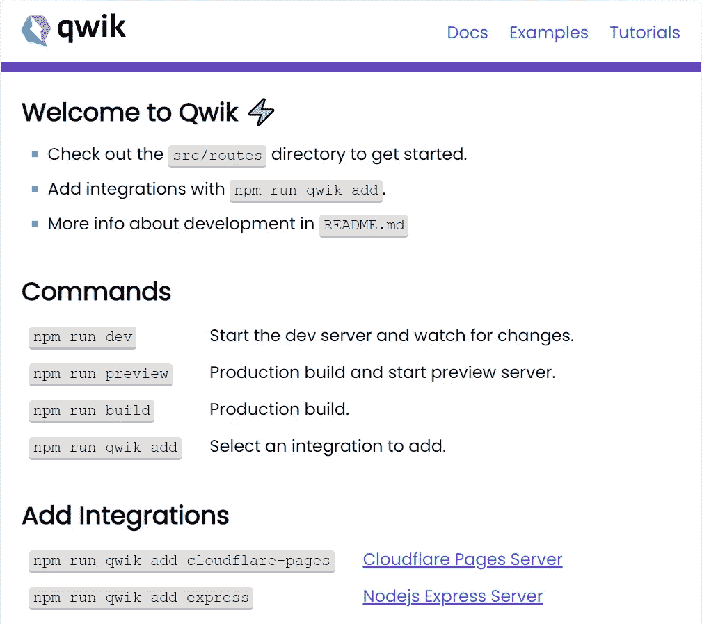

# 最快的 JavaScript 框架

> 原文：<https://javascript.plainenglish.io/the-fastest-javascript-framework-b843c6d25979?source=collection_archive---------2----------------------->

## 世界首个 O(1) JavaScript 框架一瞥


*(source:* [BuilderIO/Qwik](https://github.com/BuilderIO/qwik) *on Github)*

我们正在谈论的是" **Qwik** "，一种新的 web 框架，可以交付**即时加载 web 应用**的**任何规模或复杂性**，并在规模上实现**一致的性能。**

经过 2 年的开发，这个框架现在已经进入了测试阶段，可以投入生产了，拥有完整的特性、稳定的 API、没有阻塞问题和足够的文档。所以让我们来看看这个框架是怎么回事。

已经有很多 JavaScript 框架以解决问题为目的，或多或少，它们中的大多数都试图解决类似的问题。但是 **Qwik** 号称解决了一个其他框架解决不了的问题。所以我们先来看那个问题。

## **问题**

随着 JavaScript 和 JavaScript 框架的发展，现代网站现在需要**大量的 JavaScript** 来实现交互。而且，我们的网站越发展，我们看到的网站复杂性的增加就越多，最终需要更多的代码，这对网站的启动性能产生负面影响。过多的 JavaScript 对网站有两个主要影响，

1.  **网络带宽**:如果我们的网站有大量的 JS 代码，在较慢的网络上下载到客户的设备上需要很长时间。
2.  **启动时间**:网站的启动时间会受到影响，因为无论何时加载页面，整个 JS 代码都需要作为水合的一部分来执行。

如果需要了解什么是补水，可以参考[这篇](https://dev.to/this-is-learning/why-efficient-hydration-in-javascript-frameworks-is-so-challenging-1ca3)文章。

所以基本上， **Qwik 框架**解决了以上两个通常与任何网站加载时间相关的问题。此外，为我们提供针对速度优化的即时加载应用。

## **目标**

如上所述，通过消除加载时间的瓶颈，Qwik 声称实现了两个重要目标。

1.  **即时加载**:与其他框架不同，quick 是“**可恢复的**”，这是 Qwik 团队创造的一种新范式，用于提供 0 **水合**。这使得 Qwik 应用程序具有即时加载交互性，无论应用程序的大小或复杂性如何。这意味着该应用程序可以在任何网络上即时加载，没有任何延迟。
2.  **性能** : Qwik 通过交付纯粹的 **HTML** ，并根据需要增量加载 JS 来实现这一点。这意味着，网站在加载时需要执行的 JavaScript 非常少，并且只在交互时下载代码。这使得它成为了**“HTML”的第一个框架**。

## Qwik 是如何做到这一点的？

Qwik 主要通过两个重要策略实现这一目标:

1.  *尽可能延迟 JavaScript 的执行和下载*
2.  *在服务器端序列化应用和框架的执行状态，在客户端恢复。*

让我们来了解一下 Qwik 是如何实施这些策略的。

## **少了 JavaScript**

正如我们在上面看到的，一个网站最大的问题之一是它必须向客户端发送大量的 JavaScript。Qwik 通过向客户端发布最少的 JavaScript 直接消除了这个问题。理论上，一个 Qwik 应用程序只需要大约 1KB 的 JavaScript 代码就可以变得交互。

你可能会想，如果我们不发布 JS 代码，那么我们的应用程序将如何变得具有交互性？实际上，Qwik 确实发布了它，但不是在应用程序启动时，而是在**交互**中。Qwik 在 SSR 期间使用大量信息来尽快开始预取当前页面的交互性，这样当用户点击或交互时，JS 已经被下载了。

这类似于我们所说的延迟加载，但 Qwik 通过基于用户交互逐步下载 JavaScript，将延迟加载发挥到了极致。

## **零水合**

水化，我们知道，是 JavaScript 框架被服务器渲染后，对其进行初始化的过程。在服务器上呈现 HTML 之后，客户机上的 JavaScript 框架需要重新初始化，方法是在 DOM 节点上安装所有事件侦听器，构建内部数据结构，并恢复应用程序状态。

所有当前的 JavaScript 框架都需要这一步来使应用程序具有交互性。这个水合过程非常昂贵，Qwik 完全消除了它，这使得 Qwik 应用程序瞬间启动。为了实现这一点，Qwik 在服务器上暂停执行，并在客户机上继续执行。详细解释请参考官方文件[此处](https://qwik.builder.io/docs/concepts/resumable/)。

## **Qwik 入门**

Qwik 入门相当容易。它附带了一个 CLI，允许我们创建一个空白的入门应用程序来开始。

**先决条件**

1.  Node.js v14 或更高版本
2.  任何 IDE(建议使用 VSCode)

**使用命令行界面创建应用程序**

## **第 1 步**

在您的 shell 中运行 Qwick CLI。


## **第 2 步**

CLI 将指导您完成进一步设置项目的步骤。命名您的应用程序，并将启动器选择为 **Basic。**


## **第 3 步**

成功设置后，您将获得如下输出。


## **第 4 步**

移至 CLI 创建的目录。


## **第 5 步**

安装 npm 模块。


## **第 6 步**

调用 dev 服务器&您将看到一个默认的应用程序运行在端口 5173 上，如下所示。


## **第 7 步**

访问 [http://127.0.0.1:5173/](http://127.0.0.1:5173/) 探索该应用



## 目录布局

对于上面使用 CLI 创建的项目，您将看到类似于下面目录结构的内容。


## **本** `**routes”**` **目录**

“路由”目录提供基于目录的路由。这里需要注意的一点是，在路由目录下，`folder-path`加上一个`index`文件映射到一个 URL 路径。

例如，如果用户导航到`https://test.com/user`，则会显示在`src/routes/**user/index.tsx**`导出的组件。对于`https://test.com/store`类似，将显示`src/routes/**store/index.tsx**`处的组件。

```
src/
|_ routes/
   |_ user/
      |_ index.tsx # [https://test.com/user](https://test.com/user)
   index.tsx       # https://test.com
```

需要注意的另一个重要方面是，路由末端的叶文件应该始终作为索引命名。

```
src/
|_ routes/
   |_ user/
      |_ index.tsx # [https://test.com/user](https://test.com/user)
   |_ store/
      |_ index.tsx # [https://test.com/store](https://test.com/store)
   |_ contact/
      |_ index.tsx # htts://test.com/contact
```

鉴于，以下文件将不予注册。

```
src/
|_ routes/
   |_ user.tsx
   |_ store.tsx
   |_ contact.tsx
```

## “组件”目录

这是所有组件的推荐目录。组件是 Qwik 应用程序的构建模块。使用返回 JSX 元素的`**component$()**`声明组件。对于**reaction**开发人员，您会发现，组件计算与**reaction**非常相似。

```
**import { component$ } from '@builder.io/qwik';****export const App = component$(() => {
  return <span>Hello World!</span>;
});**
```

在上面的 starter 应用程序中，我们可以看到下面的组件。


## “公共”目录

任何静态资产，如图像，都可以放在公共目录中。

## “根”组件

Qwik 应用程序的根总是从 QwikCity 组件开始。QwikCity 只是 Qwik 核心之上的一组额外的 API，提供了路由、数据加载、端点等附加功能。


我们刚刚探索了这个框架的基础，通过访问和关注官方文件，你肯定可以尝试更多。

## 结论

Qwik 看起来像是一个有前途的框架，为我们提供了一种全新的方法来构建 web 应用程序，目的是在任何规模下提供即时加载和一致的性能。

*更多内容请看*[***plain English . io***](https://plainenglish.io/)*。报名参加我们的* [***免费周报***](http://newsletter.plainenglish.io/) *。关注我们关于*[***Twitter***](https://twitter.com/inPlainEngHQ)[***LinkedIn***](https://www.linkedin.com/company/inplainenglish/)*[***YouTube***](https://www.youtube.com/channel/UCtipWUghju290NWcn8jhyAw)*[***不和***](https://discord.gg/GtDtUAvyhW) *。对增长黑客感兴趣？检查* [***电路***](https://circuit.ooo/) *。***