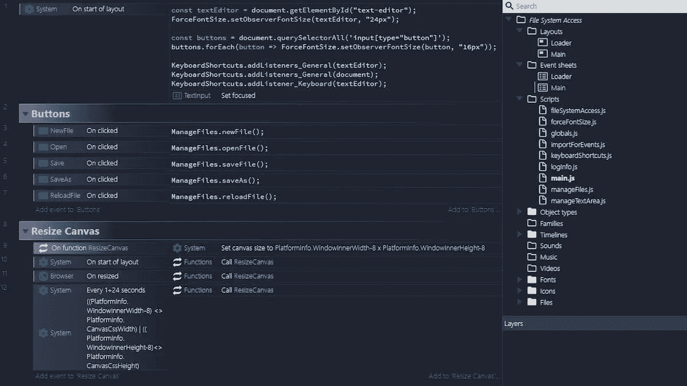

# 文件系统访问 API

> 原文：<https://javascript.plainenglish.io/the-file-system-access-api-385379cd16f6?source=collection_archive---------7----------------------->

Photo by [Patrick Lindenberg](https://unsplash.com/@heapdump?utm_source=medium&utm_medium=referral) on [Unsplash](https://unsplash.com?utm_source=medium&utm_medium=referral)

我在这里转载我的一篇旧文章。第一次出版是在 2021 年 2 月的[帕特里翁。我将在一篇新文章中提到它，所以没有人必须通过](https://www.patreon.com/posts/file-system-api-47257691) [Patreon](https://www.patreon.com/posts/file-system-api-47257691) 来阅读它。

本周，我玩了一下`File System Access API`:这个功能允许你创建可以与用户本地设备上的文件进行交互的 web 应用。用户授予 web 应用程序访问权限后，该 API 允许他们直接读取或保存对用户设备上的文件和文件夹的更改。

我想用 Construct 3 复制一个文本编辑器，其功能类似于由 [Google Chrome Labs](https://github.com/GoogleChromeLabs) 开发的编辑器([文本编辑器](https://googlechromelabs.github.io/text-editor/))。我也遵循了这个指南: [*文件系统访问 API:简化对本地文件的访问*](https://web.dev/file-system-access/) 。

当然，我也在 [GitHub](https://github.com/el3um4s) 上分享了整件事。

让我们开始:

现在，我省略了使用`File System Access API`的一些“边缘”方面，并把重点放在两个模块上:`[manageFiles.js](https://github.com/el3um4s/construct-demo/blob/master/javascript/008-text-editor/source/files/scripts/managefiles.js)`和`[fileSystemAccess.js](https://github.com/el3um4s/construct-demo/blob/master/javascript/008-text-editor/source/files/scripts/filesystemaccess.js)`。在最后你可以找到一些功能:

*   打开文件
*   写
*   保存方式
*   保存文件
*   loadFromFile
*   getNewFileHandle

# 打开文件

为了简单起见，我省略了对错误处理的解释。切入点是`[window.showOpenFilePicker()](https://wicg.github.io/file-system-access/#api-showopenfilepicker)`。当被调用时，它显示一个文件选择器对话框，并提示用户选择一个文件。在他们选择一个文件后，API 返回一个文件句柄数组。可选参数允许您影响文件选取器的行为，例如，允许用户选择多个文件、目录或不同的文件类型。在没有指定任何选项的情况下，文件选取器允许用户选择单个文件。

我将一个数组`[FileSystemFileHandle](https://wicg.github.io/file-system-access/#filesystemfilehandle)`赋给`Globals.fileHandle`。在本例中，它是一个单元素数组，包含与文件交互所需的属性和方法。

**注意:**我还没有实现跟踪所有打开文件的方法，但只有一个。然而，这样做将允许你实现一个最近文件列表*作为打开你最近处理的文件的快捷方式。*

现在，从句柄中，您可以通过

然后你可以阅读它的内容。

# 写

第二个功能是`write`，允许你将文本修改直接保存到文件中。为此，您可以使用`[FileSystemWritableFileStream](https://wicg.github.io/file-system-access/#api-filesystemwritablefilestream)`接口。然后，您可以通过调用

现在，您可以将文件的内容写入流中。

最后你可以关闭文件并将内容写入磁盘:`await writable.close()`。

**注意**:在流关闭之前，更改不会写入磁盘。

# 保存方式

从现在开始一切都简单了。*另存为*使用`getNewFileHandle()`获取文件名和保存文件的位置。然后你可以调用`write()`来...写文件。

# 保存文件

`saveFile`更简单。如果你正在编辑一个文件，它叫做`write`。如果你正在处理一个新文件，它叫做`saveAs`。

# loadFromFile

最后`loadFromFile`将文件重新加载到上次保存之前的状态。

就这样，我完成了基本结构。然而，没有简单的方法将所有这些与我们的编辑器集成。为此，您需要一个新模块:`manageFiles.js`。

# manager files . js

我只关注两个功能，`insertText`和`getText`。他们都使用

此代码允许您访问构造 3 文本框。第一个修改包含的文本，第二个读取它。这是允许 C3 正确显示元素内容所必需的。

以下函数除了通过连接到实际编辑器来调用`FileSystemAccess`模块的函数外，什么也不做。

感谢阅读！敬请关注更多内容。

***不要错过我的下一篇文章——注册我的*** [***中型邮件列表***](https://medium.com/subscribe/@el3um4s)

 [## 使用我的推荐链接— Samuele 加入 Medium

### 读一读萨缪尔(以及 Medium 上成千上万其他作家)的所有故事。不是中型成员？加入这里，一块…

el3um4s.medium.com](https://el3um4s.medium.com/membership) 

*原载于 2021 年 2 月 8 日*[*https://blog.stranianelli.com*](https://blog.stranianelli.com/file-system-access-api-english/)。

*多内容于* [***通俗易懂***](http://plainenglish.io/) *。报名参加我们的* [***免费周报***](http://newsletter.plainenglish.io/) *。在我们的* [***社区不和谐***](https://discord.gg/GtDtUAvyhW) *获得独家写作机会和建议。*