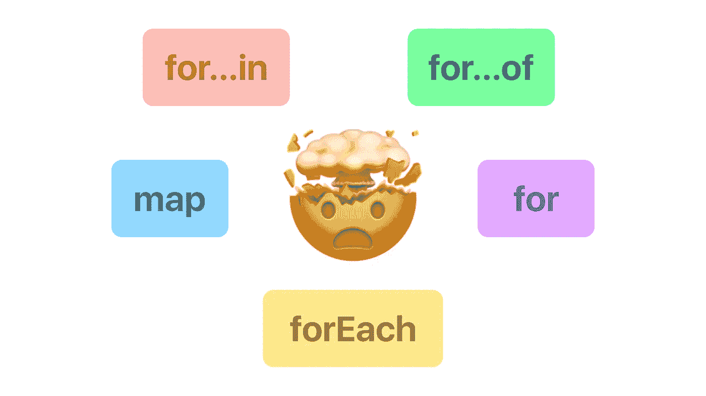

# For 循环困境

> 原文：<https://javascript.plainenglish.io/the-for-loop-dilemma-11a431abe3b6?source=collection_archive---------22----------------------->



稍微熟悉计算机编程的人都会知道什么是循环。这是遍历元素列表的标准方式，在不同的编程语言中有三种最常见的方式，for、while 和 do-while 循环。但是当你在别人的代码中寻找这些循环时，你很可能找不到它们。这是因为每种语言都有自己优化的、不太冗长的循环实现。

JavaScript 有几十种方法可以迭代不同类型的数据结构，虽然看起来这些方法可以互换，但也有一些特性使每种方法都有其独特之处。

> Youtube 上也有视频版本。

# 良好的旧循环

我们将从我们自己的传统循环开始。正是这种美丽的表达方式让你可以浏览一系列元素，并对每一个元素做一些事情。

```
let arr = [1,2,3,4,5];
for(let i=0; i<arr.length; i++){
   console.log(arr[i]);  //1 2 3 4 5
}
```

在这种类型的循环中，你会注意到几个要点，那就是你可以从数组内部的任何地方运行这个循环。例如，如果您愿意，可以只对数组的后半部分运行循环。您也可以在任何时候使用`break`关键字来中断循环。它让你可以完全控制你想对 iterable 做什么。

这个循环本质上比你在下面的文章中找到的其他遍历方法更快，比如`for each`或`for…of`，但是在现代浏览器中，这些遍历方法也有优化。因此，从性能角度来看，它们几乎都处于同一水平。

# for-each 循环

现在，这个循环有点不同。它不是遍历数组的每个索引，而是对数组中的每个元素执行一个回调函数。这个回调函数接受几个参数。第一个是实际的数组元素。接下来的两个参数，元素的索引和被调用的数组`forEach`，是可选的。

```
let arr = [1,2,3,4,5]
arr.forEach(element => console.log(element));  //1 2 3 4 5
```

与典型的`for`循环相比，这更易于阅读，但它也有一些缺点。这个循环不允许你使用`break`关键字。不管添加什么中断条件，它都将遍历整个数组。

在循环结束时，它将返回`undefined`。因此，如果您想将其他方法链接到这个循环，或者甚至将结果存储在一个单独的变量中，您就不能这样做。从技术上来说，你可以把它存储在一个变量中，但它将是`undefined`。

```
let arr = [1,2,3,4,5]
let result = arr.forEach(element => {
   return element * element   //Returning square of each element
})console.log(result)  //undefined
```

这种类型循环的一些常见用例是将每个数组元素存储在数据库中，或者用每个数组元素作为上下文来调用 API。在这些情况下，你实际上并不期望从这个循环中得到任何回报，所以使用它更有意义。现在，如果你想从循环中返回一个值，你应该使用`map`方法。

# 映射方法

这个和`forEach`很像。它为数组中的每个元素执行一个回调函数。它也有同样的一组参数，就像`forEach`循环一样。这里唯一的关键区别是，它不是返回`undefined`，而是在最后返回一个数组。所以你在回调函数中添加的任何逻辑，都将为每个元素执行，这个新元素将被添加到一个数组中，这是最后返回的结果。所以这让我们把结果存储在一个变量中，甚至链接这个函数。

```
let arr = [1,2,3,4,5]
let result = arr.forEach(element => {
   return element * element   //Returning square of each element
})console.log(result)  //1 4 9 16 25//Chaining the "find" method to the result
console.log(result.find(num => num == 9))  //9
```

所以基本上，如果你想修改数组中的元素并将它们存储在前端，使用`map`会更有意义。但是如果您想对数组中的每个元素进行操作，并且不期望任何回报，那么您应该使用`forEach`循环。

# for…of 循环

就功能而言，`for...of`循环最接近传统的`for`循环。它创建了一个遍历数组、字符串、映射或集合等可迭代对象的循环。(令人惊讶的是，一个对象不是可迭代的，但是它可以被转换成可迭代的)

```
let arr = [1,2,3,4,5]
let dummyMap = new Map([['a', 1], ['b', 2], ['c', 3]]);//FOR OF ON AN ARRAY
for (let num of arr) {
   console.log(num);    //1 2 3 4 5
}//FOR OF ON A STRING
for (let str of "Hey there") {
   console.log(str);   //H e y   t h e r e
}//FOR OF ON A MAP
for (let [key, value] of dummyMap) {
   console.log(key, value);    // a 1   b 2   c 3
}
```

在一个`for`循环中，由于我们专门设置了一个初始化表达式，我们可以从循环中的任何地方开始。这在`for…of`循环中是不可能的。(甚至是`forEach`循环或`map`方法)。

此外，您不能像在传统的 for 循环中那样访问索引。但是由于数组基本上是 Javascript 中的一个对象，所以您可以从对象的原型中使用`entries`方法。因此，现在可以迭代数组的条目(一个键值对)，而不是迭代数组。

```
let arr = [1,2,3,4,5]
for (let num of Object.keys(arr)) {
   console.log(num); // ['0',1] ['1',2] ['2',3] ['3',4] ['4',5]
}
```

# for…in 循环

`for...in` 语句遍历对象的所有可枚举属性，包括继承的属性。马上你可以看到这个迭代方法更适合于一个对象而不是一个数组。这个定义还提到了一些关于可枚举的东西。所以，如果一个属性是可枚举的，这仅仅意味着你可以在迭代对象时访问这个属性。例如，在这个物体内部，

```
const Person = {
   name : "John",
   height : "6ft"
}
```

如果我现在尝试在这个对象上使用`for...in`

```
for (let prop in Person) {
    console.log(num);  // name height
}
```

它给了我 Person 对象中的所有属性。所以这意味着属性 name 和 height 都是可枚举的。现在要创建一个不可枚举的属性，我们可以使用`Object.defineProperty()`方法。

```
Object.defineProperty(person, "gender", {
   value: "Male",
   enumerable: false
})
```

这个方法让我们为一个对象创建一个属性，这个属性可以根据我们的用例进一步配置。所以现在，如果我再次运行该文件，我将获得与添加性别之前相同的属性(姓名和身高)。但是，如果我将 enumerable 标志设置为 true，我将得到姓名、身高和性别作为结果。

您也可以使用`for...in`来迭代数组。

```
let arr = [1,2,3,4,5]
for (let num in arr) {
   console.log(num);  //0 1 2 3 4
}
```

它不是返回实际的元素，而是给我们每个元素的索引。现在这里的主要问题是`for...in`循环不仅迭代数组内部的内容，还会迭代添加到原型链中的任何其他属性。

假设我向数组原型添加了一个名为 name 的随机属性，并将该属性的值设置为“John”。

```
let arr = [1,2,3,4,5]
Array.prototype.name = "John"
for (let num in arr){
   console.log(num)  //0 1 2 3 4 name
}
```

您将看到，即使我们没有在数组中添加“name”属性，它仍然在结果中添加了名称，因为它遍历了整个原型链。

所以你应该主要使用`for…in`进行调试，看看一个对象上有哪些属性。要遍历一个数组，你应该坚持传统的`for`循环。

## 关键要点

*   你可以使用典型的`for`循环来完成几乎任何事情，而且它比大多数其他方法都要快。
*   `forEach`返回未定义，而`map`返回数组。所以你可以使用`map`来存储信息或者链接方法，但是你不能用`forEach`来做。
*   如果您只想对数组中的每个元素运行操作而不担心结果，您应该使用`forEach`，但是如果您想修改数组并在应用程序中的某个地方使用这个修改后的版本，您应该使用`map`。
*   您无法脱离`forEach`或`map`。
*   `for...of`循环遍历可迭代对象，如数组、字符串、映射或集合。您不能使用 for of 来访问索引，但是您可以在数组上使用`Object.entries`方法来获取每个元素的索引和值，然后访问索引。
*   你可以打破一个`for...of`循环。所以你不必遍历数组中的每一个元素，而在遇到`forDach`和`map`的情况下，你会这样做。
*   `for...in`循环遍历对象的可枚举属性。因为数组也是一个对象，数组索引是可枚举的属性，所以可以使用`for...in`遍历数组。作为回报，您可以获得每个元素的索引值。
*   但是不建议在数组上使用它，因为可能会得到意想不到的结果。该规范本身指出，不同浏览器之间的元素顺序可能会不匹配。
*   此外,`for...in`将在原型链中寻找所有可枚举的属性，因此您可能会得到除数组元素之外的额外的、意外的值。
*   所以你通常应该对对象的`for...in`方法进行调试，看看它有什么属性。

# 结论

如果你对这篇文章有任何疑问或建议，你可以在评论中提出来，或者你可以通过下面提到的我的社交网站与我联系。

Youtube 上也有这篇博文的视频版本。

[YouTube](https://www.youtube.com/channel/UCaktnqx_IENyT5T2lJ3F09w)
[LinkedIn](https://www.linkedin.com/in/akilesh-rao-610357137/)
[Twitter](https://twitter.com/themangalorian)
[GitHub](https://github.com/AkileshRao)

*更多内容看* [***说白了就是***](http://plainenglish.io/) *。报名参加我们的* [***免费每周简讯***](http://newsletter.plainenglish.io/) *。在我们的* [***社区***](https://discord.gg/GtDtUAvyhW) *获得独家获得写作机会和建议。*