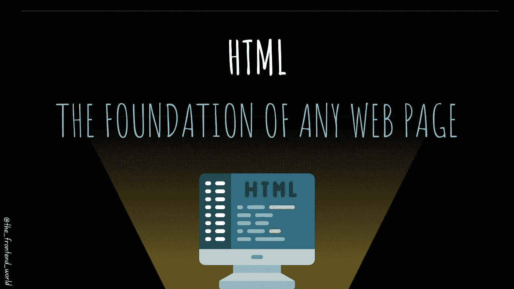
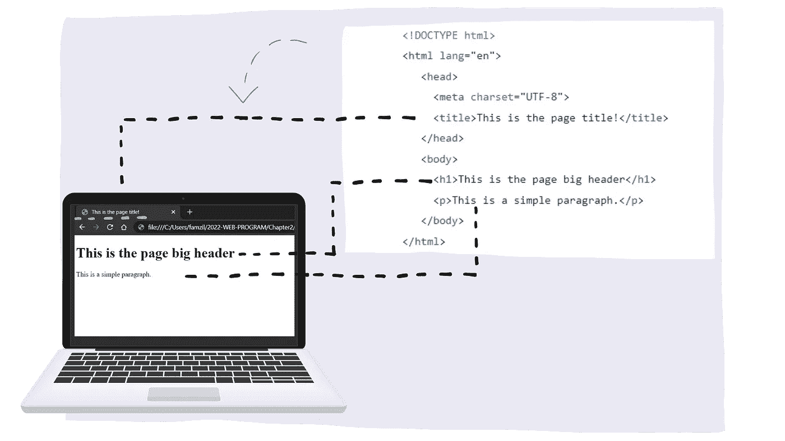
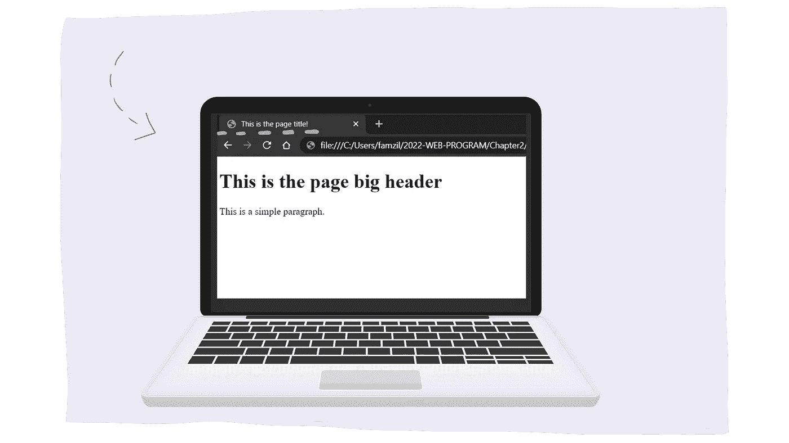

# HTML:任何网页的基础

> 原文：<https://javascript.plainenglish.io/the-foundation-of-any-web-page-78ebdcb6d874?source=collection_archive---------11----------------------->

## HTML 是用来做什么的，我怎么写 HTML 代码，我怎么启动 HTML？

By FAM

既然我们已经了解了网络，我们需要知道的常识。我们准备好下一步了！

下一步是 HTML。快速刷新一下你的记忆，HTML 是网页的骨架和结构，CSS 是它的风格，JS 是它的交互和行为。这三种技术就是 web 驱动。网络离不开它们！

《2022 网络计划》的这一章将讲述网页结构— **HTML** 。

# HTML 是什么？

> 超文本标记语言

***超文本*** 是包含其他文本链接的文本。一个文档指向另一个文档，而另一个文档又指向一堆其他文档，这样的文档越来越多。

***标记*** 是对某物进行标记，进行注释。在网络上，一切都是关于内容的。我们希望对内容进行注释，告诉浏览器这是什么内容，一个输入、一个标题、一个表格等等。，HTML 就是这么做的。

***语言*** 是一种编程语言，基本上意味着它有自己的语法意义，有正确和错误的编码方式。不遵守语法将导致解析和潜在的呈现错误。因此，HTML 是一种语言。

# 它看起来像什么？

HTML 看起来像文档结构的指令。它的好处是它的标签为页面上的内容提供了语义、机器可读性和人类可读性。

## 主要结构

HTML structure

正如你所看到和读到的:

*   这是一个 HTML 文档。
*   它得到了网页标题。
*   它得到了网页正文。
*   就是这样！

By FAM

这是将在浏览器上看到的内容:

By FAM

# 查看 HTML 的运行情况

下面是您需要遵循的步骤，以查看 HTML 的运行情况:

*   创建扩展名为`.html`的文件。
*   将上述代码添加到您的文件中，或者从 [2022 Web 程序报告](https://github.com/famzila/2022-WEB-PROGRAM/blob/main/Chapter2/html-structure.html)中复制。
*   用任何浏览器打开文件。
*   瞧啊。

By FAM

我们看到大标题和一小段。本文到此为止。只有标题和段落就没意思了。接下来的文章将帮助我们创建一个完整的网页内容😉

# 综上

> HTML 的工作是注释内容和定义文档结构，和任何语言一样，它有正确和错误的语法，你必须学习这些来编码它。

# 2022 年网络计划路线图

[**I —网络常识**](https://famzil.medium.com/2022-web-program-chapter-n-1-is-done-499fb0707220?source=your_stories_page----------------------------------------)

**二——网页骨架:HTML**

> **HTML &页面结构**

*   元素和属性
*   表单、输入、图像、多媒体、画布和 iFrame
*   …

## 了解更多信息:

 [## 2022 网络计划启动！

### 改变来自心态和习惯

medium.com](https://medium.com/geekculture/2022-web-program-is-launched-f38a3280af1a) 

与想成为 web 开发人员的人分享该程序！这将有助于保持进步，并在旅途中互相帮助。

> 让我们为 2022 年打造一个更好的‘我们’！

> 如果你喜欢我的文章， [**订阅**](https://famzil.medium.com/subscribe) 获取我的最新。如果你自己喜欢体验媒介，可以考虑通过[**注册会员**](https://famzil.medium.com/membership) 来支持我和其他成千上万的作家。它只需要每月 5 美元，它支持我们，作家，你也有机会用你的作品赚钱。当然，你可以随时取消会员资格。通过注册[这个链接](https://famzil.medium.com/membership)，你将直接用你的一部分费用来支持我，不会花你更多的钱。如果你这样做了，万分感谢你宝贵的支持，❤

让我们**联系上** [**中**](https://medium.com/@famzil/)**[**Linkedin**](https://www.linkedin.com/in/fatima-amzil-9031ba95/)**[**脸书**](https://www.facebook.com/The-Front-End-World)**[**insta gram**](https://www.instagram.com/the_frontend_world/)**[**YouTube**](https://www.youtube.com/channel/UCaxr-f9r6P1u7Y7SKFHi12g)**或**********

**** [## 通过我的推荐链接——FAM 加入 Medium

### 作为一个媒体会员，你的会员费的一部分会给你阅读的作家，你可以完全接触到每一个故事…

famzil.medium.com](https://famzil.medium.com/membership)  [## 如果你喜欢看我的文章… ♥️

### 如果你喜欢读我的文章… ♥️，当我的文章发表时，欢迎你第一个得到通知…

famzil.medium.com](https://famzil.medium.com/subscribe) 

*更多内容请看*[***plain English . io***](http://plainenglish.io/)*。报名参加我们的* [***免费周报***](http://newsletter.plainenglish.io/) *。在我们的* [***社区***](https://discord.gg/GtDtUAvyhW) *获得独家获得写作机会和建议。*****